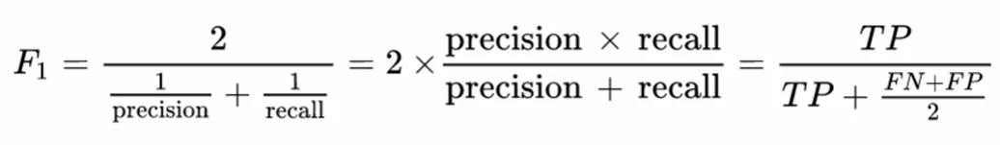
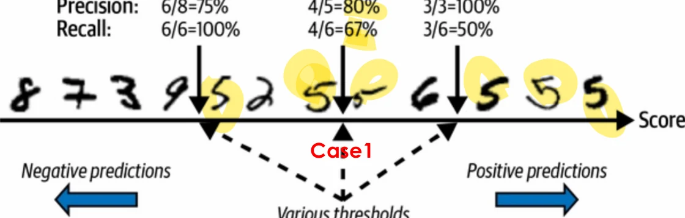

# [기계학습] ML 프로젝트 - 분류(Classfication) 모델 ( 2 )

## 원문

https://ch010104.tistory.com/78

## 노트 유형

`project`

## 배경·목표·적용 맥락

ML의 분류 모델을 평가할 때는 정밀도(Precision)와 재현율(Recall)을 모두 고려하는 것이 일반적

하지만, 두 지표가 합쳐진 형태의 하나의 지표로도 분류 모델을 평가할 수 있는데, 그 것이 바로 F1 Score!

## 구현·의사결정·결과

ML의 분류 모델을 평가할 때는 정밀도(Precision)와 재현율(Recall)을 모두 고려하는 것이 일반적

하지만, 두 지표가 합쳐진 형태의 하나의 지표로도 분류 모델을 평가할 수 있는데, 그 것이 바로 F1 Score!

### 1. F1 Score란?

F1 Score는 **정밀도(Precision)**와 **재현율(Recall)**의 **조화평균(Harmonic Mean)**으로 계산

1) F1 Score의 특징

Precision과 Recall이 모두 높을 때 높은 점수를 가짐

두 지표의 균형을 강조함

한쪽으로만 치우친 모델을 방지

2) 언제 유용할까?

서로 다른 종류의 분류기 모델을 하나의 metric으로 비교할 때, 특히 불균형 데이터셋에서 유용

### 2. Precision vs Recall: 어떤 지표가 더 중요한가?

모델의 사용 목적에 따라 정밀도와 재현율의 중요도가 상이함

1) Precision (정밀도)

예측한 Positive 샘플 중 실제로 Positive인 비율

예시: 아이가 시청해도 되는 안전한 동영상 분류기

모델이 "안전"하다고 판단한 동영상 중 실제로 안전한 비율이 중요

잘못된 판단(위험한데 안전하다고 판단)이 치명적

➡ Precision이 더 중요

2) Recall (재현율)

실제 Positive 샘플 중 올바르게 예측한 비율

예시: 암 진단 분류기

실제 암 환자를 절대 놓치지 않아야 함

놓치는 경우(FN)가 더 위험

➡ Recall이 더 중요

### 3. 정밀도와 재현율의 Trade-off

둘 다 모두 높은 것이 좋겠지만, 정밀도와 재현율은 서로 반비례 관계(정밀도와 재현율이 모두 높은 것은 사실상 불가능)

Precision ↑ ➡ 보수적인 판단 (Recall ↓)

Recall ↑ ➡ 적극적인 판단 (Precision ↓)

1) 예시로 보는 Trade-off

🧒 안전한 동영상 분류기

Precision ↑ 위해 보수적으로 예측 ➡ 실제 안전한 것도 NO라 예측 ➡ Recall ↓

🧬 암 진단 분류기

Recall ↑ 위해 보수적으로 YES ➡ 실제 암 아닌 것도 YES라 함 ➡ Precision ↓

따라서 모두 높이기란 이론적으로 어려움

2) 결정 함수(Decision Function)와 임계값(Threshold)

분류기는 단순히 클래스를 예측하지 않고 “얼마나 그 클래스에 가까운가”를 점수로 계산

이 점수가 결정 함수 값

일정 임계값(threshold) 이상이면 Positive로 판단

🔄 임계값 변화에 따른 Precision & Recall 변화

임계값을 높이면 ➡ Positive로 예측되는 기준이 까다로워짐

➡ Precision ↑, Recall ↓

임계값을 낮추면 ➡ 더 많은 샘플을 Positive로 예측

➡ Recall ↑, Precision ↓

```text
임계값 높임  → 더 확신 있는 것만 Positive → Precision ↑, Recall ↓
임계값 낮춤  → 넓게 Positive → Recall ↑, Precision ↓
```

### 4. Threshold 조정 실습: precision_recall_curve()

사이킷런의 precision_recall_curve() 함수는 다양한 임계값에 따른 정밀도와 재현율을 반환

```text
from sklearn.metrics import precision_recall_curve

precisions, recalls, thresholds = precision_recall_curve(y_true, scores)
```

thresholds: 점수 기준 값

precisions: 각 threshold에서의 정밀도

recalls: 각 threshold에서의 재현율

이 데이터를 기반으로 최적의 threshold를 선택할 수 있습니다. (예: 특정 Precision 또는 Recall 기준을 만족하는 threshold 탐색)

## 핵심 이미지





## 관련 글

- [[blog/AI(ML & DL)/index|AI(ML & DL)]]
- [[blog/AI(ML & DL)/기계학습- ML 프로젝트 - 분류 (Classification) 모델|[기계학습] ML 프로젝트 - 분류 (Classification) 모델]]
- [[blog/AI(ML & DL)/기계학습- ML 프로젝트 A - Z 까 ( 7 )|[기계학습] ML 프로젝트 A - Z 까 ( 7 )]]
- [[blog/AI(ML & DL)/기계학습- ML 프로젝트 - 분류(Classfication) 모델 ( 3 )|[기계학습] ML 프로젝트 - 분류(Classfication) 모델 ( 3 )]]
