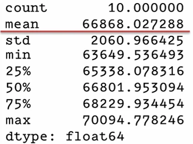
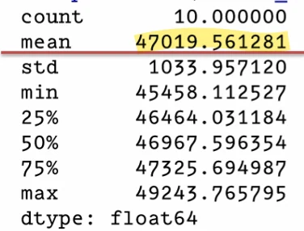

# [기계학습] ML 프로젝트 A - Z 까지 ( 6 )

## 원문

https://ch010104.tistory.com/70

## 노트 유형

`project`

## 배경·목표·적용 맥락

결측치 처리, 로그 변환, 특성 비율 계산, 범주형 처리 등 포함된 preprocessing 파이프라인 생성

훈련 방법: LinearRegression 예측기를 preprocessing 파이프라인에 추가하여 .fit() 실행

## 구현·의사결정·결과

### 머신러닝 모델 선택과 훈련

### 1. 데이터 준비 과정 요약

데이터 분리

훈련셋 / 테스트셋 분리 완료

전처리 파이프라인 구성

결측치 처리, 로그 변환, 특성 비율 계산, 범주형 처리 등 포함된 preprocessing 파이프라인 생성

훈련셋에 대한 전처리 완료

### 2. 1차 모델: 선형 회귀 (Linear Regression)

선택 이유: 간단한 기본 회귀 모델로 시작하기에 적합

훈련 방법: LinearRegression 예측기를 preprocessing 파이프라인에 추가하여 .fit() 실행

내부적으로 전처리 → 학습이 자동으로 이어짐

```text
from sklearn.linear_model import LinearRegression
lin_reg = Pipeline([
    ("preprocessing", preprocessing),
    ("lin_reg", LinearRegression())
])
lin_reg.fit(housing, housing_labels)
```

예측 결과 확인: 앞의 5개 샘플 예측값 출력

성능 평가: RMSE를 기준으로 성능 측정

```text
from sklearn.metrics import mean_squared_error
from numpy import sqrt

housing_predictions = lin_reg.predict(housing)
lin_rmse = sqrt(mean_squared_error(housing_labels, housing_predictions))

# 68972.88....
```

결과: RMSE가 높게 나옴 → 과소적합(underfitting) 발생

원인: 모델이 너무 단순하며 규제가 없었음

### 3. 2차 모델: 결정 트리 회귀 (Decision Tree Regression)

선택 이유: 선형 모델보다 더 복잡한 비선형 관계도 학습 가능

```text
from sklearn.tree import DecisionTreeRegressor
tree_reg = Pipeline([
    ("preprocessing", preprocessing),
    ("tree_reg", DecisionTreeRegressor())
])
tree_reg.fit(housing, housing_labels)

# 0.0
```

성능 평가: 훈련 데이터에 대한 RMSE 측정 → 결과: RMSE = 0, 즉 training error가 없음

🛑 하지만 현실적으로 완벽한 예측은 불가능!

→ 심각한 과대적합(overfitting) 발생

### 4. 교차 검증 (Cross Validation) 도입



목적: 과대적합 여부를 확인하고 더 일반적인 성능 평가 수행

방법: K-겹 교차 검증 (k=10) 사용

```text
from sklearn.model_selection import cross_val_score

tree_rmses = -cross_val_score(
    tree_reg, housing, housing_labels,
    scoring="neg_root_mean_squared_error",
    cv=10
)
print("평균 RMSE:", tree_rmses.mean())
```

결과: 훈련셋에서는 완벽했지만, 교차 검증 결과 RMSE는 약 66,868

과대적합이 명확히 드러남

Training error는 0이었던데 반해 교차 검증으 로 확인된 mean RMSE는 66868이므로 과대 적합 되었음이 확인

### 5. 더 나은 모델을 위한 앙상블 기법: 랜덤 포레스트 회귀



랜덤 포레스트: 여러 개의 결정 트리 모델을 결합한 앙상블 회귀 모델

작동 원리

각 트리는 입력 특성의 랜덤 부분집합으로 훈련됨

최종 예측은 모든 트리의 예측 평균값

```text
from sklearn.ensemble import RandomForestRegressor

forest_reg = Pipeline([
    ("preprocessing", preprocessing),
    ("forest_reg", RandomForestRegressor())
])
```

예상 장점

단일 결정 트리보다 과대적합 위험이 줄어듦

더 좋은 일반화 성능을 기대할 수 있음

이후에는 이 모델에 대해 교차 검증 및 하이퍼파라미터 튜닝을 통해 성능 최적화를 진행

### 6. 마무리 요약

## 관련 글

- [[blog/AI(ML & DL)/index|AI(ML & DL)]]
- [[blog/AI(ML & DL)/기계학습- ML 프로젝트 A-Z까지 ( 5 )|[기계학습] ML 프로젝트 A-Z까지 ( 5 )]]
- [[blog/AI(ML & DL)/기계학습- ML 프로젝트 A - Z 까 ( 7 )|[기계학습] ML 프로젝트 A - Z 까 ( 7 )]]
- [[blog/AI(ML & DL)/기계학습- ML 프로젝트 A-Z까지 ( 4)|[기계학습] ML 프로젝트 A-Z까지 ( 4)]]
