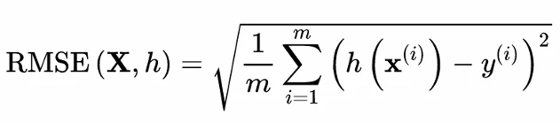
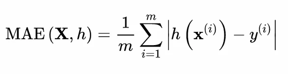
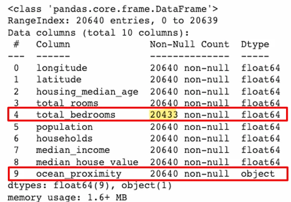

# [기계학습] ML 프로젝트 A-Z 까지 ( 1 )

## 원문

https://ch010104.tistory.com/59

## 노트 유형

`project`

## 배경·목표·적용 맥락

목표: 캘리포니아 주 20,640개 구역의 인구조사 데이터를 기반으로 **중간 주택 가격(median_house_value)**을 예측하는 회귀(regression) 모델을 훈련

사용 데이터: 10개 특성 (경도, 위도, 중간 주택 연도, 방 수, 침실 수, 인구, 가구 수, 중간 소득, 해안 근접도, 중간 주택 가격)

## 구현·의사결정·결과

### 프로젝트 개요 및 학습 목표

목표: 캘리포니아 주 20,640개 구역의 인구조사 데이터를 기반으로 **중간 주택 가격(median_house_value)**을 예측하는 회귀(regression) 모델을 훈련

사용 데이터: 10개 특성 (경도, 위도, 중간 주택 연도, 방 수, 침실 수, 인구, 가구 수, 중간 소득, 해안 근접도, 중간 주택 가격)

예측 대상: 중간 주택 가격 (타깃)

머신러닝 유형: 지도 학습(Supervised Learning) - 회귀 문제

### 머신러닝 프로젝트의 전체 흐름

큰 그림 보기

데이터 구하기 - OpenML.org, Kaggle.com 등을 이용

데이터 탐색 및 시각화

데이터 전처리

모델 선택 및 훈련 - 하나의 모델을 선택하기 보다는, 여러개의 모델을 선택한 후에 가장 적합다하고 판단되는 것은 선택

모델 튜닝 및 평가 - 하이퍼파라메터 튜닝

솔루션 제시

시스템 론칭, 모니터링 및 유지보수

### 1. 큰 그림 보기

1) 문제 정의

지도 학습에 해당하며, 타깃 레이블은 중간 주택 가격

회귀 문제로 다중 회귀(multiple regression)에 속함. 구역별 중간 주택 가격 하나만 예측하므로 단변량 회귀임.

예측 변수: 구역별 9~10개 특성

타깃 변수: 중간 주택 가격

학습 방식: 배치 학습 (batch learning)

데이터셋 전체를 활용하여 오프라인에서 모델 훈련

2) 성능 평가 지표

사용하는 머신러닝 모델의 종류에 따라 적절한 성능 평가 기준을 선택해야함.

만약, 머신러인 모델이 분류 모델이라면 분류에 맞는 성능 평가 기준을 선택

이번 예시의 모델은 회귀 모델이기 때문에, 회귀에 맞는 성능 평가 기준을 선택 - 모델이 예측한 값과 타깃 차 를 측정하는 다음 두가지 지표 중 하나로 평가 - 평균 제곱근 오차(Root Mean Square Error, RMSE) - 평균 절대 오차(MeanAbsolute Error, MAE)

**수식 표기법**

m: RMSE를 계산할 전체 샘플 수

예: 검증셋에 2,000개 샘플이 있다면 m = 2000

모델에 대한 성능 평가는 보통 검증 셋과 훈련 셋이 대해 각각 진행되는데, m은 전체 데이터 셋을 말하는 것이 아님. - 훈련 셋에서의 모델 평가에서는 훈련 셋의 수, 검증 셋에서의 모델 평가에서는 검증 셋의 수

𝒙⁽ⁱ⁾: i번째 샘플의 입력 특성 벡터 (타깃 특성은 제외)

예: 경도, 위도, 인구, 중간소득 등으로 구성된 특성 벡터

일반적으로 column vector로 표현됨

𝑦⁽ⁱ⁾: i번째 샘플의 타깃 값 (예측 대상)

예: 특정 구역의 중간 주택 가격 → 𝑦⁽¹⁾ = 156,400

X: 전체 샘플들의 특성 값이 담긴 행렬 (데이터셋)

각 행은 하나의 샘플 → i번째 행은 𝒙⁽ⁱ⁾의 전치(transpose)

h(𝒙): 머신러닝 모델이 예측한 결과값 (hypothesis 함수)

예: h(𝒙⁽¹⁾) = 158,400 이라면 prediction error = 158,400 - 156,400 = 2,000

1. 평균 제곱근 오차 (RMSE: Root Mean Square Error)

모델이 예측한 값과 타깃 간의 오차 제곱의 평균의 제곱근

RMSE(X, h): m개 샘플로 구성된 데이터셋 X에 대해 모델 h가 예측한 결과와 실제 타깃값 간 오차 제곱 평균의 제곱근

이상치(outlier)에 민감함 - 오차를 제곱하기 때문

2. 평균 절대 오차 (MAE: Mean Absolute Error)

오차의 절댓값의 평균

이상치에 덜 민감

이상치가 많이 않는 경우에는 일반적으로 RMSE를 더 자주 사용됨

이러한 모델 성능 평가의 지표가 훈련 셋에서와 검증 셋에서의 결과가 비슷한 경우 좋은 ML모델임. - 이외의 경우, 과소적합이나 과대적합의 가능성이 있음.

### 2. 데이터 구하기

1) 데이터 구하기 및 로딩

사용 데이터셋: 캘리포니아 주택 가격 데이터

다운로드 주소:

```text
url = "https://github.com/ageron/data/raw/main/housing.tgz"
```

housing.csv 파일로 압축 해제 후 pandas DataFrame으로 로딩

📌 주요 코드

```python
import pandas as pd
housing = pd.read_csv("datasets/housing/housing.csv")
```

2) 데이터 구조 확인

```text
housing.head()
```

상위 5개 행의 데이터 샘플 확인

```text
housing.info()
```

구역 수: 20,640개

총 10개 특성 (9개 수치형 + 1개 범주형: ocean_proximity)

total_bedrooms 특성의 Non-Null 의 수가 20,433으로 전체 구역 수(20,640) 보다 적음. - 총 207개의 결측치가 있는 것을 확인 가능

## 핵심 이미지







## 관련 글

- [[blog/AI(ML & DL)/index|AI(ML & DL)]]
- [[blog/AI(ML & DL)/기계학습- ML 프로젝트 A-Z까지 ( 2 )|[기계학습] ML 프로젝트 A-Z까지 ( 2 )]]
- [[blog/AI(ML & DL)/기계학습- 선형 회귀 실습 (1인당 GDP와 삶의 만족도 예측) ( 2 )|[기계학습] 선형 회귀 실습 (1인당 GDP와 삶의 만족도 예측) ( 2 )]]
- [[blog/AI(ML & DL)/기계학습- ML 프로젝트 A-Z까지 ( 3 )|[기계학습] ML 프로젝트 A-Z까지 ( 3 )]]
