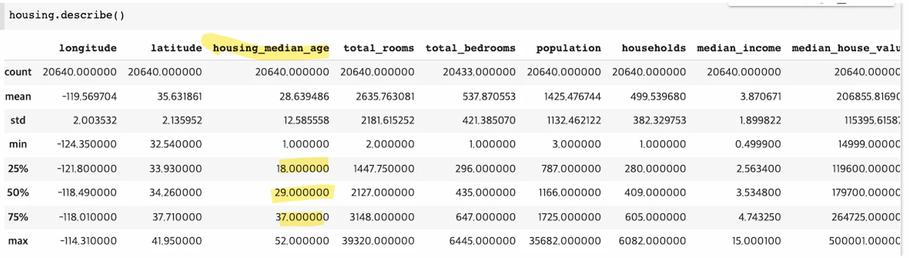
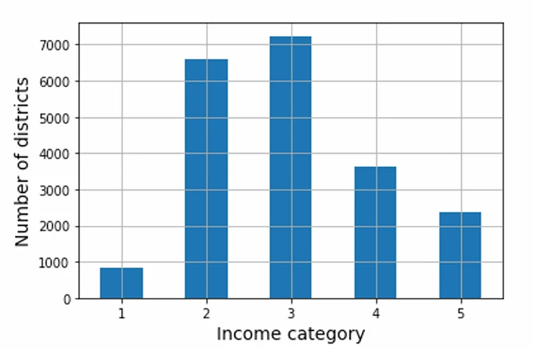
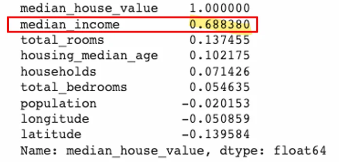

# [기계학습] ML 프로젝트 A-Z까지 ( 2 )

## 원문

https://ch010104.tistory.com/60

## 노트 유형

`project`

## 배경·목표·적용 맥락

다음 5개의 범주로 구성됨 예: <1H OCEAN, INLAND, NEAR OCEAN, NEAR BAY, ISLAND

이처럼 값이 제한된 범주로 구성된 특성을 범주형 특성(categorical feature) 이라고 부름

## 구현·의사결정·결과

### 1. 데이터 구하기 ( 이어서 )

1) 범주형 특성 탐색

해안 근접도(ocean_proximity)

다음 5개의 범주로 구성됨 예: <1H OCEAN, INLAND, NEAR OCEAN, NEAR BAY, ISLAND

이처럼 값이 제한된 범주로 구성된 특성을 범주형 특성(categorical feature) 이라고 부름

2) 수치형 특성 탐색

describe() 함수를 사용해 각 특성의 기본 통계치를 확인 가능 예: housing_median_age의 경우,

25% 지점: 18

50% (중앙값): 29

75% 지점: 37

3) 수치형 특성별 히스토그램

9개의 수치형 특성 각각에 대해 값의 분포를 시각화

x축: 특성 값의 범위

y축: 해당 값에 속하는 샘플 수

4) 테스트셋 만들기

전체 데이터셋을 훈련셋 (약 80%), 테스트셋 (약 20%) 으로 분리

테스트셋은 모델 성능 평가용으로만 사용

테스트셋을 미리 분석하지 말 것 → data snooping 편향 방지

데이터 분리 방식:

무작위 샘플링 (random sampling) - 모집단의 계층 별 비율과 테스트셋의 계층 별 비율 간 오차가 일반적으로 큼

계층적 샘플링 (stratified sampling) → 이 프로젝트에서 사용

오차가 적을수록, 계층 샘플링이 분포를 더 잘 반영했다는 의미임.

5) 계층적 샘플링 (Stratified Sampling) vs 무작위 샘플링(Random Sampling)

계층(strata): 유사한 속성을 가진 하위 그룹 예: 성별, 소득 구간 등

샘플링 시 모집단의 계층별 비율을 테스트셋에도 최대한 반영

예: 성비 51.1% vs 48.9% → 테스트셋 1000명도 이 비율 유지하도록 구성

▶ 소득 구간 기반 계층화

중간 소득(median_income)을 기준으로 계층 구성

5개 계층 정의:

계층 1: 0.0 ~ 1.5

계층 2: 1.5 ~ 3.0

계층 3: 3.0 ~ 4.5

계층 4: 4.5 ~ 6.0

계층 5: 6.0 이상

→ 소득에 따라 모델 예측력이 달라지므로, 계층적 샘플링이 중요함

### 2. 데이터 이해를 위한 탐색 및 시각화

테스트셋을 제외하고 훈련셋에서만 수행해야 편향을 방지할 수 있음

Data snooping 편향 방지를 위해 훈련셋에 대해서만 수행

1) 지리적 산점도 시각화

위도/경도를 활용한 샘플 위치 확인

대도시 근처(샌프란시스코, LA 등)에 밀집

해안 근접도 & 인구 밀도 → 주택 가격과 관련 있음

2) 특성 간 상관관계 분석

표준 상관계수 (standard correlation coefficient) 사용

값의 범위: -1 ~ 1

1에 가까울수록 양의 상관관계 (같이 증가)

-1에 가까울수록 음의 상관관계 (반대로 움직임)

0에 가까울수록 선형 관계 없음

▶ 주의사항

선형 관계만 측정 가능

상관계수 = 기울기 아님

상관계수가 0이라고 해서 완전히 무관한 것은 아님

3) 상관관계를 통해 발견한 인사이트

median_income과 median_house_value 간 상관계수: 0.69 → 가장 강한 양의 선형 관계

중간 소득이 높을수록 집값도 높음

중간 주택 가격은 $500,000 상한선 존재

모델이 이러한 인위적 상한을 학습하는 것은 피해야 함

→ 해당 데이터는 제거 권장

4) 특성 조합을 통한 유용한 피처 엔지니어링

기존 특성보다 파생 특성이 더 유용할 수 있음 예:

rooms_per_house = 총 방 수 / 가구 수

bedrooms_ratio = 침실 수 / 총 방 수

people_per_house = 총 인원 수 / 가구 수

▶ 인사이트

침실/방 비율이 낮은 집일수록 집값이 높음

방 수 대비 가구 수도 중요한 특성이 될 수 있음

## 관련 글

- [[blog/AI(ML & DL)/index|AI(ML & DL)]]
- [[blog/AI(ML & DL)/기계학습- ML 프로젝트 A-Z 까지 ( 1 )|[기계학습] ML 프로젝트 A-Z 까지 ( 1 )]]
- [[blog/AI(ML & DL)/기계학습- 선형 회귀 실습 (1인당 GDP와 삶의 만족도 예측) ( 2 )|[기계학습] 선형 회귀 실습 (1인당 GDP와 삶의 만족도 예측) ( 2 )]]
- [[blog/AI(ML & DL)/기계학습- ML 프로젝트 A-Z까지 ( 3 )|[기계학습] ML 프로젝트 A-Z까지 ( 3 )]]
