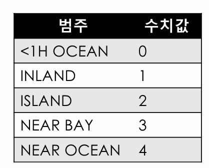
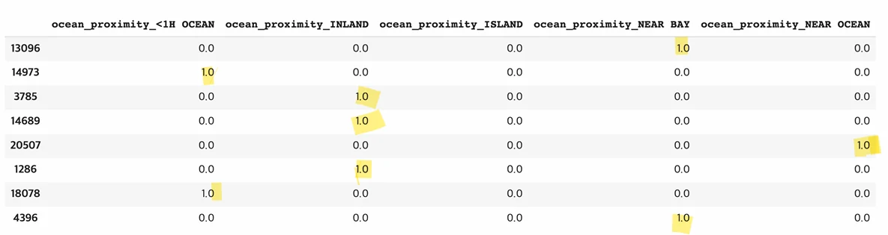

# [기계학습] ML 프로젝트 A-Z까지 ( 3 )

## 원문

https://ch010104.tistory.com/63

## 노트 유형

`project`

## 배경·목표·적용 맥락

housing: median_house_value 컬럼이 제거된 입력 데이터

대부분의 머신러닝 알고리즘은 숫자만을 다룰 수 있기 때문에, 범주형 특성의 텍스트 값을 숫자 값으로 변환해야함

## 구현·의사결정·결과

### 4. 머신러닝 알고리즘을 위한 데이터 준비

### 1. 데이터 준비

1) 입력 특성과 타깃 특성 분리

```text
housing = strat_train_set.drop("median_house_value", axis=1)  # 입력 특성
housing_labels = strat_train_set["median_house_value"].copy()  # 타깃 특성
```

housing: median_house_value 컬럼이 제거된 입력 데이터

housing_labels: 타깃(target) 값만 추출

### 2. 데이터 정제 (Data Cleaning)

1) 결측치(NaN) 처리 방법

옵션 1: 결측치가 있는 행 제거

```text
housing_option1 = housing.copy()
housing_option1.dropna(subset=["total_bedrooms"], inplace=True)
housing_option1.loc[housing.isnull().any(axis=1)].head()
```

결과: 결측치가 있던 행들이 삭제됨

옵션 2: 결측치가 있는 컬럼 자체 삭제

```text
housing_option2 = housing.copy()
housing_option2.drop("total_bedrooms", axis=1, inplace=True)
housing_option2.loc[housing.isnull().any(axis=1)].head()
```

결과: total_bedrooms 컬럼 자체가 존재하지 않음

옵션 3: 결측치를 중간값(median)으로 채우기

```text
housing_option3 = housing.copy()
median = housing["total_bedrooms"].median()
housing_option3["total_bedrooms"].fillna(median, inplace=True)
housing_option3.loc[housing.isnull().any(axis=1)].head()
```

결과: 결측치가 중간값 434로 채워짐

### 3. 결측치 자동 채우기 (SimpleImputer 사용)

1) 수치형 특성만 추출

```text
housing_num = housing.select_dtypes(include=[np.number])
```

ocean_proximity(텍스트)는 제외된 상태

2) SimpleImputer로 중간값 채우기

```text
from sklearn.impute import SimpleImputer

imputer = SimpleImputer(strategy="median")
imputer.fit(housing_num)
```

3) 학습된 중간값 확인

```text
imputer.statistics_

# array([-118.51  ,   34.26  ,   29.    , 2125.    ,  434.    ,
#        1167.    ,  408.    ,    3.5385])
```

> 원문 코드가 길어 이 노트에서는 앞부분만 보존했습니다. 전체는 원문에서 확인합니다.

각 특성별 median 값을 학습한 상태

4) 실제 데이터 변환

```text
X = imputer.transform(housing_num)

X.shape # (16512, 8)
```

5) Pandas DataFrame으로 다시 변환

```text
housing_tr = pd.DataFrame(X, columns=housing_num.columns, index=housing_num.index)
```

### 4. 이상치(Outlier) 제거 (Isolation Forest 사용)

```text
from sklearn.ensemble import IsolationForest

isolation_forest = IsolationForest(random_state=42)
outlier_pred = isolation_forest.fit_predict(X)
```

outlier_pred 결과:

```text
array([-1,  1,  1, ...,  1,  1,  1])

# housing = housing.iloc[outlier_pred == 1]
# housing_labels = housing_labels.iloc[outlier_pred == 1]
```

-1은 이상치, 1은 정상 데이터

필요하면 이상치를 제거할 수 있음:

### 5. 범주형 특성 다루기



대부분의 머신러닝 알고리즘은 숫자만을 다룰 수 있기 때문에, 범주형 특성의 텍스트 값을 숫자 값으로 변환해야함

1) 텍스트 컬럼 준비

```text
housing_cat = housing[["ocean_proximity"]]
housing_cat.head(8)

#     ocean_proximity
# 13096    NEAR BAY
# 14973    <1H OCEAN
# 3785     INLAND
# 14689    INLAND
# 20507    NEAR OCEAN
# 1286     INLAND
# 18078    INLAND
# 4396     <1H OCEAN
```

### 6. 범주형 수치화 (Ordinal Encoding)

```text
from sklearn.preprocessing import OrdinalEncoder

ordinal_encoder = OrdinalEncoder()
housing_cat_encoded = ordinal_encoder.fit_transform(housing_cat)
```

1) 변환 결과

```text
housing_cat_encoded[:5]
```

각 범주가 0~4로 변환

2) 학습된 범주 확인

```text
ordinal_encoder.categories_

# [array(['<1H OCEAN', 'INLAND', 'ISLAND', 'NEAR BAY', 'NEAR OCEAN'],
#       dtype=object)]
```

### 7. 원-핫 인코딩 (One-Hot Encoding)



1) 변환기 준비 및 학습

```text
from sklearn.preprocessing import OneHotEncoder

cat_encoder = OneHotEncoder()
housing_cat_1hot = cat_encoder.fit_transform(housing_cat)
```

2) 결과

```text
housing_cat_1hot

# <16512x5 sparse matrix of type '<class 'numpy.float64'>'
# 	with 16512 stored elements>
```

기본값은 Sparse Matrix로 저장

sparse=False 옵션을 주면 Numpy 배열로 출력

## 관련 글

- [[blog/AI(ML & DL)/index|AI(ML & DL)]]
- [[blog/AI(ML & DL)/기계학습- ML 프로젝트 A-Z까지 ( 2 )|[기계학습] ML 프로젝트 A-Z까지 ( 2 )]]
- [[blog/AI(ML & DL)/기계학습- ML 프로젝트 A-Z까지 ( 4)|[기계학습] ML 프로젝트 A-Z까지 ( 4)]]
- [[blog/AI(ML & DL)/기계학습- ML 프로젝트 A-Z 까지 ( 1 )|[기계학습] ML 프로젝트 A-Z 까지 ( 1 )]]
