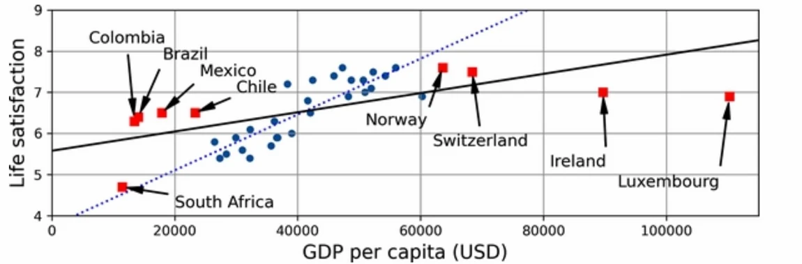
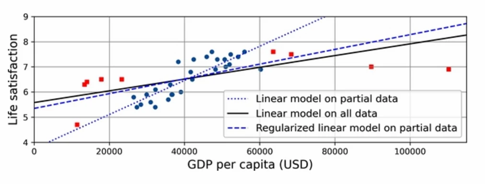
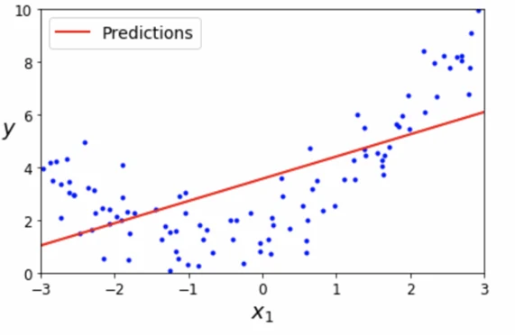

# [기계학습] ML(Machine Learning)의 주요 과제(데이터, 알고리즘 문제)

## 원문

https://ch010104.tistory.com/17

## 노트 유형

`guide`

## 적용 목적과 전제조건

머신러닝(Machine Learning)은 다양한 문제를 해결하는 강력한 도구이지만, 몇 가지 주요 도전 과제가 존재함.

이를 해결하지 않으면 모델의 성능이 저하되거나 실전에서 원하는 결과를 얻기 어려울 수 있음.

## 구현 절차·검증·주의점

### ML(Machine Learning)의 주요 과제

머신러닝(Machine Learning)은 다양한 문제를 해결하는 강력한 도구이지만, 몇 가지 주요 도전 과제가 존재함.

이를 해결하지 않으면 모델의 성능이 저하되거나 실전에서 원하는 결과를 얻기 어려울 수 있음.

머신러닝의 주요 과제는 크게 **데이터 관련 문제** 와 ** 알고리즘 관련 문제 **로 나누어짐.

### 1. 데이터 관련 문제

1.1 훈련 데이터 부족

머신러닝 모델은 일반적으로 많은 데이터를 필요. 특히 이미지 분류, 음성 인식과 같은 복잡한 문제에서는 수백만 개의 훈련 샘플이 필요할 수 있음.

훈련 데이터가 부족하면 모델이 충분히 학습되지 않아 성능이 떨어짐.

일반적으로 훈련 데이터가 많을수록 모델의 예측 성능이 향상.

1.2 대표성 없는 훈련 데이터

훈련 데이터가 대표성을 갖지 못하면 모델의 성능이 저하될 수 있음.

샘플링 노이즈(Sampling Noise): 훈련 데이터셋에 우연히 추가된 대표성이 없는 데이터

샘플링 편향(Sampling Bias): 표본 추출 방법이 잘못되어 특정 집단에 편향된 데이터

예: 특정 국가의 경제 데이터를 활용한 모델이 특정 지역에 대해 잘못된 예측을 할 가능성이 있음

1인당 GDP와 삶의 만족도 관계에 대한 선형 모델

빨간 네모로 표시된 국가의 데이터 셋이 대표성이 없는 훈련 데이터에 속할 수있음.

빨간 네모로 표시된 국가의 데이터가 훈련 셋에 포함된 경우(검은 실선)와 그렇지 않은 경우(파 란 점선)의 선형 모델 간에 차이가 큼

1.3 데이터 정제 과정의 필요성

많은 이상치와 노이즈를 포함하는 저품질(High Noise) 데이터셋은 좋은 성능을 내는 머신러닝 모델을 학습하는 데 어려움을 줌. 이는 Garbage In, Garbage Out(GIGO) 원칙과 관련이 있음.

Garbage In, Garbage Out(GIGO): 잘못된 입력(garbage)이 들어가면 잘못된 출력(garbage)이 나온다는 의미

-> 입력 데이터의 품질이 낮으면 결과 역시 신뢰할 수 없다

이상치(Outlier) 탐지 후 보정하거나 제거

누락된 값(Missing Values) 처리(일부 특성이 없는 데이터에 대한 처리)

해당 특성 또는 샘플을 제외

결측치(누락된 값)를 평균값, 중앙값 등으로 채우기

해당 특성을 포함한 경우와 제외한 경우 모델 성능 비교 -> 더 나은 것은 선택

1.4 특성 공학(Feature Engineering)

모델의 성능을 높이기 위해 문제 해결에 가장 적합한 특성을 찾음.

특성 선택(Feature Selection): 기존 데이터에 포함된 특성 중 문제 해결에 유용한 특성만 선택

특성 추출(Feature Extraction): 상관 관계가 높은 특성을 결합하여 새로운 특성을 생성

예: 중고차 예측에서 연식 + 주행거리 = 마모 정도라는 새로운 특성 추가(비지도학습의 차원 축소의 방법 중하나로 특성 추출을 사용)

새로운 특성 데이터 추가 수집: 문제 해결에 유용할 새로운 데이터 확보

### 2. 알고리즘 관련 문제

2.1 과대적합(Overfitting)

과대적합은 모델이 훈련 데이터에 지나치게 최적화되어 새로운 데이터(테스트 데이터)에서 성능이 저하되는 현상.

훈련 데이터에 대한 성능은 높지만, 실제 데이터에서는 성능이 낮음

모델이 훈련 데이터의 패턴뿐만 아니라 노이즈까지 학습한 경우 발생

모델이 복잡할 수록, 과대적합이 발생할 가능성이 높아짐

해결 방법

규제(Regularization) 적용 (L1, L2 정규화) - 훈련 중 모델 파라미터가 조정되는 과정에서 규제 적용하여 가중치를 조절함 - 규제된 모델은 일반적으로 훈련 데이터에 대해 덜 민감한 반면 새로운 데이터에 대한 일반화 성능이 높음 과대적합 예시 - 규제로 인해 만들어진 모델(Regularized linear model on partial data)의 기울기가 파란색 점만으로 만들어진 모델(Linear model on partial data)보다 기울기가 완만함!! - 규제로 인해 만들어진 모델은 훈련 데이터의 패턴(파란점들)을 덜 반영하지만 새로운 데이터에 대해선 성능이 높음

훈련 데이터 확대(Data Augmentation)

교차 검증(Cross Validation) 사용

모델 단순화(Feature Selection, 차원 축소 등)

2.2 과소적합(Underfitting)

과소적합은 모델이 너무 단순해서 훈련 데이터의 패턴을 제대로 학습하지 못하는 경우

과소적합 예시

- 파란 점들이 훈련 샘플들이고, U자 모양을 띄고 있음(2차원 모양의 모델) - 1차원 모양의 모델이 훈련 셋을 잘 반영하지 못하고 있음 -> 2차원의 분포인 훈련 샘플에 비해 1차원으로 설계한 훈련 모델이 너무 단순함 **2차원의 모델을 선택한 후에 훈련을 할 경우, 2차원의 모델 즉 훈련 데이터에 더 잘 반영하는 모델을 얻을 수 있음.**

해결 방법

더 복잡한 모델 사용 (보다 많은 파라미터가 포함된 다른 모델로 변경)

더 많은 특성을 추가하여 학습

규제 완화 (Regularization Strength 감소)

학습 시간 증가 (Epoch 수 증가)

### 3. 테스트와 검증

3.1 모델 성능 평가

머신러닝 모델의 성능을 평가하기 위해 데이터를 훈련셋(Training Set)과 테스트셋(Test Set)으로 분할.

훈련셋(Training Set, 80%): 모델을 학습하는 데 사용

테스트셋(Test Set, 20%): 모델이 새로운 데이터에서도 좋은 성능을 내는지 확인하는 데 사용

데이터셋이 매우 클 경우, 테스트셋 비율을 낮출 수도 있음(90:10)

3.2 일반화 오차(Generalization Error)

일반화 오차: 모델이 훈련 데이터에서 학습하지 않은 새로운 샘플에서의 예측 오류 비율

훈련 오차(Training Error): 훈련 데이터에서 모델이 틀린 비율

일반화 오차(Generalization Error): 모델이 훈련 데이터에서 학습하지 않은 새로운 샘플에서의 예측 오류 비율 - Test Set을 이용하여 훈련된 모델의 일반화 오차를 추정.

일반화 오차가 훈련 오차보다 훨씬 크다면 과대적합 가능성이 있음 -> 새로운 데이터에 대한 예측을 훈련 데이터보다 못함

일반적으로 훈련 오차는 항상 일반화 오차보다 작거나 같아야 정상적인 모델!!

### 4. 하이퍼파라미터 튜닝

4.1 하이퍼파라미터란?

모델 학습 과정에서 조정할 수 있는 알고리즘의 설정 값(즉, 학습 알고리즘의 파라미터를 의미!!)

예제: 학습률(Learning Rate), 규제 강도(Regularization Strength), 은닉층 개수(Neural Network Hidden Layers) 등

4.2 하이퍼파라미터 튜닝

최적의 하이퍼파라미터 값을 찾는 과정

일반적으로 교차 검증을 활용하여 최적의 조합을 찾음

예시: 하이퍼파라미터 A에 대한 최적의 설정 값을 찾기 위해서 서로 다른 100가지 값으로 설정된 100개 후보 모델들 중 일반화 오차가 가장 낮은 최적의 모델을 찾음

### 5. 검증 기법

5.1 홀드아웃 검증(Holdout Validation)

훈련 데이터를 **훈련셋(Training Set, 60%), 검증셋(Validation Set, 20%), 테스트셋(Test Set, 20%)**으로 나누어 성능을 평가

모델이 새로운 데이터를 얼마나 잘 일반화하는지를 측정하기 위한 기본적인 방법

검증셋을 활용하여 여러 후보 모델의 성능을 비교한 후 최적 모델 선택

예: 하이퍼파라미터 튜닝 시 검증셋을 활용하여 최적 설정값 결정

5.2 교차 검증(Cross Validation)

교차 검증 과정

훈련 데이터를 K개의 폴드(Fold)로 나눈 후, 여러 번 모델을 학습 및 평가하는 방법

교차 검증(Cross Validation)은 "홀드아웃 검증을 여러 번 반복하는 과정" - 1. F1을 ValidationSet 나머지 F2,F3,F4,F5를 TrainingSet 두고 F1의 성능평가인 R1을 수행 - 2. F2에 대한 성능평가 R2 - 3. F3에 대한 성능평가 R3 - 4. F4에 대한 성능평가 R4 - 5. F5에 대한 성능평가 R5 - 6. 5개의 성능 평가치(F1~F5)의 평균을 최종 모델의 검증 결과로 취함

K번의 검증 성능 평균을 최종 성능으로 사용

장점: 검증셋 하나만 사용하는 것보다 더 신뢰할 수 있는 성능 평가 가능 - 기존 홀드아웃 검증은 하나의 고정된 ValidationSet으로 검증하기 때문에 훈련 데이터가 다양하다고 할 수 없음 - 교차 검증의 경우 TrainingSet에 있는 모든 데이터 셋에 대해 ValidationSet으로 가정하여 검증하기 때문에, 보다 더 다양한 훈련 데이터에 대해 검증을 수행함.

단점: K가 커질수록 연산량 증가

**이렇게 얻은 검증 성능 평균은 일반적으로 숫자가 높고, Fold간의 표준편차가 작을 수록 신뢰할만한 모델!!!**

## 관련 글

- [[blog/AI(ML & DL)/index|AI(ML & DL)]]
- [[blog/AI(ML & DL)/기계학습- ML(Machine Learning) 시스템의 종류|[기계학습] ML(Machine Learning) 시스템의 종류]]
- [[blog/AI(ML & DL)/기계학습- Python NumPy란-- ( 1 )|[기계학습] Python NumPy란?? ( 1 )]]
- [[blog/AI(ML & DL)/기계학습- ML(Machine Learning) 이란|[기계학습] ML(Machine Learning) 이란?]]
