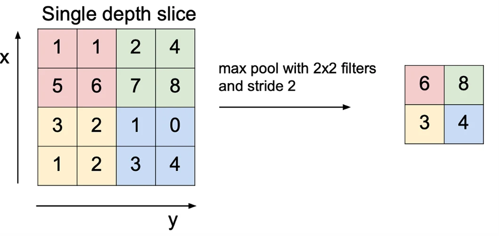
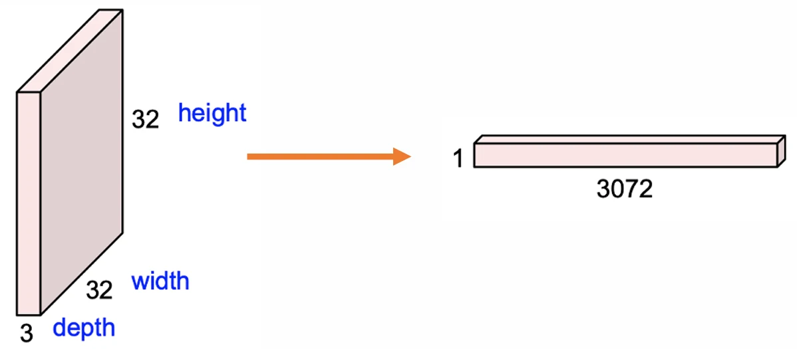
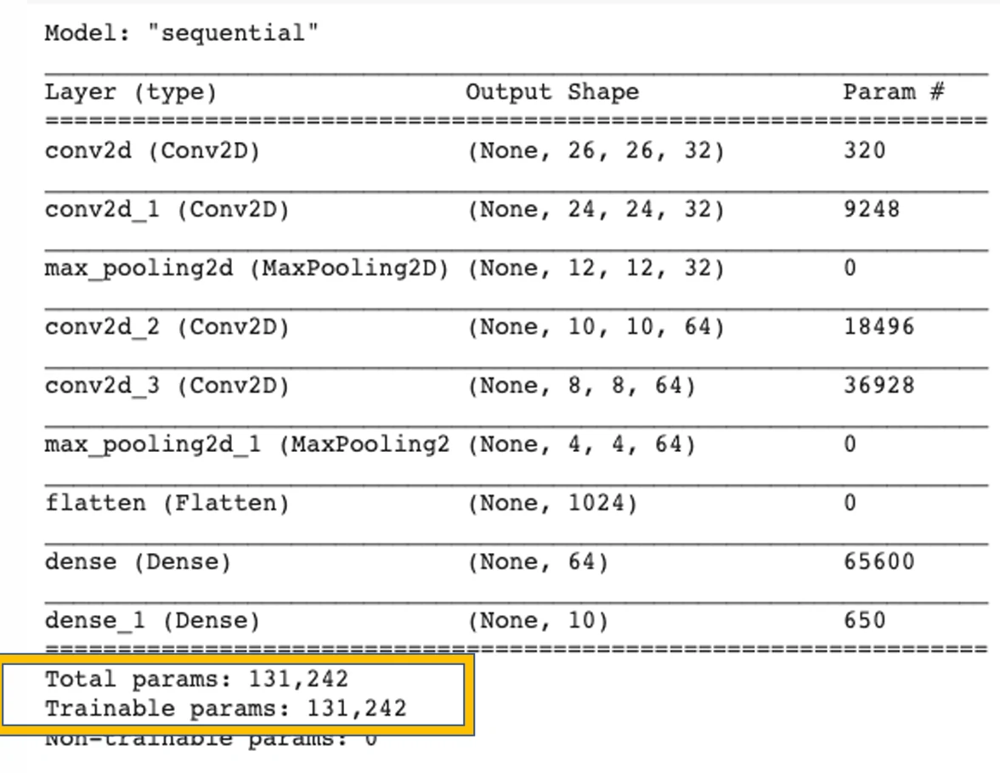

# [딥러닝] CNN

## 원문

https://ch010104.tistory.com/162

## 노트 유형

`guide`

## 적용 목적과 전제조건

필터 (Filter)의 역할: 이미지에서 찾고 싶은 특정 모양(특징)을 감지함.

학습 방식: 과거에는 연구자들이 수학적으로 필터를 설계했지만 , 딥러닝에서는 데이터로부터 목적에 맞는 필터를 자동으로 학습함.

## 구현 절차·검증·주의점

### CNN (Convolutional Neural Network) 개요

필터 (Filter)의 역할: 이미지에서 찾고 싶은 특정 모양(특징)을 감지함.

학습 방식: 과거에는 연구자들이 수학적으로 필터를 설계했지만 , 딥러닝에서는 데이터로부터 목적에 맞는 필터를 자동으로 학습함.

주요 특징:

물체가 이미지의 어느 위치에 있든 탐지 가능.

완전 연결 계층(Dense Layer)에 비해 파라미터 수가 훨씬 적음.

Dense Layer의 파라미터 수: (입력 차원) * (출력 차원).

CNN의 파라미터 수 (예: 3x3 필터): 9 * (필터 개수).

주어진 데이터셋에 특화된 특징을 추출하는 경향이 있음.

### Convolution 연산의 구성 요소

Stride: 필터를 이미지 위에서 이동시키는 간격. 예를 들어, 두 칸씩 이동하면 stride 2임.

출력 크기 계산: Convolution 연산 후의 특징 맵(activation map) 크기는 다음 일반식으로 계산됨.

공식: Output size = (N - F) / stride + 1

N: 입력 이미지의 크기

F: 필터의 크기

예시 (입력 크기 7x7, 필터 크기 3x3):

stride 1: (7 - 3) / 1 + 1 = 5. 출력 크기는 5x5.

stride 2: (7 - 3) / 2 + 1 = 3. 출력 크기는 3x3.

stride 3: (7 - 3) / 3 + 1 = 2.33. 정수로 나누어 떨어지지 않아 연산 불가.

패딩 (Padding): 입력 데이터의 경계에 0과 같은 특정 값을 채워 넣어 출력 크기를 조절하는 기법.

'Same' Padding: 출력 크기를 입력 크기와 동일하게 만들 때 사용.

패딩 크기 계산: 필터 크기가 FxF일 때, 패딩 크기를 (F - 1) / 2로 설정하면 입력과 동일한 크기의 특징이 생성됨.

F = 3 이면 패딩 크기는 1.

F = 5 이면 패딩 크기는 2.

### Convolution Layer와 Dense Layer 비교

Dense Layer:

3차원의 이미지 데이터를 1차원으로 펼쳐서 처리해야 함 (예: 32x32x3 -> 3072x1).

이 과정에서 이미지의 공간적 구조 정보가 손실됨.

하나의 출력 값을 계산할 때 모든 입력 데이터를 사용함.

Convolution Layer:

이미지의 공간 구조 정보를 그대로 유지한 채 연산을 수행함.

필터가 이미지의 작은 일부(chunk) 위를 슬라이딩하며 내적(dot product)을 통해 특징을 추출함.

하나의 필터는 하나의 특징 맵(activation map)을 생성하며 , 여러 개의 필터를 사용하면 여러 개의 특징 맵이 쌓인 형태로 출력이 나옴 (예: 6개의 필터 사용 시 28x28x6 크기의 출력).

### CNN 프로그래밍 (Keras API)

Conv2D: 2D Convolution 레이어를 생성.

filters: 필터의 개수, 즉 추출할 특징의 개수.

kernel_size: 필터의 크기 (예: (3, 3)).

strides: 필터의 이동 간격 (기본값: 1).

padding: 패딩 적용 여부 ('valid'는 패딩 없음, 'same'은 입력과 출력 크기를 같게 함) (기본값: 'valid').

MaxPooling2D: 특징 맵의 크기를 줄이는 다운샘플링 과정. 가장 중요한 특징만 남기기 위해 사용됨.

pool_size: 풀링할 영역의 크기 (예: (2, 2)).

strides: 풀링 윈도우의 이동 간격.

Flatten: 다차원 데이터를 1차원으로 변환. Dense 레이어에 입력하기 위해 필수적으로 사용됨.

### 예제: MNIST with CNN

1. 데이터 준비 및 전처리

MNIST 데이터셋을 로드하고, 이미지 데이터를 (배치 크기, 가로, 세로, 채널) 형태로 변환함.

픽셀 값을 0과 1 사이로 정규화함.

```text
(train_images, train_labels), (test_images, test_labels) = mnist.load_data()

train_images = train_images.reshape((60000, 28, 28, 1))
train_images = train_images.astype('float32') / 255

test_images = test_images.reshape((10000, 28, 28, 1))
test_images = test_images.astype('float32') / 255

train_labels = to_categorical(train_labels)
test_labels = to_categorical(test_labels)
```

2. 모델 구성

일반적으로 Conv2D 레이어를 두 번 적용한 후 MaxPooling2D를 적용하는 구조가 성능이 좋음.

```text
model = models.Sequential()
model.add(layers.Conv2D(32, (3, 3), activation='relu', input_shape=(28, 28, 1)))
model.add(layers.MaxPooling2D((2, 2)))
model.add(layers.Conv2D(64, (3, 3), activation='relu'))
model.add(layers.MaxPooling2D((2, 2)))
model.add(layers.Conv2D(64, (3, 3), activation='relu'))

model.add(layers.Flatten())
model.add(layers.Dense(64, activation='relu'))
model.add(layers.Dense(10, activation='softmax'))
```

3. 모델 요약 (model.summary())

4. 모델 컴파일 및 학습

```text
model.compile(optimizer='rmsprop',
              loss='categorical_crossentropy',
              metrics=['accuracy'])
model.fit(train_images, train_labels, epochs=5, batch_size=64)
```

학습 결과 예시 (Epoch 5)

loss: 0.0178

accuracy: 0.9950

5. Dense 모델과 파라미터 수 비교

동일한 MNIST 문제를 Dense 레이어로만 구성할 경우, 훨씬 많은 파라미터가 필요함.

```text
network = models.Sequential()
network.add(layers.Dense(512, activation='relu', input_shape=(28 * 28,)))
network.add(layers.Dense(10, activation='softmax'))
```

Dense 모델 파라미터 수: 407,050

CNN 모델 파라미터 수: 131,242

## 핵심 이미지







## 관련 글

- [[blog/AI(ML & DL)/index|AI(ML & DL)]]
- [[blog/AI(ML & DL)/딥러닝- CNN를 위한 이미지 필터링|[딥러닝] CNN를 위한 이미지 필터링]]
- [[blog/AI(ML & DL)/딥러닝- CNN의 역사, Dropout과 Batch Normalization|[딥러닝] CNN의 역사, Dropout과 Batch Normalization]]
- [[blog/AI(ML & DL)/딥러닝- 모델 다루기 (Sequential & Functional + Inception Module 실습)|[딥러닝] 모델 다루기 (Sequential & Functional + Inception Module 실습)]]
