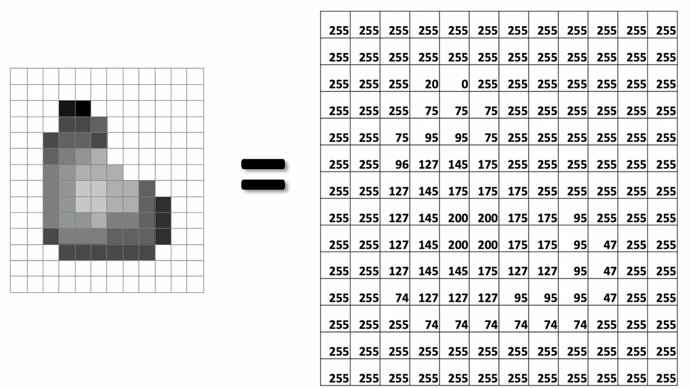
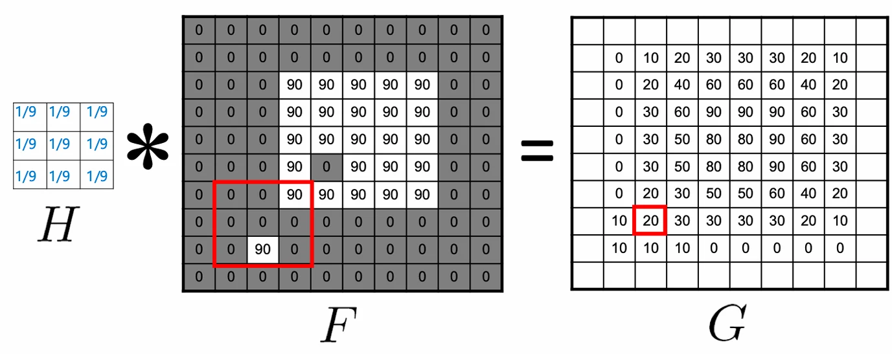
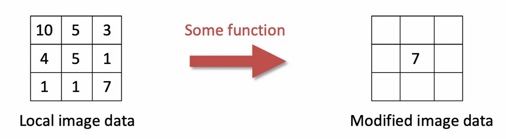

# [딥러닝] CNN를 위한 이미지 필터링

## 원문

https://ch010104.tistory.com/159

## 노트 유형

`concept`

## 핵심 개념과 선택 맥락

- 디지털 이미지는 강도(intensity) 값들의 격자(grid)로 표현

- 수학적으로는 2D 함수 f(x,y)로 나타낼 수 있으며, 각 위치의 밝기 값을 출력

## 원문 기반 개념 정리

### 1. 이미지의 본질

디지털 이미지의 이해

- 디지털 이미지는 강도(intensity) 값들의 격자(grid)로 표현

- 수학적으로는 2D 함수 f(x,y)로 나타낼 수 있으며, 각 위치의 밝기 값을 출력

샘플링과 양자화: 연속 함수를 이산화한 결과

일반적 표현: 0(검정) ~ 255(흰색), 1바이트 per 픽셀

3D 시각화: x,y축은 위치, z축은 밝기를 나타냄

### 2. 노이즈 감소 문제

문제 상황

- 정지된 장면을 촬영할 때 카메라 노이즈를 어떻게 줄일 것인가?

해결 방법

최선책: 같은 장면을 여러 번 촬영해서 평균 계산

노이즈는 랜덤하므로 평균으로 상쇄됨

차선책: 단일 이미지에서 이웃 픽셀들의 평균 사용

인접 픽셀은 유사한 값을 가진다는 가정

- 이것이 이미지 필터링의 기본 아이디어!!

### 3. 선형 필터링의 원리

핵심 개념

각 픽셀을 그 이웃들의 선형 조합으로 대체

즉, 이웃 픽셀에 가중치를 곱하고 모두 합산하는 방식입

커널(Kernel)의 역할

정의: 선형 조합의 가중치 행렬 (마스크, 필터라고도 함)

예시 계산:

```text
지역 데이터:        커널:
[10  5  3]      [ 0   0   0 ]
[ 4  6  1]   ×  [ 0  0.5  0 ]
[ 1  1  8]      [ 0   1  0.5]

계산: 10×0 + 5×0 + 3×0 + 4×0 + 6×0.5 + 1×0 + 1×0 + 1×1 + 8×0.5 = 8
```

- 각 위치의 값에 대응하는 커널 값을 곱한 후 합산하여 새로운 픽셀 값을 얻음

### 4. 교차상관과 컨볼루션

교차상관(Cross-correlation)

```text
G[i,j] = Σ Σ H[u,v] × F[i+u, j+v]
```

커널 H를 이미지 F 위에서 슬라이딩하면서 계산

전체 픽셀에 대해 1칸씩 이동하며 반복

컨볼루션(Convolution)

```text
G[i,j] = Σ Σ H[u,v] × F[i-u, j-v]
G = H * F
```

교차상관과 유사하지만 커널을 180도 회전시켜 사용

중요한 특성:

교환법칙: H * F = F * H

결합법칙: (H₁ * H₂) * F = H₁ * (H₂ * F)

- 실무에서: CNN에서는 둘을 엄격히 구분하지 않는 경우가 많음

### 5. 다양한 필터의 효과

항등 필터(Identity)

```text
[0 0 0]
[0 1 0]  → 원본 그대로
[0 0 0]
```

이동 필터(Shift)

```text
[0 0 0]
[1 0 0]  → 1픽셀 왼쪽으로 이동
[0 0 0]
```

- 왼쪽의 픽셀이 관련되어 있으므로 이동 효과가 발생

평균 필터(Mean/Blur)

```text
1/9 × [1 1 1]
      [1 1 1]  → 노이즈 제거, 흐림 효과
      [1 1 1]
```

- 주변 픽셀들의 평균을 계산하여 부드러운 이미지를 만듬

샤프닝 필터(Sharpening)

```text
원본 - 블러 = 디테일(고주파 성분)
원본 + α × 디테일 = 샤프닝
```

- 수식으로는 **F + α(F - F*H)**로 표현

블러링이 제거하는 것: 고주파 성분

이 디테일을 다시 더하면 엣지가 강조됨

### 6. 가우시안 필터

수식과 특성

```text
Gσ = (1/2πσ²) × e^(-(x²+y²)/2σ²)
```

로우패스 필터: 고주파 성분(디테일) 제거

중심에서 멀어질수록 가중치가 부드럽게 감소

σ 값에 따른 효과

σ = 1 pixel: 최소 블러

σ = 5 pixels: 중간 블러

σ = 10 pixels: 큰 블러

σ = 30 pixels: 최대 블러

중요한 특성

```text
Gσ * Gσ = Gσ√2
```

의미: 가우시안 두 번 적용 = 더 큰 가우시안 한 번 적용

폭 σ로 2번 컨볼루션하는 것은 폭 σ√2로 1번 컨볼루션하는 것과 동일

이는 계산 효율성 측면에서 중요한 성질

### 7. 샤프 필터의 구조

구성 원리

```text
단위 임펄스(Identity) - 가우시안 블러 ≈ 라플라시안 오브 가우시안
```

주파수 관점

Unfiltered: 모든 주파수 포함

Filtered: 고주파 성분 강조 → 엣지가 뚜렷해짐

- 샤프닝 필터는 고주파 성분을 강조하여 윤곽을 선명하게 만듬

### 8. 실제 세계의 컨볼루션 응용

카메라 셰이크(Camera Shake)

```text
흔들린 이미지 = 선명한 이미지 * 블러 커널
```

손떨림으로 인한 블러를 컨볼루션으로 모델링

블러 커널을 추정하면 역연산으로 복원 가능

출처: Fergus et al., SIGGRAPH 2006

보케(Bokeh)

정의: 아웃 오브 포커스 영역의 블러 효과

원리: 조리개 모양이 블러 패턴 결정

예시: 하트형 조리개 → 하트형 보케

이것도 컨볼루션으로 설명 가능한 현상

## 핵심 이미지







## 관련 글

- [[blog/AI(ML & DL)/index|AI(ML & DL)]]
- [[blog/AI(ML & DL)/딥러닝- CNN|[딥러닝] CNN]]
- [[blog/AI(ML & DL)/딥러닝- CNN의 역사, Dropout과 Batch Normalization|[딥러닝] CNN의 역사, Dropout과 Batch Normalization]]
- [[blog/AI(ML & DL)/딥러닝- 모델 다루기 (Sequential & Functional + Inception Module 실습)|[딥러닝] 모델 다루기 (Sequential & Functional + Inception Module 실습)]]
