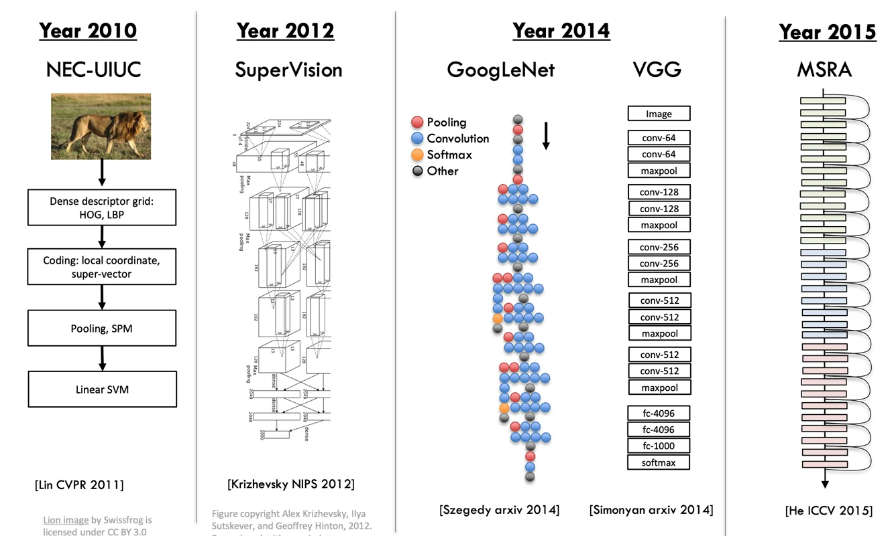
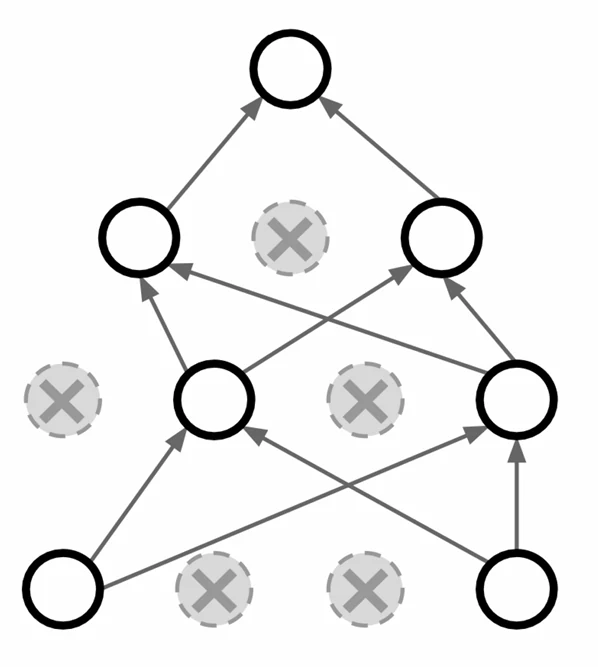
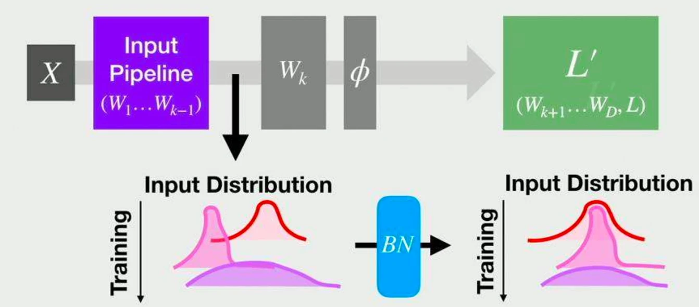

# [딥러닝] CNN의 역사, Dropout과 Batch Normalization

## 원문

https://ch010104.tistory.com/167

## 노트 유형

`concept`

## 핵심 개념과 선택 맥락

LeNet-5 (1998): 얀 르쿤(LeCun) 등이 문서 인식(document recognition)에 경사 하강법 기반 학습(gradient-based learning)을 적용

초기 성공 (음성 인식): 2010년과 2012년, Deep Belief Networks 및 Deep Neural Networks(DNN)를 활용한 음성 인식(Acoustic Modeling, Speech Recognition) 분야에서 강력한 초기 성과 등장

## 원문 기반 개념 정리

### CNN의 역사

초기 모델과 발전

LeNet-5 (1998): 얀 르쿤(LeCun) 등이 문서 인식(document recognition)에 경사 하강법 기반 학습(gradient-based learning)을 적용

초기 성공 (음성 인식): 2010년과 2012년, Deep Belief Networks 및 Deep Neural Networks(DNN)를 활용한 음성 인식(Acoustic Modeling, Speech Recognition) 분야에서 강력한 초기 성과 등장

AlexNet (2012): Alex Krizhevsky, Ilya Sutskever, Geoffrey Hinton이 ImageNet 분류(classification) 대회에서 딥러닝을 활용해 획기적인 성과를 달성

ILSVRC(ImageNet) 대회 주요 모델

2010년 (NEC-UIUC): 전통적인 컴퓨터 비전 방식 (HOG, LBP, Linear SVM 등)

2012년 (SuperVision / AlexNet): CNN이 압도적인 성능을 보인 해

2014년 (GoogLeNet, VGG): 더 깊어진 네트워크 아키텍처 등장

2015년 (MSRA / ResNet): 레이어(층)가 일정 수준 이상 깊어지면 성능이 저하되는 문제 발생7. ResNet은 '스킵 커넥션(skip connection)'을 도입하여 멀리 떨어진 레이어 간의 학습을 가능하게 함으로써 이 문제를 해결

CNN의 광범위한 활용

- ConvNet(CNN)은 현재 다양한 컴퓨터 비전 작업에 활용됨

분류 (Classification)

검색 (Retrieval)

객체 탐지 (Detection) (예: Faster R-CNN)

분할 (Segmentation)

자세 추정 (Pose Estimation)

강화 학습 (Atari 게임)

의료 영상 (악성/양성 종양 구분)

교통 표지판 인식

천문학 (은하 분류)

이미지 캡셔닝 (Image Captioning)

### Dropout과 Batch Normalization

Dropout

개념: 학습 과정에서 특정 노드(뉴런)를 랜덤하게 비활성화(사용하지 않음)

목적: 특정 노드의 가중치(weight)에 과도하게 의존하여 발생하는 과적합(overfitting) 현상 방지

효과: 여러 개의 다른 네트워크를 학습한 후 하나로 합치는 앙상블(ensemble)과 유사한 효과 발생

특징: 사용이 간편하며 성능이 우수함

Batch Normalization (배치 정규화)

개념: [Ioffe & Szegedy, 2015] 논문에서 제안됨. 신경망 레이어의 가중치($W_k$)와 활성화 함수($\phi$) 사이에 BN(Batch Normalization) 레이어를 삽입

동작 방식:

미니배치(mini-batch) 데이터의 평균($\hat{\mu}$)과 분산($\hat{\sigma}^2$)을 계산

이 배치 통계량을 사용하여 출력을 정규화($\hat{y}$). 분포를 표준 정규 분포에 가깝게 만듬

학습 가능한(Learnable) 스케일($\gamma$) 및 시프트($\beta$) 파라미터를 통해 네트워크의 표현력을 복원

장점:

빠른 수렴 속도: 학습 속도가 현저히 빨라짐

하이퍼파라미터 민감도 감소: 특히 높은 학습률(Learning Rate)에도 학습이 안정적으로 진행됨. (예: LR=0.5일 때 표준 모델은 학습에 실패하지만, BN 적용 모델은 성공)

학습 안정화: 출력 분포를 부드럽게(smooth) 만들어 학습 시간 단축

표준 아키텍처: 현재 거의 모든 표준 아키텍처에서 기본으로 사용됨

단점:

배치 크기 의존성: 배치 크기(Batch size)가 큰 경우에는 잘 동작하지만, GPU 메모리 한계 등으로 배치 크기가 작은 경우에는 학습이 어려움

Internal Covariate Shift (ICS) 가설:

기존 주장: BN 논문은 학습 중 이전 레이어의 파라미터가 변하면서 현재 레이어의 입력 분포가 변하는 현상(ICS) 을 BN이 줄여주기 때문에(안정화하기 때문에) 성능이 향상된다고 주장

반론: 후속 연구에 따르면 BN 적용 여부와 ICS 안정성 간에 큰 차이가 없으며, BN이 없는 네트워크는 학습 중 특징이 불안정하게 변하는(들쑥날쑥) 반면, BN 네트워크는 특징을 더 잘 유지함.

그 외 정규화 기법

- 배치 크기와 무관하게 동작하는 정규화 기법들. 주로 단일 데이터(N) 내에서 전체, 일부 또는 그룹별로 정규화를 수행.

Batch Norm: 배치(N) 단위로 H, W 차원에 대해 정규화

Layer Norm: 단일 데이터(N) 내에서 모든 채널(C, H, W)을 정규화

Instance Norm: 단일 데이터(N) 및 단일 채널(C) 내에서 H, W를 정규화

Group Norm: 단일 데이터(N) 내에서 채널을 여러 그룹(G)으로 나누어 그룹별로 정규화. (G=1이면 Layer Norm, G=C이면 Instance Norm과 동일).

Conv + BN + Dropout 순서

자료(p.24)는 여러 순서 조합의 테스트 손실(Test_loss)을 비교함

가장 낮은 손실 (Best): Conv - DropOut - BatchNorm - Activation - Pool (Loss: 0.0323...)

두 번째 낮은 손실 (이자 코드 예시): Conv - BatchNorm - Activation - DropOut - Pool (Loss: 0.0388...)

일반적으로 Batch Normalization와 Dropout을 같이 사용할 경우, 성능이 떨어지는 경향

Batch Normalization를 사용하면 Dropout을 사용하지 않는 것이 일반적인 표준

## 핵심 이미지

## 관련 글

- [[blog/AI(ML & DL)/index|AI(ML & DL)]]
- [[blog/AI(ML & DL)/딥러닝- 모델 다루기 (Sequential & Functional + Inception Module 실습)|[딥러닝] 모델 다루기 (Sequential & Functional + Inception Module 실습)]]
- [[blog/AI(ML & DL)/딥러닝- 검증된 AI 모델 활용(Keras Applications)|[딥러닝] 검증된 AI 모델 활용(Keras Applications)]]
- [[blog/AI(ML & DL)/딥러닝- CNN를 위한 이미지 필터링|[딥러닝] CNN를 위한 이미지 필터링]]
