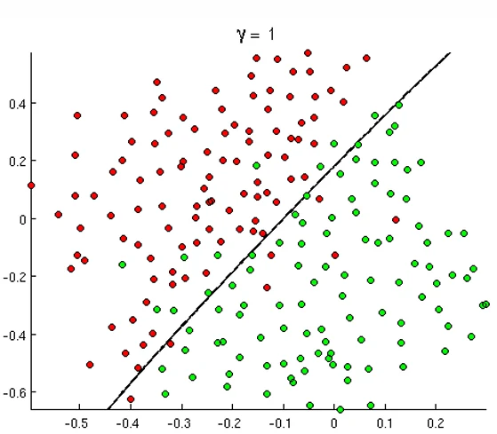
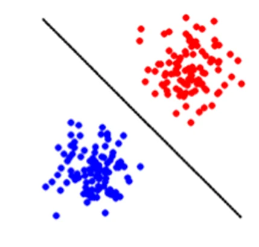
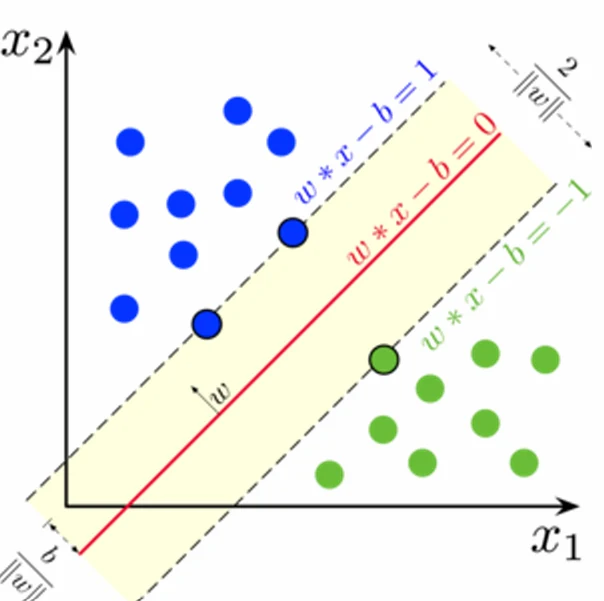

# [딥러닝] 머신러닝: 학습(Learning)과 모델(Model)

## 원문

https://ch010104.tistory.com/128

## 노트 유형

`concept`

## 핵심 개념과 선택 맥락

데이터로부터 패턴을 찾아내고, 이를 바탕으로 예측이나 분류를 수행하는 기술

컴퓨터가 명시적으로 프로그래밍되지 않고도 데이터를 통해 학습할 수 있도록 하는 방법

## 원문 기반 개념 정리

### 1. 머신러닝의 기본 개념

머신러닝(Machine Learning)이란?

데이터로부터 패턴을 찾아내고, 이를 바탕으로 예측이나 분류를 수행하는 기술

컴퓨터가 명시적으로 프로그래밍되지 않고도 데이터를 통해 학습할 수 있도록 하는 방법

이진 분류(Binary Classification) 예제

붉은 점과 녹색 점을 구분하는 문제를 통해 머신러닝의 핵심 개념을 이해 가능

데이터: 2차원 공간상의 붉은 점과 녹색 점들

목표: 새로운 점이 주어졌을 때 붉은 점인지 녹색 점인지 분류

접근법: 다양한 경계선(모델)을 그어서 점들을 구분

경계선의 복잡도에 따라:

선형 경계선: 직선으로 구분 (γ = 1)

곡선 경계선: 곡선으로 구분 (γ = 100)

복잡한 경계선: 매우 복잡한 곡선으로 구분 (γ = 1000)

### 2. 핵심 용어 정리

모델(Model)

모델은 데이터의 패턴을 수학적으로 표현

예시:

선형 모델: y = ax + b

다차원 곡선: y = ax^n + ... + bx + c

비선형 곡면: 더 복잡한 수학적 함수

중요점: 사용자가 모델의 형태를 선택

학습(Learning)

학습은 모델을 결정하는 변수값(파라미터)을 찾는 과정

예시: 선형 모델 y = ax + b에서 a와 b 값을 찾는 것

학습 과정:

목적 함수(Objective Function) 정의

최적화 알고리즘을 통해 최적의 파라미터 값 탐색

데이터에 가장 잘 맞는 모델 완성

### 3. 주요 분류 알고리즘

Linear Regression (선형 회귀)

선형 분류기로 직선으로 데이터를 분류

규칙: x가 집합1(빨간색)이면 wx > 0, x가 집합2(파란색)이면 wx < 0

Support Vector Machine (SVM)

Logistic Regression과 유사하지만 **최대 간격(margin)**을 보장

두 클래스 사이의 경계에서 가장 가까운 점들(Support Vector) 사이의 거리를 최대화

목적 함수: min(1/2||w||² + C∑ξᵢ)

k-Nearest Neighbor (k-NN)

k개의 가장 가까운 점들을 찾아서 해당 점들의 분류 결과를 평균으로 분류

매개변수 k의 값에 따라 결정 경계가 달라짐

모델의 복잡도는 k값에 의해 결정됨

k의 값이 커질 수록, 더 많은 근처 점들을 탐색한다는 뜻

Decision Tree (결정 트리)

"스무고개"와 같은 결정 트리 구조

각 속성에 대해 질문하며 분류 수행

Decision Tree 구축 과정:

가장 정보 이득(Information Gain)이 높은 속성 선택

해당 속성으로 데이터 분할

각 분할된 그룹에 대해 재귀적으로 반복

정보 이득 계산:

Information Gain = entropy(parent) - [average entropy(children)]

엔트로피: H(X) = -∑P(X=i)log₂P(X=i)

### 4. 고차원 데이터와 신경망

모든 데이터는 고차원의 점

임의의 데이터는 고차원 공간의 한 점으로 표현 가능

예: 640×480×3 픽셀의 이미지 → 921,600차원의 점

얼굴 인식: 고차원 데이터를 2차원으로 투영하여 시각화

Deep Neural Network

1980년대 신경망: 단순한 은닉층 하나

딥러닝 신경망: 다중 은닉층으로 계층적 특성 학습

첫 번째 층: 가장자리 감지

중간 층: 가장자리의 조합 감지

마지막 층: 복잡한 특성이나 조합 인식

### 5. 모델 선택 및 성능 평가

Under/Over Fitting

Underfitting: 모델이 너무 단순한 경우 (1차원)

Appropriate capacity: 적절한 복잡도 (2차원)

Overfitting: 모델이 너무 복잡한 경우 (고차원)

학습 중단 시점

검증 오차(Validation Error)가 증가하기 시작하는 지점에서 학습을 중단

훈련 오차는 계속 감소하지만

검증 오차는 특정 시점 후 증가 → 이 지점에서 중단

데이터셋 구분

Train Set: 모델 학습용 데이터

Validation Set: 학습 시 오버피팅 체크용

Test Set: 최종 모델 성능 측정용 (학습에 사용되지 않은 데이터)

성능 지표 (혼동행렬, Confusion Matrix)

주요 지표:

재현율(Recall): TP/(TP+FN) - 실제 양성 중 모델이 양성으로 예측한 비율

정밀도(Precision): TP/(TP+FP) - 양성으로 예측한 것 중 실제 양성인 비율

참 양성률(TPR): TP/(TP+FN) - Recall과 동일

거짓 양성률(FPR): FP/(FP+TN) - 실제 음성 중 양성으로 잘못 예측한 비율

### 6. 데이터 사이언스의 수학적 기초

머신러닝은 다음과 같은 수학 분야들이 종합된 학문입니다:

미적분학(Calculus): 최적화 과정

기댓값(Expectation): 확률적 추론

최적화(Optimization): 파라미터 탐색

베이즈 규칙(Bayes Rule): 확률적 추론

행렬(Matrices): 데이터 표현과 연산

확률 밀도(Probability Density): 불확실성 모델링

확률 변수(Random Variables): 데이터의 확률적 특성

## 핵심 이미지

## 관련 글

- [[blog/AI(ML & DL)/index|AI(ML & DL)]]
- [[blog/CLAUD COMPUTERING/클라우드 컴퓨터링- 머신러닝, 딥러닝과 빅데이터|[클라우드 컴퓨터링] 머신러닝, 딥러닝과 빅데이터]]
- [[blog/AI(ML & DL)/딥러닝- 퍼셉트론(Perceptron)과 경사 하강법(Gradient Descent)|[딥러닝] 퍼셉트론(Perceptron)과 경사 하강법(Gradient Descent)]]
- [[blog/AI(ML & DL)/딥러닝- 인공지능의 동향|[딥러닝] 인공지능의 동향]]
