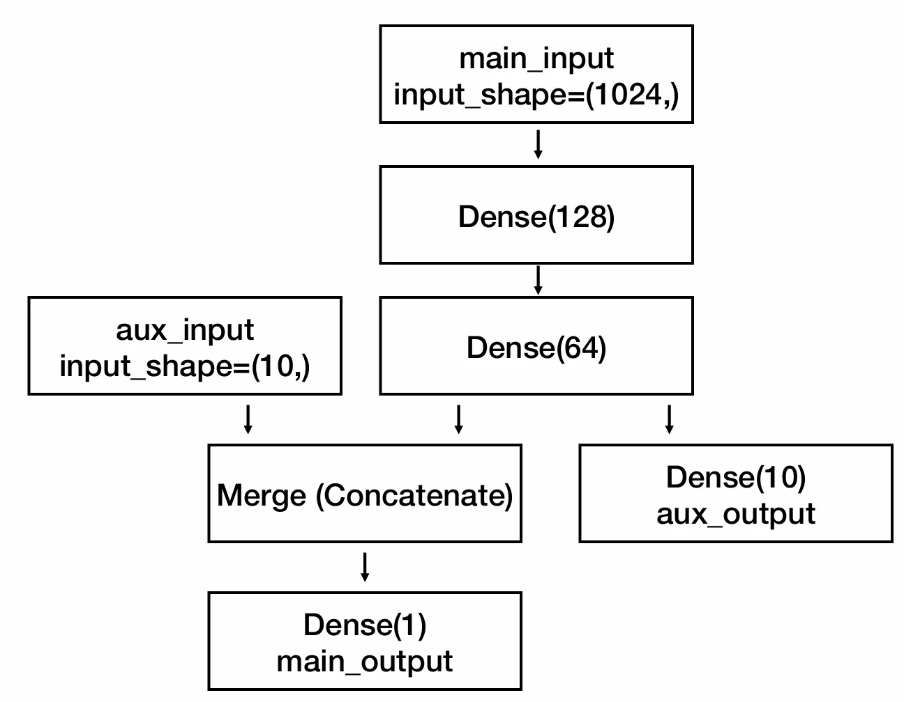
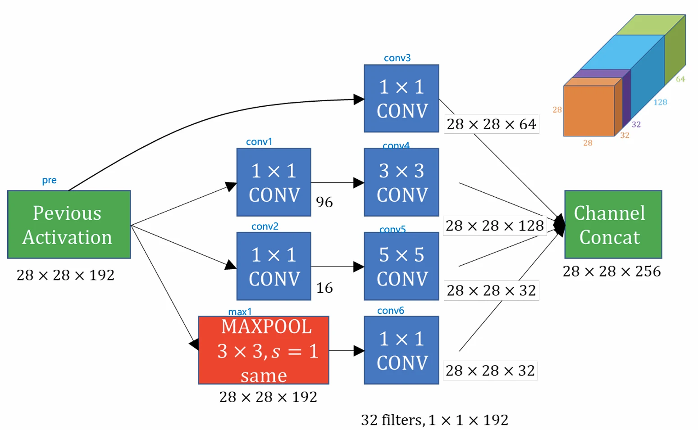

# [딥러닝] 모델 다루기 (Sequential & Functional + Inception Module 실습)

## 원문

https://ch010104.tistory.com/170

## 노트 유형

`tutorial`

## 학습 목표 및 맥락

정의: 하나의 입력과 하나의 출력을 가지며, Layer를 순차적으로 쌓아나가는 방식

핵심 원리: 이전 레이어의 output이 다음 레이어의 input이 됨

## 원문 기반 학습 정리

### 모델 생성: Sequential

정의: 하나의 입력과 하나의 출력을 가지며, Layer를 순차적으로 쌓아나가는 방식

핵심 원리: 이전 레이어의 output이 다음 레이어의 input이 됨

구현 예시:

```text
from tensorflow.keras.models import Sequential
from tensorflow.keras.layers import Dense
model = Sequential()
model.add(Dense(2, input_dim=1))
model.add(Dense(1))
```

> 원문 코드가 길어 이 노트에서는 앞부분만 보존했습니다. 전체는 원문에서 확인합니다.

### 모델 생성: Functional

개념: 입력이나 출력이 하나로 제한되지 않는 모델링 방식

필요성: "꼭 하나의 입력과 하나의 출력이어야 할까?"라는 질문에서 시작

두 개의 입력, 하나의 출력

하나의 입력, 두 개의 출력

```text
model = Model(inputs=[main_input, auxiliary_input],
              outputs=[main_output, auxiliary_output])
```

다중 입출력 모델 정의: Model 객체에 inputs와 outputs 리스트를 지정

```text
model.fit({'main_input': headline_data, 'aux_input': additional_data},
          {'main_output': headline_labels, 'aux_output': additional_labels},
          epochs=50, batch_size=32)
```

다중 입출력 모델 학습: fit 메서드에 딕셔너리 형태로 데이터를 매핑

Functional API 구현 방식:

각 계층의 입력이 무엇인지 명시적으로 지정해야 함 (예: hidden1(visible))

모델 전체에 대해 input과 output을 지정함

Functional API (Dense) 예시:

```text
from tensorflow.keras.models import Model
from tensorflow.keras.layers import Input, Dense

visible = Input(shape=(10,))
hidden1 = Dense(10, activation='relu')(visible)
hidden2 = Dense(20, activation='relu')(hidden1)
hidden3 = Dense(10, activation='relu')(hidden2)
output = Dense(1, activation='sigmoid')(hidden3)

model = Model(inputs=[visible], outputs=[output])
```

> 원문 코드가 길어 이 노트에서는 앞부분만 보존했습니다. 전체는 원문에서 확인합니다.

```text
from tensorflow.keras.utils import plot_model [cite: 56]
plot_model(model, to_file='model1.jpg', show_shapes=True) [cite: 67]
```

plot_model 실행 결과로 각 레이어의 입출력 shape을 테이블로 보여줌

모델 시각화: plot_model 유틸리티 사용

Functional API (CNN) 예시:

CNN 모델의 각 레이어(InputLayer, Conv2D, MaxPooling2D, Flatten, Dense)별 입출력 shape 요약표 제공

```text
from tensorflow.keras.layers import Input, Dense, Flatten, Conv2D, MaxPooling2D

visible = Input(shape=(64, 64, 1))
conv11 = Conv2D(32, kernel_size=(3, 3), activation='relu')(visible)
conv12 = Conv2D(32, kernel_size=(3, 3), activation='relu')(conv11)
pool1 = MaxPooling2D(pool_size=(2, 2))(conv12)
conv21 = Conv2D(16, kernel_size=(3, 3), activation='relu')(pool1)
conv22 = Conv2D(16, kernel_size=(3, 3), activation='relu')(conv21)
pool2 = MaxPooling2D(pool_size=(2, 2))(conv22)
flatten = Flatten()(pool2)
hidden1 = Dense(10, activation='relu')(flatten)
output = Dense(1, activation='sigmoid')(hidden1)

model = Model(inputs=[visible], outputs=[output])
```

> 원문 코드가 길어 이 노트에서는 앞부분만 보존했습니다. 전체는 원문에서 확인합니다.

### 분기 모델 (Branching Model)

개념: 하나의 입력을 두 개(이상)의 출력으로 분기하는 경우

구현 예시:

```text
from tensorflow.keras.layers import Input, Dense from tensorflow.keras.models import Model input1 = Input(shape=(256,)) output1 = Dense(1, activation='sigmoid')(input1) output2 = Dense(10, activation='softmax')(input1)

model1 = Model(inputs=[input1], outputs=[output1, output2]) model1.summary()
```

### 병합 모델 (Merging Model)

개념: 두 개(이상)의 입력을 한 개의 출력으로 병합하는 경우

병합 (붙이기) 예시:

Concatenate: 입력들을 그대로 붙이는 경우

Add: 입력들을 더하는 경우

Subtract: 입력들을 빼는 경우

Multiply: 입력들을 곱하는 경우

Dot: 입력들을 내적하는 경우 등

특징: 분기와 다르게 다양한 방식의 병합이 가능

병합 (붙이기) 예시:

```text
from tensorflow.keras.layers import Input, Concatenate
from tensorflow.keras.models import Model [cite: 175]

input1 = Input(shape=(128,)) [cite: 176]
input2 = Input(shape=(256,)) [cite: 176]
output = Concatenate()([input1, input2]) [cite: 177]

model2 = Model(inputs=[input1, input2], outputs=[output]) [cite: 178]
```

병합 (더하기) 예시: (두 입력의 shape이 동일해야 함)

```text
from tensorflow.keras.layers import Input, Add
from tensorflow.keras.models import Model [cite: 186]

input1 = Input(shape=(128,)) [cite: 187]
input2 = Input(shape=(128,)) [cite: 187]
output = Add()([input1, input2]) [cite: 188]

model2 = Model(inputs=[input1, input2], outputs=[output]) [cite: 195]
```

병합 (빼기) 예시: (두 입력의 shape이 동일해야 함)

```text
from tensorflow.keras.layers import Input, Subtract
from tensorflow.keras.models import Model [cite: 199]

input1 = Input(shape=(128,)) [cite: 202]
input2 = Input(shape=(128,)) [cite: 202]
output = Subtract()([input1, input2]) [cite: 204]

model2 = Model(inputs=[input1, input2], outputs=[output]) [cite: 206]
```

### 실습: 다중 입출력 모델

구조: 2개의 입력(main_input, aux_input)과 2개의 출력(main_output, aux_output)을 가짐

main_input은 Dense(128) -> Dense(64)를 거침

Dense(64)의 출력은 aux_output (Dense(10))으로 분기함

Dense(64)의 출력은 aux_input과 Concatenate로 병합됨

병합된 텐서는 main_output (Dense(1))으로 분기함

구현 코드 및 주석:

```text
# Keras가 아닌 tensorflow.keras를 사용하는 것이 일반적입니다
from tensorflow.keras import layers [cite: 211]
from tensorflow.keras import models [cite: 212]
# utils는 Keras의 일부가 아닐 수 있음 (모델 구조엔 불필요)

# 1. 메인 입력 및 처리 [cite: 214]
main_input = layers.Input(shape=(1024,))
dense128 = layers.Dense(128)(main_input)
dense64 = layers.Dense(64)(dense128) # (None, 64) 크기의 텐서

# 2. 보조 입력 [cite: 218]
aux_input = layers.Input(shape=(10,)) # (None, 10) 크기의 텐서

# 3. 병합 (Concatenate)
# 두 텐서를 이어 붙여 (None, 74) 크기의 텐서를 만듬
merge = layers.Concatenate()([aux_input, dense64])

# 4. 출력
# (참고) 이 모델은 출력이 2개인 '다중 출력 모델'

# 출력 1: 보조 출력 (dense64에서 바로 분기)
aux_output = layers.Dense(10)(dense64)

# 출력 2: 메인 출력 (병합된 merge에서 분기)
main_output = layers.Dense(1)(merge)

# 이 입력과 출력을 기반으로 모델을 정의할 수 있음
model = models.Model(inputs=[main_input, aux_input], outputs=[main_output, aux_])
```

> 원문 코드가 길어 이 노트에서는 앞부분만 보존했습니다. 전체는 원문에서 확인합니다.

### 실습: Inception Module

주제: Inception Module 코드로 작성해보기

핵심 주석: (기말고사에 반드시 출제됨)

구조:

하나의 입력(prev)을 받음

4개의 브랜치(Branch)로 분기됨

Branch 1: 1x1 Conv (입력: prev)

Branch 2: 1x1 Conv (Bottleneck, 입력: prev) -> 3x3 Conv

Branch 3: 1x1 Conv (Bottleneck, 입력: prev) -> 5x5 Conv

Branch 4: 3x3 MaxPool (입력: prev) -> 1x1 Conv

4개 브랜치의 최종 출력을 concatenate (채널 축 기준)하여 병합

구현 코드 및 주석:

```text
import tensorflow as tf
from tensorflow.keras.models import Model
from tensorflow.keras.layers import Input, Conv2D, MaxPooling2D, concatenate
from tensorflow.keras import utils # 칠판의 'utils' import

# 1. Input Layer (변수명: prev)
prev = Input(shape=(28, 28, 192))

# 2. 각 브랜치의 '중간' 레이어 (변수명: conv1, conv2, max1)
# 1x1 Conv (Branch 2의 Bottleneck)
conv1 = Conv2D(filters=96, kernel_size=(1, 1), padding='same', activation='relu')(prev)
# 1x1 Conv (Branch 3의 Bottleneck)
conv2 = Conv2D(filters=16, kernel_size=(1, 1), padding='same', activation='relu')(prev)
# 3x3 MaxPool (Branch 4의 시작)
max1 = MaxPooling2D(pool_size=(3, 3), strides=(1, 1), padding='same')(prev)

# 3. 각 브랜치의 '최종' 출력 (변수명: conv3, conv4, conv5, conv6)
# Branch 1: 1x1 Conv
conv3 = Conv2D(filters=64, kernel_size=(1, 1), padding='same', activation='relu')(prev)
# Branch 2: 3x3 Conv (입력: conv1)
conv4 = Conv2D(filters=128, kernel_size=(3, 3), padding='same', activation='relu')(conv1)
# Branch 3: 5x5 Conv (입력: conv2)
conv5 = Conv2D(filters=32, kernel_size=(5, 5), padding='same', activation='relu')(conv2)
# Branch 4: 1x1 Conv (입력: max1)
conv6 = Conv2D(filters=32, kernel_size=(1, 1), padding='same', activation='relu')(max1)

# 4. Concatenate (병합)
# 4개의 브랜치(c1, c2, c3, c4)를 채널 축 기준으로 합침
output = concatenate([conv3, conv4, conv5, conv6], axis=-1)

# 5. Model 정의 (칠판의 'model = models.Model...' 부분)
model = Model(inputs=prev, outputs=output)

# 6. 모델 요약 (칠판의 'model.summary()...' 부분)
model.summary()

# 7. (Optional) 모델 구조 시각화
# 이 코드를 실행하려면 graphviz가 설치되어 있어야 함
# utils.plot_model(model, to_file='inception_module.png', show_shapes=True)
```

> 원문 코드가 길어 이 노트에서는 앞부분만 보존했습니다. 전체는 원문에서 확인합니다.

## 핵심 이미지





## 관련 글

- [[blog/AI(ML & DL)/index|AI(ML & DL)]]
- [[blog/AI(ML & DL)/딥러닝- 검증된 AI 모델 활용(Keras Applications)|[딥러닝] 검증된 AI 모델 활용(Keras Applications)]]
- [[blog/AI(ML & DL)/딥러닝- CNN의 역사, Dropout과 Batch Normalization|[딥러닝] CNN의 역사, Dropout과 Batch Normalization]]
- [[blog/AI(ML & DL)/딥러닝- 오토인코더와 활용|[딥러닝] 오토인코더와 활용]]
