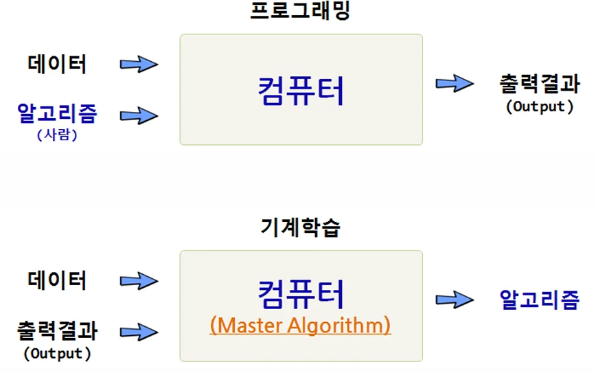
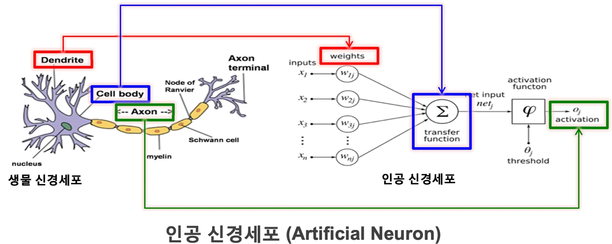
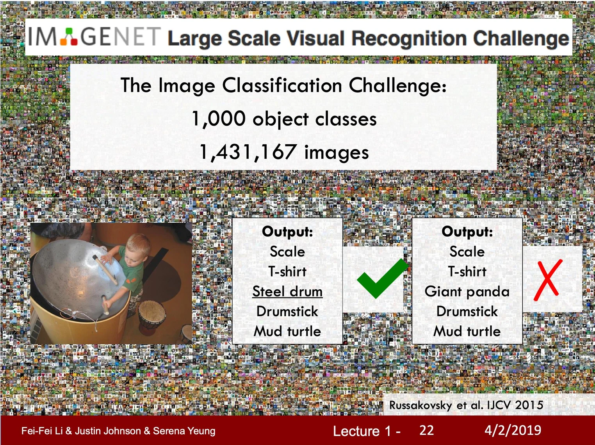

# [딥러닝] 인공지능의 동향

## 원문

https://ch010104.tistory.com/120

## 노트 유형

`concept`

## 핵심 개념과 선택 맥락

컴퓨터나 기계가 사람의 학습 능력, 문제 해결 능력 등 인지 기능을 모방하는 것을 의미

튜링 테스트(Turing Test)를 통해 AI의 성능을 측정함

## 원문 기반 개념 정리

### 1. 인공지능(AI)이란 무엇일까요?

컴퓨터나 기계가 사람의 학습 능력, 문제 해결 능력 등 인지 기능을 모방하는 것을 의미

튜링 테스트(Turing Test)를 통해 AI의 성능을 측정함

1950년대 앨런 튜링에 의해 고안된 이 테스트는 기계가 얼마나 사람과 똑같이 행동하는지에 초점을 맞춰, 기계가 인간처럼 생각할 수 있는지 판별

2018년 구글 I/O에서 시연된 '구글 듀플렉스'는 이 튜링 테스트를 성공적으로 통과한 최초의 사례로 평가받음

AI는 1950년대에 처음 등장한 이후, 머신러닝(Machine Learning)과 딥러닝(Deep Learning)의 발전을 통해 폭발적인 성장을 이룸

### 2. 스스로 학습하는 기계: 머신러닝과 딥러닝

머신러닝(Machine Learning): - 프로그래머가 모든 규칙을 직접 만들지 않고, 컴퓨터가 데이터를 통해 스스로 규칙을 학습하게 하는 방법

딥러닝(Deep Learning): - 이러한 머신러닝의 한 분야로, 인간의 뇌를 구성하는 신경세포(뉴런)의 정보 처리 방식을 모방한 인공 신경망(Artificial Neural Network) 모델에 기반 - 여러 개의 층(layer)을 깊게 쌓아 만드는데, 입력 데이터(예: 이미지 픽셀)에서 시작해 점, 선, 면과 같은 단순한 특징부터 점차 복잡하고 추상적인 특징(예: 눈, 코, 얼굴 형태)을 학습하여 최종적으로 객체를 인식하게 됨

### 3. 딥러닝 발전의 기폭제: 이미지넷(ImageNet) 챌린지

딥러닝이 최근 급격히 발전하게 된 이유는 크게 세 가지로 꼽을 수 있음

빅데이터 (Big Data)

컴퓨팅 파워 (Computing Power)의 발전

알고리즘 (Algorithm)의 진화

- 이러한 발전이 집약된 대표적인 사례가 바로 '이미지넷 대규모 영상 인식 대회(ILSVRC)' - 2012년, 딥러닝 기반의 AlexNet이 압도적인 성능으로 우승하며 딥러닝 시대의 개막

- 이후 GoogLeNet, ResNet 등 더욱 발전된 모델들이 등장하며 이미지 인식 오류율은 급격히 감소 - 마침내 2015년에는 인간의 인식 능력을 뛰어넘는 수준에 도달

### 4. AI 기술의 최신 동향 및 적용 사례

1) 게임을 정복한 AI

딥러닝 기술은 복잡한 전략 게임에서도 인간을 뛰어넘는 능력을 보여주었음

AlphaGo Zero, 바둑, 체스, 쇼기 등 여러 게임을 하나의 알고리즘으로 마스터하는 AlphaZero, 심지어 게임의 규칙까지 스스로 학습하는 MuZero로 진화

AlphaGo & MuZero: - 2016년 이세돌 9단과의 대국으로 유명한 알파고는 인간의 데이터를 기반으로 학습 - 이후 스스로 학습하는 OpenAI Five는 AI의 적용 범위를 더욱 확장

AlphaStar & OpenAI Five: - 실시간 전략 게임인 스타크래프트 II에서 그랜드마스터 레벨에 도달한 AlphaStar와 팀플레이 게임인 도타 2에서 월드 챔피언을 꺾음

2) 언어의 장벽을 넘다: 자연어 처리 (NLP)

2017년 발표된 'Attention Is All You Need' 논문의 트랜스포머(Transformer) 아키텍처는 자연어 처리 분야에 혁명을 가져옴

GPT는 현대 자연어 처리 모델의 양대 산맥이 됨

BERT & GPT: - 트랜스포머의 인코더 구조를 활용한 BERT와 디코더 구조를 활용한 ChatGPT가 2022년 11월에 공개되면서 전 세계적인 생성형 AI 열풍을 일으킴

ChatGPT: - 특히 GPT 기술은 **GPT-1(2018년)**부터 **GPT-4(2023년)**에 이르기까지 발전을 거듭함

3) 창작의 영역에 도전: 생성형 AI (Generative AI)

이제 AI는 텍스트를 입력받아 사실적인 이미지와 예술 작품을 만들어내는 수준에 이름

DALL-E 2, Midjourney, Imagen: - 자연어 설명만으로 고품질 이미지를 생성하는 대표적인 텍스트-이미지(Text-to-Image) 모델

4) 현실 세계로의 확장: 자율주행과 로보틱스

테슬라 FSD(Full-Self-Driving): - 테슬라는 실제 차량 운행 데이터를 수집하고 이를 통해 신경망을 훈련시키는 '데이터 엔진'을 구축하여 자율주행 기술을 고도화하고 있음

테슬라 봇(Tesla Bot): - AI 기술은 자율주행을 넘어 인간의 모습을 한 휴머노이드 로봇 개발로 이어지고 있음 - 이는 위험하고 반복적인 작업을 대신하며 인간의 삶을 더욱 편리하게 만들 잠재력을 가지고 있음

## 관련 글

- [[blog/AI(ML & DL)/index|AI(ML & DL)]]
- [[blog/AI(ML & DL)/딥러닝- 퍼셉트론(Perceptron)과 경사 하강법(Gradient Descent)|[딥러닝] 퍼셉트론(Perceptron)과 경사 하강법(Gradient Descent)]]
- [[blog/AI(ML & DL)/딥러닝- CNN를 위한 이미지 필터링|[딥러닝] CNN를 위한 이미지 필터링]]
- [[blog/AI(ML & DL)/딥러닝- CNN의 역사, Dropout과 Batch Normalization|[딥러닝] CNN의 역사, Dropout과 Batch Normalization]]
