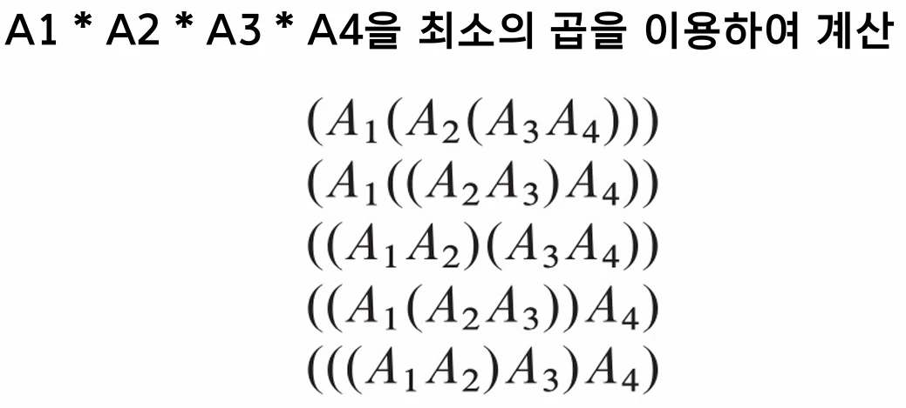
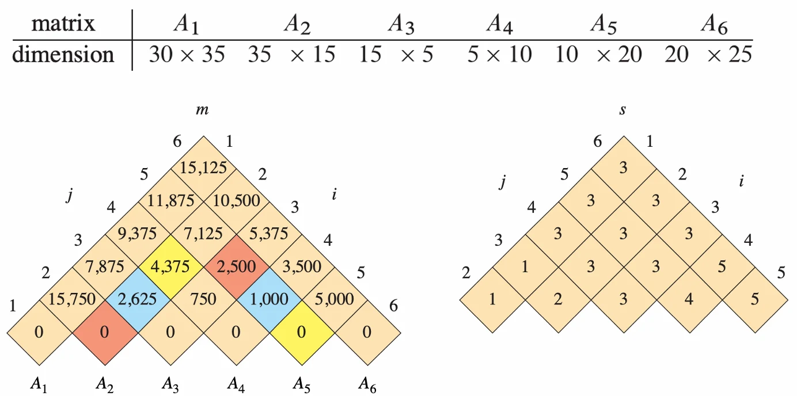
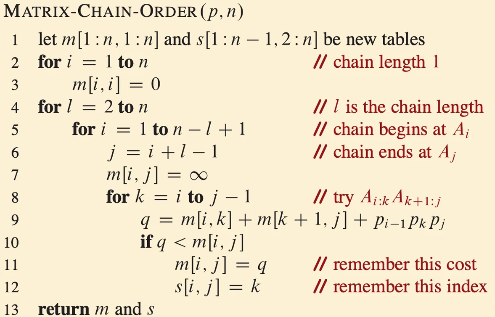

# [알고리즘] DynamicProgramming과 AllPairShortestPathAlgorithm

## 원문

https://ch010104.tistory.com/183

## 노트 유형

`concept`

## 핵심 개념과 선택 맥락

최적 해의 값을 일반적으로 bottom-up(상향식) 방식으로 계산

2. 예제 1: 행렬 곱셈 순서 (Matrix-Chain Multiplication)

## 원문 기반 개념 정리

### DynamicProgramming알고리즘

1. 동적 프로그래밍 개발 4단계

최적 해의 구조를 파악

최적 해의 값을 재귀적으로 정의

최적 해의 값을 일반적으로 bottom-up(상향식) 방식으로 계산

계산된 정보를 이용해 최적 해를 구성

2. 예제 1: 행렬 곱셈 순서 (Matrix-Chain Multiplication)

문제: 여러 행렬을 순차적으로 곱할 때, 곱셈 순서에 따라 성능 차이가 발생

예: $(A1 \times A2) \times A3$는 7,500번의 곱셈이 필요하지만, $A1 \times (A2 \times A3)$는 75,000번의 곱셈이 필요 (10배 이상 차이)

목표: 최소의 곱셈 횟수로 행렬 연산을 완료하는 최적의 순서(괄호 치기)를 결정.

DP 적용:

최적 구조: $A_i...A_j$의 최적 해는 $(A_i...A_k) \times (A_{k+1}...A_j)$ 형태의 두 하위 문제의 곱으로 분할됨

재귀 정의: $A_i...A_k$의 최적해와 $A_{k+1}...A_n$의 최적해를 각각 구함.

알고리즘: MATRIX-CHAIN-ORDER

$m[i, j]$: $A_i$부터 $A_j$까지 곱셈의 최적 연산 횟수.

$s[i, j]$: $A_i...A_j$를 최적으로 분할하는 인덱스 $k.

기저 상태: $m[i, i] = 0$ (연쇄 길이 1)

계산 (Bottom-up): 연쇄 길이 $l$을 2부터 $n$까지 증가시키며 $m$ 테이블을 채움.

$m[i, j]$ 계산 시 ($j = i+l-1$), $i \le k < j$인 모든 $k$에 대해 분할 $(A_i...A_k)(A_{k+1}...A_j)$을 시도.

비용 $q = m[i, k] + m[k+1, j] + p_{i-1}p_k p_j$ (두 부분 문제의 비용 + 최종 곱셈 비용).

$q$가 $m[i, j]$의 현재 값보다 작으면 $m[i, j] = q$로 갱신하고 $s[i, j] = k$로 기록

최적해 구성:

최종 최적 비용은 $m[1, n]$ (예: $m[1, 6]$)

$s$ 테이블을 재귀적으로 추적하여 실제 곱셈 순서를 알아냄 (예: $s[1, 6] = 3$이면 $(A1 A2 A3)(A4 A5 A6)$로 분할)

3. 예제 2: 최장 공통 부분 수열 (LCS)

문제: 두 입력 시퀀스 X와 Y의 최장 길이 공통 부분 수열(Longest Common Subsequence)을 찾는 문제

부분 수열 (Subsequence): 원래 수열에서 일부 원소를 삭제하되, 남은 원소들의 상대적 순서는 유지.

DP 적용 (재귀적 해법):

$c[i, j]$: $X_i = \langle x_1...x_i \rangle$와 $Y_j = \langle y_1...y_j \rangle$ 사이의 LCS 길이

기저 상태: $i=0$ 또는 $j=0$ 이면, $c[i, j] = 0$

$x_i = y_j$ (문자가 일치할 때): $c[i, j] = c[i-1, j-1] + 1$. (LCS 길이가 1 증가)

$x_i \ne y_j$ (문자가 불일치할 때): $c[i, j] = \max(c[i, j-1], c[i-1, j])$. (두 하위 문제 중 더 긴 쪽을 선택)

알고리즘: LCS-LENGTH

$c$ (LCS 길이) 테이블과 $b$ (경로 재구성을 위한 방향) 테이블을 생성.

$c[i, 0]$과 $c[0, j]$를 0으로 초기화

2중 루프(i, j)를 돌며 $c$ 테이블과 $b$ 테이블을 채움

$x_i = y_j$이면 $b[i, j]$에 "대각선"($\diagup$) 표시.

$x_i \ne y_j$일 때, $c[i-1, j]$가 더 크면 "위"($\uparrow$), $c[i, j-1]$가 더 크거나 같으면 "왼쪽"($\leftarrow$) 표시

시간 복잡도: $\Theta(mn)

최적해 구성: PRINT-LCS

$c[m, n]$ (예: (7, 6))에서 시작하여 $b$ 테이블의 화살표를 역으로 추적

$b[i, j]$가 "대각선"이면, $x_i$는 LCS의 요소임. $x_i$를 출력하고 $(i-1, j-1)$로 이동

"위"이면 $(i-1, j)$로 이동. "왼쪽"이면 $(i, j-1)$로 이동

### AllPairShortestPathAlgorithm

1. 문제 정의

목표: 그래프의 한 정점 u에서 다른 정점 v로 가는 가장 빠른 경로(shortest path) 탐색

입력: 가중치가 있는 방향 그래프 $G=(V, E)$3. 가중치 함수 $w: E \rightarrow \mathbb{R}$는 간선에 실수 값을 매핑

경로 가중치 $w(p)$: 경로 $p$를 구성하는 간선들의 가중치 합

최단 경로 가중치 $\delta(u,v)$: u에서 v로 가는 경로가 존재하면 최소 가중치(min), 없으면 $\infty$.

2. 기본 접근법

Single Source Shortest Paths (SSSP): 하나의 출발점에서의 최단 경로는 Bellman-Ford (음수 가중치 포함) 또는 Dijkstra (음수 가중치 없음) 알고리즘을 사용

APSP 해결: 모든 정점(vertex)을 출발점으로 하여 SSSP 알고리즘을 각각 수행하는 방식

3. 동적 프로그래밍 접근 (행렬 곱셈 유사)

동적 프로그래밍을 기반으로 하며, 반복적인 행렬 곱셈과 유사한 연산을 수행

$l_{ij}^{(r)}$: $i$에서 $j$까지 최대 $r$개의 간선을 사용하는 경로의 최소 가중치

기저 상태 ($r=0$): $l_{ij}^{(0)}$는 $i=j$일 때 0, $i \ne j$일 때 $\infty$.

재귀 정의: $l_{ij}^{(r)} = \min_{1 \le k \le n} \{ l_{ik}^{(r-1)} + w_{kj} \}$.

이는 최대 $r-1$개 간선 경로 13또는 $i$에서 $k$까지 $r-1$개 간선 경로 + $(k, j)$ 간선 경로 중 최솟값을 찾는 것.

행렬 곱셈과의 관계:

일반 행렬 곱셈 $C = A \cdot B$는 $c_{ij} = \sum_{k=1}^{n} a_{ik} \cdot b_{kj}$

최단 경로 알고리즘은 이 연산을 $\sum$ 대신 min으로, $\cdot$ 대신 +로 재정의하여 사용

$L^{(1)} = W$, $L^{(2)} = W^2$, ... $L^{(n-1)} = W^{n-1}$을 계산.

최종 $L^{(n-1)}$ 행렬이 모든 쌍의 최단 경로 가중치를 포함

알고리즘: FASTER-APSP

$L^{(n-1)}$을 구하기 위해 $W$를 $n-1$번 곱하면 $\Theta(n^4)$ 시간이 소요

대신 $W, W^2, W^4, W^8, ...$ 와 같이 거듭제곱을 반복하여 계산 (반복 제곱)

이 방식은 $\lceil \lg(n-1) \rceil$ 번의 행렬 곱셈만 필요

각 'min-plus' 행렬 곱셈은 $\Theta(n^3)$ 시간이 걸림

총 시간 복잡도: $\Theta(n^3 \lg n)$

FASTER-APSP 의사 코드는 EXTEND-SHORTEST-PATHS를 반복적으로 호출하여 $L = L^2$ 연산을 수행

4. Floyd-Warshall 알고리즘

최적 부분 구조(optimal substructure)를 활용하는 동적 프로그래밍 알고리즘.

$d_{ij}^{(k)}$: $i$에서 $j$로 가는 경로 중, 중간 정점(intermediate vertices)이 $\{1, 2, ..., k\}$ 집합에만 속하는 최단 경로의 가중치

재귀 정의:

$d_{ij}^{(0)} = w_{ij}$ ($k=0$, 중간 정점 없음)

$d_{ij}^{(k)} = \min(d_{ij}^{(k-1)}, d_{ik}^{(k-1)} + d_{kj}^{(k-1)})$ ($k \ge 1$)

의미: $k$를 거치지 않는 경로와 $i \rightarrow k \rightarrow j$ 경로 중 더 짧은 것을 선택.

알고리즘: FLOYD-WARSHALL(W, n).

$D^{(0)} = W$로 초기화

$k=1$부터 $n$까지, 모든 $i, j$ 쌍에 대해 $d_{ij}^{(k)}$를 갱신하는 3중 루프 사용

경로 재구성:

선행 정점(predecessor) 행렬 $\Pi^{(k)}$를 사용하여 경로를 재구성.

$k$를 거쳐가는 경로가 더 짧다면 ($d_{ij}^{(k-1)} > d_{ik}^{(k-1)} + d_{kj}^{(k-1)}$), $j$의 선행 정점은 $k \rightarrow j$ 경로의 선행 정점($\pi_{kj}^{(k-1)}$)이 됨

아니라면, $k$를 거치지 않는 경로의 선행 정점($\pi_{ij}^{(k-1)}$)을 유지

## 핵심 이미지

## 관련 글

- [[blog/ALGORITHM/index|ALGORITHM]]
- [[blog/ALGORITHM/알고리즘- A- (A-Star) 알고리즘과 Greedy (탐욕) 알고리즘|[알고리즘] A* (A-Star) 알고리즘과 Greedy (탐욕) 알고리즘]]
- [[blog/ALGORITHM/알고리즘- Shortest Path 알고리즘(Bellman-Ford & DIJKSTRA 알고리즘)|[알고리즘] Shortest Path 알고리즘(Bellman-Ford & DIJKSTRA 알고리즘)]]
- [[blog/ALGORITHM/알고리즘- 최소 신장 트리 (MST) - 크루스칼 (Kruskal) & 프림 (Prim) 알고리즘|[알고리즘] 최소 신장 트리 (MST) - 크루스칼 (Kruskal) & 프림 (Prim) 알고리즘]]
