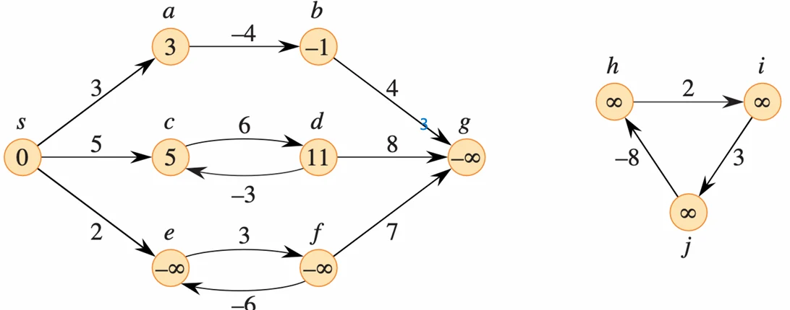
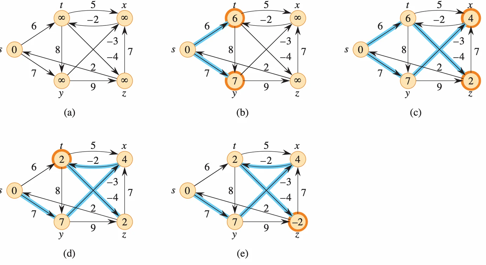
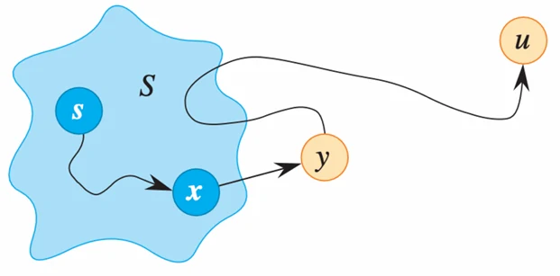

# [알고리즘] Shortest Path 알고리즘(Bellman-Ford & DIJKSTRA 알고리즘)

## 원문

https://ch010104.tistory.com/166

## 노트 유형

`guide`

## 적용 목적과 전제조건

문제: 가중치가 있는 유향 그래프 $G=(V,E)$에서 1, 한 정점 $u$에서 다른 정점 $v$로 가는 가장 가중치가 낮은 (가장 빠른) 경로를 찾는 문제

입력: 가중치가 있는 유향 그래프 $G=(V,E)$와 가중치 함수 $w: E \rightarrow \mathbb{R}$

## 구현 절차·검증·주의점

### 1. 최단 경로 문제 (Shortest Paths)

기본 정의

문제: 가중치가 있는 유향 그래프 $G=(V,E)$에서 1, 한 정점 $u$에서 다른 정점 $v$로 가는 가장 가중치가 낮은 (가장 빠른) 경로를 찾는 문제

입력: 가중치가 있는 유향 그래프 $G=(V,E)$와 가중치 함수 $w: E \rightarrow \mathbb{R}$

경로 가중치 $w(p)$: 경로 $p=\langle v_{0},v_{1},...,v_{k}\rangle$를 구성하는 간선들의 가중치 합 - $w(p)=\sum_{i=1}^{k}w(v_{i-1},v_{i})$

최단 경로 가중치 $\delta(u,v)$:

$u$에서 $v$로 가는 경로가 있으면 $min\{w(p): u \leadsto v\}$

경로가 없으면 $\infty$

최단 경로: $w(p)=\delta(u,v)$를 만족하는 모든 경로 $p$

문제의 변형

단일 출발점 (Single-Source): (이 장의 초점) 주어진 출발 정점 $s$에서 $V$에 속한 모든 정점 $v$까지의 최단 경로를 찾음

단일 도착점 (Single-Destination): 모든 정점 $v$에서 주어진 도착 정점 $t$까지의 최단 경로를 찾음. (그래프의 모든 간선 방향을 뒤집어 단일 출발점 문제로 해결 가능)

단일 쌍 (Single-Pair): 주어진 두 정점 $u, v$ 사이의 최단 경로를 찾음. (단일 출발점 문제(출발점 $u$)를 풀면 이 문제도 해결됨)

전체 쌍 (All-Pairs): 모든 정점 쌍 $(u, v)$ 간의 최단 경로를 찾음. (단일 출발점 알고리즘을 $|V|$번 실행하여 풀 수 있으나, 더 빠른 방법이 존재)

### 2. 최단 경로의 속성



최적 부분 구조 (Optimal Substructure)

정의 (Lemma 22.1): 최단 경로의 부분 경로(subpath) 역시 최단 경로

증명 (귀류법):

$v_0$에서 $v_k$로 가는 최단 경로 $p$가 있고, 이 경로의 부분 경로 $p_{ij}$ ( $v_i$에서 $v_j$까지)가 있다고 가정

만약 $p_{ij}$보다 더 짧은 경로 $p_{ij}^{\prime}$가 $v_i$에서 $v_j$로 존재한다고 가정 ($w(p_{ij}^{\prime}) < w(p_{ij})$)

$v_0$에서 $v_k$로 가는 새로운 경로 $p^{\prime}$를 ($p_{0i} \rightarrow p_{ij}^{\prime} \rightarrow p_{jk}$)로 만들 수 있음

이 경로 $p^{\prime}$의 가중치는 $w(p)$보다 작게 됨 ($w(p^{\prime}) < w(p)$)

이는 $p$가 $v_0$에서 $v_k$로 가는 최단 경로라는 원래 가정에 모순됨

따라서 $p_{ij}$는 반드시 $v_i$에서 $v_j$로 가는 최단 경로여야 함

음수 가중치 간선 및 사이클

음수 가중치 간선: 허용됨

음수 가중치 사이클:

만약 출발점 $s$에서 도달 가능한 음수 가중치 사이클이 있다면, 최단 경로는 정의되지 않음21.

이 사이클을 계속 돌면 경로 가중치를 무한히 낮출 수 있기 때문

예시:

정점 $e$와 $f$는 음수 가중치 사이클($3 + (-6) = -3$)을 형성

이 사이클은 $s$에서 도달 가능함 ($s \rightarrow e$)

따라서 $e$와 $f$의 최단 경로 가중치는 $-\infty$

$e$나 $f$에서 도달 가능한 $g$ 역시 최단 경로 가중치가 $-\infty$임

$s$에서 도달 불가능한 $h, i, j$ 등은, 비록 자신들이 음수 사이클의 일부일지라도, 최단 경로 가중치가 $\infty$

경로의 유일성

최단 경로는 유일하지 않을 수 있음

예시 (Page 7): $s$에서 $z$로 가는 최단 경로 가중치는 11로 유일하지만 29, (b)와 (c)는 서로 다른 최단 경로 트리(Shortest-paths tree)를 보여줌

단, 최단 경로 가중치($\delta(s,v)$)는 유일함

### 3. Relaxation (완화)

Relaxation은 $v$로 가는 현재까지의 최단 경로 추정치($v.d$)를 $u$를 거쳐 가는 더 짧은 경로가 있는지 확인하고, 있다면 갱신하는 핵심 연산

초기화

INITIALIZE-SINGLE-SOURCE(G, s)

모든 정점 $v \in G.V$에 대해

$v.d = \infty$ (최단 경로 추정치)

$v.\pi = \text{NIL}$ (직전 정점)

$s.d = 0$ 36363636 (출발점의 가중치는 0)

Relaxation 연산

RELAX(u, v, w)

if v.d > u.d + w(u, v) ( $u$를 거쳐 $v$로 가는 것이 더 짧다면)

v.d = u.d + w(u, v) ( $v$의 추정치를 갱신)

v.π = u 40 ( $v$의 직전 정점을 $u$로 설정)

예시 (a):

$u.d = 5$, $v.d = 9$, $w(u,v) = 2$

조건 확인: $9 > 5 + 2$ (True)

갱신: $v.d = 7$, $v.\pi = u$

예시 (b) :

$u.d = 5$, $v.d = 6$, $w(u,v) = 2$

조건 확인: $6 > 5 + 2$ (False)

갱신 안 함

Relaxation의 속성

삼각 부등식 (Triangle Inequality): $\delta(s,v) \le \delta(s,u) + w(u,v)$

상한 속성 (Upper-bound): 항상 $v.d \ge \delta(s,v)$이며, $v.d$가 $\delta(s,v)$에 도달하면 더 이상 변하지 않음48.

경로 없음 속성 (No-path): $s$에서 $v$로 가는 경로가 없으면, 항상 $v.d = \delta(s,v) = \infty$

수렴 속성 (Convergence):

$s \leadsto u \rightarrow v$가 최단 경로이고, $(u,v)$ 간선을 relax하기 전 $u.d = \delta(s,u)$가 만족되었다면 (즉, $u$까지의 최단 경로를 이미 안다면)

Relaxation 이후에는 항상 $v.d = \delta(s,v)$가 됨

증명: Relax 후 $v.d \le u.d + w(u,v)$52. 가정에 의해 $u.d = \delta(s,u)$이므로, $v.d \le \delta(s,u) + w(u,v)$54. 최적 부분 구조에 의해 $\delta(s,v) = \delta(s,u) + w(u,v)$

따라서 $v.d \le \delta(s,v)$. 상한 속성에 의해 $v.d \ge \delta(s,v)$이므로, $v.d = \delta(s,v)$가 성립

경로 Relaxation 속성 (Path-relaxation): 최단 경로 $p=\langle v_{0}, ..., v_{k}\rangle$의 간선들을 순서대로 $(v_{0}, v_{1}), ..., (v_{k-1}, v_{k})$ relax하면, 다른 relax 연산과 섞이더라도 $v_{k}.d = \delta(s,v_{k})$가 보장됨

### 4. 벨만-포드 (Bellman-Ford) 알고리즘



- 음수 가중치 간선이 있어도 작동하며 58, 음수 가중치 사이클을 탐지할 수 있음

알고리즘

그래프를 초기화 ($INITIALIZE-SINGLE-SOURCE$)

모든 간선에 대해 Relaxation을 수행함

위 2번 과정을 $|V|-1$번 반복함

(음수 사이클 탐지) 모든 간선 $(u,v)$에 대해 $v.d > u.d + w(u,v)$가 여전히 성립하는지 다시 확인

성립하는 간선이 있다면 (즉, 갱신이 또 일어난다면) 음수 사이클이 존재함을 의미 (FALSE 반환)

없다면 최단 경로를 찾았음 (TRUE 반환)

의사 코드

```text
BELLMAN-FORD (G, w, s)
1  INITIALIZE-SINGLE-SOURCE (G, s) [cite: 377]
2  for i = 1 to |G.V| - 1 [cite: 378]
3    for each edge (u, v) in G.E [cite: 382]
4      RELAX(u, v, w) [cite: 383]
5  for each edge (u, v) in G.E [cite: 384]
6    if v.d > u.d + w(u, v) [cite: 387]
7      return FALSE [cite: 388]
8  return TRUE
```

> 원문 코드가 길어 이 노트에서는 앞부분만 보존했습니다. 전체는 원문에서 확인합니다.

정확성 및 증명

최단 경로는 사이클이 없으므로(simple path), 최대 $|V|-1$개의 간선을 가짐

알고리즘은 1번째 반복에서 $s$로부터 1개 간선 거리의 최단 경로를 찾고, 2번째 반복에서 2개 간선 거리의 최단 경로를 찾는 과정을 반복함 (경로 Relaxation 속성)

따라서 $|V|-1$번 반복하면, 가능한 모든 최단 경로(최대 $|V|-1$개 간선)를 찾게 됨

만약 $|V|-1$번 반복 후에도 갱신이 가능하다면 (Line 5-7), 이는 $s$에서 도달 가능한 음수 가중치 사이클이 존재함을 의미함

예시

(a) 초기: $s=0$, 나머지 $\infty$

(b) 1차 반복 (i=1): $s$에 인접한 $t, y$ 갱신. $t.d=6$, $y.d=7

(c) 2차 반복 (i=2): 1차에서 갱신된 $t, y$로부터 뻗어 나감.

$x.d = y.d + w(y,x) = 7 + (-3) = 4$

$z.d = t.d + w(t,z) = 6 + (-4) = 2$

(d) 3차 반복 (i=3): 2차에서 갱신된 $x, z$로부터 뻗어 나감.

$t.d = x.d + w(x,t) = 4 + (-2) = 2$74.

(e) 4차 반복 (i=4 = |V|-1): 3차에서 갱신된 $t$로부터 뻗어 나감.

$z.d = t.d + w(t,z) = 2 + (-4) = -2$

총 4번의 반복($|V|-1$) 후 모든 최단 경로가 계산됨

수행 시간

초기화: $O(V)$

Relaxation 루프 (Line 2-4): $|V|-1$번 반복 * 모든 간선 $|E|$번 확인 = $O(VE)$

음수 사이클 확인 루프 (Line 5-7): $O(E)$

총 수행 시간: $O(VE)$

### 5. 다익스트라 (Dijkstra) 알고리즘



- 조건: 음수 가중치 간선이 없는(non-negative) 가중 그래프에서만 사용 가능

알고리즘 (Greedy 접근)

그래프를 초기화 ($INITIALIZE-SINGLE-SOURCE$)

$S$를 최단 경로가 확정된 정점의 집합으로, 초기에는 공집합($\emptyset$)으로 둠

$Q$를 모든 정점을 포함하는 최소 우선순위 큐(min-priority queue)로 사용82. (키는 $v.d$ 값)

$Q$에서 $d$ 값이 가장 작은 정점 $u$를 추출 (EXTRACT-MIN)

$u$를 $S$에 추가

$u$의 모든 인접 정점 $v$에 대해 RELAX(u, v, w)를 수행

만약 $v.d$ 값이 갱신되었다면, 큐 $Q$에서 $v$의 키 값을 갱신 (DECREASE-KEY)

$Q$가 비어있지 않은 동안 반복

의사 코드

```text
DIJKSTRA (G, w, s)
1  INITIALIZE-SINGLE-SOURCE (G, s)
2  S = ∅
3  Q = G.V (min-priority queue) [cite: 529, 530]
4  while Q ≠ ∅
5    u = EXTRACT-MIN(Q)
6    S = S U {u}
7    for each vertex v in G.Adj[u] [cite: 535]
8      RELAX(u, v, w)
         (if v.d decreases, call DECREASE-KEY(Q, v, v.d)) [cite: 538, 547, 548]
```

> 원문 코드가 길어 이 노트에서는 앞부분만 보존했습니다. 전체는 원문에서 확인합니다.

정확성 및 증명 (수학적 귀납법)

증명 (Theorem 22.6): while 루프가 시작할 때마다, $S$에 포함된 모든 정점 $v$에 대해 $v.d = \delta(s,v)$ (즉, $S$의 원소들은 최단 경로가 확정됨)임을 보임

귀납 가정: $S$에 속한 모든 $v$에 대해 $v.d = \delta(s,v)$라고 가정

증명 단계:

알고리즘이 $V-S$에서 $d$ 값이 가장 작은 $u$를 선택함90. $u.d = \delta(s,u)$임을 증명해야 함.

$s$에서 $u$로 가는 실제 최단 경로 $p$가 있다고 가정. 이 경로 $p$ 상에서 $S$를 벗어나는 첫 번째 정점을 $y$, $y$의 직전 정점( $S$에 속함)을 $x$라고 하자 ($s \leadsto x \rightarrow y \leadsto u$)

$x \in S$ 이므로, 귀납 가정에 의해 $x.d = \delta(s,x)$

$x$가 $S$에 추가될 때 $(x,y)$ 간선이 relax되었으므로, 수렴 속성에 의해 $y.d = \delta(s,y)$임

$y$는 $u$로 가는 최단 경로 상에 있고, 가중치가 음수가 아니므로 $\delta(s,y) \le \delta(s,u)$

알고리즘은 $y$가 아닌 $u$를 선택했으므로 (EXTRACT-MIN), $u.d \le y.d$

이를 종합하면: $\delta(s,y) \le \delta(s,u) \le u.d \le y.d$

그런데 4번에서 $y.d = \delta(s,y)$임을 알았으므로, 위 부등식의 모든 항은 같아야 함

따라서 $u.d = \delta(s,u)$이며, $u$를 $S$에 추가하는 것은 정당함

예시

(a) 초기: $s=0$, $Q=\{s:0, t:\infty, y:\infty, x:\infty, z:\infty\}$, $S=\{\}$

(b) 1. Extract $s(0)$: $S=\{s\}$.

Relax $(s,t) \rightarrow t.d=10$.

Relax $(s,y) \rightarrow y.d=5$.

$Q=\{y:5, t:10, x:\infty, z:\infty\}$

(c) 2. Extract $y(5)$: $S=\{s,y\}$.

Relax $(y,t) \rightarrow t.d=\min(10, 5+3)=8$.

Relax $(y,x) \rightarrow x.d=\min(\infty, 5+9)=14$.

Relax $(y,z) \rightarrow z.d=\min(\infty, 5+2)=7$.

$Q=\{z:7, t:8, x:14\}$.

(d) 3. Extract $z(7)$: $S=\{s,y,z\}$.

Relax $(z,x) \rightarrow x.d=\min(14, 7+6)=13$.

$Q=\{t:8, x:13\}$102.

(e) 4. Extract $t(8)$: $S=\{s,y,z,t\}$.

Relax $(t,x) \rightarrow x.d=\min(13, 8+1)=9$.

$Q=\{x:9\}$

(f) 5. Extract $x(9)$: $S=\{s,y,z,t,x\}$.

$Q$가 비게 되어 종료

수행 시간 (이진 최소 힙 기준)

힙 생성 (또는 $V$번의 INSERT): $O(V \lg V)$

EXTRACT-MIN 연산: $|V|$번 * $O(\lg V)$ = $O(V \lg V)$

DECREASE-KEY 연산: 최대 $|E|$번 * $O(\lg V)$ = $O(E \lg V)$

총 수행 시간: $O((V+E) \lg V)$ (연결 그래프의 경우 $O(E \lg V)$와 같음)

## 관련 글

- [[blog/ALGORITHM/index|ALGORITHM]]
- [[blog/ALGORITHM/알고리즘- 최소 신장 트리 (MST) - 크루스칼 (Kruskal) & 프림 (Prim) 알고리즘|[알고리즘] 최소 신장 트리 (MST) - 크루스칼 (Kruskal) & 프림 (Prim) 알고리즘]]
- [[blog/ALGORITHM/알고리즘- BFS, DFS와 최소 신장 트리(MST)|[알고리즘] BFS, DFS와 최소 신장 트리(MST)]]
- [[blog/ALGORITHM/알고리즘- A- (A-Star) 알고리즘과 Greedy (탐욕) 알고리즘|[알고리즘] A* (A-Star) 알고리즘과 Greedy (탐욕) 알고리즘]]
