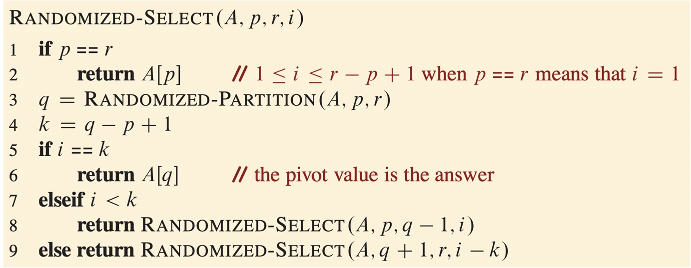
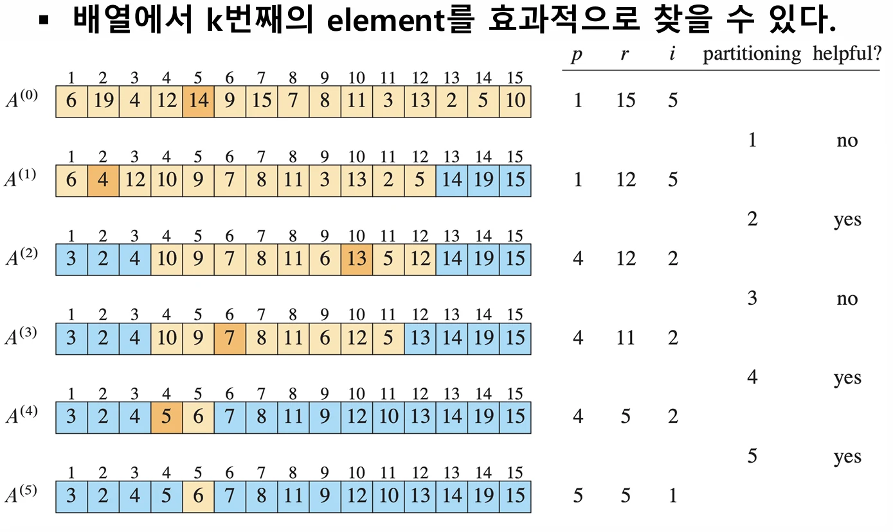

# [알고리즘] k번째 원소 찾기 (Selection Algorithm)

## 원문

https://ch010104.tistory.com/132

## 노트 유형

`guide`

## 적용 목적과 전제조건

주어진 데이터 묶음에서 특정 순서에 있는 값을 찾아야 할 때가 많음

가장 작은 값(최소값), 가장 큰 값(최대값), 혹은 정확히 가운데에 있는 값(중간값)을 찾는 것이 대표적인 예시

## 구현 절차·검증·주의점

주어진 데이터 묶음에서 특정 순서에 있는 값을 찾아야 할 때가 많음

가장 작은 값(최소값), 가장 큰 값(최대값), 혹은 정확히 가운데에 있는 값(중간값)을 찾는 것이 대표적인 예시

이를 일반화하여 "n개의 원소 중에서 i번째로 작은 원소를 찾는 문제"를 '선택 문제(Selection Problem)'

- 가장 간단한 해결책은 데이터를 모두 정렬한 뒤 i번째 인덱스의 값을 가져오는 것

- 힙 정렬이나 병합 정렬을 사용하면 $O(n \log n)$의 시간 복잡도로 해결할 수 있음

### 1. 무작위 분할을 이용한 선택 (Randomized-Select)

퀵 정렬(Quick Sort)과 유사한 아이디어를 사용하지만, 더 효율적으로 동작

퀵 정렬이 배열을 분할한 뒤 양쪽 모두를 재귀적으로 정렬하는 반면, 우리가 찾는 원소가 있는 한쪽 부분만 탐색

동작 방식

배열에서 무작위로 기준점(pivot)을 하나 고름

피벗을 기준으로 피벗보다 작은 값들은 왼쪽으로, 큰 값들은 오른쪽으로 옮김(이 과정을 Partition이라고 합니다).

피벗이 전체 배열에서 k번째 위치에 놓였다고 가정

만약 우리가 찾던 순서 i가 k와 같다면, 피벗이 바로 우리가 찾던 값이므로 탐색을 종료

만약 i가 k보다 작다면, 우리가 찾는 값은 반드시 피벗의 왼쪽에 있음 - 왼쪽 부분 배열에 대해 재귀적으로 탐색을 계속

만약 i가 k보다 크다면, 값은 피벗의 오른쪽에 있음 - 오른쪽 부분 배열을 탐색하되, 이제 찾아야 할 순서는 i-k번째가 됨

성능 분석

일반적인 경우 (Average Case): - O(n) 매번 무작위로 선택한 피벗이 배열을 균형 있게 (예: 절반씩) 나눈다면, 탐색 범위는 n→n/2→n/4→... 와 같이 줌 - 이 경우 총 연산 횟수는 n+n/2+n/4+...≈2n에 수렴하므로, 시간 복잡도는 $O(n)$이 됨

최악의 경우 (Worst Case): - O(n2) 만약 운이 나쁘게도 매번 가장 작은 값이나 가장 큰 값을 피벗으로 선택하게 되면, 탐색 범위 n→n−1→n−2→... 와 같이 단 하나씩만 줌 - 이는 $O(n^2)$의 시간 복잡도를 야기

이처럼 무작위 선택 방식은 평균적으로 매우 빠르지만, 최악의 경우 성능이 급격히 저하될 수 있다는 단점이 있음

### 2. 결정론적 선택 (Deterministic-Select) - "중간값들의 중간값"

"항상 좋은" 피벗을 고르는 결정론적 방법이 고안

이 방법의 핵심 아이디어는 "중간값들의 중간값 (Median of Medians)"을 피벗으로 사용하는 것

동작 방식

전체 n개의 원소를 5개씩 묶은 그룹으로 나눕니다. 약 n/5개의 그룹이 생성도미

각 그룹 내에서 정렬을 수행하여 중간값을 찾음(5개 원소 정렬은 상수 시간이 걸립니다)

2단계에서 찾은 n/5개의 중간값들을 모음

이 중간값들의 중간값을 재귀적으로 다시 찾아, 이 값을 최종 피벗 x로 선택

이 피벗 x를 기준으로 전체 배열을 분할(Partition)하고, Randomized-Select와 동일한 방식으로 다음 탐색 범위를 결정하여 재귀 호출을 수행

성능 분석 이 복잡한 과정은 왜 $O(n)$을 보장할까요?

"중간값들의 중간값"을 피벗으로 선택하면, 이 피벗은 전체 데이터에서 상위 또는 하위 30%에 해당하는 영역을 반드시 제외(pruning)시킬 수 있음을 수학적으로 보장

즉, 최악의 경우에도 다음 탐색 대상의 크기는 원래 데이터의 70%(7n/10)를 넘지 않음

이로 인해 최악의 경우에도 시간 복잡도는 $O(n)$이 보장

### 결론

선택 알고리즘은 특정 순위의 데이터를 효율적으로 찾는 강력한 도구

Randomized-Select: 구현이 비교적 간단하고 실제 환경에서 평균적으로 매우 빠르게 동작

Deterministic-Select (Median of Medians): 최악의 경우에도 O(n) 성능을 보장하여 안정성이 필요한 경우에 사용될 수 있는 이론적으로 매우 중요한 알고리즘

데이터 정렬이라는 $O(n \log n)$의 과정을 거치지 않고도 선형 시간 복잡도로 원하는 값을 찾아낼 수 있다는 점에서 선택 알고리즘은 매우 큰 의미를 가짐

## 핵심 이미지

## 관련 글

- [[blog/ALGORITHM/index|ALGORITHM]]
- [[blog/ALGORITHM/알고리즘- 정렬 알고리즘이란-(Counting Sort, Radix Sort, Bucket Sort) - Linear Time Sort|[알고리즘] 정렬 알고리즘이란?(Counting Sort, Radix Sort, Bucket Sort) - Linear Time Sort]]
- [[blog/ALGORITHM/알고리즘- 정렬 알고리즘이란-(Merge Sort, Heap Sort, Quick Sort)|[알고리즘] 정렬 알고리즘이란?(Merge Sort, Heap Sort, Quick Sort)]]
- [[blog/ALGORITHM/알고리즘- 정렬 알고리즘이란-(Insertion Sort, Bubble Sort)|[알고리즘] 정렬 알고리즘이란?(Insertion Sort, Bubble Sort)]]
