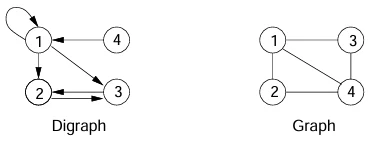
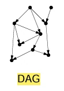
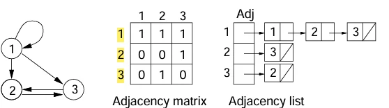

# [알고리즘] 그래프 알고리즘 소개

## 원문

https://ch010104.tistory.com/151

## 노트 유형

`concept`

## 핵심 개념과 선택 맥락

방향 그래프 (Directed Graph or Digraph): - 정점들의 순서 있는 쌍으로 간선을 표현합니다. 즉, (u, v)는 u에서 v로 가는 방향이 있는 간선을 의미

무방향 그래프 (Undirected Graph): - 정점들의 순서 없는 쌍으로 간선을 표현하며, (u, v)는 u와 v가 서로 연결되어 있음을 의미

## 원문 기반 개념 정리

그래프의 종류

방향 그래프 (Directed Graph or Digraph): - 정점들의 순서 있는 쌍으로 간선을 표현합니다. 즉, (u, v)는 u에서 v로 가는 방향이 있는 간선을 의미

무방향 그래프 (Undirected Graph): - 정점들의 순서 없는 쌍으로 간선을 표현하며, (u, v)는 u와 v가 서로 연결되어 있음을 의미

주요 용어

인접 (Adjacent): 두 정점 사이에 간선이 존재할 때 서로 인접하다고 함

차수 (Degree):

진입 차수 (In-degree): 방향 그래프에서 한 정점으로 들어오는 간선의 수

진출 차수 (Out-degree): 방향 그래프에서 한 정점에서 나가는 간선의 수

차수 (Degree): 무방향 그래프에서 한 정점에 연결된 간선의 수

경로 (Path): 정점들을 순서대로 나열한 것으로, 각 인접한 정점 쌍 사이에 간선이 존재해야 함

사이클 (Cycle): 시작 정점과 끝 정점이 같은 경로

희소 그래프 (Sparse Graph) vs 조밀 그래프 (Dense Graph): - 간선의 수가 정점의 수에 비례하는 그래프(E ∈ Θ(V))를 희소 그래프라 하고, 그렇지 않으면 조밀 그래프

특수 그래프

트리 (Tree): 사이클이 없는 연결된 무방향 그래프

포레스트 (Forest): 사이클이 없는 무방향 그래프로, 여러 트리의 집합일 수 있음

DAG (Directed Acyclic Graph): 사이클이 없는 방향 그래프

그래프의 표현

- 그래프를 컴퓨터에서 표현하는 두 가지 주요 방법이 있음

인접 행렬 (Adjacency Matrix)

V x V 크기의 2차원 배열로 그래프를 표현합니다.

정점

v에서 w로 가는 간선이 있으면 행렬의 [v, w] 위치에 1(또는 가중치)을 저장하고, 없으면 0(또는 ∞)을 저장

무방향 그래프의 경우, 간선 {v, w}를 (v, w)와 (w, v) 두 방향 간선으로 표현하므로 행렬이 대칭이 됨

Θ(V²)의 저장 공간이 필요

인접 리스트 (Adjacency List)

각 정점에 대해 해당 정점과 인접한 정점들의 리스트를 배열 형태로 유지

예를 들어, Adj[v]는 정점 v에서 나가는 간선에 연결된 모든 정점의 연결 리스트를 가리킴

Θ(V+E)의 저장 공간이 필요하여, 희소 그래프를 표현할 때 인접 행렬보다 공간 효율성이 높음

## 관련 글

- [[blog/ALGORITHM/index|ALGORITHM]]
- [[blog/ALGORITHM/알고리즘- 백트래킹을 이용한 순열-조합 및 알고리즘 성능 분석(Big-O, Omega, Theta)|[알고리즘] 백트래킹을 이용한 순열/조합 및 알고리즘 성능 분석(Big-O, Omega, Theta)]]
- [[blog/ALGORITHM/알고리즘- BFS, DFS와 최소 신장 트리(MST)|[알고리즘] BFS, DFS와 최소 신장 트리(MST)]]
- [[blog/ALGORITHM/알고리즘- 최소 신장 트리 (MST) - 크루스칼 (Kruskal) & 프림 (Prim) 알고리즘|[알고리즘] 최소 신장 트리 (MST) - 크루스칼 (Kruskal) & 프림 (Prim) 알고리즘]]
