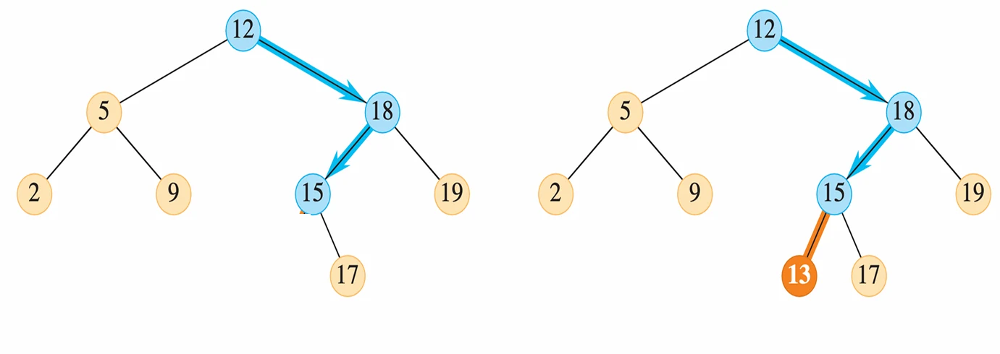
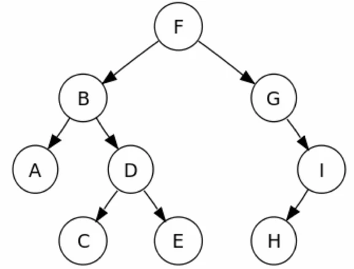
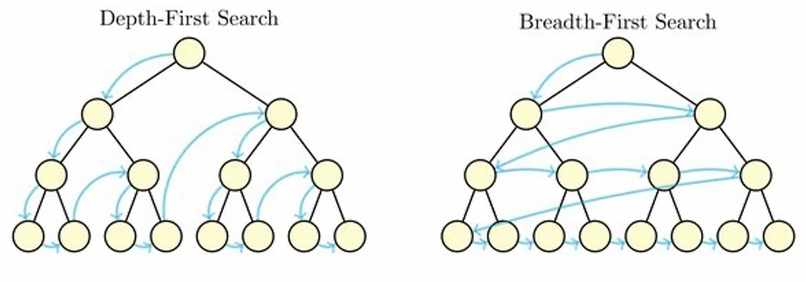

# [알고리즘] 이진 탐색 트리(Binary Search Tree)

## 원문

https://ch010104.tistory.com/145

## 노트 유형

`concept`

## 핵심 개념과 선택 맥락

이진 탐색 트리(BST)는 이름에서 알 수 있듯이 '검색'에 특화된 '이진 트리'

일반적인 이진 트리는 각 노드가 최대 두 개의 자식 노드를 가지는 구조를 의미하지만, 이진 탐색 트리는 여기에 한 가지 중요한 규칙이 추가

## 원문 기반 개념 정리

### 1. 이진 탐색 트리(BST)란 무엇일까요?



이진 탐색 트리(BST)는 이름에서 알 수 있듯이 '검색'에 특화된 '이진 트리'

일반적인 이진 트리는 각 노드가 최대 두 개의 자식 노드를 가지는 구조를 의미하지만, 이진 탐색 트리는 여기에 한 가지 중요한 규칙이 추가

BST의 핵심 속성

노드 x를 기준으로, x의 왼쪽 서브트리에 있는 모든 노드의 키(key) 값은 x의 키 값보다 작거나 같음(y.key≤x.key).

x의 오른쪽 서브트리에 있는 모든 노드의 키(key) 값은 x의 키 값보다 크거나 같음(y.key≥x.key).

- 이러한 속성 덕분에 우리는 데이터를 효율적으로 검색하고, 정렬된 상태로 유지할 수 있음

### 2. 핵심 연산: 검색, 삽입, 삭제

검색 (Search)

- BST의 가장 기본적인 연산

- 특정 값을 찾을 때, 루트 노드부터 시작하여 찾는 값과 현재 노드의 값을 비교

찾는 값이 현재 노드보다 작으면 왼쪽으로 이동

찾는 값이 현재 노드보다 크면 오른쪽으로 이동

값이 같으면 검색에 성공한 것

- 이 과정을 반복하면 원하는 값을 매우 빠르게 찾거나, 값이 없다는 것을 확인할 수 있음

삽입 (Insert)

- 새로운 노드를 추가하는 과정은 검색과 매우 유사합

삽입하려는 값으로 검색을 수행

검색이 실패하여 빈 공간(NIL 노드)에 도달하면, 그 위치에 새로운 노드를 추가

삭제 (Delete)

- 삭제는 조금 더 복잡하지만, 기존 트리의 구조를 최대한 유지하는 방향으로 진행

- 삭제하려는 노드(z)의 상태에 따라 세 가지 경우로 나뉨.

자식이 없는 경우: 그냥 삭제

자식이 하나인 경우: 해당 노드를 삭제하고 그 자리에 자식 노드를 연결

자식이 둘인 경우: - 삭제할 노드(z)의 바로 다음 순서 값(successor)을 가진 노드(y)를 찾아 z의 위치로 옮김 - 이 y는 z의 오른쪽 서브트리에서 가장 작은 값을 가진 노드가 됨

### 3. 트리 순회(Traversal) 방법



- 트리의 모든 노드를 한 번씩 방문하는 것을 '순회'라고 함

- 노드를 언제 방문하느냐에 따라 크게 세 가지 방식으로 나뉨

1. 전위 순회 (Pre-order)

순서: 노드 방문 → 왼쪽 서브트리 → 오른쪽 서브트리

의사 코드:

```text
void traversal(node){
  if(node != visited){
    visit(node); // preorder
    traversal(node->left);
    traversal(node->right);
  }
}
```

예시: F → B → A → D → C → E → G → I → H

활용: - 트리를 복사할 때 사용 - 전위 순회 결과로 노드를 순서대로 삽입하면 원래와 동일한 트리를 만들 수 있음 - 네트워크를 통해 BST를 전달할 때 사용

2. 중위 순회 (In-order)

순서: 왼쪽 서브트리 → 노드 방문 → 오른쪽 서브트리

의사 코드:

```text
void traversal(node){
  if(node != visited){
    traversal(node->left);
    visit(node); // inorder
    traversal(node->right);
  }
}
```

예시: A → B → C → D → E → F → G → H → I

활용: - BST를 중위 순회하면 키 값의 오름차순으로 정렬된 결과를 얻을 수 있음 - 정렬을 할 때 사용

3. 후위 순회 (Post-order)

순서: 왼쪽 서브트리 → 오른쪽 서브트리 → 노드 방문

의사 코드:

```text
void traversal(node){
  if(node != visited){
    traversal(node->left);
    traversal(node->right);
    visit(node); // postorder
  }
}
```

예시: A → C → E → D → B → H → I → G → F

활용: - 파일 디렉토리를 삭제할 때 유용 - 하위 파일을 모두 지운 후에 상위 디렉토리를 삭제하는 로직과 동일

### 4. 깊이 우선 탐색(DFS) vs. 너비 우선 탐색(BFS)



깊이 우선 탐색 (Depth-First Search, DFS)

DFS는 최대한 깊이 내려간 후, 더 이상 갈 곳이 없으면 위로 올라와 다른 경로를 탐색하는 방식

BST의 **전위 순회(Pre-order)**는 DFS의 한 종류입

너비 우선 탐색 (Breadth-First Search, BFS)

BFS는 현재 노드와 가까운 레벨의 노드들을 먼저 방문하는 방식

레벨 순서(Level Order) 순회라고도 불리며, 큐(Queue)를 이용하여 구현할 수 있음

## 관련 글

- [[blog/ALGORITHM/index|ALGORITHM]]
- [[blog/ALGORITHM/알고리즘- 백트래킹을 이용한 순열-조합 및 알고리즘 성능 분석(Big-O, Omega, Theta)|[알고리즘] 백트래킹을 이용한 순열/조합 및 알고리즘 성능 분석(Big-O, Omega, Theta)]]
- [[blog/ALGORITHM/알고리즘- 그래프 알고리즘 소개|[알고리즘] 그래프 알고리즘 소개]]
- [[blog/ALGORITHM/알고리즘- 재귀란- (일반 재귀 vs 꼬리 재귀)|[알고리즘] 재귀란? (일반 재귀 vs 꼬리 재귀)]]
