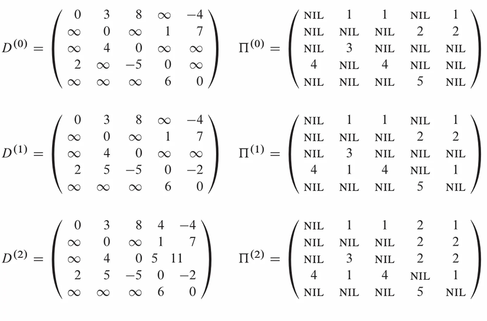
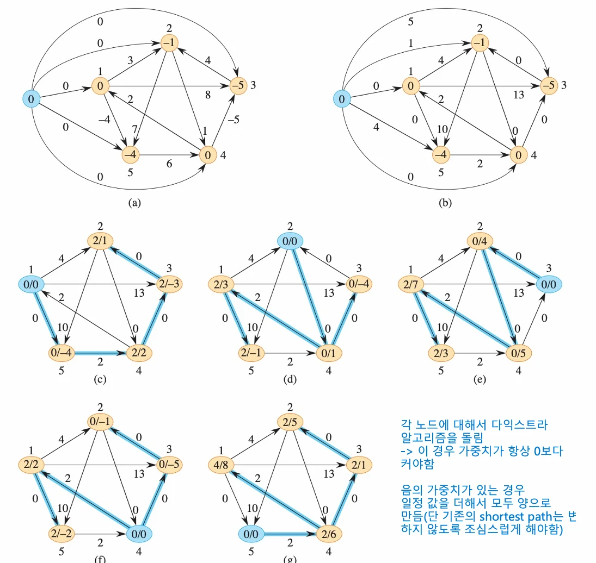

# [알고리즘]플로이드-워셜 (Floyd-Warshall) 알고리즘과 존슨 (Johnson) 알고리즘

## 원문

https://ch010104.tistory.com/188

## 노트 유형

`guide`

## 적용 목적과 전제조건

- 모든 쌍 최단 경로(APSP)를 동적 계획법(Dynamic Programming) 기반으로 해결하는 알고리즘

DP 기반: 중간 정점 집합을 늘려가는 방식으로 최단 경로를 계산

## 구현 절차·검증·주의점

### 플로이드-워셜 (Floyd-Warshall) 알고리즘



- 모든 쌍 최단 경로(APSP)를 동적 계획법(Dynamic Programming) 기반으로 해결하는 알고리즘

특징

DP 기반: 중간 정점 집합을 늘려가는 방식으로 최단 경로를 계산

음수 가중치: 음수 가중치 간선을 허용

음수 사이클: 음수 사이클을 감지할 수 있음

구현: 구현이 단순

핵심 아이디어: DP 상태 정의

D^{(k)}[i][j]: 정점 $i$에서 $j$로 갈 때, 중간 정점 집합을 ${1, ..., k}$로 제한했을 때의 최단 거리를 의미

D^{(0)}[i][j]: 중간 정점을 사용할 수 없음 (직접 연결된 간선의 가중치)

D^{(V)}[i][j]: 모든 정점을 중간 정점으로 사용할 수 있음 (최종 APSP 결과).

점화식

- i에서 j로 가는 최단 경로는 다음 두 가지 경우로 나뉨:

경로가 k를 사용하지 않는 경우:

최단 거리는 중간 정점이 {1, ..., k-1}로 제한될 때와 같음.

비용: D^{(k-1)}[i][j]

경로가 k를 사용하는 경우:

경로는 i \rightarrow ... \rightarrow k \rightarrow ... \rightarrow j 형태로 분해

최적 부분 구조에 따라, i \rightarrow k$ 경로와 $k \rightarrow j 경로 또한 각각 최단 경로여야 함

비용: D^{(k-1)}[i][k] + D^{(k-1)}[k][j]

- 이 두 경우의 최솟값이 $D^{(k)}[i][j]$가 됨

D^{(k)}[i][j] = min(D^{(k-1)}[i][j], D^{(k-1)}[i][k] + D^{(k-1)}[k][j])

시간 복잡도

O(V^3)

```text
FLOYD-WARSHALL (W, n)
1  D^(0) = W
2  for k = 1 to n
3    let D^(k) be a new n x n matrix
4    for i = 1 to n
5      for j = 1 to n
6        d_ij^(k) = min(d_ij^(k-1), d_ik^(k-1) + d_kj^(k-1))
7  return D^(n)
```

> 원문 코드가 길어 이 노트에서는 앞부분만 보존했습니다. 전체는 원문에서 확인합니다.

### 존슨 (Johnson) 알고리즘



- 음수 가중치가 있지만 음수 사이클은 없는 유향 그래프에서 모든 쌍 최단 경로(APSP)를 효율적으로 해결하는 알고리즘

특징

음수 가중치 처리: 다익스트라(Dijkstra) 알고리즘은 음수 가중치를 허용하지 않는 문제를 해결

Reweighting: 그래프의 모든 간선 가중치를 음수가 아니도록 재조정(reweighting).

효율성: 희소 그래프(Sparse graph)에서 $O(V^3)$인 플로이드-워셜보다 효율적이다21.

핵심 아이디어: Reweighting

목표:

모든 간선 가중치를 $w^{\prime}(u,v) \ge 0$ 이 되도록 만듬

재가중 후에도 원래 그래프의 최단 경로는 동일하게 최단 경로로 보존되어야 함

퍼텐셜 함수 (Potential Function):

모든 정점 v에 퍼텐셜 값 h(v)를 부여함

새로운 가중치 $w^{\prime}(u,v)$를 $w(u,v) + h(u) - h(v)$ 로 정의

경로 보존:

이 방식을 사용하면 s에서 t로 가는 모든 경로 $P$의 재가중된 비용 w^{\prime}(P)는 원래 비용 w(P)에 $h(s) - h(t)라는 상수만 더한 값이 됨

w^{\prime}(P) = w(P) + h(s) - h(t)

모든 경로에 동일한 상수가 더해지므로, 경로 간의 상대적 순서(최단 경로)가 보존

알고리즘 단계

가상 정점 s 추가:

원본 그래프 G에 새로운 정점 s를 추가

모든 정점 v in V에 대해 s에서 v로 가는 가중치 0의 간선 (s,v)를 추가

퍼텐셜 h(v) 계산 (Bellman-Ford):

$s$를 시작점으로 하여 벨만-포드(Bellman-Ford) 알고리즘을 실행한다31. (음수 간선을 처리해야 하므로 32)

각 정점 $v$에 대한 퍼텐셜 $h(v)$를 $s$에서 $v$까지의 최단 거리 $\delta(s,v)$로 정의한다: $h(v) = \delta(s,v)$

최단 거리의 삼각 부등식(\delta(s,v) \le \delta(s,u) + w(u,v))은 h(v) \le h(u) + w(u,v)를 만족하며, 이는 w^{\prime}(u,v) = w(u,v) + h(u) - h(v) \ge 0임을 보장

Reweighting 실행:

모든 간선 $(u,v)$에 대해 $w^{\prime}(u,v) = w(u,v) + h(u) - h(v)$ 공식을 적용하여 그래프 전체를 재가중

APSP 계산 (Dijkstra):

이제 모든 가중치가 0 이상이므로($w^{\prime} \ge 0$) 38, 모든 정점을 시작점으로 하여 다익스트라(Dijkstra) 알고리즘을 V번 실행

(결과 변환: 다익스트라로 구한 최단 거리 $\delta^{\prime}(u,v)$에 $h(u) - h(v)$를 더하면 원본 그래프의 최단 거리 $\delta(u,v)$를 얻음.)

시간 복잡도

벨만-포드 1회: O(VE)

다익스트라 $V$회 (힙 사용 시): $V \times O(E \log V) = O(VE \log V)

총합: $O(VE + VE \log V)

## 관련 글

- [[blog/ALGORITHM/index|ALGORITHM]]
- [[blog/ALGORITHM/알고리즘- DynamicProgramming과 AllPairShortestPathAlgorithm|[알고리즘] DynamicProgramming과 AllPairShortestPathAlgorithm]]
- [[blog/ALGORITHM/알고리즘- A- (A-Star) 알고리즘과 Greedy (탐욕) 알고리즘|[알고리즘] A* (A-Star) 알고리즘과 Greedy (탐욕) 알고리즘]]
- [[blog/ALGORITHM/알고리즘- Shortest Path 알고리즘(Bellman-Ford & DIJKSTRA 알고리즘)|[알고리즘] Shortest Path 알고리즘(Bellman-Ford & DIJKSTRA 알고리즘)]]
