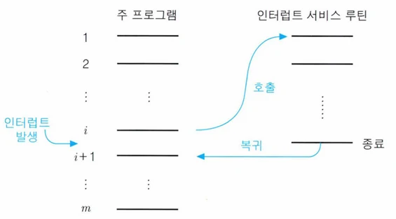
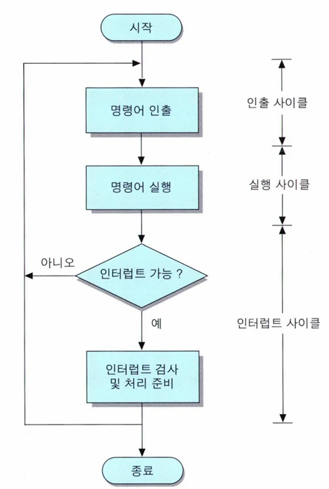
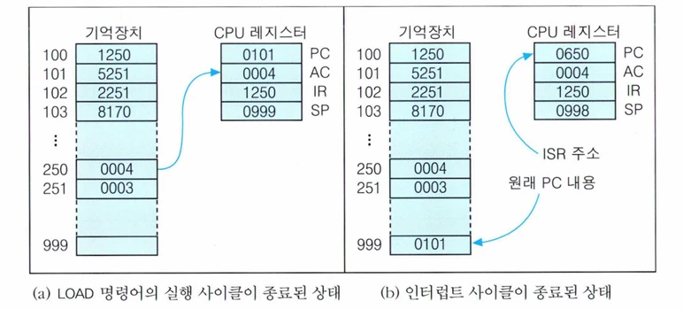

# [아키텍처] 명령어 세트(Instruction Set)과 인터럽트 사이클(Interrupt Cycle)

## 원문

https://ch010104.tistory.com/50

## 노트 유형

`concept`

## 핵심 개념과 선택 맥락

**인터럽트(interrupt)**는 프로그램 실행 중에 CPU가 현재 명령어의 흐름을 중단하고, 외부 장치나 내부 요청에 의해 다른 작업을 처리하도록 하는 메커니즘

이러한 인터럽트가 들어오면 CPU는 현재 작업을 멈추고, 해당 요청을 처리하는 **인터럽트 서비스 루틴(ISR, Interrupt Service Routine)**을 실행

## 원문 기반 개념 정리

### 1. 인터럽트 사이클 (Interrupt Cycle)







1) 인터럽트란?

**인터럽트(interrupt)**는 프로그램 실행 중에 CPU가 현재 명령어의 흐름을 중단하고, 외부 장치나 내부 요청에 의해 다른 작업을 처리하도록 하는 메커니즘

이러한 인터럽트가 들어오면 CPU는 현재 작업을 멈추고, 해당 요청을 처리하는 **인터럽트 서비스 루틴(ISR, Interrupt Service Routine)**을 실행

ISR 실행이 끝난 후에는 원래 프로그램의 흐름으로 복귀하여 작업을 이어감. - 원래 상태로 돌아가기 위해서, 인터럽트 발생 시에 현재의 CPU 상태를 저장함.

2) 인터럽트 사이클의 수행 조건

CPU는 명령어 실행 사이클과 사이클 사이에 인터럽트 요청 신호가 있는지 검사함. - 인터럽트 사이클에는 현재의 PC 값을 스택에 저장한 후, PC에 해당 ISR의 시작 주소를 적재함.

만약 요청이 감지되면, 인터럽트 사이클이 수행됨.

단, CPU가 **인터럽트 가능 상태(interrupt enabled)**일 때만 수행 가능.

반대로 중요한 작업 중이라면 **인터럽트 불가능 상태(interrupt disabled)**로 설정되어 요청을 무시함.

3) 인터럽트 사이클의 수행 단계

📝 스택 포인터(SP): 스택의 최상위 주소(TOS)를 가리키는 레지스터 일반적으로 스택은 주기억장치의 마지막 영역부터 아래로 사용됨 → SP는 초기에 큰 값으로 설정됨

인터럽트가 종료되면 999번지 스택에 저장해두었던, 인터럽트 발생 이전의 PC값 0101을 가져와서 PC값에 저장한 후, SP의 값을 1 감소시킴.

4) 인터럽트 처리 시 유의사항

예를 들어, AC 레지스터에 이전 명령어의 연산 결과가 저장되어 있는 상태에서 인터럽트가 발생하면, ISR 수행 중에 AC의 값이 바뀔 수 있음.

이런 경우 복귀 후 원래 프로그램이 잘못된 데이터를 기반으로 수행될 수 있음 → 오류 발생

따라서 **ISR 진입 시 주요 레지스터 값들을 스택에 저장(push)**하고, **ISR 종료 직전에 복원(pop)**하는 절차가 필요함.

5) 다중 인터럽트 (Multiple Interrupt)

ISR 수행 중에도 새로운 인터럽트 요청이 들어올 수 있음

이를 처리하는 방법은 2가지로 나뉜다:

💡 다중 인터럽트 실행 흐름 예시

```text
Main → ISR-X 수행 중 → 높은 우선순위 ISR-Y 발생
→ ISR-Y 완료 후 → ISR-X 복귀 → Main 복귀
```

※ 스택에는 Main 복귀 주소 + ISR-X 복귀 주소가 차례로 저장됨

### 2. 간접 사이클 (Indirect Cycle)

1) 간접 사이클이란?

간접 주소지정 방식이 사용된 명령어의 경우, 명령어에 포함된 주소가 직접 데이터의 주소가 아님

해당 주소가 가리키는 위치에 **진짜 데이터 주소(유효 주소, EA)**가 저장되어 있고, 그곳에 접근해야 함

따라서 실행 전에 간접 사이클을 거쳐 실제 연산에 사용할 주소를 획득해야 함

2) 수행 단계 (마이크로 연산)

📌 이 과정을 통해 간접 주소 → 유효 주소로 변환됨 IR이 최종적으로 실행에 사용할 주소를 갖게 됨

### 3. 명령어 파이프라이닝 (Instruction Pipelining)

1) 파이프라이닝이란?

CPU의 처리 속도를 높이기 위한 대표적인 기술

명령어 실행을 위한 하드웨어를 **여러 개의 단계(Stage)**로 나누고, 각 단계가 동시에 다른 명령어를 처리하도록 구성

2) 동작 방식 예시

각 명령어는 다음과 같은 단계를 거침:

```text
인출(Fetch) → 해석(Decode) → 실행(Execute) → 메모리 접근(Memory) → 저장(Write-back)
```

명령어 A가 인출될 때 명령어 B는 해석, 명령어 C는 실행 중 → 동시 처리

3) 특징 및 장점

## 관련 글

- [[blog/ARCHITECTURE/index|ARCHITECTURE]]
- [[blog/ARCHITECTURE/아키텍처- 제어 유니트(Control Unit) 란|[아키텍처] 제어 유니트(Control Unit) 란?]]
- [[blog/ARCHITECTURE/아키텍처- 명령어 형식과 주소지정 방식|[아키텍처] 명령어 형식과 주소지정 방식]]
- [[blog/ARCHITECTURE/아키텍처- 반도체 기억장치와 설계|[아키텍처] 반도체 기억장치와 설계]]
