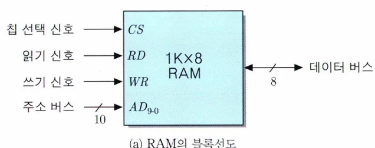

# [아키텍처] 반도체 기억장치와 설계

## 원문

https://ch010104.tistory.com/62

## 노트 유형

`concept`

## 핵심 개념과 선택 맥락

초기 컴퓨터의 주기억장치는 자기 코어(Magnetic Core) 방식이었지만, 미세전자공학(microelectronics) 기술의 발전으로 오늘날에는 반도체 기억장치(semiconductor memory) 칩이 주로 사용됨.

주기억장치, 캐시, 비휘발성 저장 등에 다양한 형태의 반도체 메모리가 적용됨.

## 원문 기반 개념 정리

### 1. 반도체 기억장치 개요

초기 컴퓨터의 주기억장치는 자기 코어(Magnetic Core) 방식이었지만, 미세전자공학(microelectronics) 기술의 발전으로 오늘날에는 반도체 기억장치(semiconductor memory) 칩이 주로 사용됨.

주기억장치, 캐시, 비휘발성 저장 등에 다양한 형태의 반도체 메모리가 적용됨.

### 2. RAM (Random Access Memory)

1) RAM의 특징

읽기/쓰기 모두 가능

전기 신호로 동작하여 빠른 속도 제공

휘발성: 전원이 꺼지면 데이터 소실

RAM은 엄밀히 말하면 RWM(Read/Write Memory) 라는 용어가 더 적합함.

2) RAM의 동작 원리

RAM은 주소와 제어 신호에 따라 동작

### 3. RAM의 유형

1) DRAM (Dynamic RAM)

캐패시터에 전하를 저장

재충전(refresh) 필요

높은 집적도와 저렴한 가격

느린 속도

2) SRAM (Static RAM)

플립플롭을 사용해 전력 공급 시 지속 유지

빠른 속도

낮은 밀도, 고가

캐시 메모리에 사용

### 4. RAM 내부 조직 예시

1) 8×8 비트 조직 (64비트 RAM)

8개의 8비트 기억장소

주소 비트: 3개 필요 (2³ = 8)

2) 16×4 비트 조직

16개의 기억장소, 각각 4비트 저장

주소 비트: 4개 필요 (2⁴ = 16)

3) 64×1 비트 조직

한 비트 단위 저장

주소 비트: 6개 (행/열로 나누어 3+3 해독기 사용)

4) 16M×4 비트 조직 DRAM

64Mbit DRAM → 4096×4096×4 비트 구조

RAS/CAS 신호를 통해 12+12비트로 분할 주소 인식

주소 입력은 12핀만 사용 가능 (래치 방식)

### 5. ROM (Read Only Memory)

1) ROM의 특징

읽기 전용, 비휘발성

시스템 초기화, 펌웨어, 마이크로프로그램 저장용

2) ROM의 종류

PROM: 한 번만 쓰기 가능

EPROM: 자외선으로 삭제 후 재쓰기 가능

EEPROM: 전기적으로 삭제/쓰기 가능, 바이트 단위 갱신

플래시 메모리: 페이지 단위 쓰기, 블록 단위 삭제

### 6. 기억장치 모듈의 설계

1) 병렬 접속

데이터 버스 폭 확대 (예: 16×4bit RAM 2개로 8비트 단어 구성)

모든 칩에 같은 주소 입력, 다른 데이터 라인 연결

2) 직렬 접속

주소 공간 확대 (예: 16×4bit RAM 2개 → 32개의 기억장소 구성)

상위 주소 비트를 칩 선택용으로 사용

3) 병렬 + 직렬 조합

1K×8bit RAM 4개 → 2K×32bit 기억장치 구성 가능

### 7. 마이크로컴퓨터의 기억장치 설계 예

1) 요구 사항

8비트 단어 길이

1KByte ROM + 2KByte RAM

ROM: 0x0000 ~ 0x03FF

RAM: 0x0800 ~ 0x0FFF

2) 사용 칩

ROM: 1K×8bit

RAM: 512×8bit × 4개

3) 주소 매핑

ROM/RAM 구분: A11 주소 비트

RAM 칩 선택: A10, A9 비트로 해독기 제어

## 핵심 이미지

## 관련 글

- [[blog/ARCHITECTURE/index|ARCHITECTURE]]
- [[blog/ARCHITECTURE/아키텍처- 제어 유니트(Control Unit) 란|[아키텍처] 제어 유니트(Control Unit) 란?]]
- [[blog/ARCHITECTURE/아키텍처- 명령어 세트(Instruction Set)과 인터럽트 사이클(Interrupt Cycle)|[아키텍처] 명령어 세트(Instruction Set)과 인터럽트 사이클(Interrupt Cycle)]]
- [[blog/ARCHITECTURE/아키텍처- 명령어 형식과 주소지정 방식|[아키텍처] 명령어 형식과 주소지정 방식]]
