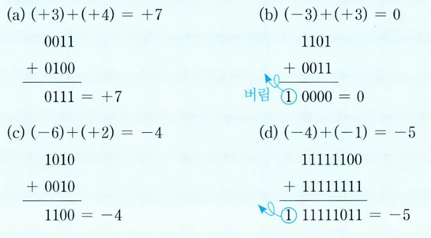
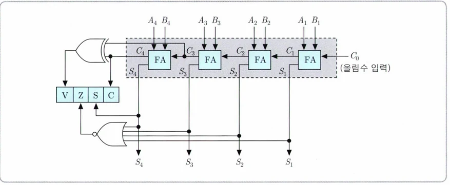
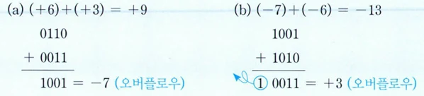

# [아키텍처] 정수의 산술 연산과 부동소수점 수

## 원문

https://ch010104.tistory.com/28

## 노트 유형

`guide`

## 적용 목적과 전제조건

signed number이기 때문에 올림수 Carray flag를 사용하지 않음.

상태 레지스터에는 V(오버플러우 유무), Z(연산 결과가 0인지), S(부호), C(carry 올림수) 의 값들이 저장되는데.

## 구현 절차·검증·주의점

### 1. 덧셈 (2의 보수 기반)

signed number이기 때문에 올림수 Carray flag를 사용하지 않음.

4 비트 병렬 가산기

4비트의 덧셈은 병렬 가산기를 통해 수행됨.

상태 레지스터에는 V(오버플러우 유무), Z(연산 결과가 0인지), S(부호), C(carry 올림수) 의 값들이 저장되는데.

C4와 C3의 올림수의 값이 서로 다른 경우에 오버플러우가 발생함. 때문에 C3과 C4의 값을 XOR 연산(같으면 0, 다르면 1 반환 )을 통해 오버플러우 유무인 V가 결정!!

(a)의 경우 C4 = 0, C3 = 1로 다르기 때문에 오버플로우가 발생!! -> V = 1

(b)의 경우 C4 = 1, C3 = 0로 다르기 때문에 오버플로우가 발생!! -> V = 1

### 2. 뺄셈 (덧셈 + 2의 보수)

뺄셈의 경우 더해지는 수를 2의 보수로 처리하여 덧셈 연산을 수행해 계산.

(+2) - (+6) 의 경우 (+2) + (-6) 으로 변환하여 처리함.

(a)에서 6은 2진수로 0110임. 이를 -6 으로 바꾸어 1010 과의 덧셈 연산을 함.

뺄셈의 경우에도 덧셈과 마찮가지로, C4와 C3의 값이 다르면 오버플로우 발생!!

A 레지스터(앞의 값) 은 그냥 병렬 가산기(덧셈 연산 처리)에 넣고, B 레지스터(뒤의 값) 은 선택 신호(+, -) 에 따라 이 수가 음수인지 양수 인지를 판단해서 음수일 경우 보수로 처리( 5 - 3 의 경우 5 + (-3) 으로 처리하기 위함)

위의 예시는 뺄셈에서 오버플로우가 발생하는 경우

### 3. 곱셈 (부호 없는 수)

### 4. 나눗셈 (부호 있는 수)

### 5. 부동소수점 수 표현 (IEEE 754)

### 1) 왜 부동소수점 표현이 필요한가?

정수 표현으로는 아주 크거나 아주 작은 수를 표현하는 데 한계가 있음.

예: 0.00000000000274, 274000000000000 → 표현 불가

➡ 과학적 표기법(지수법) 방식으로 해결:

2.74 × 10^–12,

2.74 × 10^14

### 2) 부동소수점의 일반 구조

➡ 이 구조는 10진수/2진수 모두 동일. 단, 컴퓨터는 B=2를 사용함.

+5.75 의 경우

```text
5 = 101 # 2진수
0.75 = 0.11 # 2진수

⇒ 5.75 = 101.11 = 1.0111 × 2^2
```

부호(S) = 0 (양수)

지수(E) = 2 + 127 = 129 → 10000001

가수(M) = 01110000000000000000000

### 3) IEEE 754 표준 – 32비트 부동소수점 형식

### 4) 정규화 표현 (Normalized Representation)

예: 0.1101 × 2^5 → 정규화하면 1.101 × 2^2

항상 1.xxx × 2^E 형태로 변환하여 저장

가수 M에는 xxx만 저장 → 맨 앞 1은 저장하지 않음

### 5) 바이어스(Bias) 방식 지수 표현

실제 지수 E값에 **Bias(127)**을 더하여 저장

### 6) 예제: –13.625를 IEEE 754로 표현

✅ Step 1. 10진수를 2진수로 변환

13 → 1101

0.625 → 0.101

👉 13.625 = 1101.101 = 1.101101 × 2^3

✅ Step 2. 부호 비트 (S)

음수 → S = 1

✅ Step 3. 지수 비트 (E)

실제 지수 3 → 저장 지수 = 3 + 127 = 130 → 10000010

✅ Step 4. 가수 비트 (M)

1.101101의 소수 부분 = 101101 → 뒤에 0을 채워 총 23비트

맨 앞의 1. 을 빼고 0.101101.... 부분만 저장!!

✅ 최종 결과 (IEEE 754: 32비트)

```text
1 10000010 10110100000000000000000
```

## 핵심 이미지







## 관련 글

- [[blog/ARCHITECTURE/index|ARCHITECTURE]]
- [[blog/ARCHITECTURE/아키텍처- 컴퓨터 산술과 논리 연산|[아키텍처] 컴퓨터 산술과 논리 연산]]
- [[blog/ARCHITECTURE/아키텍처- 명령어 형식과 주소지정 방식|[아키텍처] 명령어 형식과 주소지정 방식]]
- [[blog/ARCHITECTURE/아키텍처- CPU의 구조와 동작 원리|[아키텍처] CPU의 구조와 동작 원리]]
