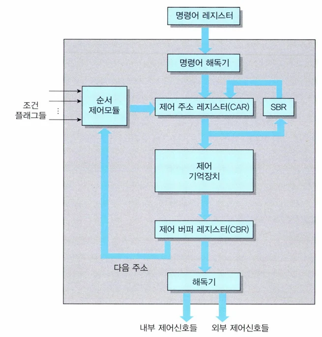
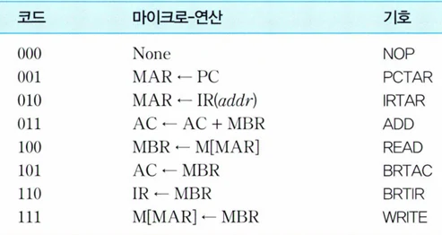
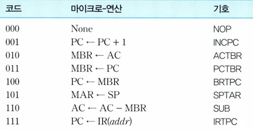

# [아키텍처] 제어 유니트(Control Unit) 란?

## 원문

https://ch010104.tistory.com/52

## 노트 유형

`concept`

## 핵심 개념과 선택 맥락

CPU 내에서 **명령어 사이클(인출 → 간접 → 실행 → 인터럽트)**이 순차적으로 수행되도록 제어 신호를 발생시킴.

마이크로연산(Micro-operation): 하나의 명령어 실행 과정에서 수행되는 가장 작은 동작 단위 (ex. MAR ← PC)

## 원문 기반 개념 정리

### 1. 제어 유니트의 기능

명령어 코드의 해독

명령어 실행을 위한 제어 신호 생성

CPU 내에서 **명령어 사이클(인출 → 간접 → 실행 → 인터럽트)**이 순차적으로 수행되도록 제어 신호를 발생시킴.

마이크로연산(Micro-operation): 하나의 명령어 실행 과정에서 수행되는 가장 작은 동작 단위 (ex. MAR ← PC)

마이크로명령어(Microinstruction): 마이크로연산을 2진 비트로 표현한 것 (제어 단어)

마이크로프로그램(Microprogram): 마이크로명령어들의 집합

루틴(Routine): CPU 기능별로 정의된 마이크로프로그램 단위

즉, CPU 클록 주기마다 서로 다른 마이크로-연산이 수행됨.

### 2. 제어 유니트의 구조

제어 기억장치는 ROM 형태이며, 마이크로명령어의 루틴들을 저장.

사상(Mapping): 연산 코드를 통해 실행 루틴의 시작 주소를 결정하는 방식 ⮕ 주소 형식: 1xxxx00 (최상위 비트는 1, 다음 4비트는 연산 코드)

### 3. 마이크로명령어 형식

1) 연산 필드 1,2 의 마이크로-연산들

2) 조건 필드의 마이크로-연산들(CD)

3) 분기 필드의 마이크로-연산들(BR)

수직적 마이크로프로그래밍: 연산 필드 값은 코딩되어 있고, 디코더를 통해 제어 신호 확장 (용량 ↓, 속도 ↓)

수평적 마이크로프로그래밍: 연산 필드 값이 제어 신호와 1:1 대응 (속도 ↑, 용량 ↑)

### 4 마이크로프로그래밍

1) 인출 사이클 루틴 (Fetch Cycle Routine)

- 기억장치에서 명령어를 읽어와 IR에 적재하는 과정

2) 간접 사이클 루틴 (Indirect Cycle Routine)

- 명령어에 포함된 주소가 실제 오퍼랜드의 주소가 아닌 포인터일 경우 → 유효 주소를 읽어오는 사이클

3) 실행 사이클 루틴 (Execution Cycle Routine)

- 명령어에 따라 실제 연산이 수행되는 루틴

명령어별 시작 주소는 사상(MAP) 방식으로 결정됨 (예: ADD → 76번지, LOAD → 68번지)

예시) X = A + B 연산이 있을 때:

### 4.5 마이크로프로그램의 순서제어

- 제어 유니트는 각 마이크로명령어의 분기 조건(CD), 분기 타입(BR), 주소 필드(ADF)를 기반으로 다음 실행 주소 결정

## 관련 글

- [[blog/ARCHITECTURE/index|ARCHITECTURE]]
- [[blog/ARCHITECTURE/아키텍처- 명령어 세트(Instruction Set)과 인터럽트 사이클(Interrupt Cycle)|[아키텍처] 명령어 세트(Instruction Set)과 인터럽트 사이클(Interrupt Cycle)]]
- [[blog/ARCHITECTURE/아키텍처- 반도체 기억장치와 설계|[아키텍처] 반도체 기억장치와 설계]]
- [[blog/ARCHITECTURE/아키텍처- 명령어 형식과 주소지정 방식|[아키텍처] 명령어 형식과 주소지정 방식]]
