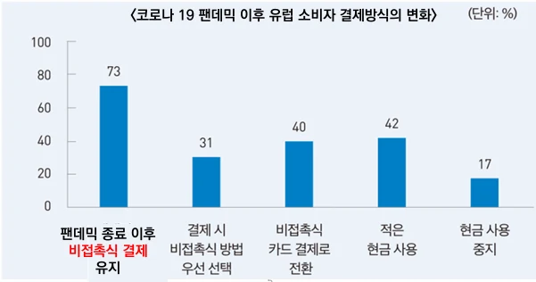
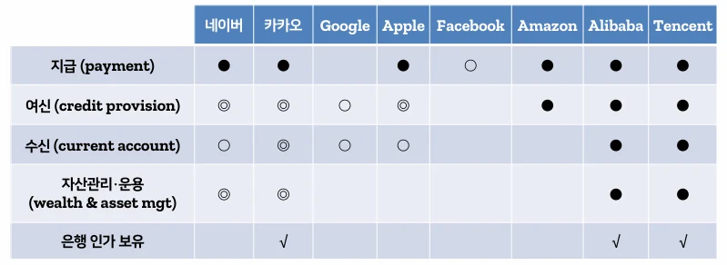

# [블록체인] CBDC 란??

## 원문

https://ch010104.tistory.com/86

## 노트 유형

`concept`

## 핵심 개념과 선택 맥락

**CBDC(Central Bank Digital Currency)**는 중앙은행이 발행하는 디지털 형태의 법정화폐

전통적인 종이 화폐(현금)와 달리 디지털 형식으로 존재하며, 중앙은행의 직접적인 채무로 간주

## 원문 기반 개념 정리

### 1. CBDC란?

**CBDC(Central Bank Digital Currency)**는 중앙은행이 발행하는 디지털 형태의 법정화폐

전통적인 종이 화폐(현금)와 달리 디지털 형식으로 존재하며, 중앙은행의 직접적인 채무로 간주

1) 주요 정의

BIS 정의: 중앙은행의 디지털 형태의 화폐로, 법정 화폐 단위로 명시되며 중앙은행의 직접 부채

IMF 정의: 주권 국가의 중앙은행이나 금융 당국이 발행하는 디지털 주화

한국은행 정의:

발행주체: 중앙은행

법적 형태: 전자적 형태로, 단일원장 또는 분산원장 구조로 구현 가능

이용주체: 일반 이용형(Retail)과 금융기관 전용형(Wholesale)으로 구분

### 2. 왜 CBDC를 도입하려 할까? (도입 배경)

1) 지급결제 시스템의 효율화

전통적인 결제는 지급(Payment) → 청산(Clearing) → 결제(Settlement) 단계로 이루어지며, 중간 청산 단계에서 시간 지연과 리스크가 발생.

CBDC는 블록체인 기반의 실시간 결제를 통해 이 중간 단계를 간소화 혹은 제거 가능.

특히 **프로그래머블 머니(Programmable Money)**로 확장이 가능해, 기존 화폐로 불가능했던 자동화된 거래도 구현 가능.

2) 모바일 기반 간편결제 서비스의 확산

코로나19 팬데믹 이후 비접촉식 결제 방식의 확산으로 국민들이 디지털 결제에 익숙해짐.

현금 사용률은 선진국, 개도국 모두 급격히 하락:

선진국: 59.3% → 30.9%

개도국: 95.7% → 77.9%

중국: 99% → 41%로 급감

3) 글로벌 스테이블코인 확산

스테이블코인(Stablecoin)은 법정화폐에 가치를 연동시킨 암호화폐로, 대표적으로 USDT, USDC가 있음.

결제, 송금, 자산 보호 등에 활용되며 2023년 기준 1,678억 달러 규모.

하지만 가격 불안정, 자금세탁, 사용자 보호 부재 등의 문제가 있어, 이에 대응하기 위해 중앙은행이 직접 발행하는 안정적인 디지털 화폐인 CBDC 필요성이 제기됨.

4) 금융 포용성 확대

세계은행은 ‘포용적 금융’을 모든 경제주체가 금융서비스에 접근 가능한 상태로 정의.

특히 **은행 계좌가 없는 사람들(unbanked)**을 위한 기본 금융 접근 수단으로 CBDC가 주목받음.

5) 빅테크의 금융시장 지배력 확대 대응

빅테크 기업들은 결제 서비스 → 대출·보험·투자 등 금융 전반으로 진출 중.

개인정보 및 거래 데이터의 집중과 독점 현상은 사회적 우려를 불러옴.

CBDC는 공공적 디지털 지급 인프라로서 이들의 지배력에 균형을 제공할 수 있음.

### 3. 한국은행의 CBDC 모의 실험 결과

2단계 실험 주요 시사점

## 핵심 이미지

## 관련 글

- [[blog/BLOCKCHAIN/index|BLOCKCHAIN]]
- [[blog/BLOCKCHAIN/블록체인- SSI( DID ), BaaS, DeFi 란|[블록체인] SSI( DID ), BaaS, DeFi 란??]]
- [[blog/BLOCKCHAIN/블록체인- 블록체인의 다양한 활용|[블록체인] 블록체인의 다양한 활용]]
- [[blog/BLOCKCHAIN/블록체인- 블록체인과 토큰|[블록체인] 블록체인과 토큰]]
