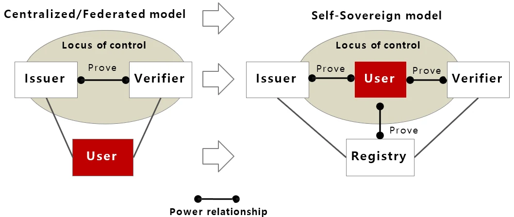
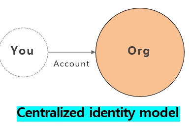
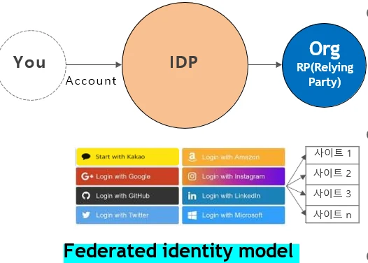

# [블록체인] SSI( DID ), BaaS, DeFi 란??

## 원문

https://ch010104.tistory.com/76

## 노트 유형

`concept`

## 핵심 개념과 선택 맥락

SSI는 사용자가 제3자의 개입 없이 자신의 디지털 신원을 직접 소유하고 관리할 수 있도록 하는 모델

기존의 중앙 집중형 신원 체계와는 달리, 사용자는 자신의 신원 정보를 언제, 어디서, 누구에게 공유할지를 스스로 결정 가능

## 원문 기반 개념 정리

### 1. SSI (Self-Sovereign Identity): 자기주권 신원

1) SSI란 무엇인가?

SSI는 사용자가 제3자의 개입 없이 자신의 디지털 신원을 직접 소유하고 관리할 수 있도록 하는 모델

기존의 중앙 집중형 신원 체계와는 달리, 사용자는 자신의 신원 정보를 언제, 어디서, 누구에게 공유할지를 스스로 결정 가능

2) 디지털 신원의 세 가지 모델

중앙형 신원 모델:

모든 사용자 이름과 암호를 기억하고 관리하는 부담은 전적으로 사용자에게 있음.

보안 취약성과 개인정보 유출 문제가 큼.

인터넷 신원의 초기 형태임.

연합형 신원 모델:

구글, 페이스북 등의 IDP를 통해 로그인.

편리하지만 여전히 중앙기관에 의존.

모든 사이트, 서비스 및 앱에서 작동하는 하나의 IDP는 없음. 따라서 사용자들은 여러 IDP의 계정이 필요함.

분산형 신원 모델(SSI):

사용자가 정보를 완전하게 통제.

블록체인을 기반으로 구성.

개인이 자신의 신원 정보를 직접 관리하고 제어할 수 있게 하는 신원 확인 시스템.

"You"와 "Peer" 두 노드가 공개키와 개인키를 사용하여 네트워크 내에서 통신하고 트랜잭션을 보안적으로 처리.

3) SSI 등장 배경

개인정보 유출 사고 (예: 인터파크, 페이스북, LG U+ 등)

인터넷은 애초에 신원 확인 기능이 없는 구조로 설계됨

인증정보 관리 불편

4) SSI의 핵심 구성요소

DID (Decentralized Identifier): 탈중앙화된 식별자

DID Document: DID에 대한 인증 정보가 포함된 문서

VC (Verifiable Credential): 사용자에게 부여된 디지털 자격증명

VP (Verifiable Presentation): VC 중 필요한 정보만 골라 제출하는 방식

검증자 / 발행자 / 사용자: SSI 참여자

블록체인: 데이터 위변조 방지를 위한 분산 원장

5) SSI의 특성

Minimalistic (최소 정보 공개) - SSI는 사용자의 프라이버시 보호를 중시 - 따라서 검증자에게 필요한 최소한의 정보만 선택적으로 공개할 수 있음 - 예를 들어, 성인 여부만 확인하면 되는 경우 생년월일 전체가 아닌 '성인 여부'만 증명할 수 있음

Security (보안성) - SSI는 블록체인 기반의 시스템을 통해 최고 수준의 보안을 제공 - 데이터 위·변조가 어렵고, 분산 저장 구조를 통해 해킹이나 시스템 장애에도 강한 저항성을 갖음

Portability (이동성) - 사용자는 자신의 신원 정보를 다양한 디바이스와 플랫폼에서 사용할 수 있음 - 예를 들어, 스마트폰 지갑에 저장된 신원 정보를 다른 웹서비스나 오프라인 환경에서도 활용할 수 있음

Consent (동의 기반) - 검증자는 사용자의 신원 정보를 확인하기 전에 반드시 소유자의 동의를 받아야 함. - 이는 사용자 중심의 데이터 통제를 보장하며, 데이터 접근에 대한 투명성을 확보

Control (사용자 통제권) - SSI에서는 사용자가 자신의 신원 정보에 대해 완전한 통제권을 가짐 - 언제, 어디서, 누구에게 어떤 정보를 공유할지 스스로 결정할 수 있어 **정보 주권(Self Data Sovereignty)**이 보장

Existence (디지털 자율 존재성) - 사용자는 제3자의 개입 없이도 디지털 세계에 독립적으로 존재하고 활동할 수 있음 - 즉, 인증기관 없이도 자신의 정체성을 증명하고 다양한 서비스에 접근할 수 있음

Persistent (영속성) - DID(Decentralized Identifier)는 현실 세계의 신원처럼 오랫동안 유지되는 식별자 - 시간이나 상황이 변해도 쉽게 바뀌지 않으며, 지속적으로 동일한 정체성을 유지할 수 있음

### 2. BaaS (Blockchain as a Service): 서비스형 블록체인

1) BaaS란?

BaaS는 클라우드 기반의 블록체인 서비스로, 복잡한 인프라 없이도 블록체인 기술을 빠르게 도입할 수 있게 해주는 플랫폼

기업은 자체적인 블록체인 전문가 없이도 스마트 컨트랙트, 노드 운영, 데이터 보안 등을 사용할 수 있음

2) BaaS의 핵심 기능

다양한 블록체인 프로토콜 지원 (예: Ethereum, Hyperledger 등)

스마트 컨트랙트 통합 개발 환경 제공 (웹 IDE, Visual Studio 등)

멀티 클라우드 및 이종 체인 연결 지원

블록체인 탐색기, 노드 상태 모니터링 제공

3)클라우드 서비스 모델과의 연계

BaaS는 클라우드 컴퓨팅 서비스 모델과 밀접하게 연관되어 있음

IaaS (Infrastructure as a Service): 서버, 저장소, 네트워크 등 인프라 자원을 서비스 형태로 제공. 사용자는 운영체제와 애플리케이션을 직접 관리.

PaaS (Platform as a Service): 애플리케이션을 개발하고 배포할 수 있는 플랫폼을 제공. 인프라, OS, 미들웨어는 제공자가 관리하며 개발자는 코드에 집중.

SaaS (Software as a Service): 클라우드에서 운영되는 완성된 소프트웨어를 사용자가 웹 브라우저 등을 통해 이용. 설치나 유지보수가 불필요.

- BaaS는 PaaS와 SaaS의 중간 형태

- 블록체인 기반 서비스를 구축하고 배포할 수 있도록 스마트 컨트랙트와 블록체인 네트워크 관리 기능 등을 제공

4) BaaS의 효과

빠른 시장 진입: 인프라 구축 없이 바로 개발 가능

비용 절감: 개발자 및 서버 유지 비용 최소화

확장성/유연성: 수요에 따라 쉽게 리소스 확장 가능

보안성 확보: 클라우드 기반의 고급 보안 기능 활용

5) 사용 시 고려사항

보안성: 데이터 암호화, 접근 제어, 침입 탐지 기능

통합성: 기존 시스템과의 API 연동

규정 준수: 개인정보보호법, 금융법 등

서비스 제공업체의 신뢰성: SLA 제공 여부

### 3. DeFi (Decentralized Finance): 탈중앙화 금융

1) DeFi란?

DeFi는 중앙 기관 없이 스마트 컨트랙트를 통해 은행, 증권, 보험과 같은 금융 서비스를 블록체인상에서 제공하는 시스템

누구나 인터넷만 있으면 금융 서비스를 만들고 이용할 수 있음

2) DeFi 기술 구조 (5계층)

1) Settlement Layer (결제 계층)

2) Asset Layer (자산 계층)

3) Protocol Layer (프로토콜 계층)

4) Application Layer (애플리케이션 계층)

5) Aggregation Layer (집계 계층)

•다양한 프로토콜과 애플리케이션을 연결해 복잡한 작업을 효율적으로 처리하고, 최적의 수익률 도출을 도와줌.

3) DeFi의 핵심 특징

검열 저항성: 정부 및 기관의 간섭 불가

비허가성 (Permissionless): 누구나 접근 가능

보안성: 블록체인 기반 데이터 불변성

빠른 처리 속도와 낮은 수수료

프로그래머블: 스마트 계약으로 자동화 가능

4) DeFi의 비즈니스 영역

탈중앙화 거래소(DEX) vs 중앙화 거래소(CEX)

대출 및 차입, 유동성 공급

보험, 파생상품 (예: Synthetix)

수익률 최적화 Aggregator

5) DeFi의 한계 및 위험

스마트 계약 코드의 취약성

암호키 분실 리스크

가격 변동성, 담보 청산

규제 미비 및 소비자 보호 부족

## 관련 글

- [[blog/BLOCKCHAIN/index|BLOCKCHAIN]]
- [[blog/BLOCKCHAIN/블록체인- 블록체인의 다양한 활용|[블록체인] 블록체인의 다양한 활용]]
- [[blog/BLOCKCHAIN/블록체인- CBDC 란|[블록체인] CBDC 란??]]
- [[blog/BLOCKCHAIN/블록체인- 블록체인과 토큰|[블록체인] 블록체인과 토큰]]
