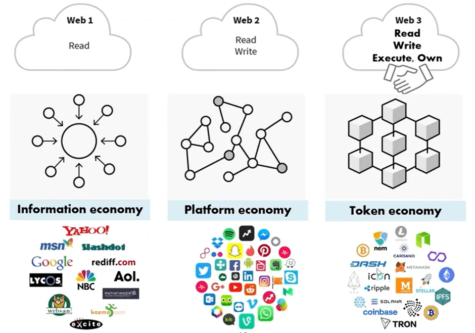

# [블록체인] 블록체인 기술: Web3

## 원문

https://ch010104.tistory.com/37

## 노트 유형

`concept`

## 핵심 개념과 선택 맥락

Web1 (읽기 중심): 정보 제공 위주의 인터넷 (예: Yahoo, Google 등)

Web2 (읽기 + 쓰기): 사용자 참여 및 플랫폼 중심 서비스 (예: Facebook, YouTube 등)

## 원문 기반 개념 정리

### 1. Web3란 무엇인가?

🔹 Web1 → Web2 → Web3

Web1 (읽기 중심): 정보 제공 위주의 인터넷 (예: Yahoo, Google 등)

Web2 (읽기 + 쓰기): 사용자 참여 및 플랫폼 중심 서비스 (예: Facebook, YouTube 등)

Web3 (읽기 + 쓰기 + 실행/소유): 탈중앙화된 네트워크 기반에서 사용자가 데이터를 소유하고, 스마트 계약을 통해 직접 실행하며, 토큰 경제로 보상을 받는 구조

✅ 핵심 키워드: 탈중앙화, 사용자 소유, 스마트 계약, 토큰, 오픈 네트워크

### 2. Web3 주요 인프라 구성 요소

### 3. Web3 관련 직무 정리

### 4. Web3 예시: Web2 vs Web3 DApp

Web3 브라우저 중에 Brave는 기존 Web2 브라우저와 달리 블록체인 기술 사용에 있어서 보안에 특화됨.

### Web3 DNS: ENS (Ethereum Name Service)

이더리움 네임 서비스(ENS)는 이더리움 블록체인을 기반으로 한 분산되고, 개방적이며, 확장 가능한 네이밍 시스템

긴 이더리움 주소(0xb8c2...)를 사람이 읽을 수 있는 이름(nick.eth)으로 매핑(반대로, 사람이 읽을 수 있는 이름을 기계가 읽을 수 있는 식별자로도 매핑함)

메타데이터, 콘텐츠 해시, 암호화폐 주소 등도 ENS를 통해 연결 가능

## 관련 글

- [[blog/BLOCKCHAIN/index|BLOCKCHAIN]]
- [[blog/BLOCKCHAIN/블록체인- 블록체인 기술 설계 및 고려사항|[블록체인] 블록체인 기술 설계 및 고려사항]]
- [[blog/BLOCKCHAIN/블록체인- 블록체인 기술- 아키텍처와 트랜잭션|[블록체인] 블록체인 기술: 아키텍처와 트랜잭션]]
- [[blog/BLOCKCHAIN/블록체인- 이더리움(Ethereum) 이란|[블록체인] 이더리움(Ethereum) 이란?]]
