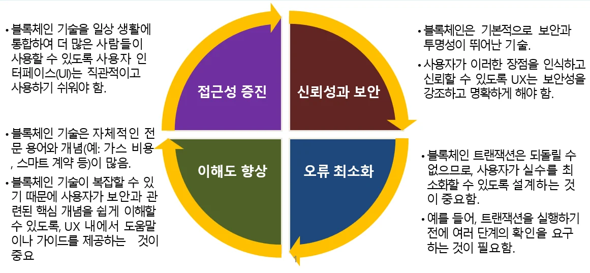
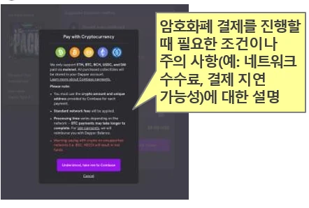
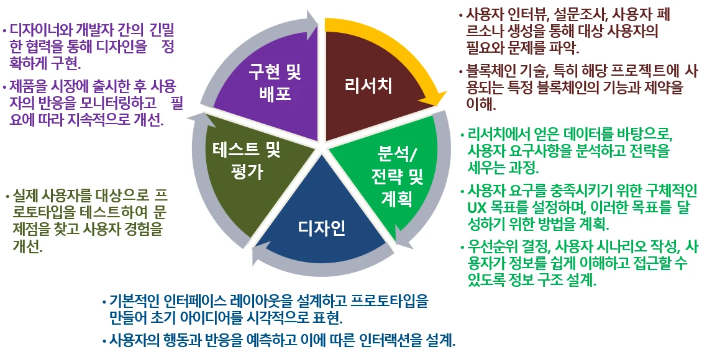

# [블록체인] 블록체인과 UX(사용자 경험)

## 원문

https://ch010104.tistory.com/49

## 노트 유형

`concept`

## 핵심 개념과 선택 맥락

블록체인은 보안성과 투명성이라는 큰 장점을 가진 기술이지만, 초보자에게는 여전히 낯설고 어렵게 느껴질 수 있음

특히 Web3 서비스는 익숙하지 않은 용어와 절차, 복잡한 사용자 흐름으로 인해 진입 장벽이 높음

## 원문 기반 개념 정리

블록체인은 보안성과 투명성이라는 큰 장점을 가진 기술이지만, 초보자에게는 여전히 낯설고 어렵게 느껴질 수 있음

특히 Web3 서비스는 익숙하지 않은 용어와 절차, 복잡한 사용자 흐름으로 인해 진입 장벽이 높음

때문에 UX(User Experience, 사용자 경험) 설계는 무엇보다도 중요!!!

### 1. UX 개념과 핵심 목표

블록체인 UX는 사용자가 블록체인 기술과 상호작용할 때의 경험을 설계하는 과정

기존 앱/웹 UX와 유사하나, 다음 요소에 특히 중점을 둠.

신뢰성과 보안 강조: 되돌릴 수 없는 트랜잭션 특성상 실수를 방지하는 UX 필요.

복잡한 개념 해소(이해도 향상): 스마트 계약, 가스비 등 전문 용어를 쉽게 설명해야 함.

접근성 향상: 누구나 사용할 수 있도록 직관적인 UI 제공.

오류 최소화: 트랜잭션 전 여러 단계의 확인 설계.

📌 예: “이 거래는 되돌릴 수 없습니다. 계속하시겠습니까?”와 같은 확인 단계.

### 2. 사용자 여정(User Journey) 예시 – NFT 구매

블록체인 기반 NFT 구매 과정을 UX 흐름으로 나누면 다음과 같음.

MetaMask 설치

Ether 구입 및 예치

결제 수단 선택

NFT 선택 및 구매 진행

수수료 확인 (가스비)

거래 완료 및 내역 확인

지갑에서 보유 내역 확인

👉 중간중간 규칙/주의사항 안내 및 거래 상태 표시가 매우 중요!!!

### 3. 왜 UX가 블록체인에서 더 중요한가?

✔️ 블록체인은 “익숙하지 않음”의 집합체

많은 사용자가 DeFi, DApp, NFT 등에 익숙하지 않음.

예: Z세대도 Web3 지갑의 니모닉 백업 문구, 가스비 개념에는 어려움 겪음.

✔️ UX는 신뢰를 만드는 도구

블록체인 서비스는 보안, 효율성, 탈중앙화 등 기술 기반의 강점을 UX를 통해 전달해야 함.

**좋은 UX는 차별화 요소(USP)**가 될 수 있음.

### 4. 주요 UX 문제와 해결 방안

예시:

❌ “가스비 부족” → ✅ “지갑 잔액이 부족하여 거래를 완료할 수 없습니다. 최소 0.01 ETH 이상이 필요합니다.”

### 5. Web3 환경에서의 UX 전략

① 단순한 UI

복잡한 지갑 주소는 복사 버튼으로 간단하게!

예: MetaMask의 ‘주소 복사’ 기능 → 기억할 필요 없이 버튼 한 번

② 안전한 사용 경험

니모닉(시드 구문) 백업 안내는 반드시 포함

예: 단어 재입력 과정, 종이에 기록 권장

③ 실수 방지 설계

사용자의 상황(토큰 부족, 지갑 미연결 등)을 사전에 감지하여 경고

④ 새로운 용어 설명

스테이킹, 채굴 등의 용어는 간단한 설명 Tooltip으로 제공

⑤ 다중 체인 지원 UX

ETH, BSC 등 여러 네트워크 설정은 초보자에게 매우 어렵기 때문에 자동 설정 안내 or 프리셋 설정을 활용

⑥ 트랜잭션 정보 시각화

거래가 지연될 경우, “진행 중”, “보류 중”, “완료됨” 등 단계별 안내 메시지 제공

예: EtherScan 링크와 함께 상태 표시 → 사용자 불안 해소

### 6. CTA(Call To Action)의 역할

- 내 웹사이트, 랜딩페이지, 이메일 또는 광고에서 고객으로 하여금 원하는 작업을 수행하도록 유도하는 짧은 문구를 말함.

- 좋은 UX는 사용자의 행동을 이끌어냄.

🔹 “지갑 생성하기”

🔹 “트랜잭션 확인하기”

🔹 “지금 시작하기”

🔹 “투자하기”

짧고 명확하며, 클릭하고 싶게 만드는 문구가 핵심!!

### 7. UX 설계 프로세스

- 블록체인 UX도 일반 UX 설계 절차를 따르되, 기술의 특수성을 고려

1) 리서치

사용자 페르소나 설정, 인터뷰, 설문조사

기술적 제약 및 보안 요구사항 이해

2) 분석 및 전략 수립

UX 목표 설정, 정보 구조 설계

3) 디자인

인터페이스 설계 및 프로토타입 제작

4. 테스트 및 평가

실제 사용자 대상으로 사용성 테스트

5. 구현 및 배포

디자이너와 개발자의 협업 → 배포 후 피드백 기반 개선

## 관련 글

- [[blog/BLOCKCHAIN/index|BLOCKCHAIN]]
- [[blog/BLOCKCHAIN/블록체인- 블록체인과 보안|[블록체인] 블록체인과 보안]]
- [[blog/BLOCKCHAIN/블록체인- 블록체인과 토큰|[블록체인] 블록체인과 토큰]]
- [[blog/BLOCKCHAIN/블록체인- 블록체인 기술- 아키텍처와 트랜잭션|[블록체인] 블록체인 기술: 아키텍처와 트랜잭션]]
