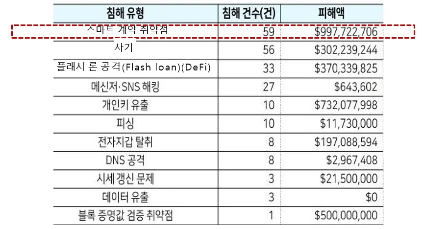
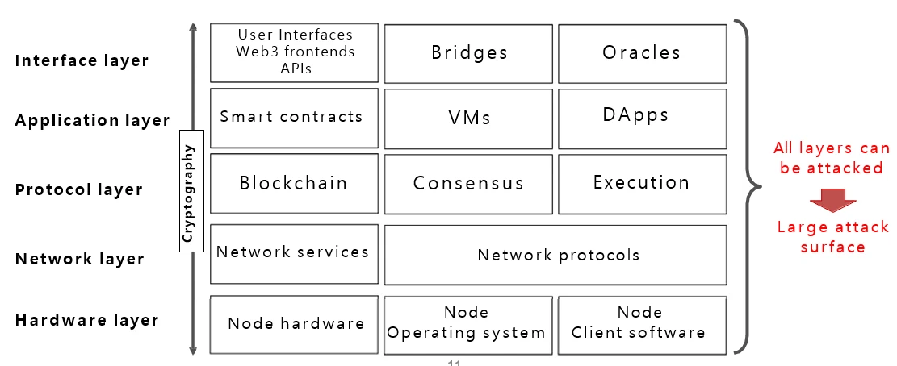
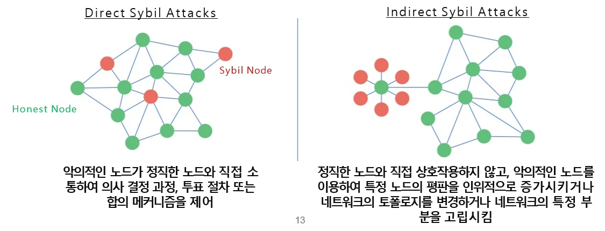

# [블록체인] 블록체인과 보안

## 원문

https://ch010104.tistory.com/48

## 노트 유형

`guide`

## 적용 목적과 전제조건

블록체인 보안 사고 사례 중에서 가장 많은 비중을 차지하는 것은 "스마트 계약 취약점" 으로 인한 사고임.

북한 해커 조직 라자루스 → DeFi 해킹으로 핵 개발 자금 확보.

## 구현 절차·검증·주의점

### 1. 블록체인 보안의 복잡성

탈중앙화 구조로 인해 전통적인 보안 적용이 어려움.

업그레이드/패치 제약: 배포 후 코드 변경 불가.

무신뢰 환경, 익명성 강조.

금전적 가치 큼 → 보안 사고 시 피해가 큼.

### 2. 블록체인 보안 사고 사례 - Crypto Scam

피싱(Phishing): 가짜 웹사이트, 문자로 개인키 탈취.

가짜 ICO: 존재하지 않는 프로젝트로 투자 유도.

폰지 스킴: 후속 투자자의 돈으로 초기 투자자 수익 제공.

마이닝 스캠: 채굴 사기.

러그풀(Rug Pull): 개발자가 투자금 들고 잠적.

멀웨어: PC 자원을 몰래 채굴에 사용.

펌프 앤 덤프: 가격 조작 후 매도.

블록체인 보안 사고 사례 중에서 가장 많은 비중을 차지하는 것은 "스마트 계약 취약점" 으로 인한 사고임.

### 3. 해킹과 자금 세탁

DeFi 해킹 급증, 특히 스마트 컨트랙트 취약점.

북한 해커 조직 라자루스 → DeFi 해킹으로 핵 개발 자금 확보.

자금세탁 방식: 중간 지갑, 브릿지, 탈중앙화 거래소 활용.

### 4. 공격 가능한 계층 구조

하드웨어부터 UI까지 모든 레이어 공격 가능

예: 스마트컨트랙트, Web3 프론트엔드, 오라클, 지갑 등

공격 범위가 광범위함 → 전방위 보안 요구.

### 5. 주요 공격 사례별 정리

1) 하드웨어: 크립토재킹 (Cryptojacking)

악성코드를 이용해 사용자의 컴퓨터나 스마트폰을 몰래 감염시켜 채굴 작업을 수행하게 함.

피해자는 기기의 속도 저하나 과도한 전력 소비를 겪지만 원인을 인지하지 못하는 경우가 많음.

2) 네트워크 레이어 공격

2.1. 시빌 공격 (Sybil Attack)

하나의 공격자가 다수의 가짜 노드나 ID를 생성해 네트워크의 의사결정이나 투표를 조작함.

합의 프로세스를 장악하거나 왜곡할 수 있음.

2.2. 이클립스 공격 (Eclipse Attack)

특정 노드를 네트워크에서 고립시키고, 오직 공격자 노드와만 통신하도록 유도.

이중 지불 공격이나 허위 블록 생성에 활용될 수 있음.

3) 애플리케이션 레이어 공격

3.1. 스마트 컨트랙트 취약점 - 스마트 계약 내의 논리적 실수나 프로그래밍 결함을 악용하여 자산 탈취 가능.

• 트랜잭션 순서 의존성 (Transaction Ordering Dependency)

블록 내 트랜잭션의 순서를 조작해 결과를 의도적으로 바꿈.

예: 프론트러닝 (선제 주문 삽입).

• 재진입 공격 (Reentrancy Attack)

외부 계약 호출 중 현재 함수를 다시 재귀적으로 호출하여 잔액 검사 이전에 자산을 중복 출금.

• 타임스탬프 조작

블록 생성자의 타임스탬프 변경을 이용해 게임이나 보상 관련 로직을 조작함.

3.2. DeFi 관련 공격

• 샌드위치 공격

사용자의 매수/매도 사이에 공격자가 트랜잭션을 선입/후입하여 가격 변동을 유도.

• 플래시론 공격

무담보 대출을 받은 후, 자산 가격 조작을 통해 단일 트랜잭션 안에서 수익을 내고 상환.

• MEV (Miner Extractable Value)

블록 생성자가 트랜잭션 순서를 임의로 바꾸거나 제거하여 자신의 수익을 극대화.

• NFT DoS (서비스 거부 공격)

NFT의 메타데이터가 저장된 외부 서버를 공격해 접근을 불가능하게 만드는 방식.

4) 인터페이스 레이어 공격

4.1. 오라클 공격

- 오라클은 외부 데이터를 블록체인에 전달하는 중개자.

• Sybil Attack: 가짜 오라클 노드 다수 생성.

• Bribing: 오라클에게 뇌물 제공하여 거짓 정보 입력.

• Censorship: 의도적으로 정보 차단.

• Tampering: 오라클이 참고하는 데이터 소스 조작.

• DoS: 오라클을 과도한 요청으로 마비시켜 계약 실패 유도.

4.2. 지갑 관련 공격

• 피싱: 가짜 지갑 페이지에서 시드 구문/개인키 탈취.

• Malware: 지갑 사용 기기에 악성코드 삽입.

• 코드 취약점: 지갑 소스코드의 보안 헛점을 이용해 자금 탈취.

• MITM (중간자 공격): 지갑과 네트워크 간 통신을 가로채고 조작.

• 사용자 실수: 시드 구문 분실, 보안 경고 무시 등.

MITM(중간자 공격)

4.3. 하드웨어 지갑 공격

공급망 단계에서 하드웨어 변경 (supply chain attack).

물리적 분해 후 메모리 추출.

컴퓨터가 감염되어 지갑과 통신 중 정보 탈취.

5) 암호화/키 관리 공격

• MITM (중간자 공격)

두 사용자의 공개키를 위조하여 중간에서 통신을 조작하거나 도청.

• Brute-force 공격

가능한 모든 키 조합을 시도해 비밀키를 알아냄.

• Key Reuse

동일한 키를 여러 상황에서 반복 사용 시 보안 약점 발생.

• Side-channel 공격

전력 소비, 전자기 방출 등의 물리적 정보 누출을 통해 키를 역산함.

• Unauthorized Key Sharing

키가 무단 공유되면 보안의 근간이 무너짐.

• Insecure Key Storage

키를 안전하지 않은 장소에 저장 → 물리적/논리적 탈취 가능.

• Key Loss or Theft

개인키를 잃으면 자산에 대한 영구적 접근 불가.

### 6. 위협 모델링 (Threat Modeling)

DREAD, STRIDE, CVSS 모델로 분석.

Attack Tree, Threat Matrix 등 시각적 위협 평가 도구 사용.

### 7. 보안 강화 방안

모듈화, 가독성 높은 스마트컨트랙트 작성

리스크 완화 계획 수립

Gas 사용 최적화 고려

커뮤니티 협업

스마트컨트랙트 업그레이드

Proxy 패턴 도입

보안 도구 사용

Securify, Mythril, Oyente, VeriSmart

## 핵심 이미지

## 관련 글

- [[blog/BLOCKCHAIN/index|BLOCKCHAIN]]
- [[blog/BLOCKCHAIN/블록체인- 블록체인 기술- 아키텍처와 트랜잭션|[블록체인] 블록체인 기술: 아키텍처와 트랜잭션]]
- [[blog/BLOCKCHAIN/블록체인- 블록체인과 토큰|[블록체인] 블록체인과 토큰]]
- [[blog/BLOCKCHAIN/블록체인- 블록체인 기술- Web3|[블록체인] 블록체인 기술: Web3]]
