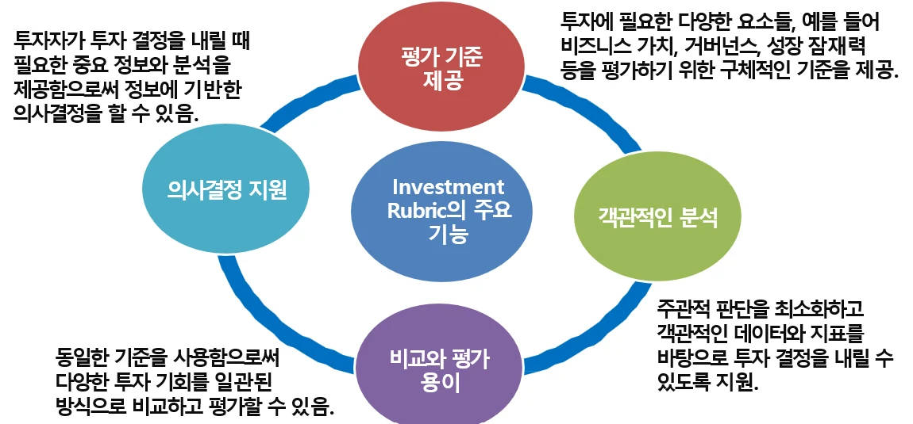
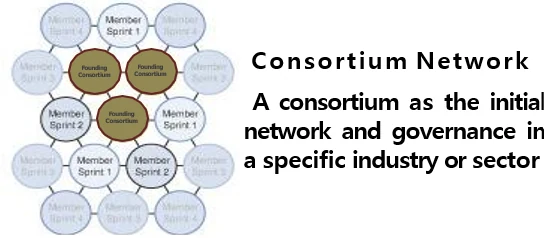
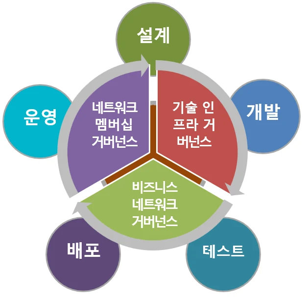

# [블록체인] 블록체인과 사업타당성 평가

## 원문

https://ch010104.tistory.com/64

## 노트 유형

`concept`

## 핵심 개념과 선택 맥락

블록체인 어플리케이션을 기획하고 사업화하기 위해선 단순 개발을 넘어 사업성과 실현 가능성을 꼼꼼히 검토해야 함. 이를 위해 BCR 프로세스를 따름.

사용 사례 발굴: 시스템 통합 관점에서 블록체인 적용 가능성을 분석

## 원문 기반 개념 정리

### 1. BCR (Blockchain Concept Realization) 프로세스

블록체인 어플리케이션을 기획하고 사업화하기 위해선 단순 개발을 넘어 사업성과 실현 가능성을 꼼꼼히 검토해야 함. 이를 위해 BCR 프로세스를 따름.

사용 사례 발굴: 시스템 통합 관점에서 블록체인 적용 가능성을 분석

비즈니스/기술 설계: 개념 증명(POC)을 통해 블록체인 네트워크 설계 및 테스트

프로젝트 위험 완화: Fail Fast, Fail Often 전략으로 초기 실패를 빠르게 발견

Minimum Viable Ecosystem(MVE): 최소 기능 생태계를 먼저 구축해 테스트

비즈니스 가치 평가: NPV(순현재가치), IRR(내부수익률) 모델로 수익성 검토

거버넌스와 리스크 관리: 공정한 보상 체계와 기술 서비스 수준 체계 확립

### 2. 투자결정을 위한 평가 체계

1) 전체 흐름

아이디어 발상 → 컨셉 개발 및 테스트 → 시장 전략/비즈니스 분석 → 신제품 개발 및 출시

지속적인 ROI 분석으로 투자 수익률 관리

2) 개념증명 (POC: Proof of Concept)

제품/기술이 조직의 문제를 해결할 수 있는지 빠르게 검증

초기 문제를 발견하고 수정하여 제품 성공 가능성을 높임

3) Investment Rubric (투자 평가 지표)

비즈니스 가치, 성장 가능성, 거버넌스 등을 일관되게 평가할 수 있는 기준 제공

주관적 판단 최소화, 객관적 데이터 기반 분석 지원

### 3. 블록체인 개발 vs 전통 소프트웨어 개발 차이

### 4. 사례: TradeLens

IBM과 Maersk가 공동 개발한 글로벌 물류 플랫폼

하이퍼레저 패브릭 기반 프라이빗 블록체인 사용

선적 문서, 세관 신고서 등을 블록체인에 업로드 → 자동 검증 및 스마트 계약 실행

문서 작업 비용과 위험을 절감, 투명성과 신뢰성을 강화

### 5. 비즈니스 모델 고려사항

Competition vs Cooperation: 협력/경쟁 전략 수립

Transformation vs Disruption: 기업 변혁과 산업 혁신

생태계 내 기업의 역할: 핵심 역량 발휘, 상호작용 설계

공정한 보상 메커니즘 구축: 생태계 내 가치 제공과 공정한 수익 배분

### 6. 초기 생태계 구성

네트워크 구성 형태

Founder-led Network: 단일 기업이 초기 주도

Consortium Network: 여러 기업이 공동 참여

Joint Venture Network: 합작 형태로 운영

Business Ecosystem: 다양한 산업을 아우르는 생태계

컨소시엄 네트워크 특징

허가형(private) 네트워크

권한과 책임을 균등 분배

기술 표준화와 협업 촉진

### 7. 블록체인 네트워크 가치 평가 모델

블록체인 특성상 전통적 기업 평가모델만으로는 부족

다음과 같은 추가 영역이 필요!!

기술적 가치: 보안성, 개발역량, 기술 혁신성

사업적 가치: 시장규모, 수익모델

네트워크 가치: 사용자 수, 탈중앙화 수준, 커뮤니티 활동

토큰 가치: 토큰 유틸리티, 유동성, 가격 변동성

지속가능성 가치: 사회적, 환경적, 윤리적 가치

규제준수 가치

벌금/제재 회피

시장 접근성 증가

투자자 신뢰도 향상

기술 혁신 촉진

브랜드 이미지 향상

### 8. 비용 분석

개발비, 유지보수, 규제준수비용, 인프라비용(데이터 저장/이전), 오라클 비용 등이 포함됨

### 9. 최소 실행 가능 생태계 (MVE)

생태계가 시장에서 작동 가능한 최소 조건을 만족하는 참여자 및 활동 확보

초기 생존성과 성장 잠재력을 평가할 수 있음

생태계 참여자에게 생태계의 비전, 방향성, 기대되는 비지느스 이점 등을 제공하여 신뢰와 참여를 이끌어 낼 수 있는 모델을 보유하는 것이 중요!!!

### 10. 블록체인 거버넌스

거버넌스란 블록체인 네트워크에서 규칙, 정책, 절차를 정의하고 집행하는 체계 기술 인프라 거버넌스, 비즈니스 네트워크 거버넌스, 네트워크 멤버십 거버넌스로 나뉨

거버넌스 구조 유형

온체인 거버넌스: 스마트 계약 기반 투표 (ex. Tezos)

오프체인 거버넌스: 포럼, 회의 등 외부 협의체 기반 (ex. Bitcoin, Ethereum)

하이브리드 거버넌스: 온체인 + 오프체인 혼합

적용 프로세스

참가자 니즈 분석

조정 활동(조정, 통제) 설정

유연한 네트워크 구조 조정

### 11. ROI 분석: 성장과 규모 확장(Growth with Scale)

지속 가능한 성장을 위해서는 단순한 매출 증가가 아니라 규모가 커질수록 더 빠르게 성장하는 구조를 만들어야 함.

ROI 분석 주요 항목:

초기/운영 비용

효율성 향상 및 비용 절감

장기적 전략적 가치

규제 준수 이점

위험 감소

## 핵심 이미지

## 관련 글

- [[blog/BLOCKCHAIN/index|BLOCKCHAIN]]
- [[blog/BLOCKCHAIN/블록체인- 블록체인과 토큰|[블록체인] 블록체인과 토큰]]
- [[blog/BLOCKCHAIN/블록체인- 블록체인의 다양한 활용|[블록체인] 블록체인의 다양한 활용]]
- [[blog/BLOCKCHAIN/블록체인- SSI( DID ), BaaS, DeFi 란|[블록체인] SSI( DID ), BaaS, DeFi 란??]]
