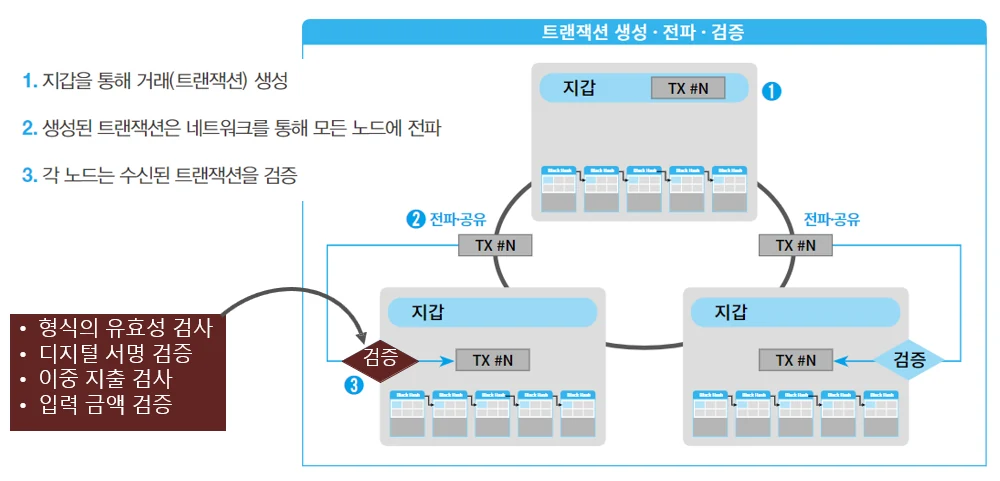
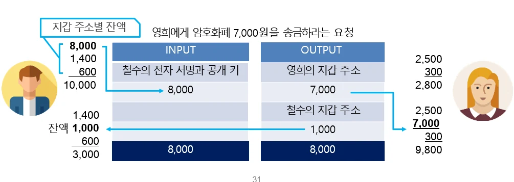
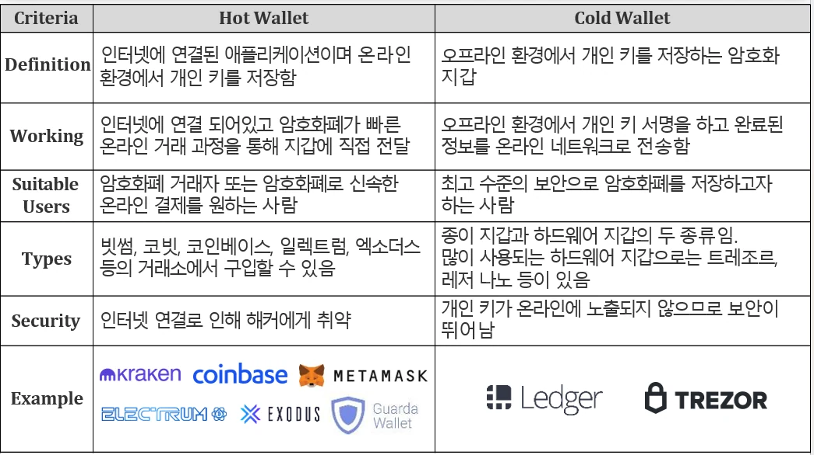

# [블록체인] 비트코인(Bitcoin) 이란?

## 원문

https://ch010104.tistory.com/25

## 노트 유형

`concept`

## 핵심 개념과 선택 맥락

정의: 중앙은행 없이 운영되는 세계 최초의 탈중앙화 디지털 화폐

출시 시점: 2009년, 사토시 나카모토가 제네시스 블록 채굴하며 시작

## 원문 기반 개념 정리

### 1. 비트코인이란?

정의: 중앙은행 없이 운영되는 세계 최초의 탈중앙화 디지털 화폐

출시 시점: 2009년, 사토시 나카모토가 제네시스 블록 채굴하며 시작

기반 기술: 블록체인, 공개키 암호화, 작업증명(PoW), 분산 시스템

### 2. 비트코인 작동 원리

1단계: 트랜잭션 생성, 전파 및 검증

사용자가 트랜잭션(예: A → B, 1BTC 전송)을 생성하고, 디지털 서명함

해당 트랜잭션은 P2P 네트워크를 통해 노드 전체에 전파됨

각 노드는 아래 항목을 기준으로 트랜잭션을 검증함:

트랜잭션 형식

디지털 서명 유효성

이중 지불 여부

입력 금액 ≥ 송금 금액 확인

2단계: 트랜잭션 저장 및 후보 블록 생성

검증 완료된 트랜잭션은 Mempool(메모리 풀)에 임시 저장됨

채굴 노드는 여러 트랜잭션을 모아 후보 블록 생성

3단계: 대표 블록 생성 경쟁 (채굴)

후보 블록을 가지고 채굴자들이 PoW 경쟁 수행 (SHA-256 해시값 연산)

가장 먼저 조건에 맞는 해시를 찾은 채굴자가 대표 블록 생성

채굴자는 블록 보상(BTC)과 수수료 획득

4단계: 대표 블록 전파 및 블록체인 연결

생성된 대표 블록이 네트워크 전체에 전파됨

각 노드가 블록 유효성 검토 후, 블록체인에 연결함

블록체인에 기록되면 해당 트랜잭션은 공식 확정(Confirmed) 처리됨

일반적으로 6개 이상의 블록이 추가되면 완전 확정(6컨펌) 상태로 인정

비트코인 네트워크에 참여하는 각각의 컴퓨터를 노드라고 함.

노드(Node)는 지갑, Memory Pool, 블록체인으로 구성되어 있음.

-> 노드들은 각각 동일한 블록체인을 저장하고 있으며, 검증과 합의 알고리즘을 통해 중앙시스템 없이 작동 -> 때문에 시간이 오래 걸림

### 3. 비트코인과 이더리움(튜링 완전성)

1) 튜링 완전(turing complete)

컴퓨터 개발되기 전 1936년 영국의 수학자인 튜링에 의해 최초로 제시된 개념

현존하는 모든 문제를 완전 언어를 이용한 알고리즘으로 풀 수 있으면 튜링 완전성을 가지고 있다고 함.

비트코인은 이터리움과 달리 if문, for 문, while 문 만으로 문제를 해결할 수 없기 때문에 튜링 완전성이 없음.

2) 비트코인 vs 이더리움

비트코인은 ‘디지털 금’,

이더리움은 ‘디지털 앱스토어’

### 4. 비트코인 트랜젝션 - UTXO 모델

UTXO란: Unspent Transaction Output (미사용 거래 출력값)

비트코인은 '잔액'을 추적하지 않고, **미사용 트랜잭션(UTXO)**을 추적해서 돈의 흐름을 관리함

보안성과 투명성, 이중지불 방지에 유리

기존 계좌 방식과의 차이점:

은행 계좌: 현재 잔액 저장

비트코인(UTXO): 사용하지 않은 트랜잭션(비트코인) 기록을 추적

A가 B에게 7,000원을 비트코인으로 송금하는 상황

A의 비트코인 지갑에 8,000원이 있다고 가정

Input 1. A가 가지고 있던 8,000원 UTXO 사용

Output 1. B에게 7,000원 송금

2. 나머지 1,000원은 A 자신의 지갑으로 '거스름돈'처럼 다시 돌려받음

**마치 지갑에서 지폐를 꺼내서, 남은 돈을 거슬러 받는 개념**

### 5. 비트코인 vs 블록체인

** 비트코인은 블록체인을 활용한 대표적 응용 사례!! **

### 6. 코인 vs 토큰

** 코인은 독립적, 토큰은 종속적 **

코인의 종류

1. 거래용 코인 (결제/송금 목적)

목적: 실질적인 거래, 결제, 송금

대표 코인: 비트코인(BTC), 라이트코인(LTC), 도지코인(DOGE), 리플(XRP)

특징:

화폐처럼 사용

속도와 수수료가 중요

2. 플랫폼 코인 (운영체제 역할)

목적: 다른 코인이나 앱들이 돌아갈 수 있는 플랫폼 제공

대표 코인: 이더리움(ETH)

특징:

안드로이드/iOS 같은 기반 플랫폼

플랫폼 위에서 얼마나 많은 앱이 돌아가는지가 중요

3. 유틸리티 코인 (앱 기능/서비스 접근)

목적: 플랫폼 내 서비스 이용, 기능 수행

예시: 테더(USDT), USD코인(USDC), 다이(DAI)

특징:

콘텐츠, 게임, 금융, 헬스케어 등 다양한 산업에 사용

**어느 분야(섹터)**에 쓰이는지가 중요

### 7. 스테이블 코인과 알트코인

### 1. 알트코인 (Altcoins)

정의: 비트코인을 제외한 모든 암호화폐를 통칭

"Alternative coin(대안 화폐)"의 줄임말

비트코인 이후 등장한 모든 암호화폐가 포함됨 → 예: 이더리움(ETH), 리플(XRP), 라이트코인(LTC), 도지코인(DOGE) 등

ISO 4217 같은 공식 통화 코드가 없기 때문에 업계에서 관행적으로 사용하는 약어(예: ETH, XRP) 사용

💡 비트코인을 선두주자로 본다면, 알트코인은 그 이후의 다양한 기능과 실험을 포함한 확장판!!

### 스테이블코인 (Stablecoins)

정의: 가격이 안정적으로 유지되도록 설계된 암호화폐

기능: 암호화폐 시장에서 교환 수단의 역할을 하기 위해 고안됨

비트코인이나 이더리움처럼 가격이 크게 변동하는 자산은 결제 수단으로 부적절

그래서 가치가 일정하게 유지되는 토큰이 필요함

### 8. 암호화폐 지갑 종류

즉, 단기 거래는 Hot Wallet, 장기 보관은 Cold Wallet 추천

### 9. 비트코인 획득 방법

채굴(Mining): 컴퓨터로 연산 → 블록 생성 → 보상 획득

거래소 구매: 실물 화폐와 비트코인 교환 (업비트, 바이낸스 등)

### 10. 블록체인 트릴레마

탈중앙성: 중앙 주체 없음, 누구나 참여 가능

보안성: 해킹/조작 저항력

확장성: TPS(초당 거래 수) 처리 능력

⚠️ 세 가지를 동시에 만족시키기 어려움 → 프로젝트마다 우선순위 조정 필요(최대 2개를 만족시킴)

** 비트코인 과 이더리움은 보안성과 탈중앙화가 강점이지만 확장성이 낮음 **

### 11. 암호화폐 지갑 분류

결과적으로 암호화폐는 보관 주제, 인터넷 연결, 기능, 플랫폼 4가지 기준에 따라 분류됨.

## 핵심 이미지

## 관련 글

- [[blog/BLOCKCHAIN/index|BLOCKCHAIN]]
- [[blog/BLOCKCHAIN/블록체인- 이더리움(Ethereum) 이란|[블록체인] 이더리움(Ethereum) 이란?]]
- [[blog/BLOCKCHAIN/블록체인- 암호화 기술과 스마트 계약(Smart Contact)이란|[블록체인] 암호화 기술과 스마트 계약(Smart Contact)이란?]]
- [[blog/BLOCKCHAIN/블록체인- 블록체인 기술 설계 및 고려사항|[블록체인] 블록체인 기술 설계 및 고려사항]]
