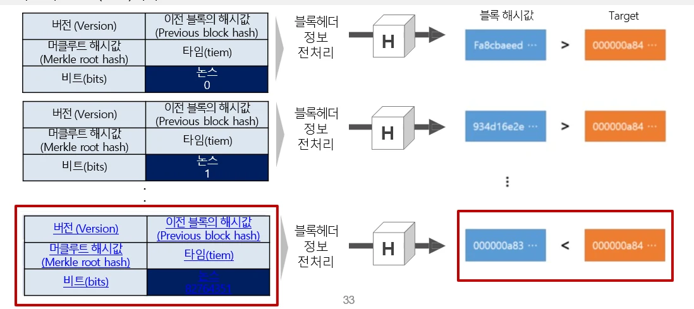
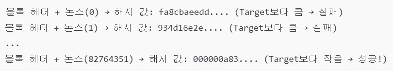
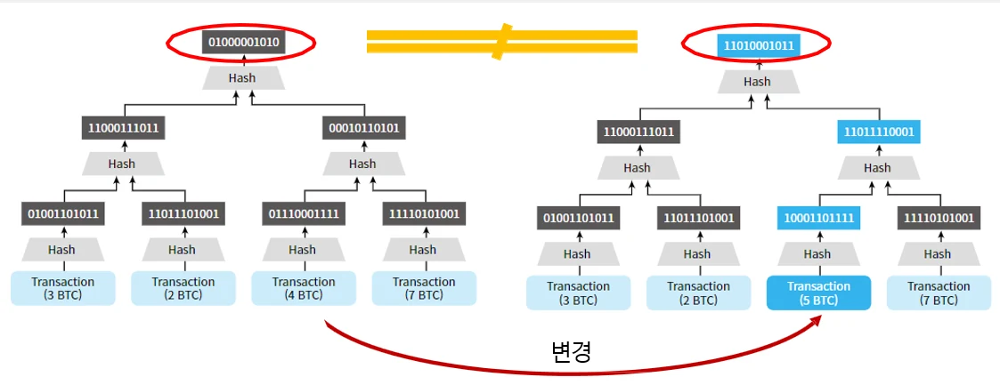

# [블록체인] 암호화 기술과 스마트 계약(Smart Contact)이란?

## 원문

https://ch010104.tistory.com/19

## 노트 유형

`concept`

## 핵심 개념과 선택 맥락

블록체인의 보안은 정보 보안의 **3대 요소(CIA)**를 기반으로 설계됨.

1) 기밀성(Confidentiality): 정보가 허가된 사용자에게만 접근 가능해야 함.

## 원문 기반 개념 정리

### 1. 보안의 3요소 (CIA 3원칙)

블록체인의 보안은 정보 보안의 **3대 요소(CIA)**를 기반으로 설계됨.

1) 기밀성(Confidentiality): 정보가 허가된 사용자에게만 접근 가능해야 함.

해결 방법: 암호화(Encryption), 접근 제어(Access Control)

2) 무결성(Integrity): 데이터가 위변조되지 않고 원본 상태가 유지되어야 함.

해결 방법: 해시 함수(Hash Function), 디지털 서명(Digital Signature)

3) 가용성(Availability): 시스템이 중단되지 않고 지속적으로 서비스를 제공해야 함.

해결 방법: 분산 네트워크, 합의 알고리즘(Proof of Work, Proof of Stake)

### 2. 블록체인을 지원하는 주요 암호화 기술

블록체인은 신뢰 없는 환경에서도 데이터의 무결성, 기밀성, 가용성을 보장하기 위해 다음과 같은 암호화 기술을 활용합니다.

1) 대칭키 암호화(Symmetric Key Encryption)

하나의 키로 데이터를 암호화/복호화하는 방식.

속도가 빠르지만, 키 분배가 어렵다는 단점이 있음(인터넷 상에서 하나의 대칭키를 공유해야하는 것이 어려움).

예시: AES(Advanced Encryption Standard)

2) 공개키 암호화(Public Key Encryption)

공개키(Public Key)와 비밀키(Private Key)를 사용하는 암호화 방식.

개인키는 본인만 알고 있어야 하며, 공개키는 누구나 접근 가능(공개된 네트워크 상에 존재). - 상대방의 공개키를 이용하여 암호화해서 데이터를 보내면, 상대방은 자신의 비밀키를 사용하여 복호화.

예시: RSA, ECC(Elliptic Curve Cryptography)

3) 디지털 서명(Digital Signature)

거래의 위변조 방지 및 사용자 신원 검증을 위해 사용.

서명된 데이터가 변경되면 서명이 무효화됨.

블록체인에서 사용 예시:

비트코인의 ECDSA(Elliptic Curve Digital Signature Algorithm)

이더리움의 ECDSA 기반 트랜잭션 서명

4) 해시 함수(Hash Function)

임의의 데이터를 고정된 길이의 값(해시 값)으로 변환하는 함수. - 데이터에 조금만 변형이 가해져도 완전히 다른 값이 나옴 - 비가역적임

데이터의 무결성을 보장하고, 원본 데이터를 복원할 수 없음(비가역성).

예시: SHA-256 (비트코인에서 사용), Keccak-256 (이더리움에서 사용)

5) 논스(Nonce, Number used once)

PoW(Proof of Work) 합의 알고리즘에서 해시 퍼즐을 해결하는 임시값.

블록을 채굴할 때 특정 조건을 만족하는 해시 값을 찾기 위해 사용됨.

블록체인은 새로운 블록을 생성할 때, 특정한 난이도를 만족하는 **해시 값(블록 해시)**을 찾아야 합니다.

블록 헤더(Block Header)의 여러 요소(버전, 이전 블록 해시, 머클 루트 해시, 타임스탬프, 비트 값 등)를 해시 함수에 넣어 변환하면 해시 값이 생성됩니다.

이때 생성된 해시 값이 목표값(Target)보다 작아야 블록이 유효하게 인정됨.

하지만 해시 함수는 입력값이 조금만 달라져도 완전히 다른 해시 값을 생성하기 때문에, 올바른 해시 값을 찾을 때까지 반복적으로 입력값을 변경해야 함.

이를 위해 논스를 계속 변경하며 해시 값을 계산하는 작업이 채굴(mining).논스의 역할

논스 활용 예제

1️⃣ 처음에는 논스 = 0부터 시작하여 블록 헤더를 해싱 2️⃣ 해시 값이 목표값보다 크면 논스를 증가시켜 다시 해싱 3️⃣ 이 과정을 반복하여 목표값 이하의 해시 값이 나오면 블록이 채굴 성공

6) 머클 트리(Merkle Tree)

블록체인의 거래 데이터를 효율적으로 저장하고 검증하는 암호화 데이터 구조

트랜잭션(거래 데이터)들을 해시 값을 통해 트리 형태로 결합하여 저장.

전체 거래 내역을 하나의 "머클 루트 해시(Merkle Root Hash)"로 압축.

블록체인은 이 머클 루트 해시를 블록 헤더에 저장하여 블록 내 거래의 무결성을 보장.

**두 머클 트리의 해시값만을 비교해서 트랜잭션의 변경이 있다는 것을 효율적으로 알 수 있음**

7) 영지식 증명(Zero-Knowledge Proof, ZKP)

상대방에게 특정 정보를 직접 제공하지 않고, 해당 정보를 알고 있음을 증명하는 방법.

쉽게 말하면, 상대방에게 내가 이 문제를 해결할 수 있다는 것을 상대방에게 그 방법을 직접 알려주지 않고 증명!!

ZKP로 인해 거래의 프라이버시를 보호하고, 익명성 강화 가능.

예시: 프라이버시 코인(ZCash, zk-SNARKs)에서 사용됨.

### 3. 스마트 계약(Smart Contract)

스마트 계약은 블록체인에서 자동으로 실행되는 코드로, 사전 정의된 조건이 충족되면 자동으로 실행.

✔ 장점

중개자 없이 신뢰성 있는 거래 가능

자동 실행으로 비용 절감

투명성과 보안성이 높음

✔ 단점

버그 발생 시 되돌리기 어려움 (DAO 해킹 사건) - 블록체인에서 블록의 해시값 계산은 이전 블록의 해시값을 사용하기 때문! - 스마트 계약으로 인한 문제 발생을 최소화하기 위해 설계 시에 "스마트 계약 설계의 기본 원칙" 을 따르고 있음.

**오라클 문제(Oracle Problem)**로 인해 외부 데이터를 신뢰하기 어려움

### 4. 오라클(Oracle)

**오라클(Oracle)**은 블록체인과 외부 데이터를 연결하는 역할을 하는 서비스!! 즉, 블록체인 밖에 있는 정보를 블록체인 안으로 가져오는 역할

스마트 계약은 블록체인 외부 데이터를 직접 가져올 수 없으므로, 외부 데이터를 연결해 주는 오라클(Oracle)이 필요 예를 들어, 암호화폐 가격, 날씨 정보, 스포츠 경기 결과 등의 데이터를 블록체인으로 가져올 때 오라클을 사용

### ✔ 오라클의 문제점 (Oracle Problem)

1) 하드웨어 오라클 문제

하드웨어 오라클은 물리적 센서, IoT 장치, RFID 칩, 보안 모듈(HSM) 등을 이용하여 외부 데이터를 블록체인에 전달하는 역할 이러한 하드웨어 오라클은 실제 환경에서 데이터를 수집하지만, 신뢰성과 무결성을 보장하는 데 여러 문제가 발생할 가능성이 있음.

예시:

1. 스마트 농업 센서 해킹

블록체인이 농업 IoT 센서를 통해 날씨 데이터를 수집하는 경우,

만약 센서가 해킹되거나 조작되면, 잘못된 날씨 데이터를 기반으로 계약이 실행될 가능성이 있음.

2. GPS 데이터 조작 문제

자동차 보험 스마트 계약에서 GPS 오라클을 사용하여 주행 거리를 기반으로 보험료 계산.

만약 사용자가 GPS 데이터를 변조하면, 보험료를 부당하게 조작할 가능성이 있음.

2) 소프트웨어 오라클 문제

소프트웨어 오라클은 웹 API, 데이터베이스, 클라우드 서비스 등의 소프트웨어 시스템을 통해 데이터를 제공하는 방식 이 방식은 인터넷 기반 데이터를 블록체인으로 가져오는 데 유용하지만, 다음과 같은 보안 문제를 유발 가능.

예시:

1. 암호화폐 가격 조작 문제

탈중앙화 금융(DeFi) 플랫폼에서 오라클을 통해 BTC/USD 가격을 가져온다고 가정.

만약 API 제공자가 해킹되거나 특정 거래소의 가격을 조작하면,

잘못된 가격 정보가 스마트 계약에 반영되어 큰 금융 손실이 발생할 수 있음.

2. 스포츠 베팅 스마트 계약 문제

블록체인 기반 스포츠 베팅 플랫폼이 외부 스포츠 데이터 API를 이용하여 경기 결과를 반영.

API 서버가 해킹되거나 잘못된 데이터를 제공하면, 베팅 결과가 왜곡될 가능성이 있음.

### ✔ 오라클 문제 해결 방법

탈중앙화 오라클(Decentralized Oracle): 여러 개의 노드가 데이터를 검증하도록 설계 (예: Chainlink)

암호화 기술 활용: ZKP(영지식 증명) 또는 TLSNotary 등을 사용하여 데이터 무결성 보장

경제적 인센티브 제공: 오라클이 정확한 데이터를 제공하도록 토큰 보상 시스템 구축

## 핵심 이미지

## 관련 글

- [[blog/BLOCKCHAIN/index|BLOCKCHAIN]]
- [[blog/BLOCKCHAIN/블록체인- 비트코인(Bitcoin) 이란|[블록체인] 비트코인(Bitcoin) 이란?]]
- [[blog/BLOCKCHAIN/블록체인- P2P(Peer-to-Peer)란- 합의 알고리즘(Consensus Algorithm)이란|[블록체인] P2P(Peer-to-Peer)란? 합의 알고리즘(Consensus Algorithm)이란??]]
- [[blog/BLOCKCHAIN/블록체인- 이더리움(Ethereum) 이란|[블록체인] 이더리움(Ethereum) 이란?]]
