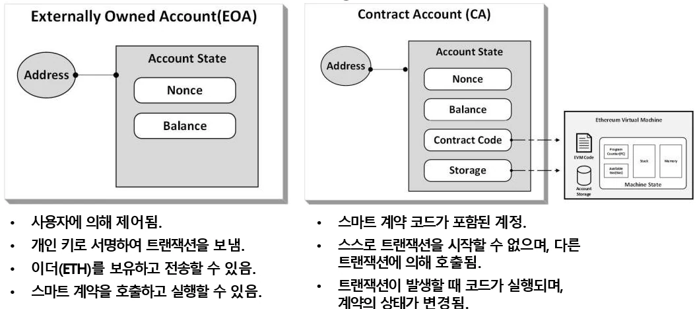

# [블록체인] 이더리움(Ethereum) 이란?

## 원문

https://ch010104.tistory.com/26

## 노트 유형

`concept`

## 핵심 개념과 선택 맥락

창시자: 비탈릭 부테린 (Vitalik Buterin), 2013년 백서 발표 → 2015년 정식 런칭

정의: 스마트 계약(Smart Contract)을 실행할 수 있는 탈중앙화 블록체인 플랫폼

## 원문 기반 개념 정리

### 1. 이더리움이란?

창시자: 비탈릭 부테린 (Vitalik Buterin), 2013년 백서 발표 → 2015년 정식 런칭

정의: 스마트 계약(Smart Contract)을 실행할 수 있는 탈중앙화 블록체인 플랫폼

주요 목적: 디지털 화폐를 넘어서 탈중앙 애플리케이션(DApp), NFT, DeFi까지 확장

### 2. 비트코인 VS 이더리움

### 3. 이더라움의 주요 구성 요소

### 1) 이더리움 블록체인

스마트 컨트랙트의 개발 및 실행이 가능한 분산형 오픈소스 플랫폼

트랜잭션을 기록하고 검증하는 분산 원장 시스템으로 데이터 불변성과 투명성 보장

다수의 노드로 구성된 탈중앙 네트워크가 무결성과 안정성을 유지

### 2) Ether (ETH)

이더리움 네트워크의 기본 암호화폐

가치 교환 수단이자, **스마트 계약 실행 수수료(GAS)**로 사용

투자 자산, DeFi, NFT, DAO, DApp 등 다양한 탈중앙화 서비스에서 활용

### 3) 스마트 컨트랙트 (Smart Contract)

조건이 충족되면 자동으로 실행되는 코드

솔리디티(Solidity) 언어로 개발

EVM 상에서 실행되며, 계약 실행 시 GAS 소비

디앱(DApp)의 핵심 기능 구현에 필수

### 4) EVM (Ethereum Virtual Machine)

스마트 컨트랙트를 실행하는 가상 머신 환경(즉, 가상의 컴퓨터)

물리적 하드웨어에 의존하지 않고, 소프트웨어로 구현된 추상적인 기계

블록체인 내 모든 노드가 동일한 EVM을 실행해 결과를 동기화

개발자는 중앙 서버 없이 스마트 계약을 배포하고 자동 실행 가능

EVM에서 이더리움 가스 시스템은 각 트랜잭션에 대한 처리에 GAS를 지불하도록 보장함.

### 5) GAS (가스)

이더리움 네트워크에서 연산 및 저장 자원 사용량을 측정하는 단위

트랜잭션/스마트 계약 실행 시 GAS 소모

사용자가 **가스 한도(Gas Limit)**와 **가스 가격(Gas Price)**을 설정

가스 설정이 너무 낮으면 거래 실패, 너무 높으면 낭비 발생 가능

### 6) 합의 알고리즘 (Consensus Mechanism)

🔁 PoS는 보안성, 에너지 효율, 확장성 측면에서 더 진보된 모델로 평가됨.

PoS에서 참여자는 자신이 보유하고 있는 이더리움의 양이 많을수록 검증자로서 참여할 수 있는 가능성이 높아짐.

### 7) EIPs (Ethereum Improvement Proposals)

이더리움 개선 제안서

이더리움의 업그레이드 및 기능 제안을 위한 표준 문서 형식

분산형 거버넌스를 통해 토론, 합의, 구현

예시:

EIP-20: ERC-20 토큰 표준

EIP-1559: 가스비 소각 메커니즘 도입 (fee burn)

### 8) 계정 유형

이더리움에서 자산(ETH)을 보유, 트랜잭션 생성, 스마트 계약 실행 등을 가능하게 하는 핵심 단위

이더리움 네트워크 상의 모든 활동은 계정을 통해 이루어짐

### 4. 스마트 계약 & 가스 (GAS)

스마트 계약: 조건이 충족되면 자동 실행되는 코드 (Solidity 언어로 작성)

가스(Gas): 트랜잭션 또는 스마트 계약 실행 시 소모되는 연산 비용 - 즉, 트랜잭션 또는 스마트 계약 실행 시에 비용이 발생함 -> 스팸 방지 및 효율성 유지

가스비 = 가스 사용량 × 가스 가격(GWei)

### 5. 합의 알고리즘 전환: PoW → PoS

🔄 The Merge(이더리움1.0 -> 이더리움 2.0)

2022년, 작업증명(PoW) → 지분증명(PoS) 전환

Beacon Chain: 새로운 합의 계층 (검증자 기반 블록 생성)

장점: 전력 소모 절감, 보안 향상, 블록 생성 속도 개선

이더리움의 노드가 합의 클라이언트와 실행 클라이언트로 나뉨. - 합의 클라이언트: PoS 합의를 담당하며, 블록 검증 및 생성과 관련된 작업을 처리. - 실행 클라이언트: 스마트 계약 실행, 트랜잭션 처리 및 상태 관리와 같은 작업을 수행.

Merge 이후에 이더리움은 두 클라이언트 간의 Engine Api를 통해 상호작용함.

### 6. 생태계 확장

💡 주요 활용 분야

NFT: 디지털 예술, 소유권 토큰화

DeFi: 탈중앙화 금융 서비스 (Aave, Uniswap 등)

게임/메타버스: Play-to-Earn (예: Axie Infinity)

스테이블코인, 결제 시스템

💸 수익성

2021년 창작자 수익: 약 4.5조 원

하루 평균 수수료 수익 업계 1위

### 7. 이더리움 통계 (2025년 기준)

### 8. 이더리움 로드맵

▶ 주요 단계별 발전 계획

### 9. EVM vs Non-EVM 블록체인

블록체인은 스마트 계약을 어떻게 실행하느냐에 따라 두 가지 유형으로 나뉨.

1) EVM 블록체인

EVM = 이더리움 스마트 계약이 실행되는 표준 가상 머신

Solidity, Vyper 언어로 작성된 스마트 컨트랙트 실행 가능

이더리움 기반 DApp과의 높은 호환성

개발자 친화적인 도구 지원:

MetaMask (지갑)

Hardhat, Truffle (개발 프레임워크)

Remix (온라인 IDE)

장점

이더리움과 코드 호환성 유지

다양한 체인 간 크로스체인 기능 가능

빠른 생태계 확장, 유저 및 개발자 수 많음

대표 EVM 블록체인

Ethereum

BNB Smart Chain

Polygon

Avalanche C-Chain

Fantom, Optimism, Arbitrum 등

2) Non-EVM 블록체인

EVM이 아닌 고유 실행 환경과 언어를 사용하는 블록체인

자체 스마트 계약 언어 사용:

Rust (Solana, NEAR)

Move (Aptos, Sui)

Clarity (Stacks) 등

EVM 기반 DApp과 직접 호환 불가

네트워크 구조, 합의 알고리즘도 이더리움과 완전히 다름

장점

독립적인 구조로 확장성이 좋음

더 높은 TPS로 더 빠른 속도

단점

호환성이 나쁨, 생태계가 적음

대표 Non-EVM 블록체인

Solana

NEAR

Algorand

Aptos

Sui

Stacks (Bitcoin L2) 등

3) EVM - EVM vs. Non-EVM

EVM간의 상호 운용은 잘 됨. 하지만, EVM과 Non-EVM간의 상호 운용성은 증가하고 있음.

EVM은 Solidity로 작성된 코드를 다른 EVM 체인에서도 재사용 가능하는 등 개발자 친화적임. 또한, 호환 및 연동이 쉬움

Non-EVM은 빠른 속도로 처리가 가능하고 높은 확장성을 가지지만, 독립적인 생태계 운영으로 인해 호환이 어려움.

높은 확장성이나 독자적인 스마트 컨트렉트 환경이 필요할 시에 Non-EVM을 사용하는 것이 좋음.

개발자 친화성과 높은 호환성을 고려하면 EVM을 사용하는 것이 좋음.

### 10. 이더리움의 자산 성격

모든 자산은 자본 자산(Capital Asset), 원자재(Commodity), 가치 저장 수단(Store of Value) 세가지 그룹으로 구분 가능

## 핵심 이미지

## 관련 글

- [[blog/BLOCKCHAIN/index|BLOCKCHAIN]]
- [[blog/BLOCKCHAIN/블록체인- 비트코인(Bitcoin) 이란|[블록체인] 비트코인(Bitcoin) 이란?]]
- [[blog/BLOCKCHAIN/블록체인- 암호화 기술과 스마트 계약(Smart Contact)이란|[블록체인] 암호화 기술과 스마트 계약(Smart Contact)이란?]]
- [[blog/BLOCKCHAIN/블록체인- 블록체인 기술 설계 및 고려사항|[블록체인] 블록체인 기술 설계 및 고려사항]]
