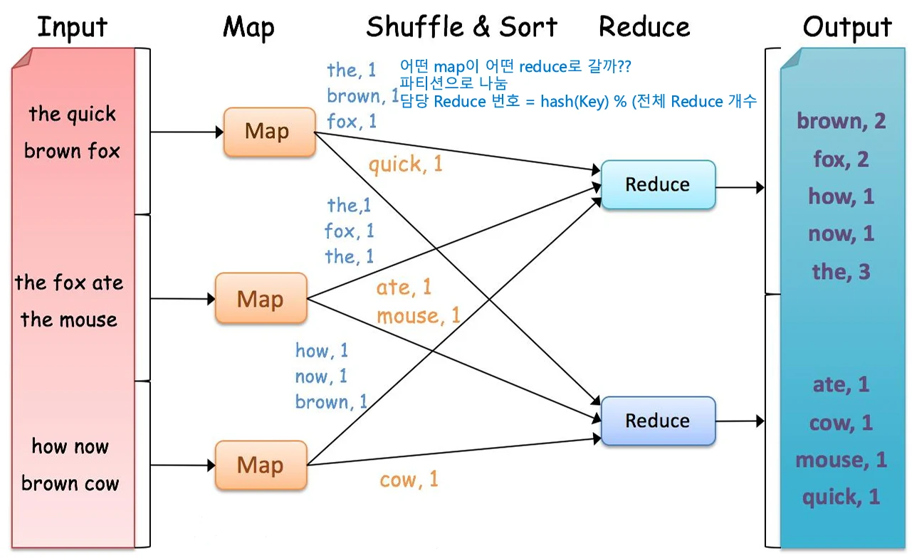
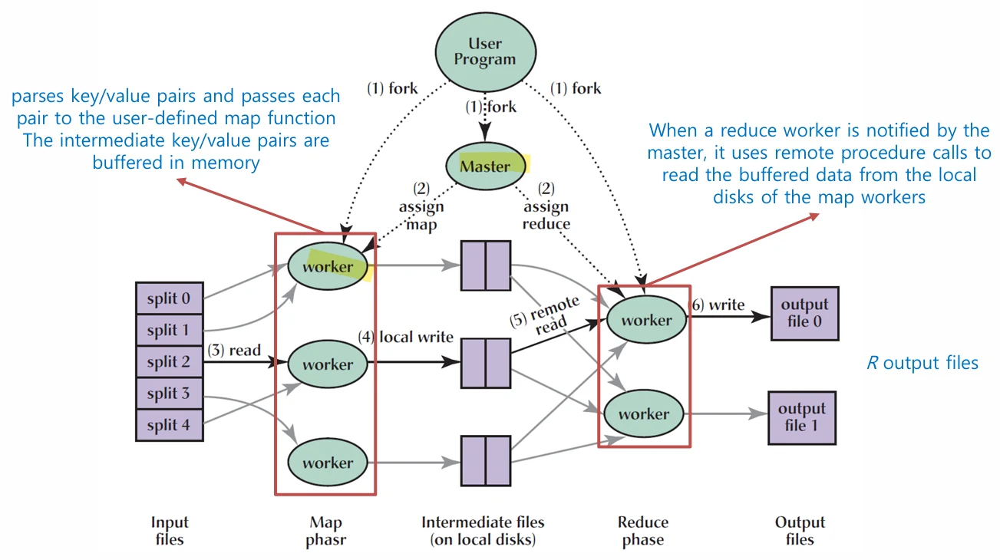
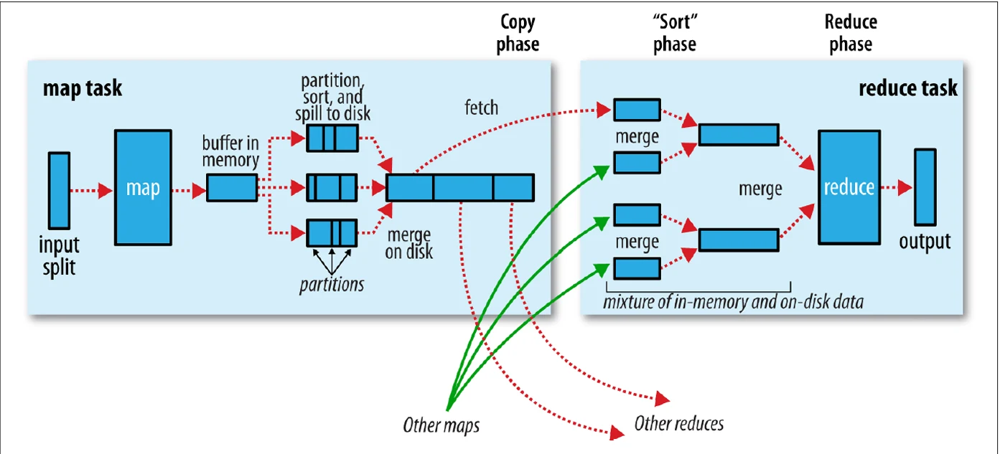

# [클라우드 컴퓨터링] Haddop의 데이터 처리를 위한 MapReduce

## 원문

https://ch010104.tistory.com/160

## 노트 유형

`concept`

## 핵심 개념과 선택 맥락

Hadoop = 대규모 데이터를 저장(HDFS) + 처리(MapReduce) 하는 오픈소스 프레임워크

HDFS(Hadoop Distributed File System): 데이터를 여러 컴퓨터에 분산 저장

## 원문 기반 개념 정리

### 1. Hadoop의 개념과 구조

Hadoop = 대규모 데이터를 저장(HDFS) + 처리(MapReduce) 하는 오픈소스 프레임워크

HDFS(Hadoop Distributed File System): 데이터를 여러 컴퓨터에 분산 저장

MapReduce: 분산된 데이터를 병렬로 계산·분석

여러 대의 일반적인 하드웨어(commodity hardware) 를 묶어 거대한 데이터 처리 시스템처럼 동작

“Store once, process anywhere” 개념 — 데이터를 여러 서버에 저장 후, 계산 작업을 데이터가 있는 곳으로 전송

### 2. MapReduce의 등장 배경

Google은 과거 수백 개의 맞춤형 분산 계산 프로그램을 사용

예: 검색 인덱스 생성, 웹 그래프 구조 분석, 인기 쿼리 요약 등

각 프로그램의 특징

연산 자체는 단순

입력 데이터가 매우 큼

분산 처리가 필수

문제점

Fault tolerance, load balancing, 병렬화, 데이터 이동 등 매번 복잡한 분산 로직을 새로 구현해야 했음

해결책

공통 패턴을 일반화한 MapReduce 모델을 제시

사용자는 map/reduce 함수만 정의 → 나머지 분산 제어는 시스템이 자동 수행

### 3. MapReduce의 개념적 모델

입력/출력 구조: (Key, Value) 쌍

Map 단계:

입력 데이터를 한 줄씩 읽어 (key, value) 형태의 중간 결과 생성

예: “the cat” → ("the", 1), ("cat", 1)

Shuffle 단계:

동일한 key를 가진 모든 value를 모아 정렬

ex) ("the", [1,1,1])

Reduce 단계:

같은 key 그룹의 value들을 집계

ex) ("the", [1,1,1]) → ("the", 3)

결과: 새로운 (Key, Value) 쌍의 집합

핵심 특징: map은 분류·가공, reduce는 집계·요약

### 4. 예시 – WordCount

가장 대표적인 MapReduce 프로그램

Map: 입력 문장 → (단어, 1) 쌍 출력

Shuffle: 동일 단어끼리 묶기 ("cat", [1,1,1])

Reduce: 빈도 합산 ("cat", 3)

Reduce 개수: 사용자가 직접 지정(개발자)

Map 개수: 입력 데이터 크기에 비례 → 자동 결정

장점:

입력 데이터 크기가 커져도 안정적으로 확장됨 (Scalability)

일부 Map이 실패해도 자동 재시작

Key → Reduce 매핑은 hash(key) % R 공식 사용 - 해쉬 함수

### 5. 실행 구조 (Execution Architecture)

전체 구성: Master + 여러 Worker

Master = Job 관리 (스케줄링, 모니터링)

Worker = 실제 Map/Reduce 실행

Map 단계:

입력 데이터를 자동으로 M개의 split으로 분할

각 split은 서로 다른 worker에서 병렬로 실행

Map의 결과는 메모리에 버퍼링 후 로컬 디스크에 저장

이후 partition function을 통해 R개의 영역으로 나누어 정렬 (각 영역 = Reduce 대상)

Reduce 단계:

Reduce worker가 RPC로 각 Map worker의 중간 데이터를 원격으로 읽어옴

정렬(shuffle & sort) 후 reduce 함수 실행

결과는 HDFS에 최종 저장

출력: Reduce 수만큼의 output 파일 생성

→ Master-Worker 구조, Map과 Reduce가 파이프라인 형태로 동작 → Map이 끝나야 Reduce 시작 가능

### 6. 작업 스케줄링 & 병렬성

Map 작업은 입력 데이터를 M개의 split으로 자동 분할

Split 크기 = 보통 HDFS 블록 크기(64MB 또는 128MB)

각 split이 한 개의 map task에 대응

Reduce 작업은 중간 key 공간을 R개의 조각으로 분할

클러스터 내 여러 노드에서 병렬 실행

Master는 데이터가 저장된 위치에 가까운 노드에서 작업을 실행하려 시도 (Data Locality)

### 7. 데이터 지역성 (Data Locality)

네트워크 대역폭은 한정 → 데이터 이동보다 계산 이동이 효율적

Master는 map task를 데이터가 실제 저장된 노드 또는 가까운 노드에 할당

데이터가 동일 노드에 있을 때 = Data-local

같은 Rack에 있을 때 = Rack-local

다른 Rack에 있을 때 = Off-rack

MapReduce는 가능한 한 Data-local 작업을 우선 배정

### 8. 장애 내성 (Fault Tolerance)

Master는 모든 Worker에 주기적으로 Ping(Heartbeat) 전송

응답이 없으면 해당 Worker를 “실패”로 간주

Map 실패 시:

중간 결과가 로컬 디스크에 저장되어 사라지므로, 해당 map task를 다른 노드에서 다시 실행

Reduce 실패 시:

최종 결과는 HDFS(글로벌 파일시스템)에 저장 → 다시 수행할 필요 없음

장애 복구 시나리오:

네트워크 유지보수 등으로 수십~수백 대 노드가 몇 분간 다운돼도

실패한 노드의 작업만 자동 재시작하여 전체 Job은 계속 진행

중복 실행 (Speculative Execution):

느린 Map이 있으면 다른 노드에서 동일 작업을 하나 더 실행

먼저 끝난 결과를 채택

전체 Job 속도를 늦추는 병목 노드 최소화

→ MapReduce는 대규모 장애에도 중단 없이 자동 복구 → Map은 언제든 다시 시작 가능, Reduce는 HDFS 덕에 안정적

### 9. Shuffle & Sort

Map 결과(key/value 쌍)는 reduce 전 단계에서 key 기준으로 정렬

같은 key를 가진 데이터는 하나의 reduce로 전달

이 과정을 Shuffle(재분배) + Sort(정렬) 라고 부름

MapReduce의 핵심 병목이지만 자동 처리됨

### 10. 핵심 철학

사용자는 map()과 reduce() 함수만 작성

나머지: 입력 분할, 데이터 이동, 네트워크 통신, 복제, 장애 복구, 로드 밸런싱 등은 프레임워크가 자동 처리

대규모 분산 환경에서도 단일 프로그램처럼 동작

## 관련 글

- [[blog/CLAUD COMPUTERING/index|CLAUD COMPUTERING]]
- [[blog/CLAUD COMPUTERING/클라우드 컴퓨터링- MapReduce 데이터 관리|[클라우드 컴퓨터링] MapReduce 데이터 관리]]
- [[blog/CLAUD COMPUTERING/클라우드 컴퓨터링- MapReduce 데이터 흐름과 API|[클라우드 컴퓨터링] MapReduce 데이터 흐름과 API]]
- [[blog/CLAUD COMPUTERING/클라우드 컴퓨터링- MapReduce vs. 병렬 데이터베이스|[클라우드 컴퓨터링] MapReduce vs. 병렬 데이터베이스]]
