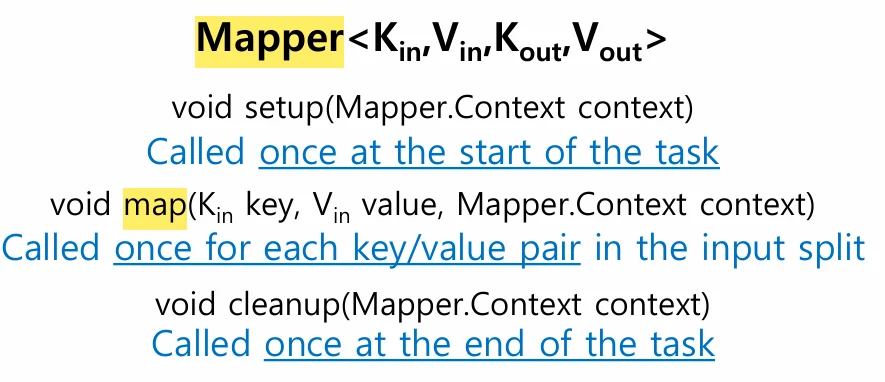
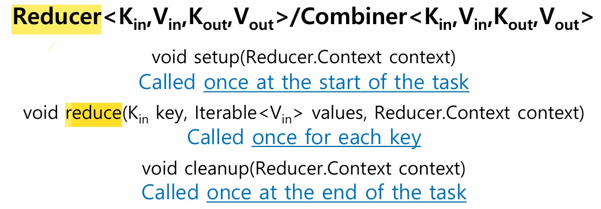
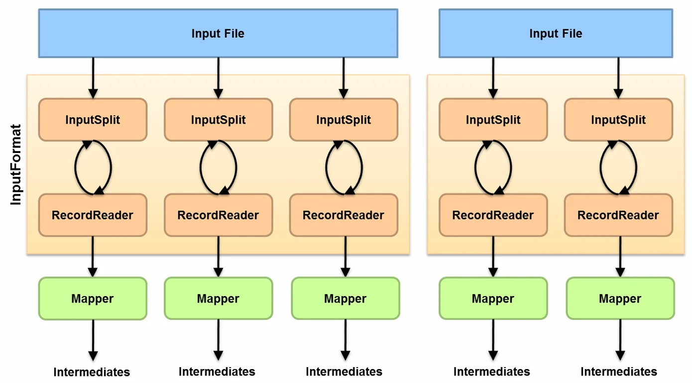

# [클라우드 컴퓨터링] MapReduce 데이터 흐름과 API

## 원문

https://ch010104.tistory.com/168

## 노트 유형

`guide`

## 적용 목적과 전제조건

모든 맵(map) 태스크의 정렬된(sort) 출력은 복사(copy)되어 단일 병합(merge) 단계를 거침.

최종 출력 파일은 하나(part 0)이며 HDFS에 복제되어 저장됨.

## 구현 절차·검증·주의점

### MapReduce 데이터 흐름

단일 리듀스 태스크(Single Reduce Task)

모든 맵(map) 태스크의 정렬된(sort) 출력은 복사(copy)되어 단일 병합(merge) 단계를 거침.

이후 하나의 리듀스(reduce) 태스크에 의해 처리됨.

최종 출력 파일은 하나(part 0)이며 HDFS에 복제되어 저장됨.

다중 리듀스 태스크(Multiple Reduce Tasks)

맵 태스크의 출력은 키(key)에 따라 파티셔닝되어 여러 리듀서로 분산됨.

각 리듀스 태스크는 자신에게 할당된 파티션의 데이터를 개별적으로 병합(merge)하여 처리함.

리듀서 개수만큼 출력 파일(part 0, part 1 등)이 생성되며, HDFS에 복제됨.

리듀스 태스크 없음 (Map-Only Job)

맵 태스크가 출력을 HDFS에 직접 씀.

정렬, 복사, 병합, 리듀스 단계가 없음.

맵 태스크 수만큼의 출력 파일(part 0, part 1, part 2 등)이 생성되어 HDFS에 복제됨

### MapReduce API

Mapper 클래스

setup(): 태스크 시작 시 1회 호출됨.

map(): 입력 스플릿(input split)의 각 레코드(키/값 쌍)마다 1회 호출됨.

cleanup(): 태스크 종료 시 1회 호출됨.

Reducer 클래스 (Combiner도 유사)

setup(): 태스크 시작 시 1회 호출됨.

reduce(): 맵 출력에서 정렬된 고유 키(key)마다 1회 호출됨.

cleanup(): 태스크 종료 시 1회 호출됨.

Partitioner 클래스

getPartition() 메서드를 통해 맵의 중간 키/값 쌍을 어떤 리듀서로 보낼지 결정함.

기본적으로는 해시 함수를 사용하며, 사용자가 특정 로직으로 커스터마이징 가능함.

Job 객체

클러스터에 제출할 작업을 패키징하는 역할을 함.

입출력 경로, 입출력 포맷, 매퍼/리듀서/파티셔너 클래스, 중간/최종 키/값 클래스, 리듀서 개수 등을 지정해야 함.

### 작업(Job) 및 매퍼(Mapper) 구성

v

매퍼 개수 결정

매퍼의 수는 사용자가 직접 지정하지 않음.

입력 데이터의 총 크기와 HDFS 블록 크기에 따라 결정되는 입력 스플릿(Input Split)의 개수에 의해 정해짐.

병렬 수준

Hadoop은 노드(컴퓨터)당 10~100개의 맵을 처리하는 것을 적정 병렬 수준으로 봄.

예: 10TB의 입력 데이터와 128MB의 블록 크기를 가질 경우, 약 82,000개의 맵이 생성될 수 있음.

한 번에 너무 많은 맵이나 리듀서를 실행하면 노드의 CPU, RAM 등 한정된 자원이 고갈될 수 있음.

### 작업(Job) 분석 및 실행

작업(Job) 및 태스크(Task)

Hadoop MapReduce 프로그램은 하나의 Job임.

Job은 여러 맵 태스크와 리듀스 태스크로 나뉨.

Task attempt는 실행 중인 태스크의 인스턴스를 의미하며 , Tasktracker의 가용 slot을 차지함.

작업 제출 (Job Submission)

클라이언트(사용자)가 Job을 생성, 구성하고 Jobtracker에게 제출함.

Jobtracker는 노드가 가득 찼을 경우, 데이터 복제본이 있는 다른 노드(가급적 가까운)에서 작업을 처리하도록 스케줄링함.

작업 실행 흐름 (Behind the Scenes)

클라이언트 측에서 입력 스플릿(Input split)을 계산함.

Job 데이터(JAR 파일, 설정 XML)를 Jobtracker에게 전송함.

Jobtracker는 Job 데이터를 공유 위치에 저장하고, 태스크를 작업 대기열(queue)에 등록함.

Tasktracker(일꾼 노드)들이 Jobtracker(대장 노드)에게 주기적으로 작업을 요청(poll)하여 할당받고 실행함.

### Hadoop 작업 실행 상세

InputFormat (입력 단계)

입력 파일(Input File)을 InputSplit 단위로 나눔.

RecordReader가 InputSplit에서 실제 데이터를 레코드(키/값 쌍) 단위로 읽어 Mapper에게 전달함.

Partitioner (중간 단계)

Mapper가 생성한 중간 결과(Intermediates)를 받음.

키(key)를 기준으로 어떤 Reducer로 데이터를 보낼지 결정하고 전송(셔플링)함.

OutputFormat (출력 단계)

Reducer의 최종 결과를 RecordWriter가 받음.

RecordWriter는 이 데이터를 최종 Output File에 씀.

출력 파일은 리듀서(Reducer)마다 하나씩 생성됨.

### 맵리듀스(MapReduce) 날씨 데이터셋 사례 연구

맵리듀스(MapReduce) 개요

맵리듀스는 데이터 처리를 위한 프로그래밍 모델임.

본질적으로 병렬 처리에 적합하며, 특히 대용량 데이터셋 분석 시 진가를 발휘함.

Java, Python, Ruby 등 다양한 언어를 지원하지만, Java의 비중이 큼.

분석 대상: NCDC 날씨 데이터셋

전 세계 기상 센서가 매시간 수집하는 대규모 로그 데이터로, 맵리듀스 분석에 적합함.

데이터는 라인(line) 기반의 ASCII 텍스트 형식임.

분석 예제에서는 기온과 같은 기본 요소에 초점을 맞춤.

데이터는 연도별(1901-2001) 디렉터리 안에 관측소별 압축 파일(.gz)로 나뉘어 저장됨.

이 방식은 '대량의 작은 파일' 문제를 야기하므로 , 분석 편의를 위해 연도별로 데이터를 병합(Concatenate)하는 전처리를 수행함.

전통적인 분석 방식 (Unix 도구)

분석 목표: "연도별 최고 기온" 찾기.

실행: awk를 사용한 쉘 스크립트로 각 연도별 압축 파일을 순회하며 처리함 .

로직:

awk가 각 라인에서 기온(위치 88-92)과 품질 코드(위치 93)를 추출함 .

기온이 9999(결측치)가 아니고 품질 코드가 유효([01459])한 경우에만 최대 기온을 갱신함 .

한계:

성능: 단일 머신에서 전체 데이터를 처리하는 데 42분이 소요됨 (특정 EC2 인스턴스 기준).

병렬화 (연도별): 연도별로 스레드를 분리하면, 연도별 데이터(파일) 크기가 달라 일부 스레드가 먼저 종료되는 '로드 밸런싱' 문제가 발생함.

병렬화 (청크별): 데이터를 고정 크기 청크(chunk)로 나누는 것이 더 낫지만 , 특정 연도 데이터가 여러 청크에 나뉘어 저장될 수 있어 결과 취합을 위한 추가 처리가 필요함.

확장성: 다중 머신을 사용하면 작업 조정(Coordination) 및 안정성(Reliability) 문제가 복잡해짐.

### Hadoop MapReduce를 이용한 분석

맵리듀스(MapReduce) 접근 방식

입력: 텍스트 입력 포맷을 사용하며, 각 라인이 하나의 레코드가 됨.

입력 키/값:

Key: LongWritable (파일 시작점부터의 바이트 오프셋). 실제 로직에서는 무시됨.

Value: Text (데이터 한 줄).

Map 단계 (데이터 준비 및 필터링)

Map 함수는 데이터를 전처리하고 유효하지 않은 레코드를 필터링하는 역할을 함.

Value(데이터 한 줄)에서 '연도'와 '기온'을 추출함.

출력 키/값: (Key: 연도, Value: 기온)의 형태로 출력(emit)함.

(예: (1950, 0), (1950, 22), (1949, 111)) .

Shuffle & Sort 단계

Map 단계의 출력이 키(연도)를 기준으로 자동 정렬되고 그룹화됨.

(예: (1949, [111, 78]), (1950, [0, 22, -11])).

Reduce 단계 (최종 집계)

Reduce 함수는 키(연도)와 해당 키에 대한 값 목록(기온 리스트)을 입력받음.

값 목록을 순회하며 최대값을 찾음.

출력 키/값: (Key: 연도, Value: 최대 기온)을 HDFS에 저장함.

(예: (1949, 111), (1950, 22)).

### Java MapReduce 구현 코드

Hadoop 전용 데이터 타입

Hadoop은 네트워크 직렬화에 최적화된 자체 기본 타입(Writable)을 사용함 (예: LongWritable, Text, IntWritable).

이는 Java의 기본 직렬화보다 가볍고 빠름.

MaxTemperatureMapper (Mapper 클래스)

Mapper<LongWritable, Text, Text, IntWritable>를 상속.

연도: line.substring(15, 19)

기온: line.substring(87, 92) (앞에 붙은 '+' 기호 처리 포함 )

품질 코드: line.substring(92, 93)

map() 메서드는 value.toString()으로 라인을 가져온 뒤, substring()을 사용해 데이터를 추출함.

기온이 9999가 아니고 품질 코드가 유효한지(matches("[01459]")) 검사함.

context.write(new Text(year), new IntWritable(airTemperature))를 호출해 중간 결과를 출력함.

MaxTemperatureReducer (Reducer 클래스)

Reducer<Text, IntWritable, Text, IntWritable>를 상속.

reduce() 메서드는 키(연도)와 Iterable<IntWritable> values(해당 연도의 모든 기온 리스트)를 입력받음.

for 루프를 돌며 Math.max()를 이용해 maxValue를 찾음.

context.write(key, new IntWritable(maxValue))를 호출해 최종 결과를 출력함.

MaxTemperature (Driver 클래스)

main 메서드에서 Job 객체를 생성하여 MapReduce 작업을 설정하고 실행함.

job.setMapperClass()와 job.setReducerClass()로 매퍼와 리듀서를 지정함.

FileInputFormat.addInputPath()와 FileOutputFormat.setOutputPath()로 입출력 경로를 설정함.

job.setOutputKeyClass()와 job.setOutputValueClass()로 최종 출력 형식을 지정함.

job.waitForCompletion(true)를 호출해 작업을 제출하고 완료될 때까지 대기함.

맵/리듀서에 매개변수 전달하기

설정 (Driver): Configuration 객체를 생성하고 conf.set("key", "value")로 값을 설정한 뒤, 이 conf 객체로 new Job(conf)를 생성함.

조회 (Mapper/Reducer): map() 또는 reduce() 메서드 내부에서 context.getConfiguration()을 호출하여 Configuration을 가져온 뒤, conf.get("key")로 값을 읽어옴.

## 핵심 이미지

## 관련 글

- [[blog/CLAUD COMPUTERING/index|CLAUD COMPUTERING]]
- [[blog/CLAUD COMPUTERING/클라우드 컴퓨터링- MapReduce 데이터 관리|[클라우드 컴퓨터링] MapReduce 데이터 관리]]
- [[blog/CLAUD COMPUTERING/클라우드 컴퓨터링- Haddop의 데이터 처리를 위한 MapReduce|[클라우드 컴퓨터링] Haddop의 데이터 처리를 위한 MapReduce]]
- [[blog/CLAUD COMPUTERING/클라우드 컴퓨터링- MapReduce vs. 병렬 데이터베이스|[클라우드 컴퓨터링] MapReduce vs. 병렬 데이터베이스]]
