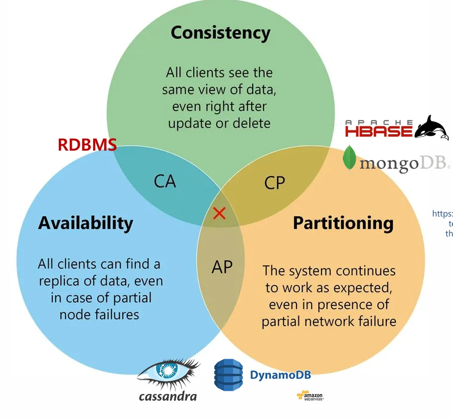
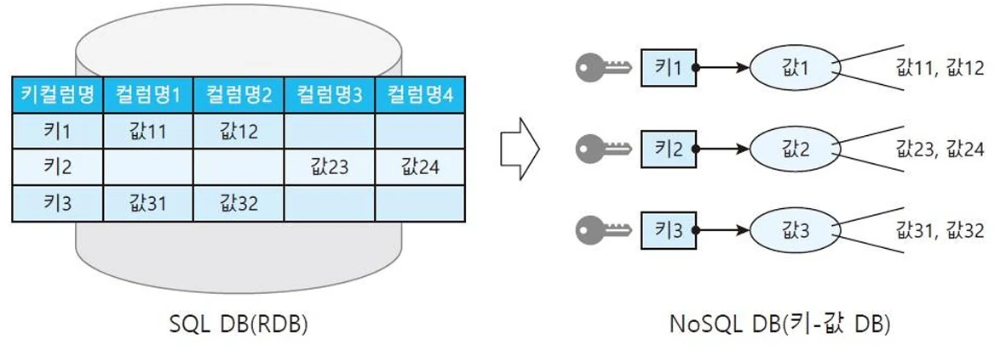
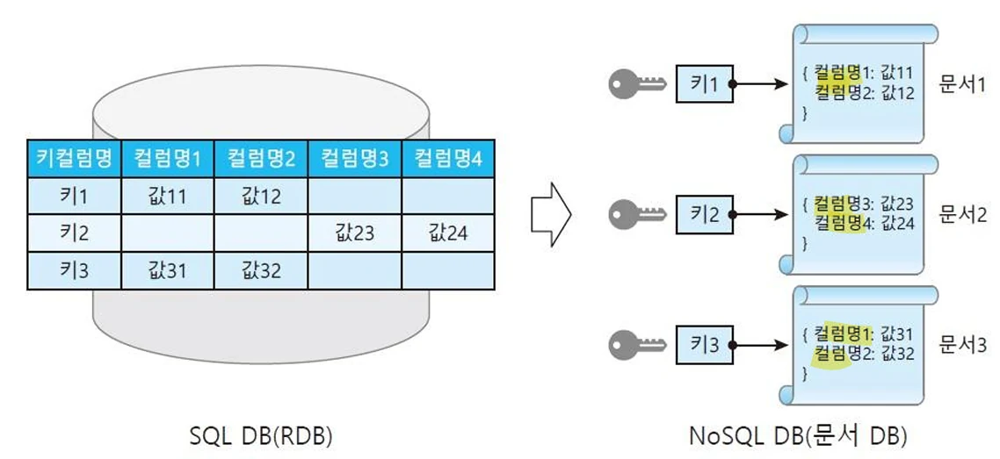

# [클라우드 컴퓨터링] NOSQL 데이터베이스

## 원문

https://ch010104.tistory.com/182

## 노트 유형

`guide`

## 적용 목적과 전제조건

NoSQL의 정의 및 특징: 관계형 모델이나 SQL 언어를 사용하지 않는 데이터베이스 기술. 대규모 클러스터에서 실행되도록 설계되어 수평적 확장이 가능함.

스키마리스(No Schema): 필드(속성)를 자유롭게 레코드에 추가할 수 있음.

## 구현 절차·검증·주의점

NoSQL의 정의 및 특징: 관계형 모델이나 SQL 언어를 사용하지 않는 데이터베이스 기술. 대규모 클러스터에서 실행되도록 설계되어 수평적 확장이 가능함.

스키마리스(No Schema): 필드(속성)를 자유롭게 레코드에 추가할 수 있음.

오픈 소스: 일반적으로 오픈 소스 기반으로 제공됨.

일관성: 보통 최종 일관성(Eventually Consistent)을 가짐 (ACID를 따르지 않음). 일관성을 포기하는 대신 확장성을 얻음.

기타 특징: 쉬운 복제 지원 (장애 허용, 쿼리 효율성), 단순한 API 제공.

CAP 이론 (CAP Theory): - 일관성(Consistency), 가용성(Availability), 분할 내성(Partitioning) 세 가지를 모두 가질 수 있는 데이터베이스는 없음.

일관성 (Consistency): 모든 클라이언트가 업데이트/삭제 직후에도 동일한 데이터 뷰를 봄. (예: RDBMS - CA) .

가용성 (Availability): 부분적인 노드 장애 시에도 클라이언트가 데이터 복제본을 찾을 수 있고, 서비스 중단 없이 시스템이 작동함. (예: DynamoDB, MongoDB - AP) .

분할 내성 (Partitioning): 부분적인 네트워크 장애 시에도 시스템이 예상대로 계속 작동함. (예: Cassandra - CP) .

NoSQL의 과제 (Challenges):

기술 성숙도: RDBMS에 비해 기술 성숙도가 낮음.

사용자 지원: Oracle과 같은 전문적인 지원이 부족함.

운영 및 관리: 대규모 분산으로 인해 고급 관리가 필요함.

데이터 접근 표준: RDBMS의 SQL과 달리 표준이 다양함.

전문가 부족: NoSQL 기술 전문가가 부족함.

NoSQL의 역할

주요 데이터베이스로 사용되기도 하며, 특정 데이터 처리를 위한 보조 데이터베이스로 자주 활용됨.

Polyglot Persistence (다중 저장소 아키텍처): 다양한 상황에서 다른 데이터 저장소를 사용하는 방식이 대세. RDBMS는 구조화된 데이터에 이상적이며 여전히 중요한 옵션임.

### NoSQL 데이터 모델 유형

키 - 값 데이터베이스 (Key-Value Stores)

특징: NoSQL 중 가장 단순한 형태. 모든 데이터를 **키(Key)**와 **값(Value)**의 쌍으로 저장.

장점: 데이터 분할 및 다른 DB로는 불가능한 수준의 수평 확장이 가능함.

단점: 특정 키 검색에 효율적이나, 데이터 정렬, 그룹화, 범위 검색 등이 어려움.

예시: DynamoDB, Redis, Memcached, RocksDB

문서 데이터베이스 (Document Databases)

특징: 키-값 DB의 발전된 형태. '키-문서' 형태로 저장하며, 각 **문서(Document)**는 속성과 데이터를 가지는 반구조적(semi-structured) 데이터로 하나의 단위로 취급됨 (JSON, XML 형태).

장점: 스키마가 자주 바뀌거나 데이터가 복잡한 계층 구조를 가질 경우, 또는 문서 자체의 검색 및 변경이 많을 때 효과적. 스키마를 다시 고칠 필요 없이 컬럼을 맞출 필요가 없음.

인기: NoSQL 유형 중 가장 인기 있음.

예시: MongoDB, CouchDB, RavenDB, OrientDB.

컬럼 패밀리 데이터베이스 (Column-family Stores)

특징: 구조가 복잡하며, 관계형 DB와 비슷하지만 컬럼 단위로 묶어 저장하는 컬럼-지향(column-oriented) 데이터베이스.

구조: 연관된 컬럼의 그룹인 **'컬럼 패밀리'**가 하나의 객체를 표현함. 미리 정의된 고정 스키마를 사용하지 않아 컬럼을 자유롭게 추가할 수 있음.

장점: 하나의 행에 많은 컬럼을 포함할 수 있어 유연성이 높고, 분산 저장 및 확장이 가능하여 빅데이터에 유리함.

예시: Cassandra, Apache HBase, Google Big Table

그래프 데이터베이스 (Graph Databases)

특징: 데이터를 데이터 간의 관계와 함께 표현하는 특수 유형. 소셜미디어, 교통망 등 많은 객체 간의 연결을 표현하는 데 적합함.

요소:

노드 (Node): 객체를 표현하며 식별자와 객체 속성을 가짐.

링크/간선 (Link/Edge): 두 객체 사이의 연결 관계를 보여주며, 노드 간의 연관 속성을 저장함.

예시: Neo4j, Apache Giraph, OrientDB.

### RDBMS (Relational Database Management System)

RDBMS의 가치:

표준화된 데이터 모델과 잘 개발된 기술 (검색 인덱스, 쿼리 최적화 등).

우수한 동시성 제어 (ACID 트랜잭션: 원자성, 일관성, 고립성, 지속성).

오랜 기간 확립되어 익숙하고 성숙한 기술, 지원 체계.

빅데이터에 대한 RDBMS의 한계:

스키마: 사전에 정의된 스키마, 스키마 정규화(3NF, BCNF)를 따름. 현재의 데이터는 자연스럽게 유연함.

비효율성: 대용량 데이터에 비효율적이고 분산 환경에서 느림.

조인(Join) 연산이 비쌈.

분산 환경: 분산 애플리케이션용으로 설계되지 않았으며, 전체 트랜잭션(Full Transactions)이 분산 환경에서 매우 비효율적임.

### 페이스북 (Facebook) 사례 연구 (2016년 기준)

데이터 규모: 월간 활성 사용자 18.6억 명, 300PB의 사용자 데이터 저장.

활용 기술:

Apache Hadoop: 대용량 데이터에 효율적인 계산을 가능하게 하는 MapReduce의 오픈 소스 구현. 100PB가 넘는 단일 HDFS 클러스터에 사용.

Apache HBase: Hadoop 컬럼-패밀리 데이터베이스. 이메일, 인스턴트 메시징, SMS 등에 사용됨.

Memcached: 분산 키-값 저장소. Facebook 초기에 웹 서버와 MySQL 서버 간의 캐시로 사용됨.

Apache Giraph: 그래프 데이터베이스. Facebook 사용자 및 연결 관계를 매우 큰 그래프로 보고 분석 작업에 사용 (2013년부터, 수조 개의 간선).

RocksDB: 고성능 키-값 저장소. Facebook 내부에서 개발되어 현재 오픈 소스로 공개됨.

## 관련 글

- [[blog/CLAUD COMPUTERING/index|CLAUD COMPUTERING]]
- [[blog/CLAUD COMPUTERING/클라우드 컴퓨터링- MapReduce vs. 병렬 데이터베이스|[클라우드 컴퓨터링] MapReduce vs. 병렬 데이터베이스]]
- [[blog/CLAUD COMPUTERING/딥러닝- 텐서플로우의 GradientTape (자동 미분)|[딥러닝] 텐서플로우의 GradientTape (자동 미분)]]
- [[blog/CLAUD COMPUTERING/클라우드 컴퓨터링- MapReduce 데이터 흐름과 API|[클라우드 컴퓨터링] MapReduce 데이터 흐름과 API]]
