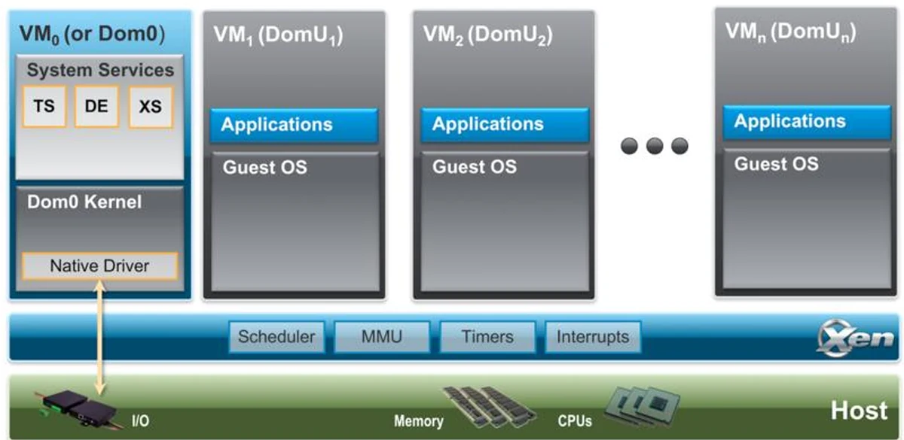
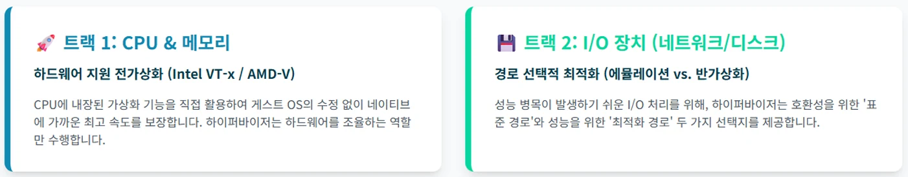
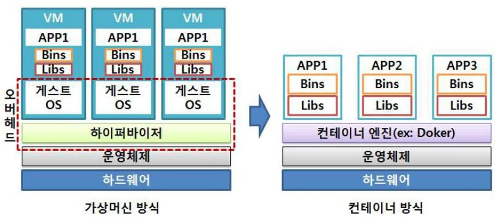

# [클라우드 컴퓨터링] 가상 머신(VM), 도커, 쿠버네티스 란?

## 원문

https://ch010104.tistory.com/138

## 노트 유형

`concept`

## 핵심 개념과 선택 맥락

- Xen은 하드웨어 위에 직접 설치되어 실행되는 Type-1(Bare-metal) 하이퍼바이저

- Xen은 CPU, 메모리, 인터럽트와 같은 핵심 자원만 관리하는 매우 가벼운 소프트웨어 계층으로 설계

## 원문 기반 개념 정리

### 1. 하이퍼바이저 심층 분석: Xen 아키텍처

- Xen은 하드웨어 위에 직접 설치되어 실행되는 Type-1(Bare-metal) 하이퍼바이저

- Xen은 CPU, 메모리, 인터럽트와 같은 핵심 자원만 관리하는 매우 가벼운 소프트웨어 계층으로 설계

Dom0와 DomU: 특별한 역할 분담

- Xen 아키텍처의 가장 큰 특징은 가상 머신(VM)을 두 종류로 나눈다는 점

Dom0 (Control Domain): - 시스템이 부팅될 때 자동으로 생성되는 유일하고 특별한 권한을 가진 가상 머신 - Dom0는 물리 하드웨어에 직접 접근할 수 있는 권한을 가지며, 시스템의 모든 I/O(네트워크, 스토리지 등) 기능을 전담하여 처리

DomU (Guest Domains): - Dom0를 제외한 모든 일반 가상 머신을 의미 - DomU는 하드웨어 제어 권한 없이 완벽하게 격리된 환경에서 실행 - 하이퍼바이저의 엄격한 통제하에 CPU와 메모리를 할당받아 사용하지만, I/O 장치에는 직접 접근할 수 없음

Xen의 I/O 처리 방식

- DomU가 파일 저장이나 네트워크 전송 같은 I/O 작업을 요청하면 다음과 같은 과정을 거침

DomU의 요청: DomU 내부의 가상 드라이버(Frontend Driver)가 하이퍼바이저에게 I/O 작업을 요청

Dom0에 전달: 하이퍼바이저는 이 요청을 받아 특권 가상 머신인 Dom0에게 전달

Dom0의 처리: Dom0는 실제 물리 장치 드라이버(Backend Driver)를 사용하여 하드웨어를 제어하고 요청된 작업을 수행

결과 반환: 작업이 완료되면 그 결과가 역순으로 DomU에게 전달

- 이러한 구조 덕분에 Xen 하이퍼바이저 자체는 매우 가볍게 유지되면서, I/O 관리는 Xen에 맞게 수정된 커널을 사용하는 Dom0에 위임하여 효율성을 높임

### 2. 하이브리드 전략

- 현대의 하이퍼바이저들은 성능을 극대화하기 위해 한 가지 방식만 고집하지 않고, 작업의 종류에 따라 최적의 기술을 선택하는 하이브리드 전략을 사용

CPU & 메모리 처리: - CPU에 내장된 가상화 지원 기능(Intel VT-x, AMD-V)을 직접 활용하는 하드웨어 지원 전가상화 방식을 사용 - 이를 통해 게스트 OS를 수정하지 않고도 네이티브에 가까운 최고 속도를 보장

I/O 장치 처리: - 성능 병목이 발생하기 쉬운 I/O 작업(네트워크, 디스크)은 반가상화(Paravirtualization) 방식을 통해 최적화 - 이는 게스트 OS가 자신이 가상 환경임을 인지하고, 전용 드라이버를 통해 하이퍼바이저와 직접 통신하여 처리 효율을 높이는 기술

- 현대 가상화 기술은 CPU/메모리는 하드웨어의 힘을 빌리고, I/O는 소프트웨어(전용 드라이버)를 통해 효율적으로 처리

### 3. 컨테이너 가상화와 Docker

- 가상 머신(VM)은 앱 하나를 실행하기 위해 매번 무거운 게스트 OS까지 설치해야 하는 오버헤드가 있음

- 컨테이너는 프로세스를 격리하는 방식으로, 하이퍼바이저와 게스트 OS 없이 애플리케이션을 실행

- 호스트 운영체제의 커널을 공유하기 때문에 기존 VM 방식에 비해 훨씬 가볍고 빠르게 동작

Docker와 Union File System

- Docker는 리눅스 컨테이너(LXC) 기술을 기반으로 하는 오픈소스 컨테이너 관리 플랫폼

- Docker의 핵심 기술 중 하나는 Union File System (UnionFS)

레이어 기반 구조: - Docker 이미지는 여러 개의 읽기 전용(Read-Only) 레이어로 구성 - 컨테이너가 실행될 때, 이 이미지 레이어 위에 변경 사항을 기록하기 위한 쓰기 가능(Writable) 레이어가 추가

Copy-on-Write (CoW): - 컨테이너가 이미지의 파일을 수정하려고 할 때, 원본 파일을 직접 바꾸는 대신 쓰기 가능 레이어로 복사(Copy)한 후 수정(Write) - 원본 이미지의 불변성이 유지

CoW 메커니즘은 데이터베이스처럼 쓰기 작업이 빈번한 워크로드에서는 파일 복사로 인한 오버헤드가 발생하여 성능 저하의 원인이 될 수 있음

해결책: Docker 볼륨(Volume)

- 볼륨은 UnionFS를 우회하여 컨테이너의 특정 경로를 호스트의 파일 시스템에 직접 연결

- 컨테이너가 삭제되어도 데이터가 보존되며, 네이티브에 가까운 I/O 성능을 얻을 수 있음

### 4. 대규모 컨테이너 관리(오케스트레이션과 쿠버네티스)

- 수백, 수천 개의 컨테이너를 수동으로 관리하는 것은 거의 불가능

-이러한 문제를 해결하기 위해 컨테이너 오케스트레이션 기술이 필

- 다수의 컨테이너를 자동으로 배포, 확장, 관리하는 것을 의미하며 서비스 탐색, 로드 밸런싱, 스케줄링 등의 기능을 포함

쿠버네티스(Kubernetes, K8s)

- 구글이 15년간 프로덕션 환경에서 워크로드를 운영한 경험을 바탕으로 만든, 표준 컨테이너 오케스트레이션 시스템

- 컨테이너화된 애플리케이션을 논리적 단위로 그룹화하여 쉽게 관리하고 발견할 수 있도록 함

쿠버네티스의 핵심 구성 요소

파드(Pod): 배포의 가장 작은 단위로, 하나 이상의 컨테이너를 포함하는 모듈러 주택과 같음

노드(Node): 파드가 실행되는 물리적 또는 가상의 서버로, 주택이 들어서는 땅에 해당.

서비스(Service): 여러 파드에 고정된 주소(IP)를 부여하여 외부 및 내부 통신을 가능하게 하는 도로명 주소와 같은 역할

디플로이먼트(Deployment): 원하는 수의 파드를 여러 노드에 걸쳐 배포하고 상태를 자동으로 유지하는 도시 개발 계획서

### 5. 컨테이너의 한계와 미래 기술

- 호스트 OS 커널을 공유하기 때문에 가상 머신에 비해 보안이나 안정성 측면에서 취약할 수 있다는 한계가 있음

- VM은 게스트 OS와 호스트 OS가 달라도 되지만, 컨테이너는 동일한 OS 커널을 공유해야 함

- 이러한 한계를 극복하고 각 기술의 장점을 결합하려는 시도들이 이어지고 있음

Singularity: - 중앙 관리 데몬 없이 사용자의 권한을 그대로 상속받아 컨테이너를 실행함으로써 보안을 강화한 컨테이너 기술

Micro VM (예: AWS Firecracker): - 가상 머신의 강력한 보안/격리 기능과 컨테이너의 빠른 속도 및 낮은 오버헤드를 결합한 기술 - 서버리스 컴퓨팅을 위해 특별히 제작된 경량 가상 머신으로, 다중 테넌트 환경에서 안전하고 빠른 실행 환경 제공

## 핵심 이미지

## 관련 글

- [[blog/CLAUD COMPUTERING/index|CLAUD COMPUTERING]]
- [[blog/CLAUD COMPUTERING/클라우드 컴퓨터링- 빅데이터와 클라우드란|[클라우드 컴퓨터링] 빅데이터와 클라우드란?]]
- [[blog/DOCKER/Docker- AWS EC2에서 Docker를 활용해서 서버 배포하기|[Docker] AWS EC2에서 Docker를 활용해서 서버 배포하기]]
- [[blog/DOCKER/Docker- AWS EC2에 서버 배포하기(Express 서버 배포하기)|[Docker] AWS EC2에 서버 배포하기(Express 서버 배포하기)]]
