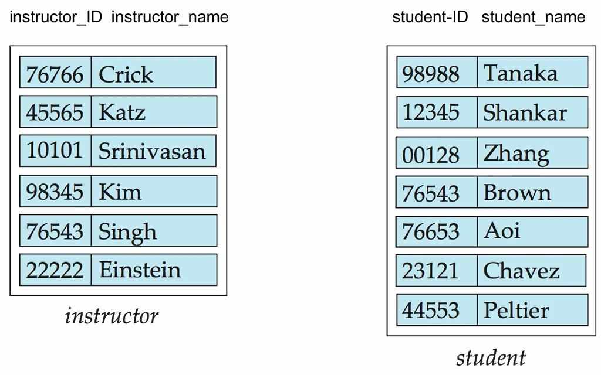
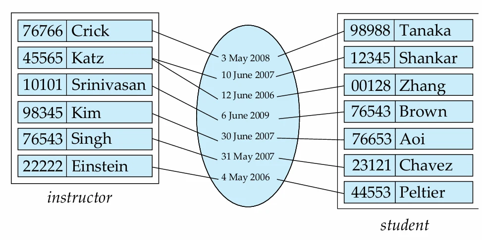
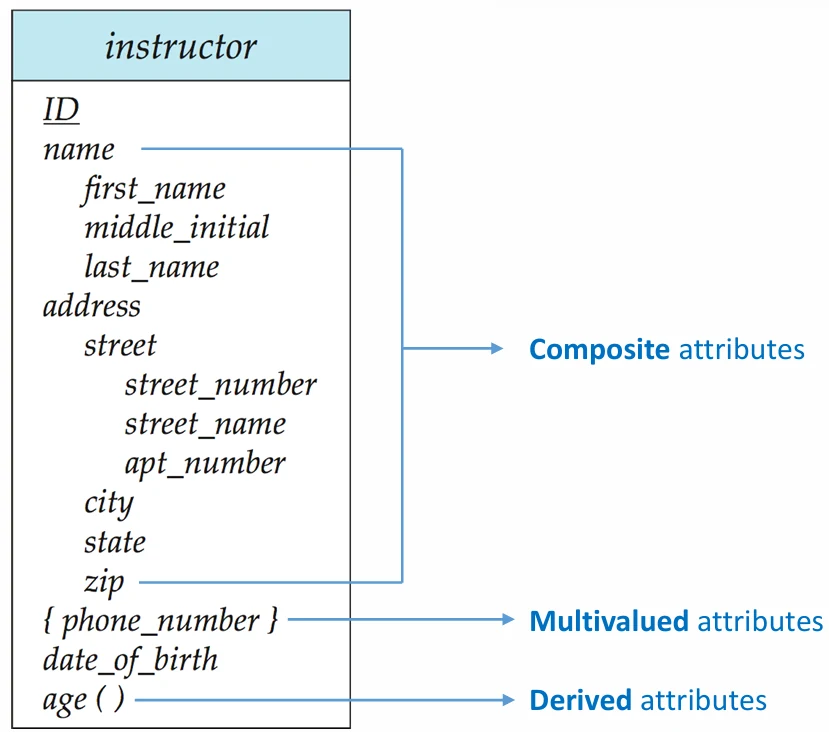

# [데이터베이스 설계] ER 다이어그램이란?

## 원문

https://ch010104.tistory.com/119

## 노트 유형

`concept`

## 핵심 개념과 선택 맥락

초기 단계: - 사용자의 데이터 요구 사항을 완전히 파악하는 단계

논리적 설계 (Logical Design): - 파악된 요구 사항을 바탕으로 데이터베이스의 스키마, 즉 뼈대를 결정

## 원문 기반 개념 정리

### 데이터베이스 설계, 왜 중요하고 어떻게 진행될까?

- 사용자가 필요로 하는 데이터를 완벽하게 파악

- 체계적인 구조로 만들어 구현하는 전 과정을 포함

- 이 과정은 크게 다음과 같은 단계로 나뉨

초기 단계: - 사용자의 데이터 요구 사항을 완전히 파악하는 단계

논리적 설계 (Logical Design): - 파악된 요구 사항을 바탕으로 데이터베이스의 스키마, 즉 뼈대를 결정

물리적 설계 (Physical Design): - 결정된 데이터베이스의 물리적 저장 방식이나 구조를 정하는 단계

정보의 중복(Redundancy)과 불완전성(Incompleteness)에 주의해야함.

- 정보가 중복되면 데이터 일관성이 깨질 수 있음

- 설계가 불완전하면 원하는 정보를 제대로 표현하지 못할 수 있음

- E-R 모델은 이러한 문제를 피하고 '좋은 설계'를 하도록 돕는 핵심적인 도구

### E-R 모델의 3가지 핵심 요소: 엔티티, 관계, 속성

엔티티(Entity), 관계(Relationship), 그리고 속성(Attribute)이라는 세 가지 기본 개념으로 나눔

1. 엔티티 (Entity)

- 구별 가능한 '사물' 또는 '객체'를 의미

- 예를 들어 '특정 학생'이나 '특정 교수' 한 명 한 명이 엔티티 - 엔티티들의 집합을 엔티티 셋(Entity Set)이라고 부름

- '모든 학생'의 집합이나 '모든 교수'의 집합이 여기에 해당

2. 관계 (Relationship)

- 여러 엔티티 간의 '연관성'을 의미 - 예를 들어 'A 교수가 B 학생을 지도한다'는 것 - 이러한 관계들의 집합을 관계 셋(Relationship Set)이라고 부름

- 관계 자체도 속성을 가질 수 있다는 것입니다. - 예를 들어, 지도(advisor) 관계는 '언제부터 지도를 시작했는지'를 나타내는 date 속성을 가질 수 있음

3. 속성 (Attributes):

- 엔티티나 관계가 갖는 구체적인 '성질'이나 '설명'

- 각 엔티티는 여러 속성으로 표현됨 - 예를 들어 학생에게는 학번이 기본 키가 될 수 있음 - 기본 키 (Primary Key): 엔티티 셋 내에서 각 엔티티를 유일하게 식별할 수 있는 속성의 집합

단순 속성 vs 복합 속성 (Simple vs. Composite): - 더 이상 나눌 수 없는 속성(예: salary)과 여러 하위 속성으로 나눌 수 있는 속성(예: name을 first_name, last_name으로 분리)

단일값 속성 vs 다중값 속성 (Single-valued vs. Multivalued): - 한 엔티티에 대해 단 하나의 값만 갖는 속성(예: ID)과 여러 값을 가질 수 있는 속성(예: phone_numbers)

파생 속성 (Derived Attribute): - 다른 속성으로부터 계산해서 얻을 수 있는 속성을 의미합니다. - 생년월일(date_of_birth) 속성이 있다면 나이(age)는 파생 속성이 될 수 있음

### 관계의 종류: 차수, 역할, 카디널리티

관계의 차수 (Degree of a Relationship Set)

- 하나의 관계에 몇 개의 엔티티 셋이 참여하는지를 나타냄 - 대부분의 관계는 2개의 엔티티 셋이 참여하는 이진 관계(Binary relationship) - 3개 이상의 엔티티 셋이 참여하는 다차수 관계(예: 교수가 학생과 함께 프로젝트를 진행하는 proj_guide 관계)도 가능

역할 (Roles)

하나의 엔티티 셋이 관계에 참여할 때, 어떤 '역할'을 하는지를 명시 가능 - 예를 들어 과목 엔티티 셋은 '선수과목(prereq)' 관계에서 '선수 과목이 되는 과목(prereq_id)'과 '후수 과목이 되는 과목(course_id)'이라는 두 가지 역할을 동시에 수행할 수 있음

매핑 카디널리티 (Mapping Cardinality)

- 한 엔티티가 관계를 통해 다른 엔티티 셋의 몇 개 엔티티와 연결될 수 있는지를 숫자로 표현한 것 - 주로 이진 관계에서 다음 네 가지 유형으로 나뉩니다.

일대일 (One-to-One): - A의 엔티티 하나가 B의 엔티티 최대 하나와 연결(예: 한 명의 학생이 하나의 좌석만 배정받음)

일대다 (One-to-Many): - A의 엔티티 하나가 B의 엔티티 여러 개와 연결될 수 있음(예: 한 명의 교수가 여러 학생을 지도함)

다대일 (Many-to-One): - A의 엔티티 여러 개가 B의 엔티티 하나와 연결될 수 있음(예: 여러 명의 학생이 하나의 학과에 소속됨)

다대다 (Many-to-Many): - A의 엔티티 여러 개가 B의 엔티티 여러 개와 연결될 수 있음 (예: 한 명의 학생이 여러 과목을 수강하고, 한 과목은 여러 학생에 의해 수강됨)

## 핵심 이미지

## 관련 글

- [[blog/DATABASE DESIGN/index|DATABASE DESIGN]]
- [[blog/DATABASE DESIGN/데이터베이스 설계- E-R 모델(관계 표현과 스키마 변환)|[데이터베이스 설계] E-R 모델(관계 표현과 스키마 변환)]]
- [[blog/DATABASE DESIGN/데이터베이스 설계- 데이터베이스 설계란|[데이터베이스 설계] 데이터베이스 설계란?]]
- [[blog/DATABASE DESIGN/데이터베이스 설계- 데이터베이스의 정규화(Normalization)란- ( 1 )|[데이터베이스 설계] 데이터베이스의 정규화(Normalization)란? ( 1 )]]
