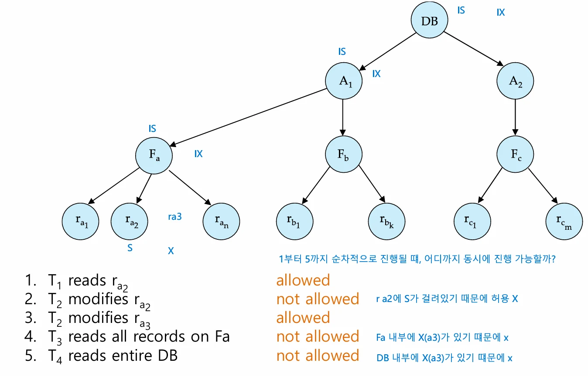
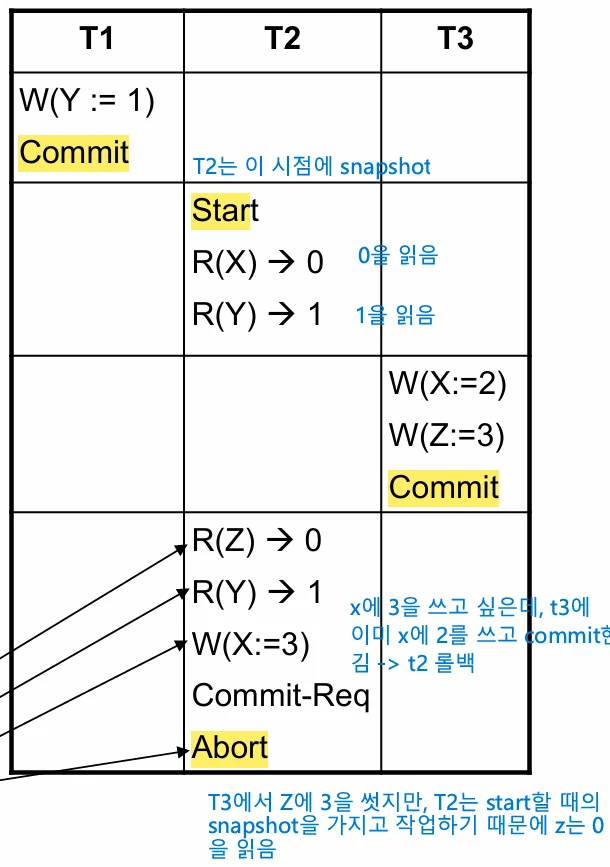

# [데이터베이스 설계] 의도적 잠금 모드 (Intention Lock Modes)

## 원문

https://ch010104.tistory.com/191

## 노트 유형

`guide`

## 적용 목적과 전제조건

다중 입도(Multiple Granularity)에서의 잠금 모드

IS (Intention-Shared): 트리의 하위 레벨에서 공유 잠금(S-lock)을 명시적으로 설정할 것임을 의미

## 구현 절차·검증·주의점

### 1. 의도적 잠금 모드 (Intention Lock Modes)

다중 입도(Multiple Granularity)에서의 잠금 모드

IS (Intention-Shared): 트리의 하위 레벨에서 공유 잠금(S-lock)을 명시적으로 설정할 것임을 의미

IX (Intention-Exclusive): 트리의 하위 레벨에서 배타 잠금(X-lock) 또는 공유 잠금(S-lock)을 명시적으로 설정할 것임을 의미

SIX (Shared and Intention-Exclusive): 현재 노드는 공유 모드로 잠그고, 하위 레벨에서는 배타 잠금(X-lock)을 수행할 것임을 의미 (S + IX 형태)

### 2. 잠금 호환성 행렬 (Compatibility Matrix)

의도적 잠금 모드 간의 호환성은 다음과 같음

참고: S와 IX는 호환되지 않음. S 잠금은 일관된 뷰를 보장해야 하는데, IX는 하위 노드 수정을 암시하므로 충돌 발생

### 3. 다중 입도 잠금 예시

트랜잭션 T_21, T_22, T_23, T_24의 잠금 수행 예시

```text
/* T21: 파일 Fa의 레코드 ra2를 읽음 */
Lock-IS(DB)
Lock-IS(Fa)
Lock-IS(A1)
Lock-S(ra2)

/* T22: 파일 Fa의 레코드 ra1을 수정 */
Lock-IX(DB)
Lock-IX(Fa)
Lock-IX(A1)
Lock-X(ra1)

/* T23: 파일 Fa의 모든 레코드를 읽음 */
Lock-IS(DB)
Lock-S(Fa)

/* T24: 전체 데이터베이스를 읽음 */
Lock-S(DB)
```

동시성: T_21, T_23, T_24는 동시 접근 가능하나, T_22는 T_23, T_24와 동시에 실행 불가

### 4. 다중 입도 잠금 규약 (Rules)

호환성 행렬을 반드시 준수해야 함

트리의 루트(Root)부터 먼저 잠금

잠금 획득 조건:

노드 Q에 S 또는 IS 잠금을 하려면, 부모 노드는 IX 또는 IS 상태여야 함

노드 Q에 X, SIX, IX 잠금을 하려면, 부모 노드는 IX 또는 SIX 상태여야 함

잠금 해제 및 순서:

자식 노드에 잠금이 없을 때만 해당 노드 잠금 해제 가능

잠금 획득: Root → Leaf 순서 (위에서 아래로)

잠금 해제: Leaf → Root 순서 (아래서 위로)

### 5. 스냅샷 격리 (Snapshot Isolation)

개념:

트랜잭션 시작 시점의 데이터베이스 스냅샷을 받아 작업 수행

동시 실행되는 다른 트랜잭션과 완전히 격리됨

업데이트 반영은 원자적(Atomic)으로 수행됨

검증 방식:

First Committer Wins: 먼저 커밋한 트랜잭션이 우선권을 가짐. 동시 실행 중인 다른 트랜잭션이 이미 데이터를 업데이트했다면 현재 트랜잭션은 중단(Abort)

First Updater Wins (Oracle 방식): 업데이트 시도 시 쓰기 잠금(Write lock)을 요청. 이미 잠금이 있다면 대기, 락을 획득한 트랜잭션이 커밋/롤백 될 때까지 기다림

### 6. 스냅샷 격리의 이점과 이상 현상

이점:

읽기 작업이 차단되지 않음 (Never blocked)

Read Committed 수준의 성능 제공

Dirty Read, Lost Update, Non-repeatable Read 방지

이상 현상 (Write Skew):

직렬성(Serializability)이 항상 보장되지 않음

두 트랜잭션이 서로 다른 데이터를 읽고 수정할 때 데이터 무결성 제약 조건이 위배될 수 있음

```text
/* Write Skew 예시: A + B >= 0 제약조건 유지 가정 */
초기값: A = 100, B = 100

T1: Read(A), Read(B) -> B에서 200 차감 결정 (A+B=0 유지) -> Write(B)
T2: Read(A), Read(B) -> A에서 200 차감 결정 (A+B=0 유지) -> Write(A)

결과: T1, T2 모두 커밋 성공하지만 A + B = -200이 되어 제약조건 위반
```

### 7. 직렬화 스냅샷 격리 (SSI) 및 구현

Serializable Snapshot Isolation (SSI):

스냅샷 격리의 확장판으로 직렬성(Serializability)을 보장

기존 SI는 Write-Write 충돌만 감지하지만, SSI는 Read-Write 충돌도 추적

사이클이 발생할 수 있는 트랜잭션을 감지하여 롤백

PostgreSQL 9.1 이상에서 구현됨

구현 현황:

Oracle, PostgreSQL, SQL Server 등에서 지원

주의: Oracle은 격리 수준을 'Serializable'로 설정하더라도 실제로는 스냅샷 격리(Snapshot Isolation)로 동작하며 진정한 직렬성을 보장하지 않음 (초기 PostgreSQL도 동일)

## 핵심 이미지





## 관련 글

- [[blog/DATABASE DESIGN/index|DATABASE DESIGN]]
- [[blog/DATABASE DESIGN/데이터베이스 설계- 회복 시스템(Recovery System)|[데이터베이스 설계] 회복 시스템(Recovery System)]]
- [[blog/DATABASE DESIGN/데이터베이스 설계- 트랜잭션 복구 및 데이터 접근|[데이터베이스 설계] 트랜잭션 복구 및 데이터 접근]]
- [[blog/DATABASE DESIGN/데이터베이스 설계- 동시성 제어|[데이터베이스 설계] 동시성 제어]]
