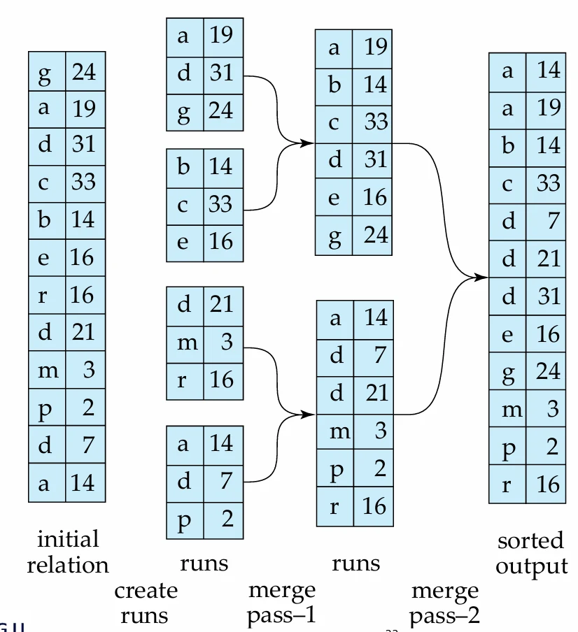
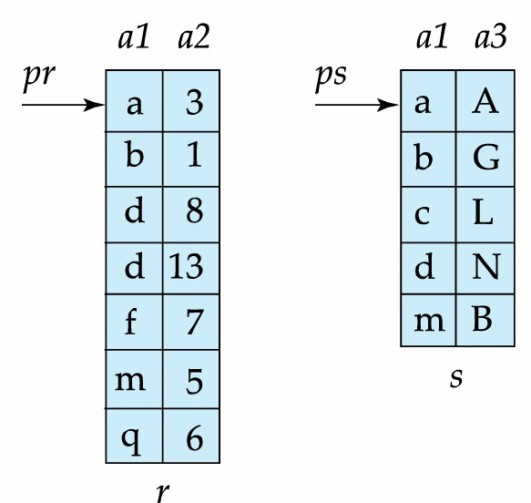
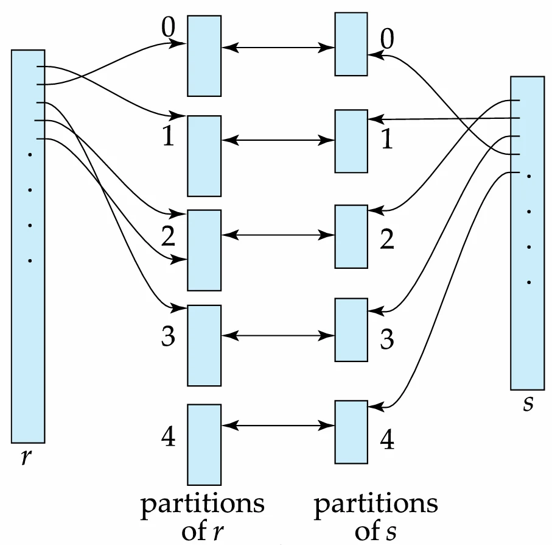

# [데이터베이스 설계] 쿼리 처리(Query Processiong) - 정렬(Sorting)과 조인(Join)

## 원문

https://ch010104.tistory.com/154

## 노트 유형

`guide`

## 적용 목적과 전제조건

사용자 요구: SQL의 ORDER BY 절을 통해 사용자가 결과의 정렬을 명시적으로 요구.

효율적인 연산: 조인과 같은 관계 대수 연산은 입력 데이터가 정렬되어 있을 때 훨씬 효율적으로 수행 가능.

## 구현 절차·검증·주의점

### 정렬 (Sorting)

데이터베이스 시스템에서 정렬이 중요한 두 가지 이유:

사용자 요구: SQL의 ORDER BY 절을 통해 사용자가 결과의 정렬을 명시적으로 요구.

효율적인 연산: 조인과 같은 관계 대수 연산은 입력 데이터가 정렬되어 있을 때 훨씬 효율적으로 수행 가능.

정렬 기법:

인덱스 활용: - 인덱스를 사용하여 논리적으로 정렬된 순서대로 데이터를 읽는 방법. - 하지만 이 경우 각 튜플에 접근할 때마다 디스크 접근이 발생하여 비용이 매우 높을 수 있음.

내부 정렬 (Quicksort): 관계(데이터)가 메모리에 전부 올라갈 정도로 작을 때 사용.

외부 정렬 병합 (External Sort-Merge): 관계가 메모리보다 커서 한 번에 처리할 수 없을 때 사용하는 기법

1단계: 정렬된 부분 집합 (Run) 생성

메모리에 할당된 블록(M)만큼의 데이터를 읽어옴.

메모리 내에서 해당 데이터를 정렬.

정렬된 데이터를 디스크에 임시 파일(Run)로 저장.

데이터 전체를 다 처리할 때까지 이 과정을 반복

2단계: 부분 집합 병합

생성된 각 Run의 첫 번째 블록을 입력 버퍼로 읽어옴.

모든 입력 버퍼의 레코드 중 정렬 순서상 가장 앞에 있는 레코드를 선택하여 출력 버퍼로 보냄.

출력 버퍼가 가득 차면 디스크에 기록.

모든 Run의 데이터가 소진될 때까지 이 과정을 반복.

### 조인 연산 (Join Operation)

조인 연산을 구현하기 위한 다양한 알고리즘. 비용 추정치를 기반으로 최적의 알고리즘을 선택.

Nested-Loop Join

Block Nested-Loop Join

Indexed Nested-Loop Join

Merge-Join

Hash-Join

1. 중첩 루프 조인 (Nested-Loop Join)

- 가장 기본적인 조인 방식으로, 외부 관계(Outer relation)의 각 튜플에 대해 내부 관계(Inner relation)의 모든 튜플과 조인 조건을 비교하는 방식

특징: 어떤 종류의 조인 조건에도 사용 가능하며 인덱스가 필요 없음.

비용: 모든 튜플 쌍을 검사하므로 매우 비효율적. 비용은 외부 테이블의 각 행을 처리할 때마다 내부 테이블을 처음부터 다시 스캔해야 하므로 디스크 탐색(Seek) 횟수가 많아짐.

Cost: br + nr * bs 블록 전송 + br + nr 탐색. (br: 외부 테이블 블록 수, bs: 내부 테이블 블록 수, nr: 외부 테이블 튜플 수) .

2. 블록 중첩 루프 조인 (Block Nested-Loop Join)

- 기존 Nested-Loop Join의 비효율을 개선한 방식으로, 튜플 단위가 아닌 블록 단위로 조인을 수행. 외부 관계의 한 블록에 대해 내부 관계의 모든 블록을 비교.

특징: 튜플마다 내부 테이블을 스캔하는 대신 블록마다 스캔하므로 디스크 I/O를 크게 줄임.

비용: br * bs + br 블록 전송 + 2 * br 탐색.

3. 인덱스 중첩 루프 조인 (Indexed Nested-Loop Join)

- 내부 관계의 조인 속성에 인덱스가 있을 때 파일 전체 스캔 대신 인덱스를 사용하여 조인 대상을 효율적으로 찾는 방식.

과정: 외부 관계의 각 튜플에 대해 조인 조건을 만족하는 튜플을 내부 관계의 인덱스를 통해 찾음.

비용: br(tT + ts) + (nr) * c (c: 인덱스 탐색 및 튜플 인출 비용).

4. 병합 조인 (Merge-Join)

- 동등 조인(equi-join)과 자연 조인(natural join)에만 사용 가능.

과정:

두 관계를 조인 속성 기준으로 정렬.

정렬된 두 관계를 병합하면서 조인 수행. 마치 정렬된 두 파일의 머지 소트와 유사하게 진행.

비용: 각 블록을 한 번만 읽으므로 br + bs 블록 전송. 정렬되지 않은 경우 정렬 비용이 추가됨.

5. 해시 조인 (Hash-Join)

- 동등 조인과 자연 조인에 적용 가능. 해시 함수를 이용해 조인할 튜플들을 빠르게 찾는 방식.

과정:

분할(Partition) 단계: - 조인 속성에 해시 함수를 적용하여 두 관계를 여러 개의 작은 파티션(버킷)으로 분할. - 동일한 해시 값을 갖는 튜플들은 같은 파티션으로 들어감.

조인(Probe) 단계: - 같은 번호를 가진 파티션끼리 조인을 수행 - 작은 관계(build input)의 파티션을 메모리에 올리고 해시 테이블을 만든 후, 큰 관계(probe input)의 파티션을 읽으면서 조인 대상을 찾음.

비용: 일반적으로 대용량 데이터 조인 시 매우 효율적.

복합 조인 (Complex Joins)

AND 조건 조인 (r⋈θ1∧θ2​s): - Block Nested-Loop를 사용하거나, 하나의 조건으로 먼저 조인한 후 나머지 조건을 만족하는 튜플을 필터링하는 방식으로 처리.

OR 조건 조인 (r⋈θ1∨θ2​s): - Block Nested-Loop를 사용하거나, 각 조건을 개별적으로 조인한 후 그 결과들을 합집합(UNION)하는 방식으로 처리.

기타 연산 (Other Operations)

중복 제거 (Duplicate Elimination): - 해싱 또는 정렬을 통해 구현 가능. - SQL에서는 비용 문제로 DISTINCT와 같이 명시적으로 요청해야 수행됨.

프로젝션 (Projection): 각 튜플에 대해 프로젝션을 수행한 후 중복을 제거하는 방식으로 처리.

집계 (Aggregation): 중복 제거와 유사한 방식으로 구현.

집합 연산 (Set Operations): 정렬 후 병합하거나 해시 기반 방식으로 구현.

외부 조인 (Outer Join): 일반 조인을 수행한 후, 조인에 참여하지 못한 튜플들을 NULL로 채워서 추가하는 방식으로 구현.

표현식 평가 (Evaluation of Expressions)

- 여러 연산으로 구성된 전체 쿼리 표현식 트리를 평가하는 두 가지 주요 방식.

1. 구체화 (Materialization)

가장 낮은 수준의 연산부터 순서대로 한 번에 하나씩 평가하는 방식.

과정: 각 연산의 결과를 디스크에 임시 테이블로 저장(Materialize)하고, 다음 단계의 연산은 이 임시 테이블을 입력으로 사용.

장점: 언제나 적용 가능.

단점: 중간 결과를 디스크에 쓰고 다시 읽어오는 비용이 매우 큼. 이를 보완하기 위해 더블 버퍼링(Double Buffering) 기법을 사용하기도 함.

2. 파이프라이닝 (Pipelining)

여러 연산을 동시에 평가하며, 한 연산의 결과가 나오는 즉시 다음 연산의 입력으로 전달하는 방식

과정: 중간 결과를 디스크에 저장하지 않고 메모리 버퍼를 통해 실시간으로 전달.

장점: 디스크 I/O 비용이 거의 없어 구체화 방식보다 훨씬 빠름.

단점: 정렬(Sort)이나 해시 조인(Hash-Join)처럼 모든 입력을 받아야 결과를 낼 수 있는 '차단(Blocking)' 연산에는 적용이 어려울 수 있음.

파이프라이닝 실행 방식:

수요 기반 (Demand-driven): - 상위 연산자가 필요할 때마다 하위 연산자에게 다음 튜플을 요청하는 '게으른(lazy)' 방식.

생산자 기반 (Producer-driven): - 하위 연산자가 튜플을 생성하는 즉시 상위 연산자로 보내는 '적극적인(eager)' 방식. 연산자 사이에 버퍼를 두어 데이터를 전달.

## 관련 글

- [[blog/DATABASE DESIGN/index|DATABASE DESIGN]]
- [[blog/DATABASE DESIGN/데이터베이스 설계- 쿼리 처리(Query Processing) - A4 ~ A10|[데이터베이스 설계] 쿼리 처리(Query Processing) - A4 ~ A10]]
- [[blog/DATABASE DESIGN/데이터베이스 설계- 쿼리 최적화 (Query Optimization)|[데이터베이스 설계] 쿼리 최적화 (Query Optimization)]]
- [[blog/DATABASE DESIGN/데이터베이스 설계- 쿼리 처리(Query Processing) - 비용 측정부터 선택 연산(A1-A3)|[데이터베이스 설계] 쿼리 처리(Query Processing) -  비용 측정부터 선택 연산(A1-A3)]]
