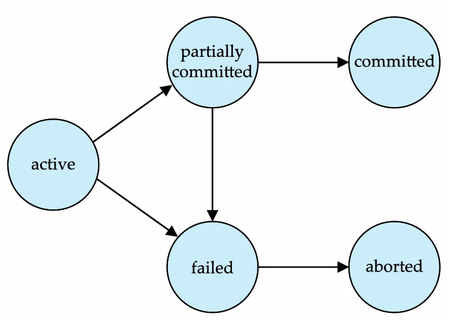
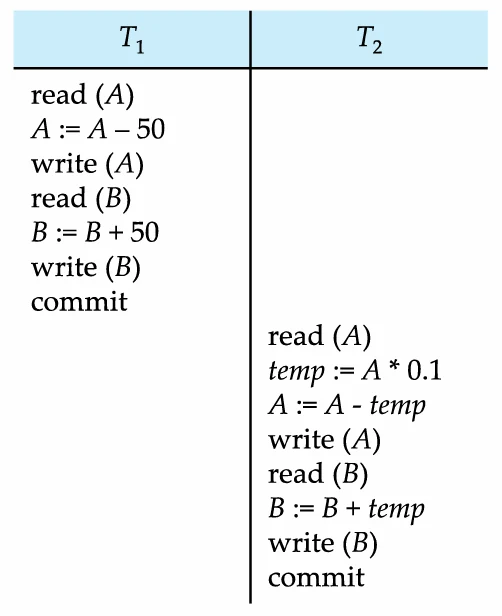
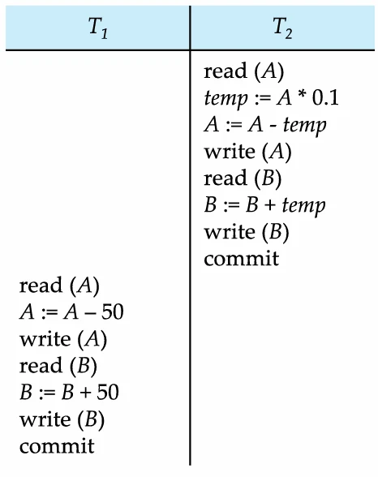

# [데이터베이스 설계] 트랜잭션이란?

## 원문

https://ch010104.tistory.com/178

## 노트 유형

`concept`

## 핵심 개념과 선택 맥락

트랜잭션 정의: 데이터베이스의 데이터 항목에 접근하고, 경우에 따라 수정하는 프로그램 실행의 단위

예시 (계좌 이체): A 계좌에서 B 계좌로 $50를 이체하는 작업은 A 읽기($read(A)$), A 수정($A := A - 50$), A 쓰기($write(A)$), B 읽기($read(B)$), B 수정($B := B + 50$), B 쓰기($write(B)$)의 단계로 구성됨

## 원문 기반 개념 정리

### 1. 트랜잭션 개념 (Transaction Concept)

트랜잭션 정의: 데이터베이스의 데이터 항목에 접근하고, 경우에 따라 수정하는 프로그램 실행의 단위

예시 (계좌 이체): A 계좌에서 B 계좌로 $50를 이체하는 작업은 A 읽기($read(A)$), A 수정($A := A - 50$), A 쓰기($write(A)$), B 읽기($read(B)$), B 수정($B := B + 50$), B 쓰기($write(B)$)의 단계로 구성됨

주요 2가지 쟁점:

하드웨어 장애, 시스템 충돌 등 다양한 유형의 실패 (Failures)

여러 트랜잭션의 동시 실행 (Concurrent execution)

### 2. ACID 속성 (ACID Properties)

데이터 무결성을 보존하기 위해 데이터베이스 시스템이 보장해야 하는 4가지 속성

Atomicity (원자성):

트랜잭션의 모든 연산이 데이터베이스에 올바르게 반영되거나, 전혀 반영되지 않아야 함 (All or nothing)

만약 계좌 이체 중 3단계(A 쓰기)와 6단계(B 쓰기) 사이에서 실패하면, 돈이 사라져 데이터베이스가 비일관된 상태가 됨

시스템은 부분적으로 실행된 트랜잭션의 갱신 내용이 데이터베이스에 반영되지 않도록 보장해야 함

Consistency (일관성):

트랜잭션 실행이 고립된 상태에서 실행될 경우, 데이터베이스의 일관성을 보존해야 함

트랜잭션 실행 중에는 일시적으로 데이터베이스가 비일관된 상태일 수 있으나 10, 트랜잭션이 성공적으로 완료되면 다시 일관된 상태여야 함

계좌 이체 예시에서, 트랜잭션 실행 전후의 (A+B) 총액은 변경되지 않아야 함

일관성 요구사항에는 명시적 무결성 제약(기본 키, 외래 키) 및 암시적 무결성 제약이 포함됨

Isolation (독립성):

여러 트랜잭션이 동시에 실행되더라도, 각 트랜잭션은 다른 트랜잭션이 동시에 실행되고 있음을 인지하지 못해야 함

트랜잭션의 중간 결과는 다른 트랜잭션에게 숨겨져야 함

만약 T1이 A 계좌를 수정한 직후(3단계) T2가 A와 B를 읽는다면(6단계 이전), T2는 (A+B) 총액이 맞지 않는 비일관된 데이터를 보게

가장 간단하게는 트랜잭션을 직렬(serially), 즉 하나씩 차례대로 실행하여 독립성을 보장할 수 있음

Durability (영속성):

트랜잭션이 성공적으로 완료된 후, 그 변경 사항은 시스템에 장애가 발생하더라도 데이터베이스에 영구적으로 보존(persist)되어야 함

### 3. 트랜잭션 상태 (Transaction State)

트랜잭션은 실행 중에 다음 5가지 상태 중 하나에 속함

Active (활성): 트랜잭션이 실행 중인 초기 상태

Partially committed (부분 완료): 마지막 명령문까지 실행을 마쳤지만, 변경 사항이 디스크에 영구 저장(Commit)되지는 않은 상태

Failed (실패): 정상적인 실행이 더 이상 진행될 수 없음이 발견된 상태

Aborted (철회): 트랜잭션이 롤백(Rollback)되고, 데이터베이스가 트랜잭션 시작 이전 상태로 복원된 상태23. (Failed 상태 이후에 도달함)

Committed (완료): 트랜잭션이 성공적으로 완료되어 변경 사항이 영구 저장된 상태24. (Partially committed 상태 이후에 도달함)

트랜잭션은 Committed 또는 Aborted 중 하나의 상태로만 종료되어야 함

### 4. 동시 실행 (Concurrent Executions)

시스템이 여러 트랜잭션을 동시에(concurrently) 실행하도록 허용하는 것

장점:

프로세서 및 디스크 활용도 증가: 한 트랜잭션이 CPU를 사용할 때 다른 트랜잭션이 디스크 I/O를 수행하여, 전체적인 트랜잭션 처리율(throughput) 향상

평균 응답 시간 감소: 짧은 트랜잭션이 긴 트랜잭션 뒤에서 불필요하게 기다릴 필요가 없음

동시성 제어 (Concurrency Control): 독립성을 달성하고, 동시 실행되는 트랜잭션 간의 상호작용으로 인해 데이터베이스 일관성이 깨지는 것을 방지하는 메커니즘

### 5. 스케줄 (Schedules)

스케줄 정의: 여러 트랜잭션이 동시에 실행될 때, 개별 명령어들이 실행되는 시간 순서(chronological order)를 명시한 것

스케줄의 조건:

해당 트랜잭션 집합의 모든 명령어를 포함해야 함

각 트랜잭션 내의 명령어 순서는 그대로 유지해야 함

직렬 스케줄 (Serial Schedule): 트랜잭션이 차례대로 하나씩 실행되는 스케줄. (예: T1 실행 후 T2 실행)

비직렬 스케줄 (Concurrent Schedule): 여러 트랜잭션의 명령어들이 섞여서(interleaved) 실행되는 스케줄

스케줄 예시 (1~4):

Schedule 1 (T1 → T2): 직렬 스케줄

Schedule 2 (T2 → T1): 직렬 스케줄

Schedule 3 (T1, T2 동시 실행): 비직렬(concurrent) 스케줄이지만, 직렬 스케줄인 Schedule 1과 동일한 결과를 내며 (A+B) 총합을 보존함 (올바른 스케줄)

Schedule 4 (T1, T2 동시 실행): 비직렬 스케줄이며, (A+B) 총합을 보존하지 못함 (일관성/독립성 실패, 잘못된 스케줄)

## 관련 글

- [[blog/DATABASE DESIGN/index|DATABASE DESIGN]]
- [[blog/DATABASE DESIGN/데이터베이스 설계- 트랜젝션과 Serializability|[데이터베이스 설계] 트랜젝션과 Serializability]]
- [[blog/DATABASE DESIGN/데이터베이스 설계- 비용 추정을 위한 통계 2 (MATERIALIZED VIEWS)|[데이터베이스 설계] 비용 추정을 위한 통계 2 (MATERIALIZED VIEWS)]]
- [[blog/DATABASE DESIGN/데이터베이스 설계- 비용 추정을 위한 통계 1 (STATISTICS FOR COST ESTIMATION)|[데이터베이스 설계] 비용 추정을 위한 통계 1 (STATISTICS FOR COST ESTIMATION)]]
