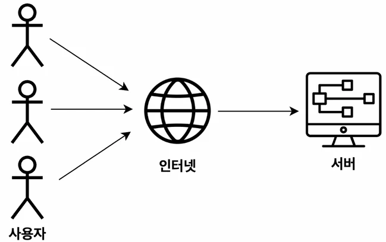
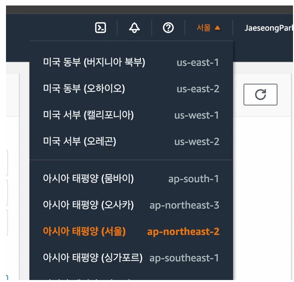
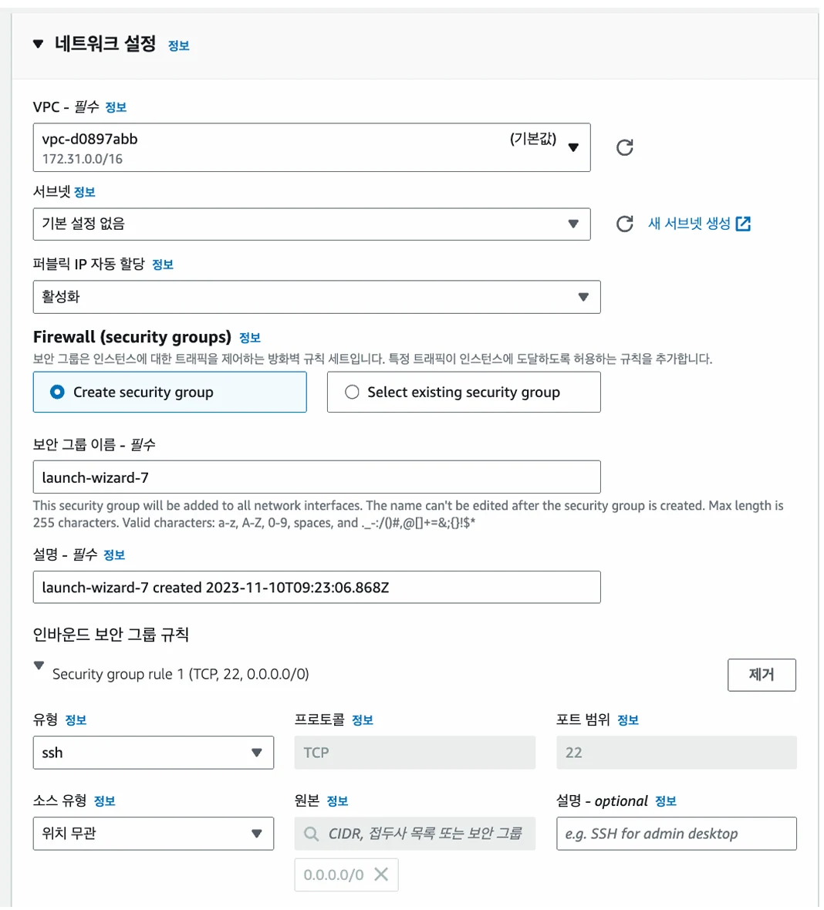

# [Docker] AWS EC2에 서버 배포하기(Express 서버 배포하기)

## 원문

https://ch010104.tistory.com/101

## 노트 유형

`concept`

## 핵심 개념과 선택 맥락

배포란, 내가 개발한 웹 서비스 또는 서버를 다른 사용자들이 인터넷을 통해 사용할 수 있도록 만드는 것

예: http://localhost:3000 → http://13.250.15.132:3000 또는 https://myapp.com

## 원문 기반 개념 정리

### 1. 배포(Deployment)란?

배포란, 내가 개발한 웹 서비스 또는 서버를 다른 사용자들이 인터넷을 통해 사용할 수 있도록 만드는 것

개발 중: localhost로 테스트함.

배포 후: IP 또는 도메인 주소로 접속 가능.

예: http://localhost:3000 → http://13.250.15.132:3000 또는 https://myapp.com

### 2. EC2란 무엇인가?

☁️ 1) 한 줄 요약:

AWS에서 제공하는 클라우드 컴퓨터를 빌려서 원격으로 사용하는 서비스

✔ 왜 EC2를 쓰는가?

내 컴퓨터로 서버를 배포하면 24시간 켜둬야 함

보안 위험 있음

EC2는 언제든 껐다 켤 수 있음 + 확장성 좋음

부가기능: 로깅, 오토스케일링, 로드밸런싱 등

✔ 프론트엔드는 EC2 안 써도 됨?

S3, Vercel, Netlify 등 정적 웹 호스팅 서비스가 있음

EC2는 백엔드 서버 배포용으로 많이 씀

### 🛠 3. 실습: EC2로 Express 서버 배포하기

1) EC2 인스턴스 생성

🔹 리전 선택

리전(Region)은 서버 위치

한국 사용자 대상 → 아시아 태평양(서울) 선택

리전별로 EC2 인스턴스가 다름 (중요!)

🔹 인스턴스 설정

이름: express-server

OS: Ubuntu 22.04 LTS(배포 목적일 경우에는 macOS나 windows에 비해서 Ubuntu가 더 효율적이며 특화되어 있음)

인스턴스 유형: t2.micro (프리 티어) - 인스턴스란, AWS에서 빌리는 컴퓨터 1대를 의미함.

키페어: 새로 생성 (RSA + .pem 파일 저장 필수)

2) 보안 그룹 설정

인바운드 규칙 추가

22번 포트: SSH 원격 접속용

80번 포트: HTTP 웹 서버용

소스는 "Anywhere (0.0.0.0/0)"로 설정

방화벽 설정이라 생각하면 됨.

3) 스토리지 설정

기본 제공 EBS(Elastic Block Store) 사용

타입: gp3

용량: 30GiB (프리 티어 최대)

4) 인스턴스 생성 후 확인 사항

퍼블릭 IPv4 주소: 서버 접근 주소

인스턴스 상태: running인지 확인(인스턴스 종료는 인스턴스의 삭제를 의미함!!)

🧩 보충 개념: IP와 Port

IP: 특정 컴퓨터의 네트워크 주소

Port: 컴퓨터 내 프로그램의 네트워크 주소

13.250.15.132:3000 → 3000번 포트에서 Express 서버 동작 중

5) 탄력적 IP 할당

왜 필요할까?

기본 IP는 임시 IP → 인스턴스 재시작하면 변경됨

탄력적 IP(EIP)는 고정 IP → 안정적인 접속 주소 제공

현재 IP의 개수가 부족하기 때문에, 이런 방식으로 사용하지 않는 IP는 필요한 사람들에게 할당하기 위해 이런 방식을 사용

6) EC2에 Express 서버 배포

📦 Node.js 설치 (Ubuntu)

```text
sudo su
apt-get update && \
apt-get install -y ca-certificates curl gnupg && \
mkdir -p /etc/apt/keyrings && \
curl -fsSL https://deb.nodesource.com/gpgkey/nodesource-repo.gpg.key | \
gpg --dearmor -o /etc/apt/keyrings/nodesource.gpg

NODE_MAJOR=20
echo "deb [signed-by=/etc/apt/keyrings/nodesource.gpg] https://deb.nodesource.com/node_$NODE_MAJOR.x nodistro main" | \
tee /etc/apt/sources.list.d/nodesource.list

apt-get update && \
apt-get install -y nodejs
```

🔍 설치 확인

```text
node -v
npm -v
```

7) Express 프로젝트 clone

```text
git clone https://github.com/JSCODE-EDU/ec2-express-sample
cd ec2-express-sample
npm install
```

8) .env 파일 직접 만들기

```text
touch .env
```

내용 예시:

```text
DATABASE_NAME=my_database
```

9) pm2로 서버 실행

```text
sudo npm install -g pm2
sudo pm2 start app.js
```

pm2는 Node.js 서버를 백그라운드 실행 및 자동 재시작 해주는 툴

실행 확인: pm2 list

🔎 브라우저에서 확인

```text
http://[탄력적 IP]
```

예시:

```text
http://15.165.203.130
```

10) 비용 방지용 EC2 종료 방법

1.EC2 인스턴스 중지 또는 종료

2. 탄력적 IP 해제 (릴리스)

## 핵심 이미지







## 관련 글

- [[blog/DOCKER/index|DOCKER]]
- [[blog/DOCKER/Docker- DockerCompose에 2개 이상의 Container 관리하기|[Docker] DockerCompose에 2개 이상의 Container 관리하기]]
- [[blog/DOCKER/Docker- AWS EC2에서 Docker를 활용해서 서버 배포하기|[Docker] AWS EC2에서 Docker를 활용해서 서버 배포하기]]
- [[blog/DOCKER/Docker- Docker Compose 란|[Docker] Docker Compose 란??]]
