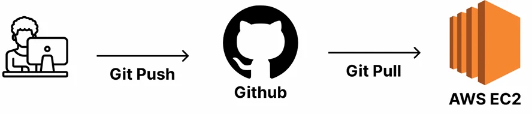
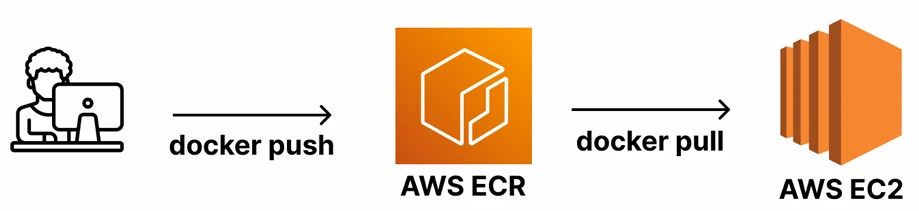
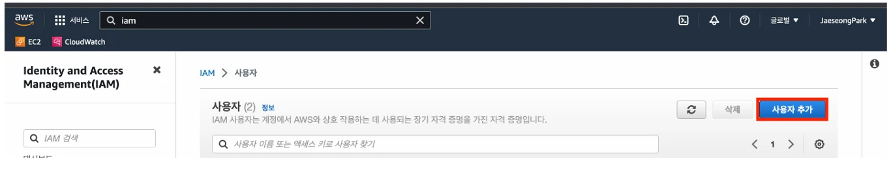

# [Docker] AWS EC2에서 Docker를 활용해서 서버 배포하기

## 원문

https://ch010104.tistory.com/102

## 노트 유형

`concept`

## 핵심 개념과 선택 맥락

docker를 사용하지 않고 EC2에서 깃허브 클론해서 배포하는 방식

DockerHub처럼 컨테이너 이미지를 저장하고 다운로드할 수 있는 AWS의 컨테이너 이미지 저장소 서비스

## 원문 기반 개념 정리

### 1. Ubuntu에서 Docker 및 Docker Compose 설치하기

EC2의 가상 인스턴스에 연결해서 설치를 해야함

1) Docker 설치

```bash
sudo apt-get update && \
sudo apt-get install -y apt-transport-https ca-certificates curl software-properties-common && \
curl -fsSL https://download.docker.com/linux/ubuntu/gpg | sudo apt-key add - && \
sudo apt-key fingerprint 0EBFCD88 && \
sudo add-apt-repository \
   "deb [arch=amd64] https://download.docker.com/linux/ubuntu $(lsb_release -cs) stable" && \
sudo apt-get update && \
sudo apt-get install -y docker-ce
```

설치 후 현재 사용자에게 docker 권한 부여:

```bash
sudo usermod -aG docker $USER
newgrp docker
```

2) Docker Compose 설치

```bash
sudo curl -L "https://github.com/docker/compose/releases/download/2.27.1/docker-compose-$(uname -s)-$(uname -m)" \
  -o /usr/local/bin/docker-compose && \
sudo chmod +x /usr/local/bin/docker-compose && \
sudo ln -s /usr/local/bin/docker-compose /usr/bin/docker-compose
```

3) 설치 확인

```bash
docker -v              # Docker 버전 확인
docker compose version # Docker Compose 버전 확인
```

### 2. AWS ECR (Elastic Container Registry) 개념 및 이유





1) AWS ECR이란?

docker를 사용하지 않고 EC2에서 깃허브 클론해서 배포하는 방식

DockerHub처럼 컨테이너 이미지를 저장하고 다운로드할 수 있는 AWS의 컨테이너 이미지 저장소 서비스

2) 왜 AWS ECR을 사용하는가?

docker를 사용하여 image를 AWE ECR에 올린 후, EC2에서 내려받아서 배포하는 방식

AWS 리소스들과 연동이 편리함.

EC2, ECS, EKS 등과 통합해 빠르고 효율적인 배포 가능.

DockerHub를 대체하여 보안성과 속도, 비용 측면에서 유리할 수 있음.

### 3. AWS CLI 설치 및 ECR 사용 준비



1) AWS CLI 설치 (Ubuntu 기준)

```text
sudo apt install unzip
curl "https://awscli.amazonaws.com/awscli-exe-linux-x86_64.zip" -o "awscliv2.zip"
unzip awscliv2.zip
sudo ./aws/install
aws --version
```

2) IAM 사용자 생성 및 Access Key 발급

1. AWS 콘솔 → IAM → 사용자 생성 (ECR, EC2 관련 권한 부여)

2. Access Key ID와 Secret Access Key 발급

3) AWS CLI 초기 설정

```text
aws configure
# 프롬프트에 따라 아래 입력
AWS Access Key ID [None]: <Access Key>
AWS Secret Access Key [None]: <Secret Access Key>
Default region name [None]: ap-northeast-2
Default output format [None]: json
```

### 4. Docker 이미지 빌드 및 ECR에 Push

1) Dockerfile 예시

```bash
# Dockerfile
FROM openjdk:17-jdk
COPY build/libs/*SNAPSHOT.jar /app.jar
ENTRYPOINT ["java", "-jar", "/app.jar"]
```

2) 프로젝트 빌드 및 이미지 생성

```text
./gradlew clean build
```

3) ECR 로그인 및 이미지 Push

```bash
# ECR 로그인
aws ecr get-login-password --region ap-northeast-2 | docker login --username AWS --password-stdin <AWS_ACCOUNT_ID>.dkr.ecr.ap-northeast-2.amazonaws.com

# 이미지 빌드 및 태그
docker build -t instagram-server .
docker tag instagram-server:latest <AWS_ACCOUNT_ID>.dkr.ecr.ap-northeast-2.amazonaws.com/instagram-server:latest

# 이미지 Push
docker push <AWS_ACCOUNT_ID>.dkr.ecr.ap-northeast-2.amazonaws.com/instagram-server:latest
```

### 5. EC2에서 컨테이너 실행 (Docker CLI 방식)

```bash
# ECR 로그인 및 이미지 Pull
aws ecr get-login-password --region ap-northeast-2 | docker login --username AWS --password-stdin <AWS_ACCOUNT_ID>.dkr.ecr.ap-northeast-2.amazonaws.com
docker pull <AWS_ACCOUNT_ID>.dkr.ecr.ap-northeast-2.amazonaws.com/instagram-server

# 컨테이너 실행
docker run -d -p 8080:8080 <이미지 경로> # --platform linux/amd64
```

❗️ 만약 이후 docker compose up에서 아키텍처 불일치 에러가 발생한다면 --platform linux/amd64 옵션을 추가하여 빌드!

EC2에서는 빌드한 아키텍처 환경의 사양이랑 배포할 아키텍처 환경의 사양이 같아야하는데, mcOS의 경우 달라서 위 오류가 발생할 수 있음

### 6. Docker Compose로 배포 (Spring Boot, MySQL, Redis 포함)

1) Compose 파일 예시 (compose.yml)

```text
# compose.yml
services:
  instagram-server:
    image: <AWS_ACCOUNT_ID>.dkr.ecr.ap-northeast-2.amazonaws.com/instagram-server:latest
    ports:
      - 8080:8080
    depends_on:
      my-db:
        condition: service_healthy
      my-cache-server:
        condition: service_healthy

  my-db:
    image: mysql
    environment:
      MYSQL_ROOT_PASSWORD: pwd1234
      MYSQL_DATABASE: mydb
    volumes:
      - ./mysql_data:/var/lib/mysql
    ports:
      - 3306:3306
    healthcheck:
      test: ["CMD", "mysqladmin", "ping"]
      interval: 5s
      retries: 10

  my-cache-server:
    image: redis
    ports:
      - 6379:6379
    healthcheck:
      test: ["CMD", "redis-cli", "ping"]
      interval: 5s
      retries: 10
```

2) 실행 명령어

```bash
docker compose up -d --build
```

3) 잘 실행됐는지 확인

```bash
docker ps
docker compose ps
docker compose logs
```

### 7. 기능 수정 후 이미지 업데이트 방법

1) 로컬에서 재빌드 후 ECR에 Push

```bash
./gradlew clean build
docker build --platform linux/amd64 -t instagram-server .
docker tag instagram-server:latest <AWS_ACCOUNT_ID>.dkr.ecr.ap-northeast-2.amazonaws.com/instagram-server:latest
docker push <AWS_ACCOUNT_ID>.dkr.ecr.ap-northeast-2.amazonaws.com/instagram-server:latest
```

2) EC2에서 이미지 Pull & 재실행

```bash
docker compose pull
docker compose up -d --build
```

## 관련 글

- [[blog/DOCKER/index|DOCKER]]
- [[blog/DOCKER/Docker- AWS EC2에 서버 배포하기(Express 서버 배포하기)|[Docker] AWS EC2에 서버 배포하기(Express 서버 배포하기)]]
- [[blog/DOCKER/Docker- DockerCompose에 2개 이상의 Container 관리하기|[Docker] DockerCompose에 2개 이상의 Container 관리하기]]
- [[blog/DOCKER/Docker- Docker Compose 란|[Docker] Docker Compose 란??]]
