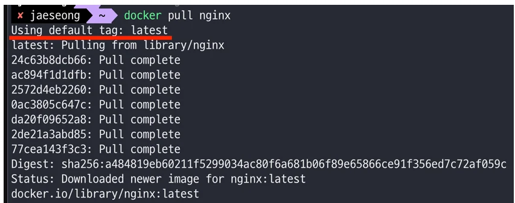
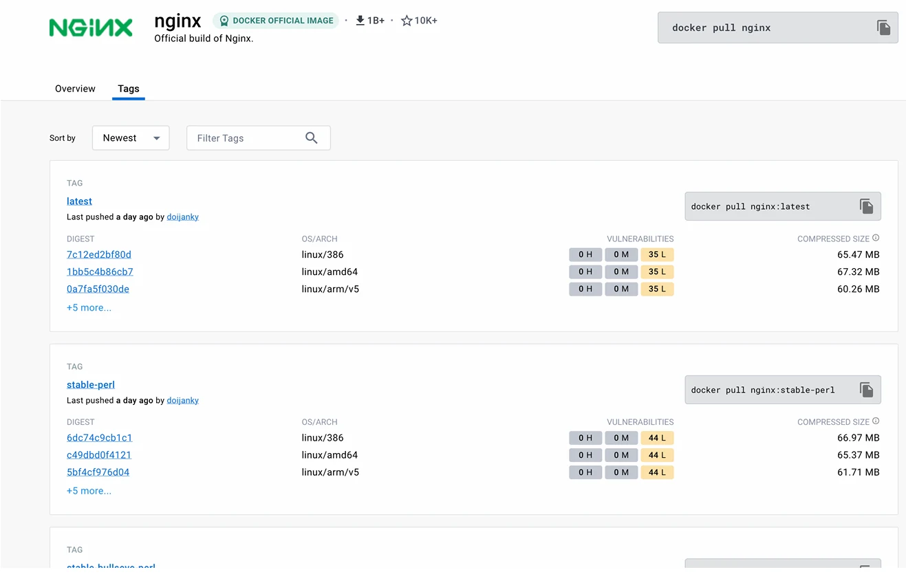
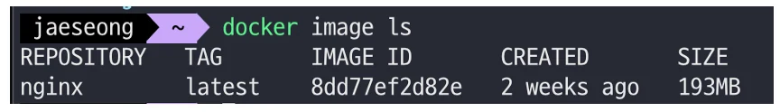

# [Docker] Docker CLI 익히기

## 원문

https://ch010104.tistory.com/96

## 노트 유형

`guide`

## 적용 목적과 전제조건

Docker 이미지는 특정 애플리케이션이 실행되기 위한 모든 설정, 코드, 라이브러리가 포함된 패키지

컨테이너는 이미지에서 실행되는 실행 단위로, 하나의 독립된 리눅스 환경이라 생각

## 구현 절차·검증·주의점

### 📥 1. Docker 이미지(Image) 다운로드





Docker 이미지는 특정 애플리케이션이 실행되기 위한 모든 설정, 코드, 라이브러리가 포함된 패키지

DockerHub에서 이미지를 다운로드(pull)

1) 최신 버전 이미지 다운로드

```bash
$ docker pull nginx        # == docker pull nginx:latest
```

nginx는 공식 이미지 이름

latest는 기본 태그로 최신 버전을 의미

2) 특정 태그 버전 이미지 다운로드

```bash
$ docker pull nginx:stable-perl
```

:stable-perl은 특정 버전을 명시한 태그

🔗 태그 확인은 DockerHub nginx 페이지에서 가능

### 🔍 2. 이미지 확인 및 삭제



1) 다운로드한 이미지 목록 확인

```bash
$ docker image ls
```

2) 이미지 삭제

```bash
$ docker image rm 이미지명_or_ID
```

사용 중인 컨테이너가 없어야 삭제 가능

ID 일부만 입력해도 됨 (단, 중복되면 삭제 불가)

3) 강제 삭제

```bash
$ docker image rm -f 이미지명_or_ID
```

4) 모든 이미지 삭제

```bash
# 사용하지 않는 이미지 전체 삭제
$ docker image rm $(docker images -q)

# 강제로 전체 삭제
$ docker image rm -f $(docker images -q)
```

### 📦 3. 컨테이너(Container) 생성과 실행

컨테이너는 이미지에서 실행되는 실행 단위로, 하나의 독립된 리눅스 환경이라 생각

1) 컨테이너 생성 (실행은 안 함)

```bash
$ docker create nginx
```

2) 생성한 컨테이너 실행

```bash
$ docker start 컨테이너ID_또는_이름

# Nginx 컨테이너 중단 후 삭제하기
$ docker ps
# 실행 중인 컨테이너 조회

$ docker stop {nginx를 실행시킨 Contnainer ID}
# 컨테이너 중단

$ docker rm {nginx를 실행시킨 Contnainer ID}
# 컨테이너 삭제

$ docker image rm nginx
# Nginx 이미지 삭제
```

> 원문 코드가 길어 이 노트에서는 앞부분만 보존했습니다. 전체는 원문에서 확인합니다.

### 🚀 4. 컨테이너 생성 + 실행 (run 명령어)

가장 일반적인 컨테이너 실행 방식

```bash
$ docker run nginx               # 포그라운드 실행
$ docker run -d nginx           # 백그라운드 실행
```

1) 이름 지정 + 백그라운드 실행

```bash
$ docker run -d --name my-web-server nginx
```

2) 포트 연결 (호스트:컨테이너)

```bash
$ docker run -d -p 4000:80 nginx
```

호스트의 4000번 포트를 컨테이너의 80번 포트와 연결

### 🧭 5. 컨테이너 조회 / 중지 / 삭제

1) 실행 중인 컨테이너 조회

```bash
$ docker ps​
```

2) 전체 컨테이너 조회 (중지 포함)

```bash
$ docker ps -a
```

3) 컨테이너 중지

```bash
$ docker stop 컨테이너명_or_ID
```

4) 강제 중지 (비정상 종료)

```bash
$ docker kill 컨테이너명_or_ID
```

5) 컨테이너 삭제

```bash
# 중지된 컨테이너 삭제
$ docker rm 컨테이너명_or_ID

# 실행 중인 컨테이너 강제 삭제
$ docker rm -f 컨테이너명_or_ID

# 전체 삭제
$ docker rm $(docker ps -qa)               # 중지된 모든 컨테이너
$ docker rm -f $(docker ps -qa)           # 실행 중 포함 모든 컨테이너
```

### 🧾 6. 컨테이너 로그 확인

1) 전체 로그 보기

```bash
$ docker logs 컨테이너명_or_ID
```

2) 최근 n줄만 보기

```bash
$ docker logs --tail 10 컨테이너명_or_ID
```

3) 실시간 로그 보기 (follow)

```bash
$ docker logs -f 컨테이너명_or_ID
```

4) 실시간 로그만 보기 (기존 로그 제외)

```bash
$ docker logs --tail 0 -f 컨테이너명_or_ID
```

### 🖥️ 7. 컨테이너 내부 접속

컨테이너는 리눅스처럼 bash로 접근 가능!

```bash
$ docker exec -it 컨테이너명_or_ID bash
```

내부 쉘에서 ls, cd, cat 등 리눅스 명령어 사용 가능

종료는 Ctrl+D 또는 exit

### 🛠️ 8. 실습: Nginx 실행 전체 흐름

```bash
# 1. 이미지 다운로드
$ docker pull nginx

# 2. 이미지 확인
$ docker image ls

# 3. 컨테이너 실행
$ docker run --name webserver -d -p 80:80 nginx

# 4. 실행 확인
$ docker ps

# 5. 중지 및 삭제
$ docker stop webserver
$ docker rm webserver
$ docker image rm nginx
```

### 🛠️9. 실습: Redis 실행

```bash
# 1. Redis 이미지로 컨테이너 실행
$ docker run -d -p 6379:6379 redis

# 2. 이미지 확인
$ docker image ls

# 3. 실행 확인
$ docker ps

# 4. 로그 확인
$ docker logs 컨테이너명_or_ID

# 5. Redis CLI 사용
$ docker exec -it 컨테이너명_or_ID bash
$ redis-cli
127.0.0.1:6379> set 1 jscode
127.0.0.1:6379> get 1
```

## 관련 글

- [[blog/DOCKER/index|DOCKER]]
- [[blog/DOCKER/Dokcer- Docker란 무엇일까-- (Container 란--, Image 란--)|[Dokcer] Docker란 무엇일까?? (Container 란??, Image 란??)]]
- [[blog/DOCKER/Docker- Docker Container 데이터 유실 방지하기 - Volume 사용하기|[Docker] Docker Container 데이터 유실 방지하기 - Volume 사용하기]]
- [[blog/DOCKER/Docker- Dockerfile를 사용하여 dockerimage 직접 만들기|[Docker] Dockerfile를 사용하여 dockerimage 직접 만들기]]
