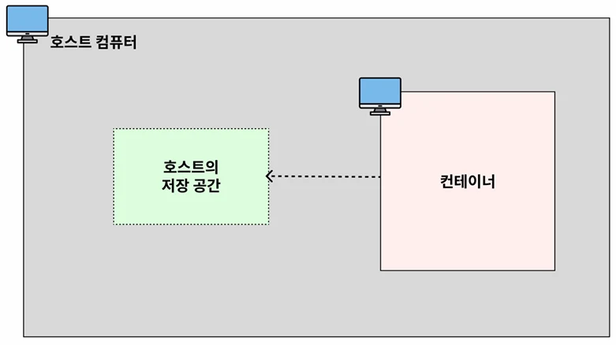
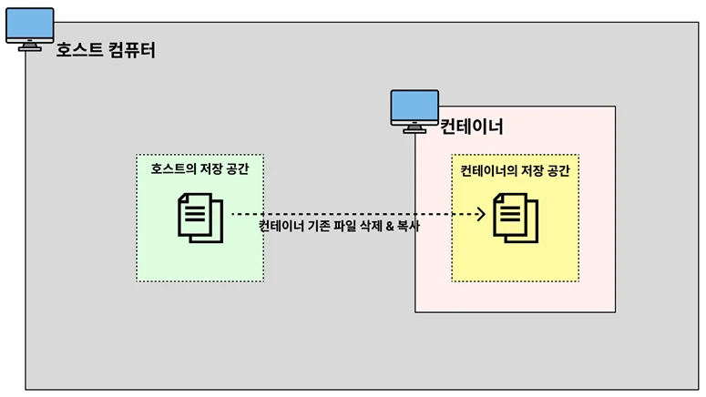
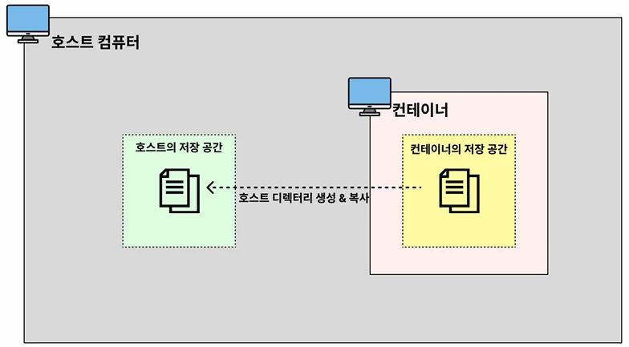

# [Docker] Docker Container 데이터 유실 방지하기 - Volume 사용하기

## 원문

https://ch010104.tistory.com/97

## 노트 유형

`concept`

## 핵심 개념과 선택 맥락

Docker를 활용하면 특정 프로그램을 컨테이너로 띄워서 간편하게 실행할 수 있음

하지만 컨테이너는 수명이 짧고, 새로운 기능이 추가되면 기존 컨테이너를 수정하지 않고 새 이미지로 교체함.

## 원문 기반 개념 정리

Docker를 활용하면 특정 프로그램을 컨테이너로 띄워서 간편하게 실행할 수 있음

하지만 컨테이너는 수명이 짧고, 새로운 기능이 추가되면 기존 컨테이너를 수정하지 않고 새 이미지로 교체함.

이 구조가 효율적이긴 하지만, 문제는 컨테이너 안에 있던 데이터도 함께 삭제된다!!

예를 들어, MySQL 컨테이너를 사용하다가 교체하면 MySQL에 저장된 데이터까지 같이 사라져버리는 일이 발생

이런 문제를 해결하기 위해 Docker는 볼륨(Volume) 이라는 개념을 제공

### 📌 1. Docker Volume(도커 볼륨) 이란?

Docker Volume은 도커 컨테이너에서 데이터를 영속적으로 저장하기 위한 방법

컨테이너 자체의 저장 공간을 사용하는 것이 아니라, 호스트 머신의 저장 공간을 공유하여 데이터를 유지

즉, 컨테이너가 삭제되어도 데이터는 유지

```bash
$ docker run -v [호스트의 디렉토리 절대경로]:[컨테이너의 디렉토리 절대경로] [이미지명]:[태그명]
```

1) 볼륨 디렉토리 존재 여부에 따른 동작

호스트 경로에 디렉토리가 존재할 경우 → 호스트 디렉터리가 컨테이너 디렉터리를 덮어쓴다

호스트 경로에 디렉토리가 존재하지 않을 경우 → 호스트 디렉토리를 새로 만들고, 컨테이너 디렉토리 내 파일들을 복사해온다

### 🧪 2. 실습: Docker로 MySQL 실행하기

1) 기본 MySQL 컨테이너 실행 (Volume 미사용)

```bash
$ docker run -e MYSQL_ROOT_PASSWORD=password123 -p 3306:3306 -d mysql
```

-e: 환경 변수 설정 옵션

MYSQL_ROOT_PASSWORD=password123: 루트 계정 비밀번호 설정 (필수)

-p 3306:3306: 호스트의 3306 포트를 컨테이너에 연결

-d: 백그라운드 실행

❗ 참고: docker pull mysql 명령 없이도 docker run mysql 하면 자동으로 이미지를 다운로드 받아 실행

2) 환경변수 직접 확인하기

```bash
$ docker exec -it <MySQL 컨테이너 ID> bash
$ echo $MYSQL_ROOT_PASSWORD
$ export  # 전체 환경변수 출력
```

3) 실행 확인

```bash
$ docker ps              # 컨테이너 실행 중인지 확인
$ docker logs <ID>       # 에러 없이 실행됐는지 로그 확인
```

### 🧪 3. 실습: MySQL에 직접 접속해보기

```bash
$ docker exec -it <MySQL 컨테이너 ID> bash
# mysql -u root -p
> show databases;
> create database mydb;
> show databases;
```

❌ 컨테이너 삭제 시 데이터도 삭제됨

```bash
$ docker stop <ID>
$ docker rm <ID>

# 다시 컨테이너 실행
$ docker run -e MYSQL_ROOT_PASSWORD=password123 -p 3306:3306 -d mysql
$ docker exec -it <ID> bash
$ mysql -u root -p
> show databases;  # 이전에 만든 mydb 사라짐!
```

이처럼 Volume을 쓰지 않으면 데이터도 함께 사라지게 됨.

### 4. 볼륨을 활용해 MySQL 데이터 보존하기

📁 1) 호스트 디렉토리 생성

```bash
$ cd /Users/jaeseong/Documents/Develop
$ mkdir docker-mysql
```

❗ 중요한 주의사항

mysql_data 디렉토리를 미리 만들지 말 것!

컨테이너의 /var/lib/mysql 초기 파일이 복사되어야 하기 때문

▶️ 2) 볼륨과 함께 MySQL 실행

```bash
$ docker run -e MYSQL_ROOT_PASSWORD=password123 \
  -p 3306:3306 \
  -v /Users/jaeseong/Documents/Develop/docker-mysql/mysql_data:/var/lib/mysql \
  -d mysql
```

/var/lib/mysql 은 MySQL 데이터가 저장되는 위치입니다 (Docker Hub 공식 문서 참고)

✅ 3) 컨테이너 내부에서 DB 생성 후 종료

```bash
$ docker exec -it <ID> bash
# mysql -u root -p
> create database mydb;
> show databases;
```

```bash
# 컨테이너 종료 및 삭제
$ docker stop <ID>
$ docker rm <ID>

# 다시 생성해도 DB 유지 확인
$ docker run -e MYSQL_ROOT_PASSWORD=password123 \
  -p 3306:3306 \
  -v /Users/jaeseong/Documents/Develop/docker-mysql/mysql_data:/var/lib/mysql \
  -d mysql
$ docker exec -it <ID> bash
$ mysql -u root -p
> show databases;  # 🎉 mydb 그대로 존재!
```

❓4) 비밀번호를 바꿨는데 접속이 안 된다?

```bash
$ docker run -e MYSQL_ROOT_PASSWORD=pwd1234 \
  -p 3306:3306 \
  -v /Users/jaeseong/Documents/Develop/docker-mysql/mysql_data:/var/lib/mysql \
  -d mysql
```

❗ 접속 불가! 이유는?

→ 이미 볼륨에 저장된 MySQL 설정에 비밀번호 정보도 포함되어 있기 때문!!

✅ 해결 방법

기존 볼륨 디렉토리 삭제 후 새로 생성

또는 다른 경로로 볼륨 지정

### 🧪 5. PostgreSQL도 동일한 방법으로 실행 가능

```bash
$ mkdir -p /Users/jaeseong/Documents/Develop/docker-postgresql/postgresql_data

$ docker run -e POSTGRES_PASSWORD=password123 \
  -p 5432:5432 \
  -v /Users/jaeseong/Documents/Develop/docker-postgresql/postgresql_data:/var/lib/postgresql/data \
  -d postgres
```

```bash
$ docker exec -it <ID> bash
# psql -U postgres
```

/var/lib/postgresql/data 경로에 데이터 저장됨

```bash
$ docker ps

$ docker logs [컨테이너 ID 또는 컨테이너명]

$ docker exec -it [컨테이너 ID 또는 컨테이너명] bash
```

### 🧪 6. MongoDB도 마찬가지

```bash
$ mkdir -p /Users/jaeseong/Documents/Develop/docker-mongodb/mongodb_data

$ docker run \
  -e MONGO_INITDB_ROOT_USERNAME=root \
  -e MONGO_INITDB_ROOT_PASSWORD=password123 \
  -p 27017:27017 \
  -v /Users/jaeseong/Documents/Develop/docker-mongodb/mongodb_data:/data/db \
  -d mongo
```

```bash
$ docker exec -it <ID> bash
# mongosh
```

/data/db 경로에 데이터 저장

```text
$ mongosh
```

## 핵심 이미지







## 관련 글

- [[blog/DOCKER/index|DOCKER]]
- [[blog/DOCKER/Docker- Docker CLI 익히기|[Docker] Docker CLI 익히기]]
- [[blog/DOCKER/Docker- Dockerfile를 사용하여 dockerimage 직접 만들기|[Docker] Dockerfile를 사용하여 dockerimage 직접 만들기]]
- [[blog/DOCKER/Dokcer- Docker란 무엇일까-- (Container 란--, Image 란--)|[Dokcer] Docker란 무엇일까?? (Container 란??, Image 란??)]]
