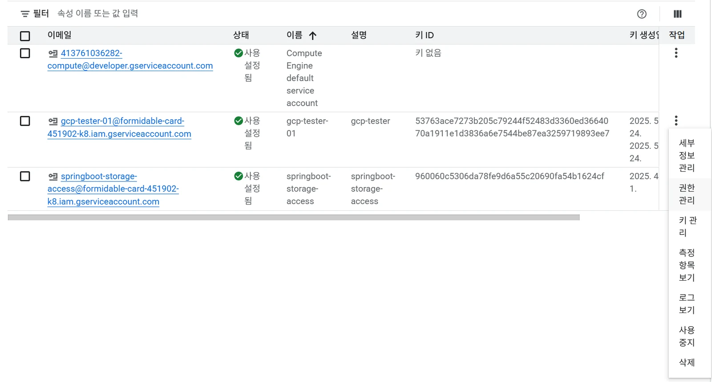
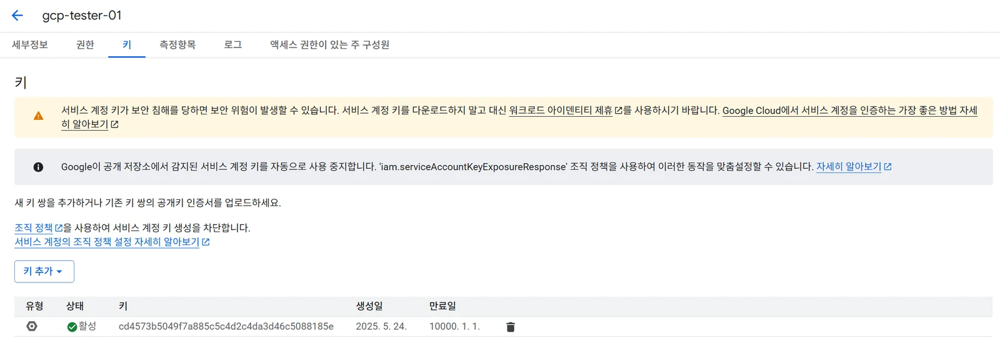

# [GCP] GCP로 프로젝트 배포하기 - ( 3 ) GCP Service 계정 & 키 생성

## 원문

https://ch010104.tistory.com/81

## 노트 유형

`project`

## 배경·목표·적용 맥락

GCP IAM의 서비스 키는 주로 애플리케이션이나 서비스가 GCP 리소스에 접근할 수 있도록 인증하는 데 사용됨.

서비스 키는 서비스 계정과 연결되며, 이를 통해 애플리케이션이 안전하게 GCP API를 호출할 수 있음

## 구현·의사결정·결과

GCP IAM의 서비스 키는 주로 애플리케이션이나 서비스가 GCP 리소스에 접근할 수 있도록 인증하는 데 사용됨.

서비스 키는 서비스 계정과 연결되며, 이를 통해 애플리케이션이 안전하게 GCP API를 호출할 수 있음

1. IAM 및 관리자 / 서비스 계정 에서 내가 원하는 서비스 계정을 생성 가능

- 이 때 어떠한 권한을 부여할 줄 것인지도 선택 가능

2. 생성된 계정의 작업 부분의 점 3개를 클릭 해서 키 관리 가능

3. 키 추가를 통해 생성 가능

- 생성된 키는 나중에 필요하기 때문에 따로 파일을 저장해 놓아야함

## 핵심 이미지

## 관련 글

- [[blog/GCP/index|GCP]]
- [[blog/GCP/GCP- GCP로 프로젝트 배포하기 - ( 4 ) I AM 에서 역할 생성하기|[GCP] GCP로 프로젝트 배포하기 - ( 4 ) I AM 에서 역할 생성하기]]
- [[blog/GCP/GCP- GCP로 프로젝트 배포하기 - ( 1 ) GCP 란|[GCP] GCP로 프로젝트 배포하기 - ( 1 ) GCP 란?]]
- [[blog/GCP/GCP- GCP로 프로젝트 배포하기 - ( 5 ) GCP VPC 란|[GCP] GCP로 프로젝트 배포하기 - ( 5 ) GCP VPC 란?]]
