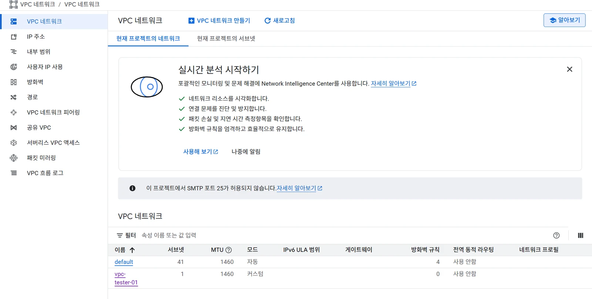

# [GCP] GCP로 프로젝트 배포하기 - ( 6 ) GCP VPC 생성하기

## 원문

https://ch010104.tistory.com/87

## 노트 유형

`project`

## 배경·목표·적용 맥락

GCP 콘솔에서 VPC 네트워크/VPC 네트워크를 들어가면 현재 프로젝트의 네트워크를 확인 가능

여기에 새로운 VPC를 생성해서 이후에 내부적인 서비스를 처리할 예정

## 구현·의사결정·결과

GCP 콘솔에서 VPC 네트워크/VPC 네트워크를 들어가면 현재 프로젝트의 네트워크를 확인 가능

기본 네트워크인 default가 생성되어 있는 경우가 있음

여기에 새로운 VPC를 생성해서 이후에 내부적인 서비스를 처리할 예정

### VPC 네트워크 생성 및 설정 방법(방화벽의 경우는 나중에 추가 예정)

VPC 네트워크 만들기 클릭

이름/설명(ex vpc-tester-01) 입력 및 최대 전송 단위(MTU) = 1460 으로 설정

나머지 설정은 건들지 말고, 서브넷을 하나 추가할 예정(이름/설명(ex subnet-tester-01) 입력 및 IP 스택 유형 IPv4(단일 스택) 선택)

IPv4 범위를 10.0.0.0/24 로 설정

비공개 Google 엑세스만 '사용'하고, 나머진 '사용 안함' 설정

만들기

이제 다시 VPC 네트워크 목록으로 돌아가면 새로 만든 VPC가 생긴 것을 확인 할 수 있음

이후 해당 VPC에 부가적인 설정(방화벽 규칙 등)을 추가 가능

## 관련 글

- [[blog/GCP/index|GCP]]
- [[blog/GCP/GCP- GCP로 프로젝트 배포하기 - ( 6 ) GCP VPC 생성하기 (89)|[GCP] GCP로 프로젝트 배포하기 - ( 6 ) GCP VPC 생성하기]]
- [[blog/GCP/GCP- GCP로 프로젝트 배포하기 - ( 5 ) GCP VPC 란|[GCP] GCP로 프로젝트 배포하기 - ( 5 ) GCP VPC 란?]]
- [[blog/GCP/GCP- GCP로 프로젝트 배포하기 - ( 6 ) GCS 란- GCS 생성하기|[GCP] GCP로 프로젝트 배포하기 - ( 6 ) GCS 란?  GCS 생성하기]]
