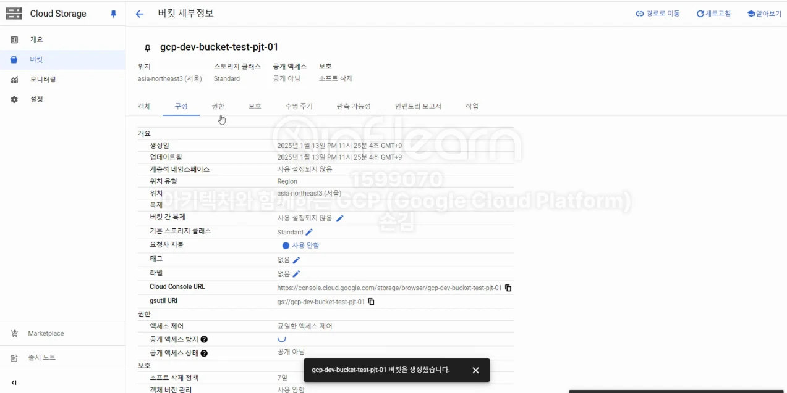

# [GCP] GCP로 프로젝트 배포하기 - ( 6 ) GCS 란?  GCS 생성하기

## 원문

https://ch010104.tistory.com/91

## 노트 유형

`project`

## 배경·목표·적용 맥락

GCP의 GCS는 Google Cloud Storage의 약자로, Google Cloud Platform에서 제공하는 객체 스토리지 서비스

GCS는 대규모 데이터를 저장하고 관리할 수 있는 안정적이고 확장 가능한 스토리지 솔루션을 제공

## 구현·의사결정·결과

### GCS (Google Cloud Storage) 란?

GCP의 GCS는 Google Cloud Storage의 약자로, Google Cloud Platform에서 제공하는 객체 스토리지 서비스

GCS는 대규모 데이터를 저장하고 관리할 수 있는 안정적이고 확장 가능한 스토리지 솔루션을 제공

GCS에서는 다음과 같은 장점이 있음

확장성: 페타바이트 이상의 데이터를 저장할 수 있으며, 자동으로 확장됨

내구성: 데이터의 내구성을 보장하기 위해 여러 지역에 걸쳐 복제됨

보안: 데이터 암호화 및 다양한 접근 제어 옵션을 제공함.

비용 효율성: 사용한 만큼만 비용을 지불하는 유연한 가격 정책을 제공됨.

통합성: 다른 GCP 서비스와 쉽게 통합할 수 있음.

GCS는 주로 백업, 아카이빙, 빅데이터 분석, 콘텐츠 저장 및 배포 등에 사용됨.

### GCS 생성하기

1. GCP 콘솔로 이동 → GCS 서비스 화면으로 이동 한다.

2. GCS 서비스에서 버킷 만들기를 클릭하여 버킷을 만드는 화면으로 이동한다.

3. 버킷 이름은 고유하고 영구적인 이름을 선택 해야한다. (버킷 이름이 중복되면 사용하지 못한다.)

4. 나는 gcp-dev-pjt-test-01 이라는 버킷 이름을 사용 하였다.

5. 데이터 저장 위처 선택 → 단일 Region을 선택 → asia-northeast3 (서울) 러진을 선택

6. 데이터의 스토리지 클래스는 기본 클래스 설정에 Standard를 선택한다.

7. 객체 엑세스 제어 방식 설정 : 균일한 엑세스 제어를 선택 후 계속으로 다음 진행.

8. 객체 데이터를 보호하는 방법에서 데이터 보호 정책에 체크박스를 해제 후 다음으로 이동한다.

9. 마지막으로 만들기를 클릭하여 GCS를 생성한다.

## 관련 글

- [[blog/GCP/index|GCP]]
- [[blog/GCP/GCP- GCP로 프로젝트 배포하기 - ( 6 ) GCP VPC 생성하기 (89)|[GCP] GCP로 프로젝트 배포하기 - ( 6 ) GCP VPC 생성하기]]
- [[blog/GCP/GCP- GCP로 프로젝트 배포하기 - ( 6 ) GCP VPC 생성하기|[GCP] GCP로 프로젝트 배포하기 - ( 6 ) GCP VPC 생성하기]]
- [[blog/GCP/GCP- GCP로 프로젝트 배포하기 - ( 5 ) GCP VPC 란|[GCP] GCP로 프로젝트 배포하기 - ( 5 ) GCP VPC 란?]]
