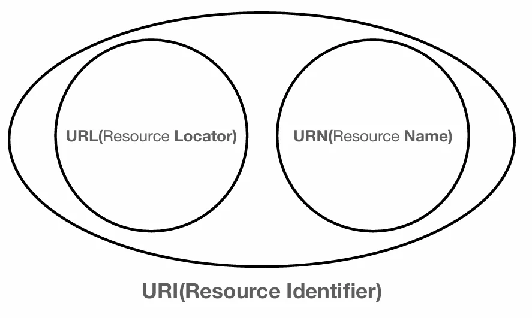
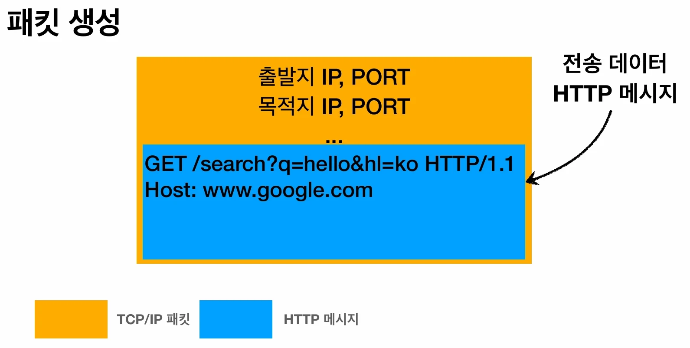

# [모든 개발자를 위한 HTTP 웹 기본 지식] 2. URI의 개념과 웹 브라우저의 요청 흐름

## 원문

https://ch010104.tistory.com/242

## 노트 유형

`tutorial`

## 학습 목표 및 맥락

URI는 리소스를 식별하는 통일된 방식을 의미하며, 크게 URL과 URN으로 분류됩니다.

URL (Uniform Resource Locator): 리소스가 있는 위치를 지정합니다.

## 원문 기반 학습 정리

### 1. URI (Uniform Resource Identifier)의 이해

URI는 리소스를 식별하는 통일된 방식을 의미하며, 크게 URL과 URN으로 분류됩니다.

URL (Uniform Resource Locator): 리소스가 있는 위치를 지정합니다.

URN (Uniform Resource Name): 리소스에 고유한 이름을 부여합니다.

특징: 위치는 변할 수 있지만 이름은 변하지 않습니다. 다만, URN만으로 리소스를 찾는 방식은 보편화되지 않아 보통 URI를 URL과 유사한 의미로 사용합니다.

### URL의 전체 문법과 구조

scheme://[userinfo@]host[:port][/path][?query][#fragment]

구성 요소 설명 비고

### 2. 웹 브라우저 요청 흐름

사용자가 URL을 입력했을 때, 서버로부터 결과를 받기까지의 과정은 다음과 같습니다.

### 1단계: 요청 메시지 생성 및 패킷 전달

DNS 조회: 도메인명을 통해 서버의 IP 주소를 확인하고 포트 번호를 파악합니다.

HTTP 요청 메시지 생성: 웹 브라우저가 다음과 같은 메시지를 작성합니다.

• 예: GET /search?q=hello&hl=ko HTTP/1.1

패킷 래핑: 생성된 HTTP 메시지를 SOCKET 라이브러리를 통해 전달하고, TCP/IP 패킷으로 감쌉니다. 이 패킷에는 출발지/목적지 IP와 PORT 정보가 포함됩니다.

### 2단계: 서버 응답 및 브라우저 렌더링

서버 처리: 구글 서버가 요청을 확인하고 HTTP 응답 메시지를 생성합니다.

◦ 응답 예: HTTP/1.1 200 OK, 데이터 형식(Content-Type), 실제 HTML 데이터 등.

응답 전달: 응답 메시지가 다시 TCP/IP 패킷에 담겨 웹 브라우저로 전달됩니다.

렌더링: 웹 브라우저가 도착한 HTTP 메시지 안의 HTML 데이터를 해석하여 화면에 출력합니다.

## 관련 글

- [[blog/INFLEARN/index|INFLEARN]]
- [[blog/INFLEARN/모든 개발자를 위한 HTTP 웹 기본 지식- 1. 인터넷 네트워크|[모든 개발자를 위한 HTTP 웹 기본 지식] 1. 인터넷 네트워크]]
- [[blog/INFLEARN/모든 개발자를 위한 HTTP 웹 기본 지식- 4. HTTP 메서드 활용 및 API 설계|[모든 개발자를 위한 HTTP 웹 기본 지식] 4. HTTP 메서드 활용 및 API 설계]]
- [[blog/INFLEARN/모든 개발자를 위한 HTTP 웹 기본 지식- 5. HTTP 상태코드 (HTTP Status Codes)|[모든 개발자를 위한 HTTP 웹 기본 지식] 5. HTTP 상태코드 (HTTP Status Codes)]]
