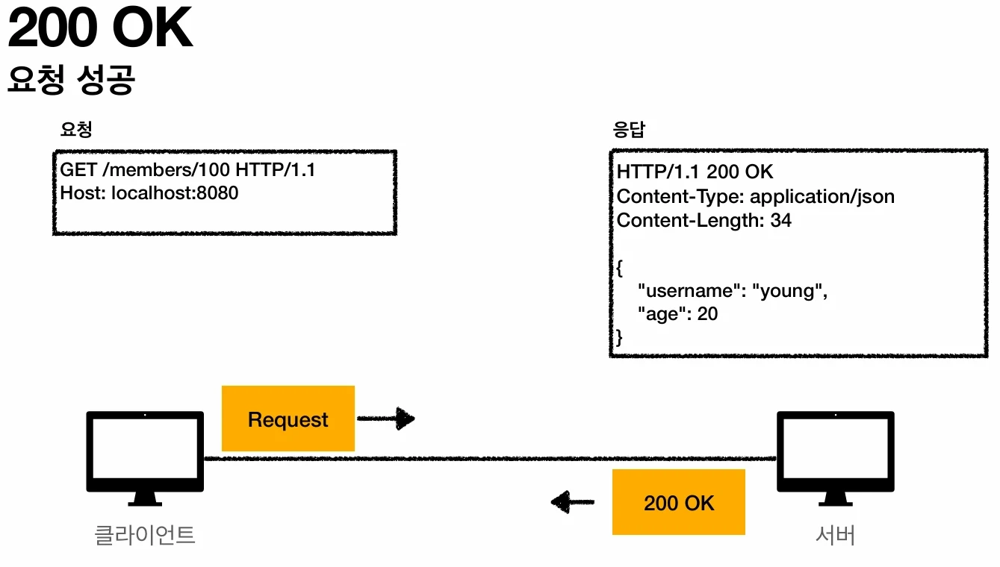
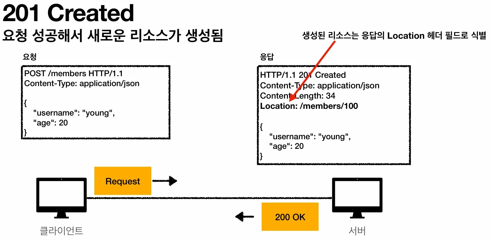
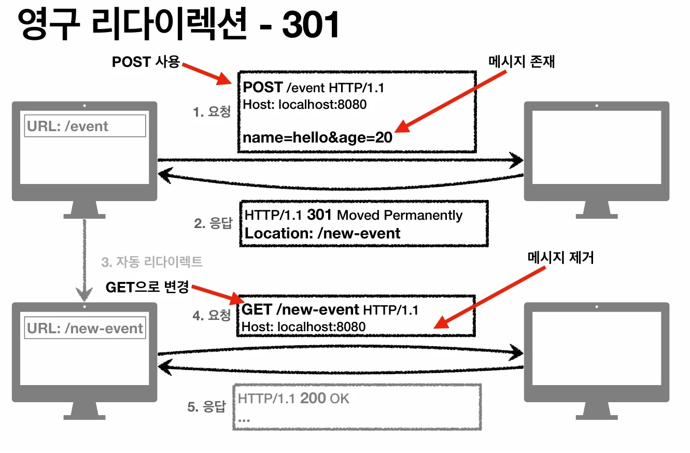

# [모든 개발자를 위한 HTTP 웹 기본 지식] 5. HTTP 상태코드 (HTTP Status Codes)

## 원문

https://ch010104.tistory.com/248

## 노트 유형

`tutorial`

## 학습 목표 및 맥락

상태 코드는 클라이언트가 보낸 요청의 처리 상태를 응답에서 알려주는 기능입니다.

1xx (Informational): 요청이 수신되어 처리 중 (거의 사용 안 함)

## 원문 기반 학습 정리

### 1. 개요

상태 코드는 클라이언트가 보낸 요청의 처리 상태를 응답에서 알려주는 기능입니다.

1xx (Informational): 요청이 수신되어 처리 중 (거의 사용 안 함)

2xx (Successful): 요청 정상 처리

3xx (Redirection): 요청 완료를 위해 추가 행동 필요

4xx (Client Error): 클라이언트 오류 (잘못된 문법 등)

5xx (Server Error): 서버 오류 (정상 요청을 처리하지 못함)

모르는 상태 코드가 나타나면? 클라이언트는 상위 상태 코드(예: 299 -> 2xx)로 해석해서 처리합니다. 이를 통해 미래에 새로운 코드가 추가되어도 클라이언트를 변경할 필요가 없습니다.

### 2. 2xx - 성공 (Successful)

클라이언트의 요청을 성공적으로 처리한 상태입니다.

200 OK: 요청 성공.

예시: 웹 브라우저에서 특정 게시글 내용을 조회(GET)했을 때 데이터를 정상적으로 받아오는 경우.

201 Created: 요청 성공으로 새로운 리소스가 생성됨.

예시: 회원가입 폼을 제출(POST)하여 서버에 새로운 사용자 계정이 생성된 경우. (응답의 Location 헤더에 생성된 리소스 주소 포함)

202 Accepted: 요청이 접수되었으나 처리가 완료되지 않음.

예시: 대규모 데이터 리포트 생성 요청을 보냈을 때, 서버가 "접수 확인, 나중에 완료되면 알려줄게"라고 응답하는 경우(배치 처리).

204 No Content: 요청을 성공적으로 수행했지만, 응답 본문에 보낼 데이터가 없음.

예시: 웹 문서 편집기에서 '저장' 버튼을 눌렀을 때, 화면 이동 없이 저장만 완료된 경우.

### 3. 3xx - 리다이렉션 (Redirection)

웹 브라우저는 3xx 응답에 Location 헤더가 있으면 해당 위치로 자동 이동합니다.

### 영구 리다이렉션 (URI가 영구적으로 이동)

301 Moved Permanently: 리다이렉트 시 요청 메서드가 GET으로 변하고 본문이 제거될 수 있음.

예시: 기존 /event 페이지를 /new-event로 영구 변경했을 때. 검색 엔진도 바뀐 주소로 인지함.

본문(Body)를 제거하기 때문에, 새로운 /new-event주소에서 이전 요청의 본문을 포함해서 다시 요청해야함

회원가입 POST 였다면, 새로운 new 회원가입 화면으로만 이동하고, 정보를 다시 입력해서 POST 요청해야함

308 Permanent Redirect: 301과 같으나, 요청 메서드와 본문을 유지함.

예시: 회원가입(POST) 도중 주소가 영구 변경되어도 리다이렉트된 주소로 동일하게 가입 정보(POST)를 보냄.

본문이 유지되고 회원가입의 POST 요청이 유지되기 때문에, 정보를 다시 입력하지 않아도 회원가입이 됨

실무에서는 301을 많이 사용함(/new-event 처럼 주소가 바뀌면 이전의 본문을 사용하지 못하는 경우가 많음)

### 일시적인 리다이렉션 (URI가 일시적으로 변경)

302 Found: 요청 메서드가 GET으로 변할 수 있음 (현실적으로 가장 많이 사용).

예시: 이벤트 기간에만 잠시 다른 페이지로 보낼 때.

요청 메서드가 GET으로 바뀔수도 있고, 아닐수도 있음

307 Temporary Redirect: 요청 메서드와 본문 유지 (메서드 변경 금지).

예시: 302와 같으나, 처음 보낸 POST 메서드를 리다이렉트 시에도 반드시 유지해야 할 때.

요청 메서드가 무조건 유지됨

303 See Other: 요청 메서드가 무조건 GET으로 변경됨.

예시: 주문 완료 후 새로고침 시 중복 주문을 막기 위해 '주문 완료 결과 페이지'로 GET 이동시킬 때(PRG 패턴).

### PRG: Post/Redirect/Get

일시적인 리다이렉션의 가장 흔하고 중요한 사용 사례입니다.

사용 전 문제점: POST 요청으로 주문 후 웹 브라우저를 새로고침하면, 마지막 요청이었던 POST가 다시 서버로 전송되어 중복 주문이 발생할 수 있습니다.

해결 방법: POST로 주문 후, 주문 결과 화면을 직접 응답하지 않고 결과 페이지 주소로 리다이렉트(302/303) 시킵니다.

결과: 리다이렉트 이후 브라우저의 URL은 GET 메서드 기반의 결과 조회 주소로 바뀌게 됩니다. 사용자가 새로고침을 해도 주문 결과 페이지만 다시 GET으로 조회하게 되어 중복 주문을 방지할 수 있습니다.

### 기타 리다이렉션

304 Not Modified: 캐시 목적으로 사용.

예시: 브라우저가 가진 이미지 파일이 서버와 비교해 바뀌지 않았을 때, 데이터를 다시 받지 않고 내 컴퓨터의 캐시를 사용하게 함.

### 4. 4xx - 클라이언트 오류 (Client Error)

오류의 원인이 클라이언트에 있으며, 똑같은 재시도는 계속 실패합니다.

400 Bad Request: 요청 구문이나 파라미터 오류.

예시: 필수 입력값인 '이름'을 누락하고 서버에 데이터를 보냈을 때.

401 Unauthorized: 인증(Authentication) 필요.

예시: 로그인이 필요한 마이페이지에 로그인하지 않은 상태로 접근했을 때.

참고: 인증 vs 인가

인증(Authentication): 본인이 누구인지 확인 (로그인)

인가(Authorization): 권한 부여 (특정 리소스에 접근할 수 있는 권한)

403 Forbidden: 서버가 요청을 이해했지만 승인을 거부함.

예시: 일반 사용자가 관리자 전용 페이지(/admin)에 접근하려고 할 때.

404 Not Found: 요청 리소스를 찾을 수 없음.

예시: 주소를 잘못 입력했거나, 삭제된 게시글 주소로 접근했을 때.

### 5. 5xx - 서버 오류 (Server Error)

서버 문제로 인해 발생하는 오류입니다. 서버가 복구되면 재시도 시 성공할 수 있습니다.

500 Internal Server Error: 서버 내부 문제로 인한 오류.

예시: 서버 코드에 버그가 있거나 데이터베이스 장애가 발생하여 처리가 안 될 때.

503 Service Unavailable: 일시적인 과부하 또는 예정된 작업으로 잠시 처리 불가.

예시: 서버 점검 중이거나 접속자가 너무 많아 서버가 응답을 거부할 때.

## 관련 글

- [[blog/INFLEARN/index|INFLEARN]]
- [[blog/INFLEARN/모든 개발자를 위한 HTTP 웹 기본 지식- 6. HTTP 일반 헤더|[모든 개발자를 위한 HTTP 웹 기본 지식] 6. HTTP 일반 헤더]]
- [[blog/INFLEARN/모든 개발자를 위한 HTTP 웹 기본 지식- 7. HTTP 헤더 - 캐시와 조건부 요청|[모든 개발자를 위한 HTTP 웹 기본 지식] 7. HTTP 헤더 - 캐시와 조건부 요청]]
- [[blog/INFLEARN/모든 개발자를 위한 HTTP 웹 기본 지식- 4. HTTP 메서드 활용 및 API 설계|[모든 개발자를 위한 HTTP 웹 기본 지식] 4. HTTP 메서드 활용 및 API 설계]]
