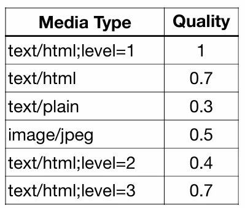
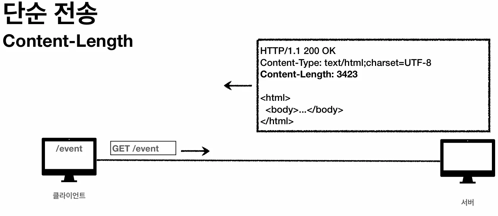
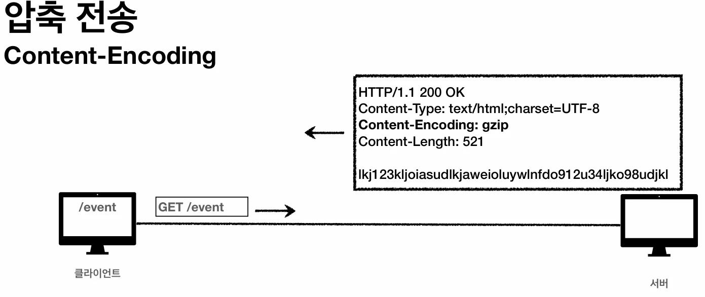

# [모든 개발자를 위한 HTTP 웹 기본 지식] 6. HTTP 일반 헤더

## 원문

https://ch010104.tistory.com/249

## 노트 유형

`tutorial`

## 학습 목표 및 맥락

형식: field-name ":" OWS field-value OWS (field-name은 대소문자 구분 없음)

용도: HTTP 전송에 필요한 모든 부가정보 포함 (메시지 바디 내용, 크기, 압축, 인증, 서버 정보, 캐시 관리 등)

## 원문 기반 학습 정리

### HTTP 헤더 1 - 일반 헤더 정리

### 1. HTTP 헤더 개요

형식: field-name ":" OWS field-value OWS (field-name은 대소문자 구분 없음)

용도: HTTP 전송에 필요한 모든 부가정보 포함 (메시지 바디 내용, 크기, 압축, 인증, 서버 정보, 캐시 관리 등)

표준 헤더: 매우 방대하며, 필요시 임의의 헤더 추가 가능

### 2. HTTP 바디와 헤더의 변화 (RFC2616 → RFC7230)

과거 (RFC2616): 엔티티(Entity)라는 용어 사용. 엔티티 헤더가 엔티티 본문 데이터를 해석하는 정보 제공.

최신 (RFC7230~7235): 표현(Representation) 이라는 용어 사용.

표현 = 표현 메타데이터 + 표현 데이터

메시지 본문(message body)을 통해 표현 데이터를 전달하며, 이를 **페이로드(payload)**라고 함.

### 3. 표현(Representation) 헤더

표현 헤더는 전송과 응답 모두에서 사용됩니다.

Content-Type: 표현 데이터의 형식 (미디어 타입, 문자 인코딩 - 예: text/html, application/json)

Content-Encoding: 표현 데이터 압축 방식 (데이터 전달 측에서 압축 후 추가 - 예: gzip, deflate)

gzip(압축함)

identity(압축 안함)

Content-Language: 표현 데이터의 자연 언어 (예: ko, en)

Content-Length: 표현 데이터의 길이 (바이트 단위)

### 4. 협상(Content Negotiation)

클라이언트가 선호하는 표현을 서버에 요청하는 것으로, 요청시에만 사용합니다.

종류: Accept (미디어 타입), Accept-Charset (문자 인코딩), Accept-Encoding (압축), Accept-Language (언어)

우선순위 (Quality Values, q):

0~1 사이의 값을 가지며 클수록 높은 우선순위 (생략 시 1).

더 구체적인 것이 우선함.

구체적인 타입을 기준으로 미디어 타입을 맞춤.

보장해주는 것은 아님(요청을 받는 서버가 지원해주는 것 중에서 우선순위가 높은 것으로 응답해주는 것)

### 5. 전송 방식

단순 전송: Content-Length를 지정하여 한 번에 전송.

압축 전송: Content-Encoding을 추가하여 압축 후 전송. (encoding함)

분할 전송 (Transfer-Encoding: chunked): 덩어리로 쪼개서 전송. 이 경우 Content-Length를 사용하면 안 됨.

아래의 예시는 5바이트씩 정보를 보내는 것임

범위 전송 (Range, Content-Range): 이미지 등을 받을 때 일부분만 요청하고 전송.

범위를 지정해서 정보를 지정해서 요청함

### 6. 일반 정보 및 특별한 정보

### 일반 정보

Referer: 이전 웹 페이지 주소 (유입 경로 분석용)

User-Agent: 클라이언트의 애플리케이션 정보 (브라우저 정보 등)

Server: 응답을 처리하는 오리진 서버의 소프트웨어 정보

Date: 메시지가 발생한 날짜와 시간

### 특별한 정보

Host: 요청한 호스트 정보 (도메인). 필수 헤더이며 하나의 IP에 여러 도메인이 적용된 서버에서 필수적임.

Location: 페이지 리다이렉션 시 이동할 주소 (3xx 응답 결과).

Allow: 허용 가능한 HTTP 메서드 (405 응답 시 포함).

Retry-After: 서비스 불능 시 다음 요청까지 대기해야 하는 시간.

### 7. 인증(Authentication)

Authorization: 클라이언트 인증 정보를 서버에 전달.

WWW-Authenticate: 401 Unauthorized 응답과 함께 사용되며, 필요한 인증 방법 정의.

### 8. 쿠키(Cookie)

HTTP의 무상태(Stateless) 특성을 보완하기 위해 사용됩니다.

전달 메커니즘: 서버에서 Set-Cookie로 전달하면 클라이언트는 쿠키 저장소에 보관하고, 이후 모든 요청 시 Cookie 헤더에 담아 전송.

생명주기:

세션 쿠키: 만료 날짜 생략 시 브라우저 종료 시까지만 유지.

영속 쿠키: expires나 max-age 설정 시 해당 시점까지 유지.

도메인(Domain): 명시하면 서브 도메인 포함, 생략 시 현재 문서 기준 도메인만 적용.

경로(Path): 지정된 경로를 포함한 하위 경로 페이지에서만 쿠키 접근 가능 (일반적으로 path=/ 설정).

보안:

Secure: https인 경우에만 전송.

HttpOnly: XSS 공격 방지 (JS에서 접근 불가).

SameSite: XSRF 공격 방지 (요청 도메인과 쿠키 도메인이 같은 경우만 전송).

## 관련 글

- [[blog/INFLEARN/index|INFLEARN]]
- [[blog/INFLEARN/모든 개발자를 위한 HTTP 웹 기본 지식- 5. HTTP 상태코드 (HTTP Status Codes)|[모든 개발자를 위한 HTTP 웹 기본 지식] 5. HTTP 상태코드 (HTTP Status Codes)]]
- [[blog/INFLEARN/모든 개발자를 위한 HTTP 웹 기본 지식- 7. HTTP 헤더 - 캐시와 조건부 요청|[모든 개발자를 위한 HTTP 웹 기본 지식] 7. HTTP 헤더 - 캐시와 조건부 요청]]
- [[blog/INFLEARN/모든 개발자를 위한 HTTP 웹 기본 지식- 4. HTTP 메서드 활용 및 API 설계|[모든 개발자를 위한 HTTP 웹 기본 지식] 4. HTTP 메서드 활용 및 API 설계]]
