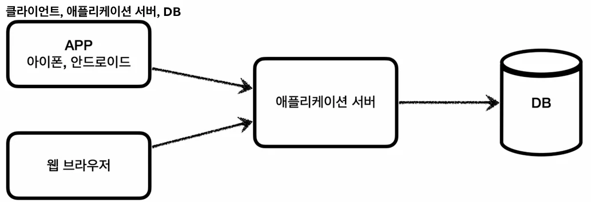
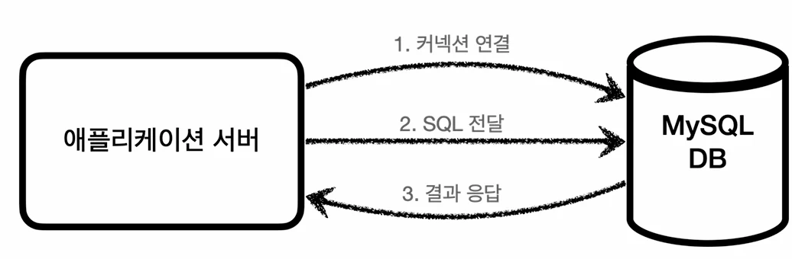
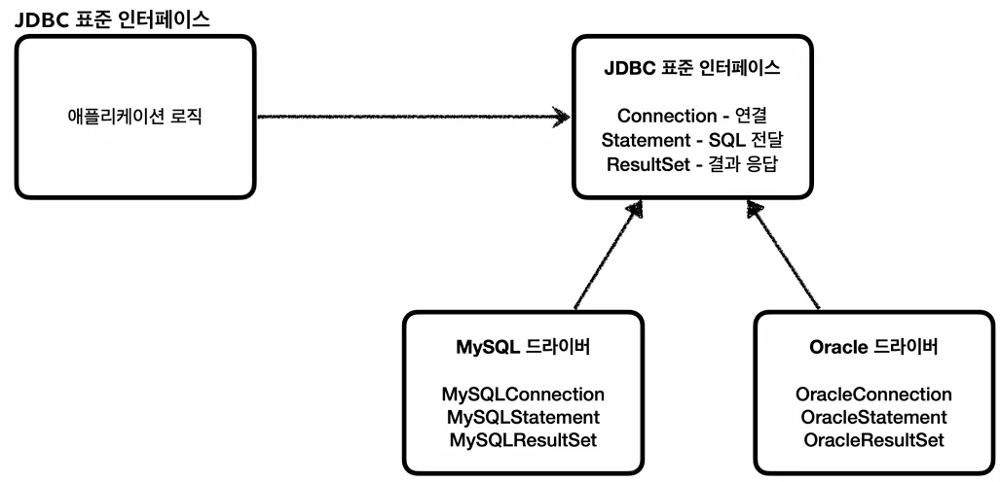

# [스프링 DB 1편 - 데이터 접근 핵심 원리] 1. JDBC 이해

## 원문

https://ch010104.tistory.com/294

## 노트 유형

`tutorial`

## 학습 목표 및 맥락

H2 데이터베이스는 가볍고 편리하며, SQL을 실행할 수 있는 웹 콘솔 화면을 제공하여 개발 및 테스트 용도로 매우 적합한 RDBMS입니다.

스프링 부트 3.x 사용 시: 2.1.214 버전 이상 필수 권장

## 원문 기반 학습 정리

### 1. H2 데이터베이스 설정

H2 데이터베이스는 가볍고 편리하며, SQL을 실행할 수 있는 웹 콘솔 화면을 제공하여 개발 및 테스트 용도로 매우 적합한 RDBMS입니다.

### 1.1 설치 및 실행 방법

버전 선택 가이드: 스프링 부트 버전에 맞게 다운로드합니다.

스프링 부트 2.x 사용 시: 1.4.200 버전 권장

스프링 부트 3.x 사용 시: 2.1.214 버전 이상 필수 권장

운영체제별 실행 방법:

MAC / Linux:

cd bin chmod 755 h2.sh ./h2.sh

Windows: h2.bat 더블 클릭 또는 터미널 실행

### 1.2 데이터베이스 파일 생성 및 최초 접속

최초 접속 (데이터베이스 파일 생성):

H2 웹 콘솔 로그인 화면에서 사용자명(sa)을 입력합니다.

JDBC URL에 jdbc:h2:~/test를 입력하고 [연결] 단위를 클릭합니다. (최초 생성 시 '연결 시험'을 누르면 오류가 발생할 수 있으므로 바로 '연결'을 누릅니다.)

사용자 홈 디렉토리에 ~/test.mv.db 파일이 정상적으로 생성되었는지 확인합니다.

이후 접속 (네트워크 모드):

파일 직접 제어로 인한 락(Lock) 문제를 방지하기 위해, 파일 생성 이후부터는 TCP 소켓 주소를 통해 접속합니다.

JDBC URL: jdbc:h2:tcp://localhost/~/test

💡 H2 데이터베이스가 정상 생성되지 않는 현상 해결책 H2를 기동하고 jdbc:h2:~/test 입력 시 Database "/Users/.../test" not found... [90149-200] 오류가 나는 경우 아래 단계를 따릅니다.

H2 데이터베이스를 완전히 종료한 후 재시작합니다.

웹 브라우저 자동 실행 시 주소창의 IP 주소(예: 100.1.2.3:8082/...) 확인합니다.

IP 부분을 localhost로만 변경하여 엔터를 누릅니다 (뒤의 jsessionid 쿼리 파라미터는 절대 건드리지 않아야 합니다).

예시: localhost:8082/login.jsp?jsessionid=...

변경된 화면에서 JDBC URL에 jdbc:h2:~/test를 입력하면 정상 생성됩니다. 이후에는 정상적으로 jdbc:h2:tcp://localhost/~/test로 사용합니다.

### 1.3 테스트 테이블 생성

프로젝트 내 테이블 관리를 위해 루트 경로에 sql/schema.sql 파일을 생성하고 아래 스크립트를 작성하여 H2 콘솔에서 실행합니다.

```sql
-- 기존 테이블 존재 시 삭제
drop table member if exists cascade;

-- member 테이블 생성
create table member (
    member_id varchar(10),
    money integer not null default 0,
    primary key (member_id)
);

-- 초기 테스트 데이터 삽입
insert into member (member_id, money) values ('hi1', 10000);
insert into member (member_id, money) values ('hi2', 20000);
```

실행 후 select * from member;를 통해 데이터가 올바르게 조회되는지 확인합니다.

### 2. JDBC의 이해와 데이터 접근 기술 개요

### 2.1 JDBC의 등장 배경

### 1. H2 데이터베이스 설정

H2 데이터베이스는 가볍고 편리하며, SQL을 실행할 수 있는 웹 콘솔 화면을 제공하여 개발 및 테스트 용도로 매우 적합한 RDBMS입니다.

### 1.1 설치 및 실행 방법

버전 선택 가이드: 스프링 부트 버전에 맞게 다운로드합니다.

스프링 부트 2.x 사용 시: 1.4.200 버전 권장

스프링 부트 3.x 사용 시: 2.1.214 버전 이상 필수 권장

운영체제별 실행 방법:

MAC / Linux:

cd bin chmod 755 h2.sh ./h2.sh

Windows: h2.bat 더블 클릭 또는 터미널 실행

### 1.2 데이터베이스 파일 생성 및 최초 접속

최초 접속 (데이터베이스 파일 생성):

H2 웹 콘솔 로그인 화면에서 사용자명(sa)을 입력합니다.

JDBC URL에 jdbc:h2:~/test를 입력하고 [연결] 단위를 클릭합니다. (최초 생성 시 '연결 시험'을 누르면 오류가 발생할 수 있으므로 바로 '연결'을 누릅니다.)

사용자 홈 디렉토리에 ~/test.mv.db 파일이 정상적으로 생성되었는지 확인합니다.

이후 접속 (네트워크 모드):

파일 직접 제어로 인한 락(Lock) 문제를 방지하기 위해, 파일 생성 이후부터는 TCP 소켓 주소를 통해 접속합니다.

JDBC URL: jdbc:h2:tcp://localhost/~/test

💡 H2 데이터베이스가 정상 생성되지 않는 현상 해결책 H2를 기동하고 jdbc:h2:~/test 입력 시 Database "/Users/.../test" not found... [90149-200] 오류가 나는 경우 아래 단계를 따릅니다.

H2 데이터베이스를 완전히 종료한 후 재시작합니다.

웹 브라우저 자동 실행 시 주소창의 IP 주소(예: 100.1.2.3:8082/...) 확인합니다.

IP 부분을 localhost로만 변경하여 엔터를 누릅니다 (뒤의 jsessionid 쿼리 파라미터는 절대 건드리지 않아야 합니다).

예시: localhost:8082/login.jsp?jsessionid=...

변경된 화면에서 JDBC URL에 jdbc:h2:~/test를 입력하면 정상 생성됩니다. 이후에는 정상적으로 jdbc:h2:tcp://localhost/~/test로 사용합니다.

### 1.3 테스트 테이블 생성

프로젝트 내 테이블 관리를 위해 루트 경로에 sql/schema.sql 파일을 생성하고 아래 스크립트를 작성하여 H2 콘솔에서 실행합니다.

```sql
-- 기존 테이블 존재 시 삭제
drop table member if exists cascade;

-- member 테이블 생성
create table member (
    member_id varchar(10),
    money integer not null default 0,
    primary key (member_id)
);

-- 초기 테스트 데이터 삽입
insert into member (member_id, money) values ('hi1', 10000);
insert into member (member_id, money) values ('hi2', 20000);
```

실행 후 select * from member;를 통해 데이터가 올바르게 조회되는지 확인합니다.

### 2. JDBC의 이해와 데이터 접근 기술 개요

### 2.1 JDBC의 등장 배경

일반적으로 애플리케이션 서버가 데이터베이스를 사용할 때는 다음과 같은 3단계 과정을 거칩니다.

### RDBMS 변경 시 발생하는 문제점

기존에는 MySQL, Oracle 등 각 데이터베이스마다 커넥션을 연결하고, SQL을 전달하고, 결과를 받는 방법이 전부 달랐습니다. 이로 인해 두 가지 심각한 문제가 있었습니다.

### RDBMS 변경 시 발생하는 문제점

기존에는 MySQL, Oracle 등 각 데이터베이스마다 커넥션을 연결하고, SQL을 전달하고, 결과를 받는 방법이 전부 달랐습니다. 이로 인해 두 가지 심각한 문제가 있었습니다.

코드 변경의 연쇄 작용: 데이터베이스를 다른 RDBMS로 변경하면 애플리케이션 서버에 개발된 데이터 접근 코드도 모두 수정해야 합니다.

학습 비용: 개발자가 다루는 데이터베이스마다 사용법을 완전히 새로 학습해야 합니다.

이러한 문제를 해결하기 위해 자바 표준 인터페이스인 JDBC(Java Database Connectivity)가 등장했습니다.

### 2.2 JDBC 표준 인터페이스와 드라이버

JDBC는 데이터베이스 접속을 위한 자바 표준 API입니다. 표준 인터페이스로서 대표적으로 다음 3가지 기능을 정의합니다.

java.sql.Connection: 데이터베이스 연결(커넥션)을 담당합니다.

java.sql.Statement: SQL을 담아 데이터베이스에 요청을 보내는 창구 역할을 합니다.

java.sql.ResultSet: 실행된 SQL 요청에 대한 데이터베이스의 응답 결과를 담습니다.

각 데이터베이스 벤더(회사)에서는 이 JDBC 표준 인터페이스를 자신의 데이터베이스 기술에 맞춰 구현한 라이브러리를 제공하는데, 이를 JDBC 드라이버라고 부릅니다. (예: MySQL JDBC 드라이버, Oracle JDBC 드라이버 등)

### 🌟 JDBC가 해결한 것

데이터베이스 변경의 유연성: 애플리케이션 로직은 JDBC 표준 인터페이스에만 의존하므로, DB가 바뀌면 드라이버 구현체(라이브러리)만 갈아끼우면 됩니다. 애플리케이션 코드는 그대로 유지됩니다.

학습 부담 일원화: 개발자는 자바 표준 JDBC 사용법만 한 번 익혀두면 수십 개의 데이터베이스에 동일하게 적용할 수 있습니다.

### ⚠️ 표준화의 한계

RDBMS마다 제공하는 SQL 문법(예: 페이징 쿼리)이나 세부 데이터 타입 등이 완벽히 같지는 않습니다. ANSI SQL 표준이 존재하더라도 한계가 있기 때문에, DB를 변경할 때 JDBC 코드는 그대로 유지되더라도 작성된 특정 SQL문은 해당 DB 방언에 맞춰 수정해야 할 수 있습니다. 이 한계는 추후 JPA(ORM) 기술을 사용하면 상당 부분 극복할 수 있습니다.

### 3. JDBC와 최신 데이터 접근 기술

JDBC는 1997년에 출시된 역사가 깊은 기술로, 직접 사용하기에는 반복적이고 다루어야 할 리소스 관리 코드가 복잡합니다. 이를 편리하게 개선한 현대적 기술들은 크게 SQL Mapper와 ORM으로 나뉩니다.

### 3.1 SQL Mapper

동작 방식:

특징:

개발자가 SQL을 직접 작성합니다.

SQL 실행 결과를 객체(Object)로 편리하게 매핑해 줍니다.

중복되고 지저분한 JDBC 반복 코드를 내부적으로 제거해 줍니다.

대표 기술: 스프링 JdbcTemplate, MyBatis

### 3.2 ORM (Object-Relational Mapping) 기술

동작 방식:

특징:

객체를 관계형 데이터베이스 테이블과 직접 매핑해 줍니다.

개발자가 반복적인 SQL을 작성하지 않아도, ORM 프레임워크가 SQL을 동적으로 자동 생성해서 실행해 줍니다.

RDBMS 제품마다 미세하게 다른 SQL(방언) 문제도 내부 추상화로 해결해 줍니다.

대표 기술: JPA, Hibernate, EclipseLink

### 3.3 핵심 요약

두 기술 모두 내부적으로는 결국 JDBC를 직접 호출하여 동작합니다. 따라서 데이터 접근 기술을 한 차원 높게 다루고 트러블슈팅을 완벽하게 하기 위해서는 JDBC의 근본적인 연결 방식과 내부 원리를 철저히 알고 있어야 합니다.

### 4. 데이터베이스 연결 실습

실제 코드를 작성하여 자바 애플리케이션과 H2 데이터베이스를 연동해 보겠습니다.

### 4.1 ConnectionConst (기본 상수 정의)

데이터베이스 접속 정보를 전역적으로 관리할 추상 클래스입니다.

```typescript
package hello.jdbc.connection;

public abstract class ConnectionConst {
    public static final String URL = "jdbc:h2:tcp://localhost/~/test";
    public static final String USERNAME = "sa";
    public static final String PASSWORD = "";
}
```

### 4.2 DBConnectionUtil (커넥션 획득 유틸리티)

JDBC 표준이 제공하는 DriverManager를 사용하여 물리적인 데이터베이스 커넥션을 획득합니다.

```java
package hello.jdbc.connection;

import lombok.extern.slf4j.Slf4j;
import java.sql.Connection;
import java.sql.DriverManager;
import java.sql.SQLException;

import static hello.jdbc.connection.ConnectionConst.*;

@Slf4j
public class DBConnectionUtil {

    public static Connection getConnection() {
        try {
            // DriverManager를 통해 라이브러리에 등록된 드라이버를 찾아 커넥션을 획득합니다.
            Connection connection = DriverManager.getConnection(URL, USERNAME, PASSWORD);
            log.info("get connection={}, class={}", connection, connection.getClass());
            return connection;
        } catch (SQLException e) {
            // 예외 컴파일 에러를 런타임 에러로 전환하여 던집니다.
            throw new IllegalStateException(e);
        }
    }
}
```

### 4.3 DBConnectionUtilTest (연결 검증 테스트)

JUnit 5 기반의 간단한 학습용 테스트 코드로 동작을 확인합니다. (※ 실행 전 반드시 H2 데이터베이스 서버가 켜져 있어야 합니다.)

```text
package hello.jdbc.connection;

import lombok.extern.slf4j.Slf4j;
import org.junit.jupiter.api.Test;
import java.sql.Connection;

import static org.assertj.core.api.Assertions.assertThat;

@Slf4j
class DBConnectionUtilTest {

    @Test
    void connection() {
        Connection connection = DBConnectionUtil.getConnection();
        assertThat(connection).isNotNull();
    }
}
```

### 실행 성공 로그

```text
get connection=conn0: url=jdbc:h2:tcp://localhost/~/test user=SA, class=class org.h2.jdbc.JdbcConnection
```

결과 분석: 반환된 구체 클래스가 org.h2.jdbc.JdbcConnection임을 확인할 수 있습니다. 이는 H2 드라이버가 제공하는 H2 전용 커넥션 객체이며, 내부적으로 자바 표준 java.sql.Connection 인터페이스를 구현하고 있습니다.

### 만약 아래와 같은 에러가 발생하는 경우

```text
Connection is broken: "java.net.ConnectException: Connection refused (Connection refused): localhost" [90067-200]
```

원인: H2 데이터베이스 서버가 가동되지 않았거나, ConnectionConst의 포트 및 URL 주소 설정이 잘못되었습니다.

### 4.4 JDBC DriverManager 커넥션 요청 흐름도

애플리케이션 로직에서 커넥션을 획득할 때, 내부적으로 드라이버 매니저가 드라이버를 탐색하는 상세 구조는 다음과 같습니다.

### 5. JDBC를 이용한 CRUD 개발

이제 본격적으로 데이터를 관리하는 레포지토리 코드를 통해 회원(Member) 테이블에 데이터를 등록, 조회, 수정, 삭제하는 기능을 완전히 직접 작성해 보겠습니다.

### 5.1 도메인 설계 (Member)

회원의 ID와 해당 회원이 소지한 금액을 표현하는 단순 데이터 객체입니다. Lombok의 @Data를 활용합니다.

```java
package hello.jdbc.domain;

import lombok.Data;

@Data
public class Member {
    private String memberId;
    private int money;

    // 기본 생성자 필수
    public Member() {
    }

    public Member(String memberId, int money) {
        this.memberId = memberId;
        this.money = money;
    }
}
```

### 5.2 CRUD 통합 리포지토리 구현 (MemberRepositoryV0)

가장 원초적인 JDBC API만을 사용하여 리소스를 획득하고 안전하게 정리하는 리포지토리 클래스입니다.

```java
package hello.jdbc.repository;

import hello.jdbc.connection.DBConnectionUtil;
import hello.jdbc.domain.Member;
import lombok.extern.slf4j.Slf4j;

import java.sql.*;
import java.util.NoSuchElementException;

/**
 * JDBC - DriverManager 사용 리포지토리
 */
@Slf4j
public class MemberRepositoryV0 {

    // ==========================================
    // 1. 등록 (C)
    // ==========================================
    public Member save(Member member) throws SQLException {
        // 파라미터 바인딩을 위해 ?가 포함된 템플릿 SQL을 작성합니다.
        String sql = "insert into member (member_id, money) values(?, ?)";

        Connection con = null;
        PreparedStatement pstmt = null;

        try {
            con = getConnection();
            pstmt = con.prepareStatement(sql);

            // SQL 바인딩 파라미터 위치(? 순서)에 따라 값 대입 (1부터 시작)
            pstmt.setString(1, member.getMemberId());
            pstmt.setInt(2, member.getMoney());

            // executeUpdate()는 영향받은 DB row의 수(int)를 반환합니다.
            pstmt.executeUpdate();
            return member;
        } catch (SQLException e) {
            log.error("db error", e);
            throw e;
        } finally {
            // 사용한 데이터베이스 리소스는 반드시 닫아주어야 리소스 누수가 발생하지 않습니다.
            close(con, pstmt, null);
        }
    }

    // ==========================================
    // 2. 조회 (R)
    // ==========================================
    public Member findById(String memberId) throws SQLException {
        String sql = "select * from member where member_id = ?";

        Connection con = null;
        PreparedStatement pstmt = null;
        ResultSet rs = null;

        try {
            con = getConnection();
            pstmt = con.prepareStatement(sql);
            pstmt.setString(1, memberId);

            // SELECT 쿼리는 executeQuery()를 사용하고, 조회 데이터가 담긴 ResultSet을 반환받습니다.
            rs = pstmt.executeQuery();

            // rs.next()를 최초 한 번은 호출해야 커서가 실제 데이터 행을 가리킵니다.
            if (rs.next()) {
                Member member = new Member();
                member.setMemberId(rs.getString("member_id"));
                member.setMoney(rs.getInt("money"));
                return member;
            } else {
                // 데이터를 발견하지 못한 경우 커스텀 예외를 발생시킵니다.
                throw new NoSuchElementException("member not found memberId=" + memberId);
            }
        } catch (SQLException e) {
            log.error("db error", e);
            throw e;
        } finally {
            close(con, pstmt, rs);
        }
    }

    // ==========================================
    // 3. 수정 (U)
    // ==========================================
    public void update(String memberId, int money) throws SQLException {
        String sql = "update member set money=? where member_id=?";

        Connection con = null;
        PreparedStatement pstmt = null;

        try {
            con = getConnection();
            pstmt = con.prepareStatement(sql);
            pstmt.setInt(1, money);
            pstmt.setString(2, memberId);

            int resultSize = pstmt.executeUpdate();
            log.info("resultSize={}", resultSize);
        } catch (SQLException e) {
            log.error("db error", e);
            throw e;
        } finally {
            close(con, pstmt, null);
        }
    }

    // ==========================================
    // 4. 삭제 (D)
    // ==========================================
    public void delete(String memberId) throws SQLException {
        String sql = "delete from member where member_id=?";

        Connection con = null;
        PreparedStatement pstmt = null;

        try {
            con = getConnection();
            pstmt = con.prepareStatement(sql);
            pstmt.setString(1, memberId);

            pstmt.executeUpdate();
        } catch (SQLException e) {
            log.error("db error", e);
            throw e;
        } finally {
            close(con, pstmt, null);
        }
    }

    // ==========================================
    // 공통 - 자원 해제 유틸리티 메소드
    // ==========================================
    private void close(Connection con, Statement stmt, ResultSet rs) {
        // 자원 해제는 역순으로 진행합니다 (ResultSet -> Statement -> Connection)
        // 각각의 close() 마다 try-catch 구조를 감싸서 하나의 자원이 끊겨도 나머지가 반드시 닫히도록 격리합니다.
        if (rs != null) {
            try {
                rs.close();
            } catch (SQLException e) {
                log.info("error", e);
            }
        }

        if (stmt != null) {
            try {
                stmt.close();
            } catch (SQLException e) {
                log.info("error", e);
            }
        }

        if (con != null) {
            try {
                con.close();
            } catch (SQLException e) {
                log.info("error", e);
            }
        }
    }

    private Connection getConnection() {
        return DBConnectionUtil.getConnection();
    }
}
```

### 6. 동작 원리 및 세부 작동 방식 분석

### 6.1 리소스 정리(Close)의 중요성

누수 방지: 커넥션, Statement 등을 닫지 않고 유지할 경우 커넥션 부족 상태(커넥션 풀 고갈)가 오며 서버가 다운되는 커넥션 장애를 유발합니다. 반드시 어떤 예외 상황에서도 실행이 보장되도록 finally 블록 내에서 닫아주어야 합니다.

역순 해제: 커넥션을 열어 Statement를 만들고 ResultSet을 얻었으므로, 반납할 때는 사용의 역순으로 rs.close() ➔ stmt.close() ➔ con.close() 순서로 닫습니다.

### 6.2 PreparedStatement와 SQL Injection

PreparedStatement는 Statement의 자식 인터페이스입니다.

? 위치에 사용자의 입력값을 단순히 결합하는 것이 아니라 안전하게 문자열 치환 가공 및 파라미터 바인딩을 진행하므로, 악의적으로 조작된 쿼리를 주입하는 SQL Injection 공격을 확실하게 예방할 수 있습니다. 무조건 사용해야 합니다.

### 6.3 ResultSet 커서(Cursor) 탐색 작동 원리

ResultSet은 DB가 반환하는 테이블 데이터가 들어있는 바이트 기반의 응답 구조체입니다. 내부적으로 포인터 역할을 하는 커서(Cursor)를 이용해 순회합니다.

최초 상태: 커서는 실제 첫 번째 데이터 이전의 임의의 영역(Before First)을 가리키고 있습니다. 따라서 아무런 조회 행을 참조할 수 없습니다.

rs.next(): 커서를 다음 행으로 한 칸 전진시킵니다.

이동한 자리에 행 데이터가 존재하면 true를 반환합니다.

이동한 자리에 행 데이터가 없으면(끝 부분 도달) false를 반환합니다.

rs.getString("컬럼명"): 현재 커서가 서 있는 행의 컬럼 데이터를 자바 데이터 타입에 맞게 매핑하여 가져옵니다.

검증 테스트를 수행하며, 테스트가 실패하거나 중복되어 에러가 발생하는 예외 상황을 완벽하게 진단해 봅니다.

```text
package hello.jdbc.repository;

import hello.jdbc.domain.Member;
import lombok.extern.slf4j.Slf4j;
import org.junit.jupiter.api.Test;

import java.sql.SQLException;
import java.util.NoSuchElementException;

import static org.assertj.core.api.Assertions.assertThat;
import static org.assertj.core.api.Assertions.assertThatThrownBy;

@Slf4j
class MemberRepositoryV0Test {

    MemberRepositoryV0 repository = new MemberRepositoryV0();

    @Test
    void crud() throws SQLException {
        // 1. 등록 (Save)
        Member member = new Member("memberV0", 10000);
        repository.save(member);

        // 2. 조회 (FindById)
        Member findMember = repository.findById(member.getMemberId());
        log.info("findMember={}", findMember);

        // lombok의 @Data 애노테이션에 의해 내부 필드값 전체를 비교해주는 equals() 메소드가 알아서 수행됩니다.
        assertThat(findMember).isEqualTo(member);

        // 3. 수정 (Update: money 10000 -> 20000)
        repository.update(member.getMemberId(), 20000);
        Member updatedMember = repository.findById(member.getMemberId());
        assertThat(updatedMember.getMoney()).isEqualTo(20000);

        // 4. 삭제 (Delete)
        repository.delete(member.getMemberId());

        // 삭제 성공 후 조회 시NoSuchElementException 예외가 정상 발생해야 성공으로 판정합니다.
        assertThatThrownBy(() -> repository.findById(member.getMemberId()))
                .isInstanceOf(NoSuchElementException.class);
    }
}
```

### 7.1 데이터 중복으로 인한 테스트 실패 이슈 (PK 중복 예외)

만약 이미 DB에 memberV0라는 ID를 가진 사용자가 등록되어 있거나, 테스트 완료 단계에서 에러가 발생하여 회원 삭제(delete) 코드가 정상 호출되지 못한 채 동일 테스트를 재실행하면 다음과 같은 에러가 발생합니다.

```sql
org.h2.jdbc.JdbcSQLIntegrityConstraintViolationException: Unique index or primary key violation: "PUBLIC.PRIMARY_KEY_8 ON PUBLIC.MEMBER(MEMBER_ID) VALUES 9"; SQL statement:
insert into member (member_id, money) values(?, ?)
```

문제 해결책: 이 경우 H2 데이터베이스 웹 콘솔에 가셔서 delete from member;를 실행하여 적재된 회원 정보를 일괄 수동 소거한 다음 테스트를 재실행해야 합니다.

근본적 해결법: 해당 테스트의 마지막 단계에서 데이터 삭제가 보장되거나, 트랜잭션의 롤백 기능(트랜잭션 관리)을 도입하면 매 반복 테스트 실행 시 중복 오류 없이 깔끔하고 무한정 반복 검증 가능한 격리된 테스트 환경을 구축할 수 있습니다.

## 핵심 이미지







## 관련 글

- [[blog/INFLEARN/index|INFLEARN]]
- [[blog/INFLEARN/스프링 DB 1편 - 데이터 접근 핵심 원리- 2. 커넥션풀과 데이터소스 이해|[스프링 DB 1편 - 데이터 접근 핵심 원리] 2. 커넥션풀과 데이터소스 이해]]
- [[blog/INFLEARN/스프링 DB 1편 - 데이터 접근 핵심 원리- 3. 트랜잭션 이해|[스프링 DB 1편 - 데이터 접근 핵심 원리] 3. 트랜잭션 이해]]
- [[blog/INFLEARN/스프링 DB 1편 - 데이터 접근 핵심 원리- 4. 스프링과 문제 해결 - 트랜잭션|[스프링 DB 1편 - 데이터 접근 핵심 원리] 4. 스프링과 문제 해결 - 트랜잭션]]
